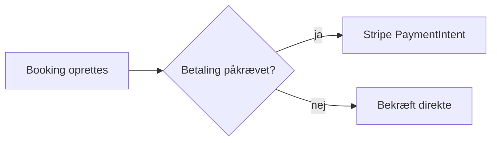

# Blok-katalog og kvalitetsbar

Viewer'en renderer GitHub-flavored markdown plus otte custom fenced blocks.
Alt andet markdown (tabeller, code fences med sprog, task lists, blockquotes)
virker som normalt. Læs hele denne fil før du skriver en plan.

## Fence-regler

- Custom blocks åbnes med ` ```<type> ` og lukkes med samme antal backticks.
- Skal en blok indeholde almindelige ` ``` `-code fences (typisk `tabs` og
  `columns`), så brug **fire** backticks om selve blokken: ` ````tabs `.
- Blok-typer: `mermaid`, `callout`, `files`, `questions`, `steps`, `columns`,
  `tabs`, `wireframe`.

## mermaid — diagrammer

Fuld mermaid 11-syntaks (flowchart, sequenceDiagram, erDiagram, stateDiagram,
gantt…). Renderes lokalt, tema følger dark/light-toggle.

```` markdown

````

Brug diagrammer hvor de bærer information prosa ikke kan: flows med
forgreninger, sekvenser på tværs af services, ER-relationer. Aldrig som pynt.

## callout — beslutninger, risici, info

Info-linje: `<tone> <titel>`. Toner: `decision`, `risk`, `warning`, `info`,
`question`, `done`. Body er markdown.

```` markdown
```callout decision Webhook-kø frem for synkron behandling
Stripe-events skrives til `payment.webhook_event` og behandles af en
baggrundsworker. Begrundelse: idempotens + retry uden at blokere svar til Stripe.
```
````

Enhver væsentlig arkitektur-beslutning i planen skal stå i en
`decision`-callout med begrundelse. Kendte faldgruber i en `risk`-callout.

## files — filkort

Én fil pr. linje. Prefix `+` (ny), `~` (ændres), `-` (slettes), intet prefix =
kontekst. Annotation efter ` # `. Renderes som træ grupperet på mapper.

```` markdown
```files
+ api/src/Web.Api/Endpoints/Pos/CreateSale.cs      # nyt endpoint, POST /pos/sales
~ api/src/Infrastructure/Persistence/AppDbContext.cs # tilføj DbSet<Sale>
+ src/PrepMeUp.Infrastructure/Migrations/20260920_AddPacket.cs # migration
- api/src/Web.Api/Endpoints/Pos/LegacySale.cs      # erstattes
```
````

Hver plan der rører kode skal have et files-kort. Rigtige stier — aldrig
opdigtede.

## questions — åbne spørgsmål (interaktive)

Top-level `- ` er et spørgsmål; indrykkede `- ` er valgmuligheder (chips).
Frederik kan vælge chip, skrive frit svar og markere afklaret — alt gemmes i
localStorage og ryger med i feedback-eksport.

```` markdown
```questions
- Skal refusion ske automatisk ved aflysning < 24t før?
  - Ja, fuld refusion
  - Nej, manuel vurdering
  - Konfigurerbart pr. chain
- Genbruger vi comm_e2ee-nøglerne til kvitteringer?
```
````

Uafklarede beslutninger hører HER — ikke skjult i prosa. Skriv aldrig en plan
uden at overveje om der er åbne spørgsmål.

## steps — interaktiv tjekliste med progress

Info-linje = valgfri titel. Task-list-syntaks. Checkbox-state persisteres.

```` markdown
```steps Implementering
- [ ] EF-migration (src/PrepMeUp.Infrastructure/Migrations/)
- [ ] Endpoint + handler + DTO records
- [ ] Expo hook + screen
- [ ] Verifikation: dotnet test + manuel flow-test
```
````

Sidste step er altid verifikation (test, build eller checkbar adfærd).

## columns — sammenligning side om side

Info-linje: titler adskilt af `|`. Kolonner adskilt af en linje med kun `---`.
Brug fire backticks hvis kolonnerne indeholder code fences.

```` markdown
```columns Option A: Polling | Option B: Webhook
Simpel, ingen ny infrastruktur.
Latens op til 30 s.
---
Realtid, kræver endpoint + signaturvalidering.
Mere kode, men korrekt langsigtet.
```
````

Brug til reelle trade-offs med 2-3 alternativer. Konklusionen står i en
`decision`-callout ved siden af.

## tabs — grupperede code-eksempler

Sektioner adskilles af `=== Label`-linjer. Brug ALTID fire backticks, da
indholdet typisk er code fences. Syntax highlighting via highlight.js
(csharp, typescript, sql, json, bash m.fl.).

`````markdown
````tabs
=== Endpoint
```csharp
internal sealed record CreateSaleRequest(Guid LocationId, IReadOnlyList<SaleLine> Lines);
```
=== SQL
```sql
CREATE TABLE pos.sale (id uuid PRIMARY KEY, chain_id uuid NOT NULL);
```
````
`````

Vis den reelle form af de bærende filer — records, signaturer, tabeller.
2-5 tabs. Ikke hele filer; kun det der bærer beslutningen.

## wireframe — UI-mockups

Info-linje: `<surface>: <label>`. Surfaces: `browser`, `desktop`, `mobile`,
`panel`. Body er et råt HTML-fragment — ingen `<style>`/`<script>`, ingen
bredder/højder. Renderer'en ejer chrome, tema og typografi.

```` markdown
```wireframe mobile: POS — kurv
<div class="wf-col">
  <h1>Kurv</h1>
  <p class="wf-muted">2 varer · Sofie K.</p>
  <div class="wf-card wf-row"><span>Herreklip</span><span class="wf-badge">350 kr</span></div>
  <div class="wf-card wf-row"><span>Voks</span><span class="wf-badge">120 kr</span></div>
  <hr>
  <div class="wf-row"><strong>I alt</strong><span class="wf-pill">470 kr</span></div>
  <button class="primary">Betal med terminal</button>
  <button>Betal kontant</button>
</div>
```
````

Auto-stylede bare elementer: `h1-h3`, `p`, `label`, `input`, `select`,
`textarea`, `button`, `button.primary`, `a`, `hr`, `table`. Helper-klasser:
`wf-card`, `wf-muted`, `wf-pill`, `wf-badge`, `wf-row`, `wf-col`,
`wf-split` (sidebar-layout). Skriv rigtigt produktindhold — rigtige labels,
priser, navne — aldrig lorem ipsum.

UI-planer starter med wireframes af de vigtigste screens ØVERST i planen,
før arkitekturen. Backend-planer har ingen wireframes.

## Kvalitetsbar for dokumentet

Planen er en seriøs teknisk plan, ikke marketing:

- **Outcome først.** Objektiv + hvad "færdig" betyder i de første linjer.
  Scope og non-goals eksplicit.
- **Selvbærende.** En læser uden chat-historik skal forstå den. Aldrig
  "som diskuteret" eller "i modsætning til før".
- **Specifik.** Rigtige filer, symboler, tabeller, datashapes. Aldrig et step
  som "få det til at virke".
- **Beslutninger med begrundelse** i decision-callouts; reelle alternativer i
  columns; risici i risk-callouts; uafklaret i questions-blokken.
- **Verifikation til sidst.** Test-/build-kommandoer eller checkbar adfærd.
- **Blokke bærer, prosa binder.** Gentag ikke diagram-indhold i prosa.
  Ingen hero-art, gradients eller salgssprog.

Struktur-skabelon (afvig når opgaven kræver det):

```markdown
# <Titel>

<2-4 linjer: objektiv + done-kriterie>

## Kontekst og scope
## Løsning            ← decision-callouts, mermaid, columns
## Filer              ← files-blok
## Nøglekode          ← tabs-blok
## Trin               ← steps-blok (sidste step = verifikation)
## Risici             ← risk-callouts
## Åbne spørgsmål     ← questions-blok
```
