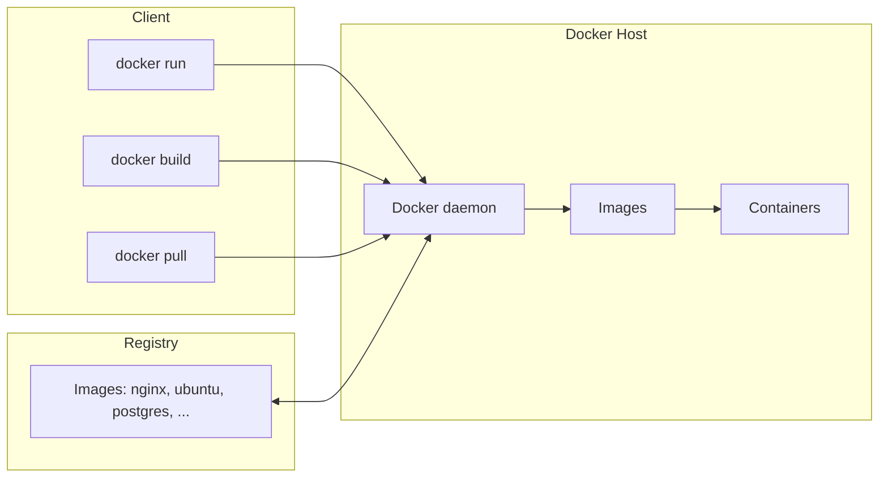

# Docker

## Agenda

- What is Docker?
- Creating images
- Build and deploy containers
- Persisting data

## Overview

- Docker is an open platform for developing, shipping and running applications.
- Docker separates applications from infrastructure.
- Docker lets you manage your infrastructure the same way you manage your applications.

## Docker architecture

- **Docker daemon** — listens for Docker API requests and manages Docker objects.
- **Docker client** — the primary way users interact with Docker (Docker Desktop also talks to the daemon).
- **Docker registries** — store Docker images. Docker Hub is a public registry (used by default); you can run a private registry.
  - `docker pull` / `docker run` fetch required images.
  - `docker push` publishes images to registries.

Architecture diagram (described): the client (`docker run`, `docker build`, `docker pull`, or Docker Desktop) sends commands to the Docker daemon on the Docker host. The daemon builds and stores images and creates containers from them. Images are pulled from / pushed to a registry (e.g. Docker Hub, hosting images like nginx, ubuntu, postgres, plus extensions and plugins).



## Docker images

- Images are read-only templates with instructions for creating containers.
- Images are typically based on other images, with some customization.
- To build an image, you create a **Dockerfile**: a simple syntax defines the steps needed to produce an image and run it.
- Each instruction creates a **layer** in the image.
- Layers are what make Docker so lightweight, small, and fast compared with other virtualization technologies: when rebuilding an image, only the layers that have changed are rebuilt.

## Docker containers

- A container is a runnable instance of an image.
- A container is relatively well isolated from other containers and its host machine.
- A container is defined by its image plus any configuration you provide when you create or start it.
- When a container is removed, any changes to its state that are not stored in persistent storage disappear.

## Docker vs VM

- VMs abstract hardware details to make it easier to run applications on different hardware architectures and use hardware resources more efficiently.
- Docker was designed to provide a lightweight and portable way to package and run applications in an isolated and reproducible environment.

Diagram (described): containers stack as *App + Config/dependencies → Container Engine → Host OS → Hardware*; VMs stack as *App + full Guest OS per VM → Hypervisor → Host OS → Hardware*. Containers share the host kernel and skip the guest OS, which is why they are lighter.

Reference: https://www.freecodecamp.org/news/docker-vs-vm-key-differences-you-should-know/

## Docker deployment

Containers and VMs can be combined ("Containers and VMs Together", Docker Blog). In a datacenter or VPC you can run containers directly on a physical server (Apps → Docker Engine → OS → Physical server) or run Docker Engine inside VMs on a hypervisor — even mixing containerized apps and plain VM apps on the same physical host.

## Creating images

### Dockerfile (multi-stage, ASP.NET Core API)

```dockerfile
# build stage/image
# https://hub.docker.com/_/microsoft-dotnet
FROM mcr.microsoft.com/dotnet/sdk:10.0 AS build
WORKDIR /source

# copy csproj and restore as distinct layers
COPY *.sln .
COPY api/*.csproj ./api/
RUN dotnet restore

# copy everything else and build app
COPY api/. ./api/
WORKDIR /source/api
RUN dotnet publish -c release -o /app

# final stage/image
FROM mcr.microsoft.com/dotnet/aspnet:10.0
WORKDIR /app
COPY --from=build /app ./
ENTRYPOINT ["dotnet", "api.dll"]
```

Notes:

- Featured .NET tags: 9.0 (Standard Support), 10.0 (Long-Term Support).
- The aspnet container actively sets the HTTP port to **8080** (the default value). You can override it in your Dockerfile with `ENV ASPNETCORE_HTTP_PORTS=80` (a semicolon-delimited list of port values).

### docker build

The `docker build` command builds an image from a Dockerfile and a **context**:

- A build's context is a set of files located in a PATH or URL.
- When the URL points to a Git repository, that repo acts as the context.

Options:

- `--pull` — always attempt to pull a newer version of the image.
- `--file, -f` — name of the Dockerfile (default is `PATH/Dockerfile`).
- `--tag, -t` — name and optionally a tag in the `name:tag` format.

Use a `.dockerignore` file to exclude files from being sent to the Docker daemon.

```bash
docker build -t myimage .
docker build -f ./path/Dockerfile.API .
```

### Multi-stage build

- A feature that helps reduce the size of final images.
- A large base image containing the SDK is used for compiling and publishing, e.g. `FROM mcr.microsoft.com/dotnet/sdk:10.0 AS build`.
- Then a small runtime-only base image hosts the application in production, e.g. `FROM mcr.microsoft.com/dotnet/aspnet:10.0`.

### Image layers

- Each command in the Dockerfile becomes a layer in the image.
- View the layers with `docker image history my-image`.
- Docker caches layers and reuses them when possible.
- Once a layer changes, all downstream layers have to be recreated as well.
- Image layers can be shared between different images and different containers.

### Publishing images

- Use `docker push` to upload and publish images to registries (default registry: Docker Hub).
- Be sure to tag the image as `<USERNAME>/<IMAGE_TAG>`.

```bash
docker image push yourUserId/imageName:tag
```

## Running containers

### docker run

```bash
docker run [OPTIONS] IMAGE [COMMAND] [ARG...]
```

Options:

| Option | Meaning |
|---|---|
| `--detach, -d` | Run container in background and print container ID |
| `--rm` | Automatically remove the container when it exits |
| `--tty, -t` | Allocate a pseudo-TTY |
| `--interactive, -i` | Keep STDIN open even if not attached |
| `--volume, -v` | Bind mount a volume |
| `--name` | Assign a name to the container |
| `--publish, -p` | Publish a container's port(s) to the host |
| `--env, -e` | Set environment variables |
| `--hostname, -h` | Container host name |

Example — run the image `my_app`, expose container port 8080 as host port 5050, and remove the container when it stops:

```bash
docker run --rm -p 5050:8080 my_app
```

### Running an MS SQL database

```bash
docker run -e "ACCEPT_EULA=Y" -e "MSSQL_SA_PASSWORD=YourStrong@Passw0rd" \
  -p 1433:1433 --name sql1 --hostname sql1 \
  -d \
  mcr.microsoft.com/mssql/server:2025-latest
```

### Other useful docker commands

| Command | Purpose |
|---|---|
| `docker port` | List port mappings or a specific mapping for a container |
| `docker container prune` | Remove all stopped containers |
| `docker ps` | List containers |
| `docker rmi` | Remove one or more images |
| `docker rm` | Remove one or more containers |
| `docker images` | List images |

## Persisting data

- All data is written to the container's file system by default — this data is lost when the container is removed.
- Docker has two options for containers to store files on the host machine filesystem: **volumes** and **bind mounts**.
- Docker also supports containers storing files in-memory on the host machine with **tmpfs mounts**.

### Storage options

- **Volumes**
  - Stored in a part of the host filesystem managed by Docker.
  - Can be managed directly with the Docker CLI.
  - Should only be modified by Docker processes.
- **Bind mounts**
  - Stored anywhere on the host filesystem.
  - Cannot be managed with the Docker CLI.
  - May be modified by any process (Docker and/or non-Docker).
- **In-memory file systems (tmpfs)**
  - Stored in the host system's memory.

### Volumes

- Persist data on the host filesystem, managed by Docker.
- Use cases: sharing data across multiple containers; back-up, restore and migration of data between host machines.

```bash
docker volume create my-vol   # create a volume
docker volume ls              # list volumes
```

Start a container with a volume (mounts the volume `my-vol` into `/data` in the container) — use the `-v|--volume` flag or `--mount`:

```bash
docker run -d -v my-vol:/data -it ubuntu
# or
docker run -d --mount source=my-vol,target=/data -it ubuntu
```

### Bind mounts

- Mounts a directory/file on the host machine into a container.
- Use cases: sharing configuration files from the host machine to containers; sharing source code or build artifacts between a development environment on the host and a container.

Start a container with a bind mount (mounts the sub-directory `target` inside the current directory to `/app` in the container):

```bash
docker run -d -v "$(pwd)"/target:/app -it ubuntu
# or (preferred)
docker run -d \
  --mount type=bind,src="$(pwd)"/target,dst=/app \
  -it ubuntu
```

## References & links

- dotnet/sdk image: https://github.com/dotnet/dotnet-docker/blob/main/README.sdk.md
- dotnet/aspnet image: https://github.com/dotnet/dotnet-docker/blob/main/README.aspnet.md
- Volumes: https://docs.docker.com/storage/volumes/
- Bind mounts: https://docs.docker.com/storage/bind-mounts/
