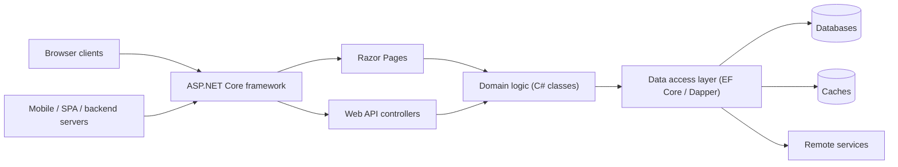

# ASP.NET Core Introduction

Develop cloud-ready web applications using Microsoft's latest framework, ASP.NET Core 10.0. Example of a large production site built with ASP.NET: Stack Overflow (http://stackoverflow.com).

## Cross-platform server apps

Develop web sites and services that run on Linux, Windows and macOS with the fast and modular platform provided by .NET Core and ASP.NET Core:

- Open-source (on GitHub)
- Cross-platform
- Optimized
- Modular

## The ASP.NET Core 10 stack

The stack, from top to bottom:

```
ASP.NET Core 10
.NET 10 libraries
Core CLR
Kestrel
Linux / Windows / Mac OS
```

## Kestrel — the ASP.NET Core server

- Kestrel is a cross-platform web server (Windows, Mac, Linux) for ASP.NET Core.
- Kestrel is the web server included by default in ASP.NET Core project templates.
- You can use Kestrel by itself or with a reverse proxy server, such as IIS, Nginx, Apache — or YARP.
- A reverse proxy server receives HTTP requests from the Internet and forwards them to Kestrel after some preliminary handling.

## Cross-platform development

- ASP.NET Core comes with an agile project system in Visual Studio.
- It also provides a complete command-line interface so you can develop using the tools of your choice, on the platform of your choice (Windows, Mac or Linux).
- The entire ASP.NET Core stack is open source, which encourages community contributions and engagement.

## NuGet

ASP.NET Core is based on a set of granular and well-factored NuGet packages, which allows you to optimize your app to have just what you need:

- Reduce the surface area of your application to improve security
- Reduce your servicing burden
- Improve performance

A true pay-for-what-you-use model.

## Cloud

ASP.NET Core is built to be cloud-ready by introducing environment-based configuration and providing built-in dependency injection support.

## .NET Core

- ASP.NET Core is built on .NET Core, which supports true side-by-side app versioning.
- .NET Core is Microsoft's cross-platform implementation of .NET.
- It is a modular runtime and library implementation that includes a subset of the .NET Framework — it is **not** a full port of .NET.
- It consists of a set of libraries called **CoreFX** and a small, optimized runtime called **CoreCLR**.
- The CoreCLR runtime and CoreFX libraries are distributed via NuGet; CoreFX libraries are factored as individual NuGet packages according to functionality.

## "Old-fashioned" BIN deploy

Deployment flow: source code → `dotnet publish` → xcopy the output to a server with the .NET Core runtime installed.

## Not dependent on Visual Studio

- You can develop an ASP.NET application efficiently using command-line tools like `dotnet`, `npm`, etc.
- Any editor works: Visual Studio Code, Atom, etc.
- But Visual Studio has superior support for ASP.NET Core.

## Installing the Core SDK

- Download from https://www.microsoft.com/net/download/core — not needed if you use Visual Studio.
- If you use Visual Studio, you must install the ASP.NET/web development workloads.

## Dotnet CLI

Docs: https://docs.microsoft.com/en-us/dotnet/articles/core/tools/

`dotnet new -l` lists the available templates, e.g.:

| Template | Short name | Language | Tags |
|---|---|---|---|
| Console Application | `console` | C#, F#, VB | Common/Console |
| Class library | `classlib` | C#, F#, VB | Common/Library |
| Unit Test Project | `mstest` | C#, F#, VB | Test/MSTest |
| xUnit Test Project | `xunit` | C#, F#, VB | Test/xUnit |
| ASP.NET Core Empty | `web` | C#, F# | Web/Empty |
| ASP.NET Core Web App (MVC) | `mvc` | C#, F# | Web/MVC |
| ASP.NET Core Web App | `razor` | C# | Web/MVC/Razor Pages |
| ASP.NET Core with Angular | `angular` | C# | Web/MVC/SPA |
| ASP.NET Core with React.js | `react` | C# | Web/MVC/SPA |
| ASP.NET Core Web API | `webapi` | C# | Web/WebAPI |
| Solution File | `sln` | | |
| Razor Page | `page` | | |

Example:

```bash
dotnet new mvc --auth Individual
```

Running `dotnet new mvc` scaffolds a project with `Controllers/`, `Models/`, `Views/`, `Properties/`, `wwwroot/`, `appsettings.json`, `appsettings.Development.json`, `Program.cs`, `Startup.cs` and the `.csproj` file.

## A typical ASP.NET Core application

Architecture diagram (described):

- **Client tier:** browser clients; mobile, single-page applications and backend servers.
- **Web tier (web server) — the ASP.NET Core application:**
  - *Presentation layer:* the ASP.NET Core framework routing requests to Razor Pages and/or Web API controllers.
  - *Business logic layer:* domain logic (plain C# classes).
  - *Data access layer:* EF Core / Dapper.
- **Data tier:** databases, caches (e.g. Redis), remote services.

The back-end comprises the web tier plus the data tier.



## How does ASP.NET Core work?

Request pipeline (described from diagram):

1. HTTP request is made to the server and is received by the ASP.NET Core web server (Kestrel).
2. The ASP.NET Core web server receives the HTTP request and passes it to the middleware.
3. The request is processed by the application (ASP.NET Core infrastructure and application logic), which generates a response.
4. The response passes through the middleware back to the web server.
5. The web server sends the response to the browser.

## Server rendered UI

**Benefits:**

- The client requirements are minimal because the server does the work of logic and page generation:
  - Great for low-end devices and low-bandwidth connections.
  - Allows for a broad range of browser versions at the client.
  - Quick initial page load times.
  - Minimal to no JavaScript to pull to the client.
- Flexibility of access to protected server resources:
  - Database access.
  - Access to secrets, such as values for API calls to Azure storage.
- Static site analysis advantages, such as search engine optimization.

**Drawbacks:**

- The cost of compute and memory use is concentrated on the server, rather than each client.
- User interactions require a round trip to the server to generate UI updates.

## Server rendered ASP.NET Core UI technologies

- **ASP.NET Core Razor Pages** — simple architecture.
- **ASP.NET Core MVC** — the classic architecture.
- **Blazor** — supports both client- and server-side rendering.

## References & links

- Welcome to ASP.NET Core: https://docs.microsoft.com/da-dk/aspnet/core/
- Tutorial — Create a Razor Pages web app with ASP.NET Core: https://docs.microsoft.com/en-us/aspnet/core/tutorials/razor-pages
- Performance improvements in ASP.NET Core 6: https://devblogs.microsoft.com/dotnet/performance-improvements-in-aspnet-core-6/
- .NET Core CLI tools: https://docs.microsoft.com/en-us/dotnet/core/tools/
- Visual Studio Code: https://code.visualstudio.com/
