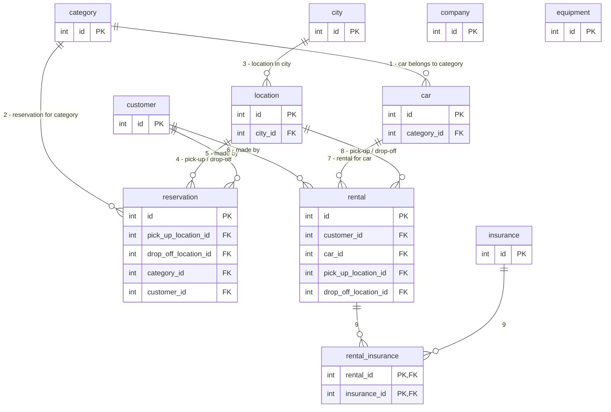

# Conceptual Data Modeling

## Method

For each view, build a local conceptual data model (ER diagram):

1. Identify entity types
2. Identify relationship types
3. Identify attributes for entities and relations
4. Determine candidate and primary key attributes
5. Consider structures (aggregation, hierarchy, ...)
6. Check model
   1. Does it have redundancies?
   2. Does it address the expected CRUD operations?
7. Review with client

For beginners, add step 0 to the check: verify that degree, cardinality, existence, ... are right.

## Running example: car rental project description

> A car rental company rents cars to customers. The company owns several cars. Each car has a brand, model name, production year, mileage, color, and so on. Cars are divided into different categories: small, mid-size, large, limousines.
>
> The company has many locations where you can rent a car. The rental locations are located in different cities throughout the country. There can be more than one company location in a city.
>
> Anyone over 21 who has a valid driver's license can rent a car. Customers under 25 or over 75 years pay different (higher) charges than other customers.
>
> Before renting a car, a customer usually makes a reservation for a car. A customer specifies the dates when the car will be rented, the pick-up location, the drop-off location, and the category of car he wants to rent. A customer may specify that he wants some extra equipment in the car, for example a GPS, a car seat for a child, etc.
>
> When a customer rents a car, he declares the pick-up and drop-off location, and the drop-off date. The customer can buy various types of insurance. He can also decide that he doesn't need insurance because the insurance is covered otherwise, for example by his credit card company. The customer can choose additional options such as the possibility of an early drop-off, various refueling options, etc.
>
> The customer pays the charges when he returns the car.

(Based on https://www.vertabelo.com/blog/how-to-create-a-database-model-from-scratch/)

## Identify entities and attributes

Find objects (**nouns**) and properties (**adjectives**, ...) of the objects from the project description:

- An entity should contain descriptive information
- Multivalued attributes should be modeled as entities
- Attributes are properties associated with the primary entity/relation
- Attributes should be attached to the 'most relevant' entity/relation
- Not only real-world objects count as entities

### Chen "guiding" rules (English grammar → ER structure)

| English grammar structure | ER structure |
|---|---|
| Common noun | Entity type |
| Proper noun | Entity |
| Transitive verb | Relationship type |
| Intransitive verb | Attribute type |
| Adjective | Attribute for entity |
| Adverb | Attribute for relationship |

### Nouns in the description

Highlighted nouns: car, company, customers, brand, model name, production year, mileage, color, categories, locations, cities, country, company location, city, driver's license, charges, dates, reservation, insurance, location, equipment.

### A first take on entities

First pass yields the entities (each drawn as a table stub with `id int PK`):

`category`, `car`, `customer`, `company`, `location`, `city`, `equipment`, `insurance`

### Test/improve (evaluate)

Re-read the description against the model. Underlined on re-reading: **rental** locations and **reservation** — the process nouns *rental* and *reservation* were missed as entities.

### A second take on entities

Add the missed entities:

`category`, `car`, `rental`, `reservation`, `customer`, `company`, `location`, `city`, `equipment`, `insurance`

## Identify relationships

Find relations as **transitive verbs** on objects from the project description. Determine:

- relationship degree
- connectivity
- existence (optional / mandatory)
- attributes associated with the relationship

Make sure not to introduce redundant relationships. More than one relationship can exist between the same entities. (Same Chen guiding-rules table applies.)

### A first take on relationships

1. Each car belongs to a category,
2. Each reservation is for a category of cars,
3. Each location is in a city,
4. Each reservation has a pick up and a drop off location,
5. Each reservation is made by a customer,
6. Each rental is made by a customer,
7. Each rental is for a certain car,
8. Each rental has a pick up and a drop off location.
9. Each rental is connected to some insurance...

### Relations for the example

The resulting relational structure (crow's foot diagram in the slides; note 9 realized as junction table `rental_insurance` with references):

(`company` and `equipment` remain unconnected at this stage; `reservation` has both a pick-up and a drop-off relationship to `location`, likewise `rental`.)

## Check model

Given the entities, attributes and relationships:

- Add example data — what CRUD will you do? SELECTs/INSERTs/...

Design is iterative:

- Compare schema with description
- When in doubt, ask questions — there is not one correct design

Identify conflicts in the schema:

- Synonyms / homonyms
- Structural conflicts
- Keys
- Dependencies
