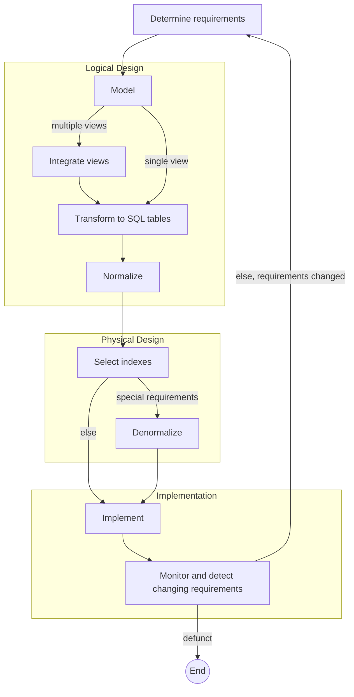

# Database Life Cycle

The database life cycle incorporates the basic steps involved in designing a global schema of the logical database, allocating data across a computer network, and defining local DBMS-specific schemas. Once the design is completed, the life cycle continues with database implementation and maintenance.

The overall flow (activity diagram from the slides):



Big picture: real-world information → requirements definition → **data model** → database system, with the data model acting as the communication tool between users and developers.

## Requirements

The database requirements are determined by interviewing both the producers and users of data, and using the information to produce a formal requirements specification. The course assumes you have gained requirements experience already (SW2ISE ... SWXPRJ).

## Logical design

The **global schema** — a conceptual data model diagram that shows all the data and their relationships — is developed using techniques such as ER. Primary focus of the next lectures.

What to model:

- Domain rules and business rules
- Data structures and object structures
- **Not** processes/code — that is business logic!

Alternatively, some split the Logical Design phase into:

- **Conceptual Design** (Model + Integrate)
- **Logical Design** (Transform to SQL tables)

### Model and integrate views

Each stakeholder view is modeled as its own ER diagram, then views are integrated into one. Example from the slides: a *retail salesperson view* (customer –N– orders –N– product, customer –N– served-by –1– salesperson, product –N– sold-by –1– salesperson) and a *customer view* (customer –1– places –N– order) are integrated into one combined ER diagram (customer places orders, orders are for products, customers served by salespersons, salespersons fill out orders).

### Transform to SQL

Transform the conceptual model to SQL tables. The integrated ER example becomes tables such as:

- `Customer(cust-no, cust-name, ...)`
- `Product(prod-no, prod-name, qty-in-stock)`
- `Salesperson(sales-name, addr, dept, job-level, vacation-days)`
- `Order(order-no, sales-name, cust-no)`
- `Order-product(order-no, prod-no)`

```sql
create table customer
    (cust_no integer,
     cust_name char(15),
     cust_addr char(30),
     sales_name char(15),
     prod_no integer,
     primary key (cust_no),
     foreign key (sales_name) references salesperson,
     foreign key (prod_no) references product);
```

### Normalize

Normalization is dealt with later — think of it as optimizing your data structure for space (removing "duplication").

Terminology notes:

- Elsewhere, the term **logical model** often refers to the conceptual data model, and **physical model** refers to the DBMS-specific implementation model (e.g. SQL tables).
- Many conceptual data models are obtained not from scratch but by **reverse engineering** from an existing DBMS-specific schema.

## Physical design

Move from standard SQL to DBMS-specific configurations. The physical design step involves selection of **indexes**, **partitioning**, and **clustering** of data.

In some cases it makes sense to have "duplicated" data in your data structure to improve control — so decisions on whether to **denormalize** are made in this phase.

## Implementation

Once the design is completed, the database can be created by implementing the formal schema using the **DDL** of a DBMS — including setting up indexes and establishing constraints such as **referential integrity**.

As the database begins operation, monitoring indicates whether performance requirements are being met. Requirements also change over time... and the cycle restarts.

## Summary

- **Requirements** — assumed prior experience (SW2ISE/SWXPRJ)
- **Logical design** — primary focus of this course
- **Physical design** — covered briefly; self-study option
- **Implementation** — you will "naturally" experience this in SW4PRJ
