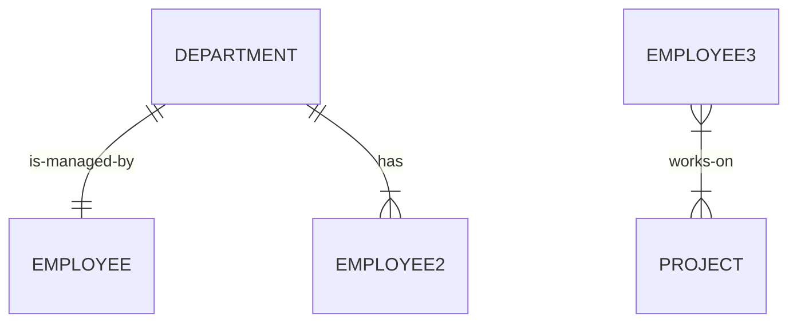

# Entity-Relationship Modeling

Contents: introduction to ER modelling, fundamental ER constructs, degrees/connectivity/attributes, advanced ER constructs (generalization and aggregation, ternary relationships).

## What is an ER model?

An **entity–relationship model** (ER model) describes interrelated things of interest in a specific domain of knowledge. It is composed of:

- **entity types**, which classify the things of interest
- **relationships** that can exist between entities (instances of those entity types)

"The ER model becomes an abstract data model that defines a data or information structure which can be implemented in a database, typically a relational database." (adapted from Wikipedia; classic reference: Peter Pin-Shan Chen, "English, Chinese and ER diagrams".)

It is a **conceptual** model, as opposed to logical and physical.

## Fundamental ER constructs

- **Entity ("type")** — basic modeling unit related to some real-world object. Chen notation: rectangle, e.g. `Employee`.
- **Weak entity** — an entity connected to another (parent) entity; does not exist without the parent (e.g. a loan payment only exists if there is a loan entry). Notation: double-bordered rectangle, e.g. `Employee-job-history`.
- **Relationship** — association between entities. Notation: diamond, e.g. `works-in`.
- **Attributes** — properties, drawn as ovals attached to an entity:
  - **identifier (key)** — uniquely identifies each instance of the entity; underlined, e.g. `emp-id`
  - **descriptor (nonkey)** — e.g. `emp-name`
  - **multivalued descriptor** — multiple values; double-lined connection, e.g. `degrees`
  - **complex attribute** — attribute contains more information, i.e. sub-attributes, e.g. `address` composed of `street`, `city`, `state`, `zip-code`

## Relation degree

- **Binary** — relating two entities. Most common; all other relations can be decomposed into binary. Example: `Department N — is-subunit-of — 1 Division`.
- **Binary recursive** — relating two elements of the same entity. Example: `Employee` with `manages` relationship where the `1` side is labeled *manager* and the `N` side *subordinate*.
- **Ternary** — relating three entities. Example: `Employee N — uses — N Project`, with a third leg `N Skill`.
- **Higher degree / n-ary** — relating *n* entities, e.g. Employee x Project x Skill x Computer. Not used in practice.

## Relation cardinality (AKA connectivity)

- **One-to-one** — one instance of the left entity relates to at maximum one instance on the other side. Chen: `Department 1 — is-managed-by — 1 Employee`.
- **One-to-many** — the instance of the "1"-side entity relates to many instances on the N side; each instance on the "N" side relates to only one on the "1" side. Chen: `Department 1 — has — N Employee`.
- **Many-to-many** — each instance of each entity relates to many instances on the other side. Chen: `Employee N — works-on — N Project`, optionally with relationship attributes (`task-assignment`, `start-date`).

Course conventions on N:

- **N is a maximum cardinality and implies at least (minimum) 1.**
- A specific number is allowed, like 3.
- Beware, this is not standard — but it is used as the standard in this course.

The same three cases in mermaid (mermaid uses min/max pairs rather than Chen 1/N labels):



## Relation attributes

- **One-to-one** — do not add possibly ambiguous attributes. Example: `start-date` on `Department is-managed-by Employee` — is it the inauguration of the department or the first day of work for the employee?
- **One-to-many** — do not add possibly ambiguous attributes.
- **Many-to-many** — add them, the semantics is clear. `start-date` on `works-on` is common to an instance of the assignment of a particular Employee to a particular Project.

## Relation existence (optional / mandatory)

The **optional symbol** (a small circle `○` on the connection line) signals that some entities on that side are not related to any entity of the other type. Example: `Department 1 ○— is-managed-by — 1 Employee` — some employees are not department managers, so the relationship is optional for Employee.

Mandatory example: `Office 1 — is-occupied-by — N Employee` (no circle).

**If no symbol is there, we assume the existence prescribed by 1 or N is mandatory.**

## Generalization / inheritance

Specifies that several types of entities with certain common attributes can be generalized into a higher-level entity type — a generic or superclass entity, more commonly known as a **supertype** entity. Notation: subtype rectangles connected upward through a circle labeled `d` or `o` to the supertype (connectors drawn as subset symbols).

- **Disjoint (d)** — requires mutual exclusiveness of subtypes. Example: supertype `Employee` with subtypes `Manager`, `Engineer`, `Technician`, `Secretary`.
- **Overlapping (o)** — subtypes may overlap; coverage can be total or partial. **Total → double line** between supertype and the `(o)` circle. Example: supertype `Individual` with overlapping subtypes `Employee` and `Customer`.

## Ternary relationships

Ternary relationships are required when binary relationships are not enough to describe an association among three entities. They are more complex than binary relationships.

In general, for an n-ary relationship, **each entity considered to be a "one" has its key appearing on the right side of exactly one functional dependency (FD)**.

Ternary relationships can have attributes in the same way that many-to-many binary relationships can.

### One-to-one-to-one

*A technician uses exactly one notebook for each project. Each notebook belongs to one technician for each project.*

Diagram: `Technician 1 — uses-notebook — 1 Project`, third leg `1 Notebook`.

Note that a technician may still work on many projects and maintain different notebooks for different projects.

Functional dependencies:

```text
emp-id, project-name → notebook-no
emp-id, notebook-no  → project-name
project-name, notebook-no → emp-id
```

### One-to-one-to-many

*Each employee assigned to a project works at only one location for that project, but can be at different locations for different projects.*

Diagram: `Project 1 — assigned-to — N Employee`, third leg `1 Location`.

- At a particular location, an employee works on only one project.
- At a particular location, there can be many employees assigned to a given project.

Functional dependencies:

```text
emp-id, loc-name     → project-name
emp-id, project-name → loc-name
```

### One-to-many-to-many

*Each engineer working on a particular project has exactly one manager, but each manager of a project may manage many engineers, and each manager of an engineer may manage that engineer on many projects.*

Diagram: `Manager 1 — manages — N Engineer`, third leg `N Project`.

Assertions:

1. One engineer, working under one manager, could be working on many projects.
2. One project, under the direction of one manager, could have many engineers.
3. One engineer, working on one project, must have only a single manager.

Functional dependency:

```text
project-name, emp-id → mgr-id
```

### Many-to-many-to-many

*Employees can use many skills on any one of many projects, and each project has many employees with various skills.*

Diagram: `Employee N — skill-used — N Project`, third leg `N Skill`.

Functional dependencies: **none**.

### Example of relation attributes on a ternary relationship

Attribute `Tool` attached to the `skill-used` relationship: associated with a given employee using a particular skill on a certain project, indicating that a value for tool is uniquely determined by the combination of employee, skill, and project.

## General n-ary relationships

Generalizing the ternary form to higher-degree relationships, an n-ary relationship describing some association among n entities is represented by a single relationship diamond with n connections. Example: `enrolls-in` connecting `Student`, `Class`, `Room`, `Day`, `Time`.

- This construct provides some challenges to the ER model (see the DMaD book)
- It is also difficult to map to relational databases
- Best to avoid — decompose into binary and ternary relations

## Alternative notations

- **Chen** — what we use in this course (SW4BAD assignment notation!)
- **Crow's foot** — similar to Chen; instead of 1/N labels it uses line-end symbols (crow's foot for many, bars for one, circle for optional, `min = 0/1, max = 1` markers); weak entity is called an *intersection entity*
- **UML** — industry standard now; data modeling as you are used to in other courses
- **IDEF1X** — originated by the US Air Force
- **Bachman** — historical

## Real-example ER diagram

The DMaD book's global example combines the constructs: `Division 1 — contains — N Department`; `Department 1 — has / is-managed-by / is-headed-by — Employee` (with optionals); `Employee N — skill-used — N Skill / N Project`; `Project — assigned-to — Location`; recursive `is-married-to` and `manages` on Employee; a disjoint (d) generalization of Employee into `Manager`, `Secretary`, `Engineer`, `Technician`; and further relations `is-allocated Desktop`, `has-allocated Workstation`, `belongs-to Prof-assoc`.

## Summary

- Entity-relationship as a model of data ontology, with diagrammatic notation by Chen
- Model notation for fundamental concepts: Entity, Relation, Attribute
- Degrees, connectivity, and attributes specify the modeled relation
- Advanced ER constructs:
  - Generalization and aggregation model inheritance
  - Ternary relationships are complex, but all possibilities are covered here
  - N-ary relations are too complex — decompose into binary and ternary
