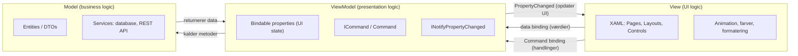

# Kapitel 9 — The MVVM Pattern

## Metadata

- **Kapitel:** 9 — The MVVM Pattern
- **Bog:** .NET MAUI in Action — Matt Goldman, Manning
- **Kursus:** Front-end udvikling (SW4FED-02)
- **Relateret lektion:** L08
- **Hovedemner:**
  - Model, View, ViewModel (MVVM) som arkitekturmønster i XAML-baserede apps
  - Adskillelse af UI logic, presentation logic og business logic
  - `INotifyPropertyChanged` og `PropertyChanged`-eventet som motor bag opdatering af UI
  - `CallerMemberName`-attributten og `OnPropertyChanged()` uden eksplicit propertynavn
  - Command binding (`ICommand`, `Command`, `Command<T>`) som erstatning for event handlers
  - `BindingContext` sat i code-behind i stedet for XAML
  - Behaviors og `EventToCommandBehavior` fra .NET MAUI Community Toolkit
  - `BaseViewModel` med `Title`, `IsLoading` og `Navigation` til genbrug på tværs af ViewModels
  - Dependency injection af services og ViewModels via `MauiProgram`/`ServiceCollection`
  - SOLID-principperne, især single responsibility og dependency inversion
  - Praktisk refaktorering: MauiTodo og MauiStockTake (InputPage/InputViewModel)

---

## Introduktion

MVVM-mønsteret blev introduceret af Microsoft med Windows Presentation Foundation (WPF) og er siden blevet standarden for apps udviklet med XAML. Det er et populært mønster med nok nuancer til, at der er skrevet hele bøger om emnet alene. Dette kapitel giver en introduktion, og efterhånden som man kommer længere i sin .NET MAUI-rejse, vil man typisk have brug for at gå dybere ned i emnet.

Brugen af MVVM-mønsteret er på nogle måder mere kunst end videnskab. Man skal sigte efter at forstå reglerne for adskillelse af UI logic, presentational logic og business logic, hvis man vil bruge MVVM i sin app. Blind efterlevelse af ethvert mønster er selvsagt et antipattern, og man bør prioritere, at koden er læsbar og vedligeholdelsesvenlig. Men man kan ikke træffe en informeret beslutning om, hvornår man skal afvige fra mønsteret, hvis man ikke forstår det godt.

Kapitlet er bygget op sådan, at det praktiske kommer først: MauiTodo refaktoreres for at løse et konkret, uløst problem (at markere to-do items som færdige), og først derefter dykkes der ned i mønsterets filosofi. Til sidst refaktoreres MauiStockTake for MVVM, og stock-taking-featuren færdiggøres.

---

## 9.1 Refactoring the MauiTodo app for MVVM

I kapitel 3 så vi, at databinding kan bruges til at forbedre to-do-appen ved at binde til en collection og bruge et template til at vise hvert item. Nu går vi et skridt videre og bruger MVVM-mønsteret til at løse ét væsentligt udestående problem i MauiTodo.

**Figur 9.1 (pointe):** Uden MVVM håndterer UI'et for MauiTodo alt — inklusive kommunikationen med databasen. Når brugeren klikker på Add-knappen, henter event handleren titlen og due date for det nye item, opretter et nyt to-do item med disse værdier og gemmer det i databasen. UI'et kan i denne arkitektur ikke gemme ændringer i et items checked state til databasen.

En vigtig feature i en to-do app er evnen til at markere items som færdige. MauiTodo har en `CheckBox` i sit data template, som renderes ved siden af hvert to-do item, men den gør ingenting.

Problemet er, at selvom vi kan tilføje en event handler i code-behind, der reagerer på `CheckBox`-events, har vi ingen måde at sende parametre ind på — specifikt det to-do item, som eventet svarer til. `CheckBox`-kontrollen understøtter et `CheckedChanged`-event, som kræver en delegate med følgende metodesignatur:

```csharp
void CheckBox_CheckedChanged(Object sender, CheckedChangedEventArgs e)
```

Hvis vi forsøger at delegere `CheckedChanged`-eventet fra en `CheckBox` til en metode med en anden signatur (metodens navn er ligegyldigt), får vi en fejl. Det betyder, at vi er begrænset til to parametre: `sender` og event-argumenterne. Her er `sender` selve `CheckBox`en, som ikke giver os nogen information om to-do item'et, og event-argumenterne indeholder én boolsk værdi, der fortæller, om `CheckBox`en er checked eller unchecked. Sidstnævnte er nyttigt, men fortæller stadig ikke, *hvilket* to-do item der er berørt.

Der findes nogle hacky workarounds, men den bedre tilgang er at bruge en **command** i stedet for en event handler. `Command` er en implementering af `ICommand`-interfacet, som definerer en `Execute`-property — altså kode, der køres, når `ICommand`'en invokeres. Konstruktoren for `Command` accepterer en funktion, der tildeles `Execute`-propertyen; man kan deklarere den inline med et lambda-udtryk eller sende en metode ind. En `Command` kan tage parametre, hvilket løser vores problem med at identificere to-do item'et — men `CheckBox` har ingen `ICommand`-property at binde til.

Vi starter derfor med at refaktorere MauiTodo: flytte koden ud af code-behind og ind i en ViewModel, som har en command i stedet for en event handler. Derefter vender vi tilbage til problemet med, at `CheckBox` mangler en `ICommand`-property.

**Figur 9.2 (pointe):** Efter refaktoreringen af MauiTodo til MVVM gør code-behind for `MainPage` intet andet end at sætte binding context til ViewModel'en. Alle kontroller i UI'et bindes til properties i ViewModel'en, og ViewModel'en er ansvarlig for at kommunikere med databasen. Denne tilgang er renere og honorerer single responsibility principle.

### Navngivning og oprettelse af ViewModel

Første skridt er at oprette ViewModel'en. En god konvention for navngivning af ViewModels er at bruge navnet på View'et og erstatte `Page` eller `View` med `ViewModel`. Vi laver en ViewModel til `MainPage`, så den kommer til at hedde `MainViewModel`. I MauiTodo-projektet oprettes en mappe kaldet **ViewModels** og klassen **MainViewModel.cs**.

`MainViewModel` skal implementere `INotifyPropertyChanged`-interfacet. `INotifyPropertyChanged` definerer en event handler, der notificerer UI'et, når en property på ViewModel'en er ændret. Dette skridt er nødvendigt, når man bruger MVVM. Da vi ikke længere manipulerer properties direkte på UI'et, er vi nødt til at rejse et event for at informere UI'et om, at en property er ændret, og at UI'et skal opdateres.

I metoden, der invokerer `PropertyChanged`-eventet, bruger vi en attribut kaldet `CallerMemberName` på metodeparameteren. Det lader os kalde metoden uden at angive et property-navn. I stedet kan navnet på propertyen udledes automatisk, når vi kalder den fra en propertys setter.

### Listing 9.1 The initial code for MainViewModel.cs

```csharp
using System.ComponentModel;
using System.Runtime.CompilerServices;
namespace MauiTodo.ViewModels;
public class MainViewModel : INotifyPropertyChanged
{
    #region INotifyPropertyChanged
    public event PropertyChangedEventHandler
        PropertyChanged;

    protected void OnPropertyChanged(
        [CallerMemberName] string propertyName = "")
    {
        var changed = PropertyChanged;

        if (changed == null)
            return;
        changed.Invoke(this, new PropertyChangedEventArgs(propertyName));
    }
    Public void RaisePropertyChanged(params string[] properties)
    {
        foreach (var propertyName in properties)
        {
            PropertyChanged?.Invoke(this, new
                PropertyChangedEventArgs(propertyName));
        }
    }
    #endregion
}
```

**Annotationer:**

1. ViewModel'en implementerer `INotifyPropertyChanged`-interfacet.
2. Event handleren defineret på `INotifyPropertyChanged`-interfacet.
3. `OnPropertyChanged`-metoden. Vi kan kalde denne metode hvor som helst i koden og angive et property-navn for at bede UI'et opdatere, eller vi kan kalde den fra en propertys setter uden at angive et navn. `CallerMemberName`-attributten vil da invokere notifikationen med navnet på kalderen.
4. Invokerer event handleren og angiver navnet på den property, der er opdateret.
5. Denne metode invokerer også eventet, men lader os angive flere property-navne.
6. Løber listen af property-navne igennem og invokerer event handleren for hver enkelt.

> **Bemærk:** `Public void RaisePropertyChanged(...)` står med stort `P` i bogens listing. Det er en trykfejl i kilden — C# kræver `public`. Koden er gengivet ordret som i bogen.

### Properties og fields

Dernæst tilføjes ViewModel'ens properties og fields. Dette svarer i store træk til det, vi allerede havde i `MainPage`s code-behind, men med små forskelle. Fields bruges til at holde private data internt i ViewModel'en, mens **properties skal bruges til binding**. Vi tilføjer en `ObservableCollection` af typen `TodoItem`, en `string` til titlen på et nyt to-do item, en `DateTime` til due date på et nyt item, og én `ICommand` til at tilføje et nyt to-do item samt én til at markere et som færdigt.

### Listing 9.2 The MainViewModel's properties and fields

```csharp
using MauiToo.Models;
using MauiTodo.Data;
using System.Windows.Input;
using System.Collections.ObjectModel;
...
public ObservableCollection<TodoItem> Todos { get; set; } = new();
public string NewTodoTitle { get; set; }
public DateTime NewTodoDue { get; set; } = DateTime.Now;
public ICommand AddTodoCommand { get; set; }

public ICommand CompleteTodoCommand { get; set; }

private readonly Database _database;
```

**Annotationer:**

1. Definerer en property af typen `ICommand` ved navn `AddTodoCommand`. Buttons har en `ICommand`-property (som kan data bindes), der invokeres ved klik. Denne command træder i stedet for event handleren.
2. Definerer endnu en `ICommand` ved navn `CompleteTodoCommand`.

### Metoder på ViewModel'en

Vi tilføjer en `Initialize`-metode, som henter listen af to-do items fra databasen og fylder `ObservableCollection`en. Vi tilføjer en metode til at tilføje et nyt to-do item — i store træk den samme som metoden i code-behind — og en metode til at markere et to-do item som færdigt. Sidstnævnte tager et `TodoItem` som parameter og sender det videre til databasens `UpdateTodo`-metode.

### Listing 9.3 The methods to add to MainViewModel

```csharp
private async Task Initialise()
{
    var todos = await _database.GetTodos();

    foreach(var todo in todos)
    {
        Todos.Add(todo);
    }
}

public async Task AddNewTodo()
{
    var todo = new TodoItem
    {
        Due = NewTodoDue,
        Title = NewTodoTitle
    };

    var inserted = await _database.AddTodo(todo);
    if (inserted != 0)
    {
        Todos.Add(todo);
        NewTodoTitle = String.Empty;
        NewTodoDue = DateTime.Now;
        RaisePropertyChanged(nameof(NewTodoDue),
            nameof(NewTodoTitle));
    }
}

public async Task CompleteTodo(TodoItem todoitem)
{
    var completed = await _database.UpdateTodo(todoitem);
    OnPropertyChanged(nameof(Todos));
}
```

**Annotationer:**

1. I code-behind var metoden til at tilføje to-do items en event handler, som krævede en bestemt signatur. Fordi metoden nu invokeres af en `Command`, som ikke har et sådant krav, kan vi ændre returtypen til `Task` og eliminere en `async void`.
2. For at forenkle opdatering af flere properties i UI'et har vi tilføjet en ekstra metode, der invokerer property changed-event handleren. Metoden tager et array af strings, så vi kan sende flere property-navne ind.
3. En metode til at fuldføre to-do items, som vi ikke kunne kalde før.

### Konstruktoren

Til sidst tilføjes en konstruktor til `MainViewModel`, som tildeler en ny instans af databasen til det private field. Vi kobler også de to `ICommand`-properties op ved at tildele dem nye instanser af `Command`-typen med deres respektive metoder sat som `Execute`-property. For update-metoden kan vi bruge `TodoItem` som type-argument. Sidste skridt er, at konstruktoren kalder `Initialize`-metoden. Da den metode er `async`, bruger vi discard-operatoren.

### Listing 9.4 The MainViewModel constructor

```csharp
public MainViewModel()
{
    _database = new Database();
    AddTodoCommand = new Command(async () => await
        AddNewTodo());

    CompleteTodoCommand = new Command<TodoItem>(async
        (item) => await CompleteTodo(item));

    _ = Initialise();
}
```

**Annotationer:**

1. Tildeler `AddNewTodo`-metoden til `Execute`-propertyen på `AddTodoCommand`.
2. Tildeler `CompleteTodo`-metoden til `Execute`-propertyen på `CompleteTodoCommand`.

### Oprydning i code-behind

Nu opdateres code-behind. Næsten al kode fjernes, da funktionaliteten flyttes til ViewModel'en. Slet alle properties og metoder fra `MainPage.xaml.cs`, og lad kun konstruktoren stå tilbage. Fjern derefter al kode fra konstruktoren undtagen `InitializeComponent()`-kaldet fra templaten.

Herefter tilføjes følgende linje i konstruktoren efter `InitializeComponent()`:

```csharp
BindingContext = new MainViewModel();
```

Vi lærte om `BindingContext` i kapitel 3, og eftersom `ContentPage` nedarver `BindableObject`, har den en `BindingContext`. Her sættes den til en ny instans af `MainViewModel`. Nu vil enhver binding til en source-property være en property på dette objekt.

### Opdatering af UI'et

Sidste skridt i MVVM-refaktoreringen er at opdatere UI'et til at bruge den nye binding context. Først fjernes binding context-tildelingen fra XAML, da vi nu sætter den i code-behind. Derefter tilføjes property bindings for `Entry`- og `DatePicker`-kontrollerne, og event handleren på `Button` erstattes med en `Command`. Til sidst sættes en binding for `ItemsSource` på `CollectionView`, fordi vi ikke længere tildeler den i code-behind.

### Listing 9.5 MainPage.xaml with MVVM bindings

```xml
<ContentPage xmlns="http://schemas.microsoft.com/dotnet/2021/maui"
xmlns:x=http://schemas.microsoft.com/winfx/2009/xaml
x:Class="MauiTodo.MainPage"
x:Name="PageTodo">

    <Grid RowDefinitions="1*, 1*, 1*, 1*, 8*"
    MaximumWidthRequest="400"
    Padding="20">
        <Label Grid.Row="0"
        Text="Maui Todo"
        HorizontalTextAlignment="Center"
        FontSize="Title"/>
        <Entry Grid.Row="1"
        HorizontalOptions="Center"
        Placeholder="Enter a title"
        WidthRequest="300"
        Text="{Binding NewTodoTitle}"/>
        <DatePicker Grid.Row="2"
        WidthRequest="300"
        HorizontalOptions="Center"
        Date="{Binding NewTodoDue}"/>

        <Button Grid.Row="3"
        Text="Add"
        WidthRequest="100"
        HeightRequest="50"
        HorizontalOptions="Center"
        Command="{Binding AddTodoCommand}"/>

        <CollectionView Grid.Row="4"
        ItemsSource="{Binding Todos}">
            <CollectionView.ItemTemplate>
                <DataTemplate>
                    <SwipeView>
                        <SwipeView.LeftItems>
                            <SwipeItems Mode="Reveal">
                                <SwipeItem Text="Delete"
                                IconImageSource="delete"
                                BackgroundColor="Tomato"/>
                            </SwipeItems>
                        </SwipeView.LeftItems>

                        <SwipeView.RightItems>
                            <SwipeItems Mode="Reveal">
                                <SwipeItem Text="Done"
                                IconImageSource="check"
                                BackgroundColor="LimeGreen"/>
                            </SwipeItems>
                        </SwipeView.RightItems>
                        <Border Stroke="{StaticResource PrimaryColor}"
                        StrokeThickness="3"
                        StrokeShape="RoundRectangle 10"
                        Padding="5"
                        Margin="0,10">
                            <Border.Shadow>
                                <Shadow Brush="Black"
                                Offset="20,20"
                                Radius="40"
                                Opacity="0.8"/>
                            </Border.Shadow>
                            <Grid WidthRequest="325"
                            ColumnDefinitions="1*, 5*"
                            RowDefinitions="Auto, 25"
                            x:Name="TodoItem">
                                <CheckBox VerticalOptions="Center"
                                HorizontalOptions="Center"
                                Grid.Column="0"
                                Grid.Row="0"
                                IsChecked="{Binding Done, Mode=TwoWay}"/>
                                <Label Text="{Binding Title}"
                                FontAttributes="Bold"
                                LineBreakMode="WordWrap"
                                HorizontalOptions="StartAndExpand"
                                FontSize="Medium"
                                Grid.Row="0"
                                Grid.Column="1"/>
                                <Label Text="{Binding
                                Due, StringFormat='{0:dd MMM yyyy}'}"
                                VerticalOptions="End"
                                Grid.Column="1"
                                Grid.Row="1"/>
                            </Grid>
                        </Border>
                    </SwipeView>
                </DataTemplate>
            </CollectionView.ItemTemplate>
        </CollectionView>
    </Grid>
</ContentPage>
```

**Annotationer:**

1. Fjerner binding context-tildelingen fra XAML, da vi nu gør det i kode.
2. Binder `Entry` til `NewTodoTitle`-propertyen i ViewModel'en. `NewTodoTitle` opdateres, hver gang værdien af `Entry` ændres, så vi behøver ikke længere hente værdien fra kontrollen med kode.
3. Binder `DatePicker` til `NewTodoDue`-propertyen i ViewModel'en. `NewTodoDue` opdateres, når værdien i `DatePicker` ændres, så vi behøver ikke hente værdien fra kontrollen med kode.
4. Fjerner `Clicked`-event handler-referencen og tilføjer en `Command`-reference, bundet til `AddTodoCommand` i ViewModel'en.
5. Bemærk, at bindingen for `ItemsSource`-propertyen på `CollectionView` er den samme, da der er en `Todos` `ObservableCollection` i ViewModel'en, ligesom der var i code-behind.
6. Fjerner `Invoked`-event handlerne fra swipe items.
7. Vi behøver ikke ændre bindings i data templaten, fordi binding context for data templaten er selve item'et, og for medlemmer af en collection ændrer det sig ikke. Hvert template får stadig et item fra collection'en; kilden til collection'en er uden betydning i denne kontekst.

På dette punkt bør MauiTodo kunne køre og fungere som før. Funktionaliteten er den samme, men vi har nu en meget renere app; business logic og UI er rent adskilt. Vi kan nu implementere features, der før ville være svære eller rodede — som at sætte `Done`-tilstanden på et to-do item fra UI'et, hvilket vi gør i næste afsnit — og appen bliver generelt lettere at vedligeholde.

> **Øvelse**
>
> Vi er tilbage ved en discarded `Initialize()`-metode. Se, om du kan refaktorere den til at hænge tilbage i page lifecycle-metoderne:
>
> 1. Tildel den nye instans af ViewModel'en til et privat field, og sæt derefter det private field som binding context.
> 2. Kald ViewModel'ens `Initialize`-metode fra sidens `OnAppearing()`-metode.

---

## 9.2 Using behaviors to augment your controls

Der er stadig ét problem tilbage i to-do-appen: at finde en måde at markere to-do items som færdige. Modellen har en `Done`-property, og UI'et har en `CheckBox`, men vi mangler stadig at forbinde dem.

Problemet er, at `CheckBox`-kontrollen har et `CheckedChanged`-event, der kan delegere til en event handler, men som ikke lader os sende brugerdefinerede parametre. Vi har kigget på Commands, som vi kan bruge i MVVM — de *tillader* parametre, men `CheckBox`-kontrollen har ingen `Command`-property, der kan bindes.

Løsningen er en **behavior**. Behaviors lader os udvide funktionaliteten af UI-kontroller ved at *påhæfte* en behavior til en kontrol i stedet for at subklasse kontrollen til vores egen type. Subklassning af kontroller er nyttigt i visse tilfælde, men unødvendigt her.

En behavior kan påhæftes enhver property eller metode på en kontrol, så vi hæfter en behavior på `CheckedChanged`-eventet fra `CheckBox`en og affyrer en `Command` som respons. I listing 9.5 opsummerede vi, at i en `CollectionView` er selve item'et binding context, hvilket betyder, at vi har adgang til det to-do item, `CheckBox`en svarer til. Afhængigt af use casen kunne vi sende `Id` på to-do item'et til en metode, der markerer det som færdigt. I vores tilfælde sender vi hele to-do item'et og videregiver det til databasens `Update`-metode. Denne tilgang passer til vores krav og kan også genbruges, hvis vi senere tilføjer redigeringsfunktionalitet, i stedet for at skrive en skræddersyet metode til én enkelt use case.

### .NET MAUI Community Toolkit

At udvide en kontrol på denne måde — at kalde en `Command` som svar på et event — er et almindeligt krav i MVVM. Så almindeligt, at der findes en færdigbygget **Event to Command Behavior** i .NET MAUI Community Toolkit. Community Toolkit er et sæt open source-tilføjelser til .NET MAUI, bidraget af fællesskabet. Disse tilføjelser opfylder krav, der er så udbredte, at det giver mening at samle dem ét sted, selvom de ikke er en del af kerne-produktet .NET MAUI.

Community Toolkit er en uvurderlig samling af features, som man sandsynligvis kommer til at afhænge af i sine .NET MAUI-apps: https://learn.microsoft.com/dotnet/communitytoolkit/maui

Første skridt er at installere NuGet-pakken `CommunityToolkit.Maui` i MauiTodo-appen. Toolkittet kræver en initialiseringslinje i host builderen i `MauiProgram.cs` (som vi så i MauiMovies), så den skal også tilføjes i MauiTodo. Vi bruger `EventToCommandBehavior` i XAML; den ligger i namespacet `CommunityToolkit.Maui.Behaviors`. Tilføj namespacet til `MainPage.xaml` ved at tilføje følgende linje i `ContentPage`-tagget:

```xml
xmlns:behaviors="clr-namespace:CommunityToolkit.Maui.Behaviors;assembly=CommunityToolkit.Maui"
```

Denne kode henter namespacet ind og giver det en XML-namespace-reference ved navn `behaviors`. Med det på plads kan vi referere det i vores XAML.

### Listing 9.6 CheckBox in MainPage.xaml

```xml
<CheckBox IsChecked="{Binding Done, Mode=TwoWay}"
VerticalOptions="Center"
HorizontalOptions="Center"
Grid.Column="0"
Grid.Row="0">

    <CheckBox.Behaviors>
        <behaviors:EventToCommandBehavior
        EventName="CheckedChanged"
        Command="{Binding Source={x:Reference PageTodo},
        Path=BindingContext.CompleteTodoCommand}"
        CommandParameter="{Binding .}"/>
    </CheckBox.Behaviors>
</CheckBox>
```

**Annotationer:**

1. Vi er gået fra et self-closing tag (`<CheckBox ... />`) til `<CheckBox ...> ... </CheckBox>`, hvilket lader os neste yderligere elementer inde i `CheckBox`en.
2. Start med at tilføje `EventToCommand`-behavioren fra det `behaviors` XML-namespace, vi definerede i `ContentPage`-tagget.
3. Fortæller `EventToCommand`-behavioren, at den skal binde til `CheckedChanged`-eventet.
4. Fortæller `EventToCommand`-behavioren, hvilken command vi vil bruge. Husk, at binding context for et item i en `CollectionView` er selve item'et, så vi er nødt til at angive en bestemt binding context for commanden.
5. Med binding source sat til `TodoPage` (det XML-navn, vi tildelte `MainPage.xaml`-filen) kan vi angive `CompleteTodoCommand` i `MainViewModel` (som er binding context for `MainPage`).
6. Vi kan angive en parameter til commanden. Husk, at binding context for et item i en `CollectionView` er selve item'et, så vi bruger et punktum (`.`) til at sætte parameteren til hele binding context — i dette tilfælde `TodoItem`.

Kør MauiTodo nu. Du kan tilføje to-do items og checke `CheckBox`en for hvert item. Det kunne du selvfølgelig også før, men nu vil et breakpoint i databasens `Update`-metode blive ramt, når du checker eller unchecker et item. Endnu bedre: hvis du lukker MauiTodo og åbner den igen, vil de items, du har markeret som færdige, stadig være checked. Når vi checker boksen og udløser `CheckedChanged`-eventet, reagerer `EventToCommand`-behavioren og kalder `CompleteTodoCommand` i ViewModel'en, som til gengæld kalder databasens `Update`-metode, der persisterer ændringen til disk.

Ved at bruge en `Behavior` har vi tilføjet funktionalitet til en `Control` uden at skulle subklasse den eller bygge vores egen. Vi kan nu abstrahere funktionalitet ud af vores View og ind i vores ViewModel; dermed har vi løst et kritisk udestående problem i MauiTodo-appen.

> **Øvelse**
>
> Tilbage i kapitel 4 introducerede vi `SwipeView` i MauiTodo, men den viste kun en besked, der bekræftede vores intention (at slette eller fuldføre et to-do item), i stedet for at udføre handlingen.
>
> I afsnit 9.1 slettede vi `SwipeItem`s `Invoked`-event handler fra `MainPage`s code-behind. Kører du appen nu, får du derfor en fejl, da vi stadig refererer til denne event handler i XAML'en.
>
> Færdiggør swipe-featuren i MauiTodo:
>
> 1. Brug `SwipeView`s `Command`-property til at binde til `CompleteTodoCommand` i ViewModel'en.
> 2. Tilføj en `DeleteTodoCommand` til ViewModel'en, og brug `SwipeView`s `Command`-property til at binde til den.
>
> Når øvelsen er gennemført, kan du tilføje to-do items, markere dem som færdige (enten ved at checke boksen eller ved at bruge `SwipeView`) eller slette dem (via `SwipeView`).

---

## 9.3 What is MVVM?

MVVM er et software design pattern, der fremmer organisering af kode ved at holde business logic, presentation logic og UI adskilt.

**Figur 9.3 (pointe):** Med MVVM-mønsteret hører UI logic — som omfatter layouts og UI-adfærd som animation og tekstformatering — hjemme i **View**. Presentation logic — som omfatter UI-tilstand, altså værdierne af properties i UI'et, og logik til at reagere på brugerhandlinger — hører hjemme i **ViewModel**. Business logic — som regler for at behandle brugerinput eller kommunikere med et API — hører hjemme i **Model**.



Med MVVM omsætter vi single responsibility principle til praksis ved at holde layout og UI-adfærd i Views, UI-tilstand og presentational logic i ViewModels, og business logic i Model. UI-adfærd kan være ting som at ændre farven på en knap eller et label eller animere et UI-element. Presentational logic er i bund og grund UI-tilstanden — for eksempel værdien indtastet i en `Entry`. Business logic er, hvordan den virkelige verdens scenarie modelleres i kode. Det inkluderer modeller, der repræsenterer virkelige objekter, som appen håndterer — for eksempel en model for en bil med properties for make, model og year og metoder til at ændre objektets tilstand. Business logic omfatter også, hvad vi gør med vores modeller: eksempelvis metoder til at forespørge en database eller et API om en liste af biler baseret på bestemte kriterier. I essensen er Model problemdomænet repræsenteret i kode.

### 9.3.1 The Model

Begrebet *model* er velkendt, men i MVVM har det en specifik betydning, som kan (eller ikke kan) afvige fra det, man er vant til. Ordet *model* bruges nogle gange om en enkelt klasse. En `Car`-klasse kan for eksempel indeholde properties, der repræsenterer faktiske egenskaber ved en bil (make, model, year), og kan som sådan siges at *modellere* en bil.

Denne definition er snævrere end i MVVM, hvor **Model** refererer til modellen af *hele dit problemdomæne* snarere end en specifik klasse. Models omfatter klasser, der modellerer virkelige objekter — som bil-eksemplet — såvel som andre klasser, der indeholder domænelogik. Disse klasser kan indeholde forretningsregler eller logik til at kommunikere med en database eller et REST API. Sådanne klasser kaldes ofte *service layer* eller varianter af *application*- eller *infrastructure layer*. I MVVM udgør individuelle modeller (som bilen) og øvrig business logic (som services) tilsammen **Model**.

> **Model vs. model: Disambiguation**
>
> Ordet *model* bruges ofte i softwareudvikling og datalogi (og mange andre felter). I denne bog: ser du ordet med stort (**Model**), refererer forfatteren specifikt til Model-komponenten i MVVM-mønsteret. Ser du *model* med lille begyndelsesbogstav, bruges begrebet med en anden betydning, som kan udledes af konteksten. Den førnævnte `Car`-klasse er en *model*, ikke en **Model**.
>
> Klasser som `Car` omtales ofte som *entities*, men — for at føje til forvirringen — er en almindelig konvention i MVVM-projekter at lægge entities i en mappe kaldet **Models** og klasser med business logic-metoder i en mappe kaldet **Services**.
>
> Forfatteren følger den konvention i bogen, da det er nemt nok at skelne mellem MVVM som arkitekturmønster og organiseringen af filer og mapper i sin solution. Man behøver ikke følge konventionen i egne projekter, men man skal forstå den for at kunne følge bogens eksempler. Det er nyttigt at vænne sig til denne tilgang, da man sandsynligvis møder den i projekter, man arbejder på eller ser online.

Model består altså af de klasser, der definerer objekter og funktionalitet, som repræsenterer problemdomænet. I den forstand kan man tænke på Model som det samme som en domænemodel i enhver anden .NET-applikation.

### 9.3.2 The View

Views er dækket i detaljer i tidligere kapitler, og views, som beskrevet der, passer til samme definition, som vi bruger i MVVM-mønsteret. Til opsummering findes views i tre varianter: **pages**, **layouts** og **controls**. Tilsammen udgør de definitionen af, hvordan appens information vises for brugeren — det, vi kalder **UI logic**. UI logic består i bund og grund af *layout* og *behavior*. Layout som begreb er definitionen af, hvilke elementer der er hvor på skærmen (til forskel fra "et layout", som f.eks. et `Grid`, der er måden logikken implementeres på), og behavior er, hvad de elementer gør.

For eksempel kan en `Page` indeholde et `Grid`, hvori der er nogle `Label`s, en `Entry` og en `Button`. `Page`, `Grid`, `Label`s, `Entry` og `Button` er en del af layoutet, som er en del af UI logic. En animation, der forstørrer og formindsker forskellige `Label`s under bestemte betingelser, er behavior.

### 9.3.3 The ViewModel

ViewModel er hjertet i MVVM-mønsteret, da den indeholder kernelogikken, der styrer, hvad brugeren ser og interagerer med. ViewModels indeholder **presentational logic**, som adskiller sig fra UI logic på nogle vigtige måder. Hvor View definerer *hvordan* ting vises, definerer ViewModel *hvad* der vises.

For eksempel kan en `Switch` i et view have tilstanden on eller off. Denne tilstand er presentational logic og hører hjemme i ViewModel'en. Farven på switchen er UI logic og bør defineres i View'et.

**Figur 9.4 (pointe):** En `Switch`-kontrol. I det øverste eksempel er switchen i on-position (dens *tilstand*), og dens baggrund er grøn (dens *behavior*). I det nederste eksempel er switchen i off-position, og baggrunden er rød. Switchens tilstand bør styres af ViewModel'en, og dens behavior bør styres af View'et.

Vil du have din switch til at fremstå rød i off-tilstand og grøn i on-tilstand, er det UI logic (teknisk set UI behavior). Mens `Switch`ens tilstand (on/off) skal vedligeholdes i ViewModel'en, hører behavioren for den switch — som ændrer sig som respons på tilstanden — hjemme i View'et.

> **ViewModel vs. view model: Disambiguation**
>
> Man kender måske begrebet *view model* i forvejen. Det er almindeligt at tale om en view model uden for MVVM, og det er vigtigt at vide, at i MVVM har begrebet **ViewModel** en anden og meget specifik betydning.
>
> Uden for MVVM kan begrebet *view model* være flydende, men det refererer typisk til et **data transfer object (DTO)**, der indkapsler alle data, et view har brug for, snarere end en specifik model eller entity. I en webapp, der viser en salgs-leaderboard, kunne man have en DTO for en individuel sælger, en anden for en månedlig total, en tredje for et månedligt gennemsnit osv. I stedet for at lade viewet kalde hver enkelt kan API'et returnere en view model, der indeholder alle de data, viewet skal bruge for at rendere leaderboardet, så ét enkelt API-kald er nok. (I øvrigt blev GraphQL designet til at løse netop dette problem; det ligger uden for bogens rækkevidde, men se *GraphQL in Action* af Samer Buna, Manning 2021.)
>
> I MVVM betyder begrebet **ViewModel** — som forfatteren altid skriver som ét ord i PascalCase — specifikt en klasse, der repræsenterer tilstanden af, og leverer funktionalitet til, et View. Den afgørende forskel mellem en MVVM-ViewModel og en view model som DTO er, at **en ViewModel indeholder funktionalitet**. En DTO kan per definition ikke.

**Figur 9.5 (pointe):** Et View kaldet `CarPage` har kontroller, hvor brugeren kan indtaste make, model og year for en bil. Værdierne for disse kontroller gemmes ikke i properties på View'et. I stedet bruges databinding til at binde kontrollernes værdier til properties i en ViewModel. Konkret har ViewModel'en en property `car` af typen `Car`, og `Car`-typen har properties for make, model og year; UI-kontrollerne er bundet til disse properties på `Car`-instansen i ViewModel'en.

### 9.3.4 Binding from Views to ViewModels

View'et bruger databinding til at forbinde sig med properties i ViewModel'en. Dermed holder ViewModel'en værdierne for kontrollerne i View'et, og View'et er kun ansvarligt for at rendere — ikke for at gemme eller behandle — information.

ViewModels indeholder også al koden til at interagere med Model, hvilket holder den logik ude af View'et. Views kan naturligvis meget mere end blot at vise eller tillade redigering af data. Mange af kontrollerne i .NET MAUI har events, som vi kan skrive event handlers til — det simpleste eksempel er en `Button`. Vi har set før, at man kan lave en event handler til at reagere på et klik, men denne metode er *delegeret* frem for *data bundet*. Derfor skal den ligge i code-behind-filen.

Der findes en workaround: at delegere event handleren i kode frem for i XAML. Man kunne for eksempel lave en metode med den rigtige signatur i sin ViewModel og så i View'ets konstruktor skrive:

```csharp
MyButton.Clicked += MyViewModel.MyEventHandler;
```

Men den tilgang introducerer flere problemer. For det første: når vi skriver en event handler til et click-event i code-behind, har den kode også adgang til andre UI-properties. Som eksempel: i FindMe-appen fra kapitel 3 henter vi brugerens navn fra en `Entry` i UI'et, når brugeren klikker på en `Button`, og bruger det i beskeden, vi deler sammen med lokationen. Hvis denne metode lå i en ViewModel, ville den ikke have adgang til `Entry`en til at hente navnet. Et andet problem — som vi netop løste med MVVM i MauiTodo — er, at vi ofte ikke kan sende meningsfulde parametre med en event handler.

I stedet for at delegere events rejst i View'et til handlers i ViewModels bruger vi i .NET MAUI princippet om **commanding**, som løser disse problemer og giver mere fleksibilitet. Flere indbyggede kontroller i .NET MAUI har en `Command`-property, som kan bindes til en property på en ViewModel af typen `ICommand`. .NET MAUI har også indbyggede implementeringer af `ICommand`-interfacet, og ved at inkludere dem i vores ViewModels og binde til dem i vores Views kan vi flytte al presentational logic ud af vores Views og efterlade kun den nødvendige UI logic.

**Figur 9.6 (pointe):** `Command`-propertyen på `Button`-kontrollen i View'et er bundet til `AddCarCommand`-propertyen på ViewModel'en. Når knappen tappes, kaldes `ICommand`'en i ViewModel'en, og al logik, der afgør om og hvordan kode udføres, håndteres af ViewModel'en.

Efter at have flyttet logik fra View til ViewModel har vi brug for en måde, hvorpå ViewModels kan opdatere kontroller i View'et, når værdierne af bindable properties ændres. Uden MVVM kunne vi sætte værdierne af properties direkte på UI-kontrollerne; med MVVM kan vi ikke det.

Vi har set, hvordan vi kan bruge databinding til at binde properties på UI-kontroller til properties på ViewModels. For at få det til at virke begge veje — altså at opdatere UI'et, når værdien af en bundet property ændres — skal vi implementere `INotifyPropertyChanged`-interfacet fra namespacet `System.ComponentModel` i vores ViewModel. `INotifyPropertyChanged` definerer et `PropertyChangedEventHandler`-event kaldet `PropertyChanged`.

> **NOTE** Alle `Page`s i .NET MAUI implementerer `INotifyPropertyChanged`, hvilket er grunden til, at vi kunne bruge det i MauiMovies.

Når et View binder til en ViewModel, abonnerer det på `PropertyChanged`-events. Når et event rejses for en property, som View'et er bundet til, opdaterer View'et den tilsvarende værdi.

### 9.3.5 Putting it all together

**Figur 9.7 (pointe):** I MVVM-mønsteret indeholder View kun UI logic. Kontroller bindes til properties på en ViewModel, og i stedet for event handlers bruges commands til at udløse handlinger. ViewModel'en vedligeholder View'ets tilstand ved at eksponere properties, som UI'et kan binde til, og commands, som UI'et kan kalde. Model indeholder al business logic, og ViewModel interagerer med Model. I eksemplet injiceres en `CarService` fra Model ind i ViewModel'en. En `Button` i View'et bruges til at udløse en command i ViewModel'en. ViewModel'en indeholder et `Car`-objekt, hvis properties er bundet i UI'et. Add Car Command kalder `AddCar`-metoden i den injicerede service og sender ViewModel'ens `Car`-property med som parameter.

Ved at følge MVVM-mønsteret opnår vi flere fordele:

- **Honorerer single-responsibility principle** — View'et er kun ansvarligt for UI. ViewModel'en er kun ansvarlig for View'ets tilstand. Klasserne, der udgør Model, tjener hver deres specifikke funktion.
- **Lettere at vedligeholde** — Fordi hver af disse komponenter er løst koblet, kan vi ændre en af dem med lille eller ingen effekt på de andre. Designere eller UI-udviklere kan arbejde uafhængigt af udviklere, der arbejder med presentation logic eller business logic. Problemer isoleres lettere, og nye features er lettere at implementere.
- **Lettere at teste** — Fordi ViewModel'en er ren kode, kan vi skrive unit tests, der kan validere næsten al UI-funktionalitet. Faktisk kan vi teste al logik, der ligger uden for View'et — og i MVVM er det alt undtagen layout og UI behavior.

> **Skal man altid bruge MVVM-mønsteret?**
>
> MVVM-mønsteret er et værktøj, man lærer at bruge, når det tilfører værdi. I nogle tilfælde — særligt trivielle apps med én skærm — er MVVM unødvendigt. Selv for komplekse apps findes alternativer til MVVM, i særdeleshed **Model-View-Update (MVU)**-mønsteret, som er ret populært. MVU er et tilstandsbaseret mønster med et immutabelt UI og passer godt, hvis man foretrækker at definere sit UI i C#-kode frem for XAML.
>
> Man kan vælge MVVM, MVU eller ingen af delene i sine .NET MAUI-apps. Hvilket man bruger, er op til én selv og teamet. Selvom MVU betragtes som førsteklasses i .NET MAUI, understøttes det ikke ud af boksen med førstepartsværktøj. Derfor betragtes MVVM stadig af mange som standardmønsteret i .NET MAUI, og derfor er det bogens mønster.
>
> Er man bekendt med MVU og interesseret i at bruge det i .NET MAUI, se Gerald Versluis' Getting Started-video: https://youtu.be/52RmT2MIFzg

### Tabel 9.1 The MVVM pattern

UI-definitioner og -adfærd hører hjemme i View, presentational logic i ViewModel, og business logic i Model.

| Logical function | Where it belongs | Example |
| --- | --- | --- |
| UI definition | In the View | XAML markup, der definerer en `Button` eller et `Label` |
| UI behavior | In the View | Kode, der animerer en knap som respons på et tap |
| Presentational logic (UI state) | In the ViewModel | Properties, der repræsenterer kontroller i UI'et — f.eks. en `Name`-string, som et `Label` i UI'et er bundet til, og som får data fra en `Name`-property på et `User`-objekt i Model |
| Business logic | In the Model | Properties på en bil i en bil-app (make, model, year osv.) eller kode, der kalder en søgemetode i et repository eller API og sender brugerinput med som søgeparameter |

---

## 9.4 The MauiStockTake app without MVVM

Det er fuldt ud muligt at bygge MauiStockTake uden MVVM. Faktisk har vi bygget flere apps i bogen uden MVVM (selvom vi er begyndt at bruge nogle af de features, der muliggør det, såsom databinding og service-abstraktion). Disse apps har været trivielle sammenlignet med MauiStockTake, så det har ikke skabt problemer at bygge dem uden MVVM (bortset fra `CheckBox`en i MauiTodo).

**Figur 9.8 (pointe):** Uden MVVM injiceres services direkte ind i UI'et. Business logic i UI'et samler data fra UI-kontroller og konstruerer requests til services.

Det ville virke og ville give Mildred den funktionalitet, hun har brug for. Men der er problemer med denne tilgang:

- **Bryder single-responsibility principle** — UI'et bør kun være ansvarligt for UI. I denne tilgang styrer UI'et applikationstilstanden og udfører business logic.
- **Svært at vedligeholde** — Arkitekturen gør det svært at identificere og rette fejl og at ændre funktionalitet eller tilføje nye features. Der er tæt kobling, fordi business logic ligger direkte i UI'et. At udvide logisk funktionalitet eller ændre UI'et påvirker hinanden direkte.
- **Svært at teste** — Business logic i UI'et er næsten umuligt at teste på anden måde end manuelt.

Vi kan løse disse problemer ved at adoptere MVVM-mønsteret, som gør det lettere at skrive længerelevende apps med vedligeholdelsesvenlig og tilpasningsdygtig kode.

> **MVVM for SOLID apps**
>
> SOLID er et sæt objektorienterede programmeringsprincipper, der hjælper med at bygge ren og vedligeholdelsesvenlig kode. SOLID er et akronym:
>
> **Single responsibility principle** — SRP siger, at enhver klasse eller metode skal være ansvarlig for én ting og kun én ting. Alle dele af den klasse eller metode skal være rettet mod det formål.
>
> **Open/closed principle** — Klasser og metoder skal være åbne for udvidelse, men lukkede for modifikation. Man udvider altså eksisterende funktionalitet som respons på nye krav i stedet for at ændre den. I praksis opnås dette med abstrakte klasser og interfaces. Interfaces og baseklasser bør ikke ændres (closed), men nye implementeringer eller afledte typer kan tilføjes frit (open).
>
> **Liskov substitution principle** — Enhver afledt type kan træde i stedet for sin forældertype. Det betyder i praksis, at hvis man nedarver en baseklasse, må ens klasse ikke bryde den kontrakt, baseklassen tilbyder. En afledt klasse skal kunne bruges alle steder, hvor en baseklasse kunne bruges.
>
> **Interface segregation principle** — Et interface (en definition af en afhængighed) skal være snævert fokuseret på kun den funktionalitet, der kræves for netop den afhængighed. Har man f.eks. en klasse, der har brug for en `Sum()`-metode, bør afhængigheden for den klasse kun deklarere `Sum()` og ikke andre metoder som `Subtract()` eller `Multiply()`. I dette simple eksempel har man muligvis brug for de andre metoder i den forbrugende klasse, og så ville det give mening at definere et `ICalculator`-interface, der deklarerer alle de grundlæggende aritmetiske metoder. Husk dog, at C# tillader multipel interface-nedarvning, så man stadig kan skrive en `Calculator`-klasse, der implementerer alle aritmetiske operationer defineret på forskellige interfaces. Det er måske ikke nødvendigt for en lommeregner, men i mere komplekse scenarier er det bedst at holde interfaces fokuserede på den specifikke afhængighed, de definerer.
>
> **Dependency inversion principle** — Dette princip er fundamentalt det, der gør os i stand til at skrive løst koblet kode. Det siger, at vi inverterer afhængigheder ved at definere dem dér, hvor vi har brug for dem, i stedet for dér, hvor de leveres. `Sum()`-eksemplet illustrerer det: en forbrugende klasse ved, at den har brug for en `Sum()`-metode, men kender (eller bekymrer sig) ikke nødvendigvis om `Calculator`-klassen. Det betyder, at implementeringen af `Sum()` kan ændres uden effekt på den klasse, der forbruger den.

---

## 9.5 The MauiStockTake app in MVVM

Nu hvor vi kender MVVM-mønsteret og ved, hvordan det hjælper med at undgå faldgruberne, ser vi på, hvordan MauiStockTake ser ud *med* MVVM. UI logic (View), presentation logic (ViewModel) og business logic (Model) er rent adskilt.

**Figur 9.9 (pointe):** Højniveau-arkitekturen for MauiStockTake med MVVM. App Shell definerer appens overordnede struktur. `LoginPage`, `InputPage` og `ReportPage` har hver deres tilsvarende ViewModel. Model består af services med business logic og individuelle modeller som `Product` og `User` (én mangler for stock count, som tilføjes senere). Disse services interagerer med web-API'et, hvor data aggregeres.

**Figur 9.10 (pointe):** `InputPage` med tilhørende ViewModel i MVVM-mønsteret. `InputViewModel` nedarver en fælles `BaseViewModel`, som indeholder `INotifyPropertyChanged`-implementeringen og eksponerer public properties, som kontroller i det tilsvarende View bindes til.

Da vi kiggede på MauiStockTake-arkitekturen uden MVVM, så vi, at UI'et indeholdt næsten al logik i appen. Noget funktionalitet lå i services, men UI'et gjorde det tunge arbejde. Nu vendes det om: code-behind for XAML-filerne gør intet andet end at sætte binding context, og UI-kontrollerne binder simpelthen til en ViewModel.

`InputPage` har en `SearchBar`, hvor brugeren kan søge efter det produkt, der skal optælles. `SearchCommand`-propertyen på `SearchBar` bindes til en `ICommand`-property på ViewModel'en, som udfører søgningen via en metode i `ProductService`.

Resultaterne af søgningen lægges i en `ObservableCollection`, som en `Picker` i View'et er bundet til. Brugeren kan vælge et item fra `CollectionView`, og `SelectedItem`-propertyen på `CollectionView` er bundet til en `SelectedProduct`-property på ViewModel'en. En `Stepper` i View'et bruges til at angive, hvor mange af varen brugeren har talt; den er bundet til en `Count`-property på ViewModel'en.

Når brugeren er klar til at indsende sin optælling, kan de klikke på en `Button`, hvis `Command`-property er bundet til en `ICommand` på ViewModel'en. `ICommand`'en kalder en metode i `IInventoryService`, som sender resultatet tilbage til API'et.

### 9.5.1 The Model

Vi begyndte at beskrive MauiStockTake-appens Model i kapitel 7 (tabel 7.1), hvor vi kiggede på problemområderne. Model for appen består af Authentication Service, Inventory Service, Product Service og deres tilknyttede typer.

I MauiTodo udgør `TodoItem` og `Database` tilsammen Model. I MauiStockTake består Model af services i `MauiStockTake.Client`-projektet og deres tilknyttede DTO'er i Shared-projektet, samt `AuthService`, vi oprettede i `MauiStockTake.UI`-projektet.

### Tabel 9.2 The MauiStockTake Model

| Problem Area | Type(s) | Service |
| --- | --- | --- |
| Products | `ProductDto` | `ProductService` |
| Inventory | `StockCountDto`, `InventoryItemDto` | `InventoryService` |
| Staff | `User` | `AuthService` |

I MauiStockTake består Model af services og DTO'er, der modellerer de problemområder, appen er designet til at løse. For produkter er `ProductDto` typen, der repræsenterer faktiske produkter, og `ProductService` har business logic til at arbejde med `ProductDto`. For inventory har `InventoryService` business logic til at arbejde med `StockCountDto` og `InventoryItemDto`. `AuthService` har business logic til at håndtere brugere.

Når man skriver sine egne apps, opretter man modeller og services, der repræsenterer det virkelige problem, appen adresserer. Men i MauiStockTake er Model allerede oprettet.

### 9.5.2 The ViewModel

I dette afsnit oprettes ViewModel'en til `InputPage`. Ligesom i MauiTodo håndterer `InputViewModel` al tilstand og logik for `InputPage`, som får `InputViewModel` sat som binding context. `InputPage` er kun ansvarlig for at vise UI'et.

`InputViewModel` får nogle properties og metoder, der er specifikke for `InputPage`, men har også krav, som er fælles for enhver side i appen. Den skal for eksempel bruge en implementering af `INotifyPropertyChanged` (som i MauiTodos `MainViewModel`), samt en titel, en loading-indikator og en instans af `INavigation`.

> **NOTE** Med Shell behøver man ikke en reference til appens navigation stack, da man kan kalde `Shell.Current.GotoAsync()` hvor som helst i appen. Men man har brug for den til ethvert andet navigationsparadigme (også i en Shell-app, f.eks. når man pusher modale sider).

I stedet for at replikere disse metoder og properties implementerer vi dem i en **base ViewModel**, som andre ViewModels kan nedarve.

#### Creating the BaseViewModel

Opret en mappe i `MauiStockTake.UI`-projektet kaldet **ViewModels**, og tilføj en ny fil kaldet **BaseViewModel.cs**. `BaseViewModel`-klassen implementerer `INotifyPropertyChanged`, så alle andre ViewModels kan aflede fra `BaseViewModel`, og vi kun skal skrive implementeringen én gang.

### Listing 9.7 BaseViewModel.cs

```csharp
using System.ComponentModel;
using System.Runtime.CompilerServices;
namespace MauiStockTake.UI.ViewModels;
public class BaseViewModel : INotifyPropertyChanged
{
    public event PropertyChangedEventHandler
        PropertyChanged;

    public void OnPropertyChanged([CallerMemberName]
        string propertyName = "")
    {
        var changed = PropertyChanged;
        if (changed == null)
            return;

        changed.Invoke(this, new PropertyChangedEventArgs(propertyName));
    }
}
```

**Annotationer:**

1. `BaseViewModel` implementerer `INotifyPropertyChanged`-interfacet.
2. `INotifyPropertyChanged`-interfacet deklarerer et event kaldet `PropertyChanged` og en tilknyttet event handler.
3. Vi definerer en metode, vi kan kalde, som invokerer eventet. Signaturen tillader os at bruge en caller til at rejse eventet (ved at kalde metoden fra en property setter) eller at sende navnet på propertyen som parameter.
4. Opretter en lokal reference til eventet.
5. Invokerer eventet, så bundne Views kan opdatere properties.

`BaseViewModel` giver os en implementering af `INotifyPropertyChanged`, så vi kan binde et View til enhver ViewModel, der nedarver denne baseklasse, og invokere handleren for at notificere UI'et om ændringer. Men vi kan tage `BaseViewModel` videre end en simpel `INotifyPropertyChanged`-implementering. Vi forventer at få brug for anden fælles funktionalitet på alle sider. I MauiStockTake har hver side en titel, så vi kan tilføje en `Title`-property til base-ViewModel'en. Vi får også brug for en loading-indikator, så vi tilføjer en property til det. Vi tilføjer backing fields til disse og kalder `OnPropertyChanged` i propertyernes settere.

Vi vil også tilføje en `INavigation`-property til `BaseViewModel`. Navigation og control flow er presentation logic, så vi vil have den logik styret af ViewModel'en snarere end View'et.

Man ser disse properties (`Title`, `Navigation` og `IsLoading`) i base-ViewModels i mange projekter, og i egne apps finder man måske andre fælles properties, man vil implementere.

### Listing 9.8 The BaseViewModel common properties

```csharp
public class BaseViewModel : INotifyPropertyChanged
{
    private string _title;
    public string Title { get => _title; set { _title = value;
        OnPropertyChanged(); } }

    private bool _isLoading;
    public bool IsLoading { get => _isLoading; set { _isLoading = value;
        OnPropertyChanged(); } }

    public INavigation Navigation { get; set; }
    ...
}
```

> **TIP** Gem denne `BaseViewModel`, da den kan genbruges i enhver app. Man kan også bruge **MVVM Community Toolkit** til at forenkle oprettelsen af ViewModels: http://mng.bz/pPX2

Vi bruger `ViewModels`-namespacet i hele appen, så tilføj det til `GlobalUsings.cs`:

```csharp
global using MauiStockTake.UI.ViewModels;
```

#### Creating the InputViewModel

> **View first vs. ViewModel first**
>
> Forfatteren bygger normalt sine apps med en **ViewModel-first**-tilgang frem for View-first. Som .NET-udvikler — ikke UX- eller UI-designer — tænker han på apps ud fra funktionelt design frem for visuelt design, og det fjerner noget kognitiv belastning, når det visuelle design skal laves, hvis alle funktionelle elementer allerede er på plads.
>
> Er man mere visuelt orienteret, kan det være lettere at bygge View'et først og derefter ViewModel'en. Man vil også opdage, at nogle frameworks og biblioteker enten direkte kræver eller i det mindste hælder naturligt mod den ene eller anden tilgang.
>
> Har man en UI-designer på teamet, har man måske allerede det visuelle design, før der skrives en linje kode, og så kan det være lettere at bygge UI'et først.
>
> Men en af de bedste fordele ved MVVM-mønsteret er, at man kan gøre begge dele **samtidigt**. Med MVVM kan én udvikler arbejde på Views og en anden på ViewModels uden at træde hinanden over tæerne, og de kobles sammen, når de er klar.

I `ViewModels`-mappen oprettes en klasse `InputViewModel`, som nedarver `BaseViewModel`. Ud fra de funktionelle krav og figur 9.10 ved vi, at `InputPage` skal bruge fire hovedkontroller:

- En `SearchBar` til at slå produkter op
- En `CollectionView` til at vælge det ønskede produkt fra søgeresultaterne
- En `Stepper` til at angive antallet af enheder af det valgte produkt, der er talt
- En `Button` til at registrere stock count'en

Vi har ikke bygget UI'et endnu, men eftersom vi ved, at det skal bruge disse kontroller, kan vi begynde at tilføje properties til ViewModel'en:

- `SearchBar` skal bruge en command til at udføre søgningen, så tilføj en `ICommand`-property ved navn `SearchProductsCommand`.
- `CollectionView` skal bruge en collection at binde søgeresultaterne til, så tilføj en `ObservableCollection` af typen `ProductDto`. `CollectionView` skal også bruge en `ProductDto` at binde det valgte item til, så tilføj en `ProductDto`-property ved navn `SelectedProduct`.
- `Stepper` skal bruge en `int` at binde til, så tilføj en `int`-property ved navn `Count`.
- `Button` skal bruge en command til at gemme stock count'en, så tilføj en `ICommand`-property ved navn `AddCountCommand`.

### Listing 9.9 InputViewModel.cs

```csharp
using System.Collections.ObjectModel;
using System.Windows.Input;

namespace MauiStockTake.UI.ViewModels;
public class InputViewModel : BaseViewModel
{
    public Icommand SearchProductsCommand { get; set; }

    public Icommand AddCountCommand { get; set; }

    public ObservableCollection<ProductDto>
        SearchResults { get; set; } = new ();

    public ProductDto SelectedProduct { get; set; }

    public int Count { get; set; }
}
```

**Annotationer:**

1. `ObjectModel`-namespacet indeholder den `ObservableCollection`, vi bruger til at gemme listen af produkt-søgeresultater.
2. `Input`-namespacet indeholder `ICommand`, som vi binder Buttons til.
3. Vores ViewModel nedarver `BaseViewModel`, som indeholder vores `INotifyPropertyChanged`-implementering.
4. En `ICommand`, vores `SearchBar` kan binde til.
5. En `ICommand`, vores `Button` kan binde til.
6. En `ObservableCollection` af typen `ProductDto`, som vi fylder med søgeresultater.
7. En `ProductDto` til at binde `SelectedItem`-propertyen på en `CollectionView` til, så vi ved, hvilket produkt brugeren har valgt.
8. En `int` til at binde `Stepper`en til, så vi ved, hvor mange af hver vare brugeren har talt.

> **Bemærk:** `Icommand` med lille `c` i listingen er en trykfejl i bogen; det korrekte typenavn er `ICommand`. Koden er gengivet ordret.

Denne kode fuldender definitionen af `InputViewModel`. Den gør endnu ingenting — vi skal stadig tilføje metoder, som commands kan udføre — men interfacet (de bindable properties) for View'et er komplet. Før vi kan bruge denne ViewModel i et View, skal vi registrere den i service collection i `MauiProgram`, så vi kan injicere den i View'ets konstruktor. Tilføj denne kode efter linjen, der registrerer `LoginPage`:

```csharp
builder.Services.AddTransient<InputViewModel>();
```

### 9.5.3 The View

Det tilsvarende View for inventory-workflowet er `InputPage`. Vi har allerede tilføjet `InputPage` som placeholder, men vi skal tilføje layouts og kontroller til at understøtte workflowet.

#### Creating the InputPage

`InputPage` leverer appens kerneworkflow og den funktionalitet, der gør Mildred og hendes team i stand til at droppe deres ineffektive papir-og-blyant-optællinger.

Vi sætter først alt op i code-behind. Åbn `InputPage.xaml.cs` og lav følgende ændringer:

1. Fjern `Button_Clicked`-event handleren.
2. Tilføj et `private readonly` field af typen `InputViewModel` ved navn `_viewModel`.
3. Injicer `InputViewModel` i sidens konstruktor.
4. Tildel den injicerede ViewModel til fieldet.
5. Tildel sidens `Navigation`-property til fieldets `Navigation`-property.
6. Sæt sidens binding context til fieldet.
7. Fjern `Products`-namespacet.

### Listing 9.10 InputPage.xaml.cs

```csharp
namespace MauiStockTake.UI.Pages;
public partial class InputPage : ContentPage
{
    private readonly InputViewModel _viewModel;

    public InputPage(InputViewModel viewModel)
    {
        InitializeComponent();

        _viewModel = viewModel;
        _viewModel.Navigation = Navigation;
        BindingContext = _viewModel;
    }
}
```

**Annotationer:**

1. Opretter et readonly field kaldet `_viewModel` af typen `InputViewModel`.
2. Injicerer `InputViewModel` i konstruktoren.
3. Tildeler den injicerede ViewModel til fieldet.
4. Tildeler sidens `Navigation`-property til ViewModel'ens `Navigation`-property.
5. Sætter sidens binding context til fieldet.

Da vi injicerer ViewModel'en i `InputPage`, har den ikke længere en default-konstruktor (dvs. uden parametre). Shell kan ikke oprette en instans af den uden at resolve den fra service collection, så vi skal tilføje en registrering. I `MauiProgram`, efter linjen hvor vi registrerer `LoginPage`, registreres `InputPage` også som transient.

Nu er vi klar til at bygge UI'et. Åbn `InputPage.xaml`, slet `VerticalStackLayout` og dets indhold, så kun `ContentPage`-taggene er tilbage. Derefter tilføjes:

- Et `Grid` til layout
- En `SearchBar`, hvor brugeren kan indtaste et søgeord og søge efter matchende produkter
- En `CollectionView` til at vise listen af `SearchResults`
- En `ActivityIndicator` til at vise, at søgeresultater indlæses
- Et `Label` til at vise antallet af optalte varer
- En `Stepper` til at registrere antallet af optalte varer
- En `Button`, brugeren kan trykke på for at gemme optællingen

**Figur 9.11 (pointe):** De relative rækkehøjder og indhold for det `Grid`, der udgør `InputPage`. Ikke vist er `ActivityIndicator`, som ligger i række 0 med et row span på 5. De indstillinger får den til at fremstå i midten af `Grid`et, når den er synlig.

### Listing 9.11 InputPage.xaml with the layout added

```xml
<?xml version="1.0" encoding="utf-8" ?>
<ContentPage xmlns="http://schemas.microsoft.com/dotnet/2021/maui"
xmlns:x="http://schemas.microsoft.com/winfx/2009/xaml"
x:Class="MauiStockTake.Client.Pages.InputPage"
Title="Input Page">
    <Grid Padding="20"
    RowDefinitions="*, 3*, 2*, 2*, *">
    </Grid>
</ContentPage>
```

**Annotationer:**

1. Åbnings-`Grid`-tagget med `Padding` sat til 20 på alle sider.
2. Rækkedefinitionerne med relative højder 1, 3, 2, 2 og 1.
3. Lukke-`Grid`-tagget (resten af vores kontroller kommer før dette).

### Listing 9.12 The SearchBar control

```xml
<SearchBar x:Name="ProductSearchBar"
Grid.Row="0"
SearchCommand="{Binding SearchProductsCommand}"
SearchCommandParameter="{Binding Text,
Source={x:Reference ProductSearchBar}}"
Placeholder="Search for a product..."/>
```

**Annotationer:**

1. Tilføjer en `SearchBar` og giver den et navn (som bruges få linjer nede).
2. Placerer `SearchBar`en i række 0 af `Grid`et.
3. Binder `SearchBar`ens `SearchCommand`-property til ViewModel'ens `SearchProductsCommand`-property (vi har allerede sat sidens binding context til `InputViewModel`).
4. Binder `SearchCommandParameter` (som sendes videre til `SearchProductsCommand`) til `Text`-propertyen på `SearchBar`en via den navnereference, vi tidligere oprettede.
5. Sætter `Placeholder` for `SearchBar`en.

### Listing 9.13 The CollectionView control

```xml
<CollectionView Grid.Row="1"
ItemsSource="{Binding SearchResults}"
SelectedItem="{Binding SelectedProduct}"
SelectionMode="Single"
Margin="20,0">
    <CollectionView.ItemsLayout>
        <LinearItemsLayout ItemSpacing="10"
        Orientation="Vertical"/>
    </CollectionView.ItemsLayout>
    <CollectionView.ItemTemplate>
        <DataTemplate>
            <VerticalStackLayout>
                <Label Text="{Binding Name}"
                TextColor="Black"
                FontSize="Large"/>
                <Label Text="{Binding ManufacturerName}"
                TextColor="Gray"/>
            </VerticalStackLayout>
        </DataTemplate>
    </CollectionView.ItemTemplate>
</CollectionView>
```

**Annotationer:**

1. Tilføjer en `CollectionView` til række 1 af `Grid`et.
2. Binder `ItemsSource`-propertyen til ViewModel'ens `SearchResults`-collection.
3. Binder `SelectedItem`-propertyen til ViewModel'ens `SelectedProduct`-property.
4. Sætter `SelectionMode` til `Single`, da vi ikke vil have brugeren til at vælge flere produkter.
5. Tilføjer `ItemsLayout`-propertyen, så vi kan sætte nogle individuelle værdier.
6. Sætter `ItemSpacing` til 10, hvilket forbedrer UX ved at give luft mellem items.
7. Sætter `CollectionView`ens orientering til vertikal.
8. Layoutet for `DataTemplate` bliver et `VerticalStackLayout`.
9. Tilføjer et `Label` og binder `Text` til `Name`-propertyen på `ProductDto` (husk, binding context for `DataTemplate` i en `CollectionView` er item'et i collection'en).
10. Tilføjer endnu et `Label` og binder `Text`-propertyen til `ManufacturerName`-propertyen på `ProductDto`.

Denne `CollectionView` giver os en pæn måde ikke bare at vise listen af søgeresultater, men også at lade brugeren vælge ét for at angive, hvilket produkt de ledte efter. `CollectionView` indeholder ikke en loading-indikator, så vi tilføjer en `ActivityIndicator` til siden, så brugeren ved, at der sker noget, når søgningen er indsendt.

Vi tilføjer den til den samme række i `Grid`et som `CollectionView`, hvilket hjælper brugeren med at forstå, at resultat-collection'en indlæses, når indikatoren vises. Vi binder `IsVisible`-propertyen til ViewModel'ens `IsLoading`-property, som vi kan sætte alt efter, hvornår vi indlæser data.

### Listing 9.14 The ActivityIndicator control

```xml
<ActivityIndicator Grid.Row="1"
HorizontalOptions="CenterAndExpand"
VerticalOptions="CenterAndExpand"
IsRunning="True"
IsVisible="{Binding IsLoading}"/>
```

**Annotationer:**

1. Tilføjer en `ActivityIndicator` til række 1 af `Grid`et.
2. Sætter `HorizontalOptions` til `CenterAndExpand`, så den sidder i midten.
3. Sætter `VerticalOptions` til `CenterAndExpand`, så den sidder i midten.
4. Sætter `IsRunning` til `True`.
5. Binder `IsVisible`-propertyen på `ActivityIndicator` til `IsLoading`-propertyen på ViewModel'en.

Der er to dele i at registrere en stock count: produktet, der registreres, og antallet af optalte varer. Vi har tilføjet produktdelen; nu til optællingen. Vi tilføjer et `Label` til at vise den aktuelle optælling og en `Stepper`, så brugeren kan øge eller mindske tallet.

### Listing 9.15 The count label and stepper controls

```xml
<Label Text="{Binding Count}"
FontSize="Header"
HorizontalOptions="Center"
VerticalOptions="Center"
Grid.Row="2"/>

<Stepper HorizontalOptions="Center"
VerticalOptions="Center"
Value="{Binding Count}"
Grid.Row="3"/>
```

**Annotationer:**

1. Tilføjer et `Label` og binder `Text`-propertyen til ViewModel'ens `Count`-property.
2. Vi vil have tallet stort, så `FontSize` sættes til `Header`.
3. Sætter `HorizontalOptions` og `VerticalOptions` til `Center`.
4. Placerer `Label`et i række 2 af `Grid`et.
5. Tilføjer en `Stepper` og sætter `HorizontalOptions` og `VerticalOptions` til `Center`.
6. Binder `Value`-propertyen til ViewModel'ens `Count`-property.
7. Placerer `Stepper`en i række 3 af `Grid`et.

### Listing 9.16 The Button control

```xml
<Button Text="Add count"
Command="{Binding AddCountCommand}"
Grid.Row="4"/>
```

**Annotationer:**

1. Tilføjer en `Button` og sætter `Text`-propertyen til "Add count" (for at vise, hvad knappen gør).
2. Binder `Command`-propertyen på `Button` til `AddCountCommand`-propertyen på ViewModel'en.
3. Placerer `Button`en i række 4 af `Grid`et.

Listing 9.16 fuldender koden for `InputPage`.

**Figur 9.12 (pointe):** `InputPage` i MauiStockTake-appen, her kørende på Android.

Alle kontroller i UI'et er bundet til ViewModel'en. Men selvom ViewModel'en eksponerer nogle properties, som UI'et kan binde til, leverer den ingen funktionalitet. Til det skal vi koble services op.

### 9.5.4 Adding the Search functionality

`ProductService` bruges af `InputViewModel` til at slå produkter op ud fra et søgeord indtastet af brugeren. Før vi bygger `ProductService`, definerer vi, hvilken funktionalitet ViewModel'en har brug for fra den.

Åbn `InputViewModel.cs` og injicer `IProductService` i konstruktoren. For at tilgå den uden for konstruktoren tildeles den til et `private readonly` field.

### Listing 9.17 The updated InputViewModel constructor and field

```csharp
private readonly IProductService _productService;

public InputViewModel(IProductService productService)
{
    _productService = productService;
}
```

Tilføj en reference til `MauiStockTake.Client.Services` i `GlobalUsings.cs` for at importere namespacet for denne service. Tilføj derefter en ny privat metode af typen `Task` ved navn `UpdateSearchResults`, som tager en `string`-parameter ved navn `searchTerm`. Gør metoden `async`, så den ikke blokerer UI'et, mens søgeresultater hentes fra API'et.

Inde i metoden skal vi:

1. Sætte `IsLoading`-propertyen (nedarvet fra `BaseViewModel`) til `true`. Vi binder `ActivityIndicator` i UI'et til denne property.
2. Rydde `SearchResults`-`ObservableCollection`'en, så kun resultater for den aktuelle søgning vises. Da `ObservableCollection`s automatisk notificerer UI'et om ændringer i deres indhold, rydder vi collection'en i stedet for at oprette en ny instans.
3. Kalde den `SearchProducts`-metode, vi lige har defineret, og tildele resultatet til en midlertidig variabel.
4. Sætte `IsLoading` tilbage til `false` for at skjule `ActivityIndicator`.
5. Iterere gennem listen af søgeresultater og tilføje hvert enkelt til `ObservableCollection`'en.

### Listing 9.18 The UpdateSearchResults method of the InputViewModel

```csharp
private async Task UpdateSearchResults(string searchTerm)
{
    IsLoading = true;

    SearchResults.Clear();

    var results = await _productService.SearchProducts(searchTerm);

    IsLoading = false;

    results.ForEach(res => SearchResults.Add(res));
}
```

**Annotationer:**

1. Tilføjer en async-metode kaldet `UpdateSearchResults`, som forventer en `string` som parameter.
2. Sætter `IsLoading` til `true` (`BaseViewModel` håndterer property change-notifikationer for denne property).
3. Kalder `Clear`-metoden på `SearchResults`-`ObservableCollection`'en.
4. Kalder og afventer `SearchProducts`-metoden defineret på `IProductService`-interfacet og sender det modtagne søgeord med.
5. Sætter `IsLoading` til `false`.
6. Itererer gennem listen af resultater og tilføjer hvert resultat til `SearchResults`-`ObservableCollection`'en.

Sidste skridt for at få appen til at virke er at koble `SearchProductsCommand` op til denne metode. Tilføj følgende linje til `InputViewModel`-konstruktoren:

```csharp
SearchProductsCommand = new Command<string>(async (term) => await UpdateSearchResults(term));
```

Bemærk, at `Command` her er typet til `string`, hvilket lader command-bindingen sende en `CommandParameter`.

Kør appen og prøv at søge efter et produkt. Du bør se en `ActivityIndicator` snurre, mens appen indlæser resultater fra API'et. Har du indtastet et søgeord, der matcher et produkt i databasen, vises nogle resultater (kapitlets ressource-mappe indeholder en fuld liste af produkter i MauiStockTake-databasen).

**Figur 9.13 (pointe):** MauiStockTake søger efter og viser derefter produkter, her kørende på Android.

### 9.5.5 Adding the inventory functionality

Nu hvor appen søger efter produkter, skal vi kunne registrere resultater af optællinger. Har du udforsket appen lidt, har du måske bemærket, at `Stepper`-knapperne (`+` og `–`) tilsyneladende ikke gør noget. Både `Stepper` og `Label` er bundet til `Count`-propertyen, men `Count`-propertyen notificerer ikke UI'et om ændringer. Værdien *sættes*, når vi trykker på `+` og `–`, men ændringen afspejles ikke i UI'et.

Vi kan løse problemet ved at opdatere `Count`-propertyen i `InputViewModel` til at bruge et backing field og rejse en property changed-notifikation, når den opdateres.

### Listing 9.19 The InputViewModel Count property

```csharp
private int _count = 0;

public int Count
{
    get => _count;
    set
    {
        _count = value;
        OnPropertyChanged();
    }
}
```

**Annotationer:**

1. Tilføjer et backing field til `Count`-propertyen og sætter startværdien til 0.
2. Ændrer `Count` fra en autoproperty til en eksplicit property.
3. Property-getteren returnerer backing fieldets værdi.
4. Setteren sætter backing fieldets værdi til den nye værdi.
5. Kalder `OnPropertyChanged`-metoden, som uden parametre rejser en change-notifikation for kalderen (her `Count`-propertyen).

Kører du appen igen nu, bør count-indikatoren ændre sig som respons på `Stepper`en.

> **Didaktisk pointe:** Dette er et klassisk MVVM-symptom — en autoproperty (`public int Count { get; set; }`) kan sagtens *modtage* værdier fra en TwoWay-binding, men den kan ikke *skubbe* ændringer ud til andre bundne kontroller, fordi der ikke rejses noget `PropertyChanged`-event. Så snart to kontroller er bundet til den samme property, skal propertyen have et backing field og kalde `OnPropertyChanged()`.

Nu hvor vi har et produkt og en optælling, skal de registreres. Den funktionalitet leveres af `IInventoryService`, så vi injicerer den i `InputViewModel`-konstruktoren.

### Listing 9.20 The InputViewModel constructor

```csharp
private readonly IInventoryService _inventoryService;

public InputViewModel(IproductService productService,
    IInventoryService inventoryService)
{
    _inventoryService = inventoryService;
    ...
}
```

**Annotationer:**

1. Tilføjer et field til at tildele `IInventoryService` til.
2. Injicerer `IInventoryService` i konstruktoren.
3. Tildeler den injicerede `IInventoryService` til fieldet.

Dernæst tilføjes metoden, der tilføjer en stock count via `IInventoryService`. Metoden skal:

- Verificere, at brugeren har valgt et produkt, og vise en alert, hvis ikke
- Sende stock count'en til API'et via `IInventoryService`
- Vise en besked til brugeren om, hvorvidt handlingen lykkedes

### Listing 9.21 The InputViewModel AddCount method

```csharp
private async Task AddCount()
{
    if (SelectedProduct is null)
    {
        await App.Current.MainPage.DisplayAlert("Product Required", "You
            have not selected a product to record a count for", "OK");
        return;
    }
    IsLoading = true;

    var added = await _inventoryService.AddStockCount(
        SelectedProduct, Count);
    IsLoading = false;

    if (added)
    {
        await App.Current.MainPage.DisplayAlert(
            "Added", "Stock count has been added to inventory", "OK");
    }
    else
    {
        await App.Current.MainPage.DisplayAlert(
            "Error", "Something went wrong, please try again.", "OK");
    }
}
```

**Annotationer:**

1. Gør metoden `async`, så den ikke låser UI'et.
2. Vi laver ingen validering, så vi skal sikre, at et produkt er valgt. Hvis ikke, viser vi en alert og returnerer fra metoden.
3. Sætter loading-indikatoren til `true`, så brugeren kan se, at der sker noget, mens appen taler med API'et.
4. Kalder `AddStockCount`-metoden på `IInventoryService` og sender `SelectedProduct` og `Count` med; afventer resultatet og tildeler det til en midlertidig variabel.
5. Nu hvor kommunikationen med API'et er færdig, sættes loading-indikatoren til `false`.
6. Tjekker, om tilføjelsen af optællingen lykkedes, så vi kan give passende feedback til brugeren.
7. Viser en succesbesked, hvis tilføjelsen lykkedes.
8. Viser en fejlbesked, hvis tilføjelsen mislykkedes.

Sidste skridt er at tildele den nye metode til `Execute`-propertyen på `AddCountCommand`. Tilføj følgende linje til konstruktoren:

```csharp
AddCountCommand = new Command(async () => await AddCount());
```

### Nulstilling af formularen

På dette punkt er stock take-workflowet funktionelt komplet. Man kan køre appen, søge efter produkter og registrere en stock count. Men to UX-bugs står tilbage. For det første tillader optællingen kun input via `Stepper`, hvilket bliver træls, hvis brugeren skal registrere tal i 10'erne eller hundrederne (alt over 10 er irriterende at indtaste via en `Stepper`). Det problem behandles i kapitel 11. Det andet problem, som ryddes op nu, er, at søgeresultaterne bliver hængende, efter en stock count er registreret. Ideelt set nulstilles formularen efter registrering af data, klar til næste optælling.

Der er ikke meget tilbage. Vi laver en lille ændring i `InputPage`-XAML'en og en lille ændring i `InputViewModel`. Aktuelt kalder `SearchBar`-kontrollen en `Command` på ViewModel'en og sender sin `Text`-property med som command-parameter. I stedet binder vi `Text`-propertyen til en property på ViewModel'en og bruger den til at kalde `SearchProducts`-metoden på `IProductService`. Så kan vi simpelthen sætte den til en tom streng for at rydde søgeordet og rydde `ObservableCollection`'en af søgeresultater.

Tilføj en `string`-property ved navn `SearchTerm` til `InputViewModel`. Opdater derefter `UpdateSearchResults`-metoden til at bruge den frem for en parameter, og opdater command-definitionen i konstruktoren. Tilføj derefter en metode ved navn `ResetForm`, som skal:

1. Rydde `SearchResults`-collection'en
2. Sætte `Count` til 0
3. Sætte `SelectedProduct` til `null`
4. Sætte `SearchTerm` til en tom streng
5. Rejse en property changed-notifikation for `SearchTerm`-propertyen

Når metoden er tilføjet, kan vi kalde den fra `AddCount`-metoden for at nulstille formularen, når optællingen er registreret.

### Listing 9.22 The updated InputViewModel

```csharp
public class InputViewModel : BaseViewModel
{
    ...
    public string SearchTerm { get; set; }

    public InputViewModel(IProductService productService, IInventoryService
        inventoryService)
    {
        ...
        SearchProductsCommand = new Command(async
            () => await UpdateSearchResults());
    }

    private async Task UpdateSearchResults()
    {
        IsLoading = true;

        SearchResults.Clear();
        var results = await _productService.
            SearchProducts(SearchTerm);

        IsLoading = false;
        results.ForEach(res => SearchResults.Add(res));
    }

    private async Task AddCount()
    {
        ...
        if (added)
        {
            await App.Current.MainPage.DisplayAlert("Added", "Stock count
                has been added to inventory", "OK");
            ResetForm();
        }
        else
        {
            ...
        }
    }

    private void ResetForm()
    {
        SearchResults.Clear();
        Count = 0;
        SelectedProduct = null;
        SearchTerm = string.Empty;
        OnPropertyChanged(nameof(SearchTerm));
    }
}
```

**Annotationer:**

1. Tilføjer `SearchTerm`-propertyen.
2. Fjerner `string`-parameteren fra command-tildelingen til `SearchProductsCommand`.
3. Fjerner metodeparameteren fra `UpdateSearchResults`.
4. Opdaterer kaldet til `SearchProducts`-metoden til at bruge ViewModel'ens `SearchTerm`-property i stedet for en værdi sendt til metoden.
5. Efter en succesfuld tilføjelse af en optælling kaldes `ResetForm`-metoden.
6. Tilføjer en `ResetForm`-metode med `void` returtype.
7. Rydder `SearchResults`-`ObservableCollection`'en.
8. Sætter `Count`-propertyen til 0.
9. Sætter `SelectedProduct` til `null`.
10. Sætter `SearchTerm` til en tom streng.
11. Rejser en property changed-notifikation for `SearchTerm`.

Nu hvor ViewModel'en nulstiller formularen efter en succesfuld stock count, skal vi lave en lille ændring i UI'et. `SearchBar`-kontrollen sender aktuelt en command-parameter; den fjernes, og `Text`-propertyen bindes til `SearchTerm`-propertyen på ViewModel'en.

### Listing 9.23 The updated SearchBar control

```xml
<SearchBar x:Name="searchBar"
Grid.Row="0"
TextColor="{StaticResource PrimaryColor}"
SearchCommand="{Binding SearchProductsCommand}"
Text="{Binding SearchTerm}"
Placeholder="Search for a product..."/>
```

Det fuldender alt, hvad der skal til for stock take-workflowet (bortset måske fra at forbedre UX for indtastning af store tal). Kør appen og sikr dig, at du kan søge efter produkter og registrere stock counts.

**Figur 9.14 (pointe):** En succesfuld registrering af en stock count i MauiStockTake-appen, her kørende på Android.

---

## 9.6 Reviewing the MauiStockTake app so far

Indtil dette kapitel har alle eksempler været simple demoer. MauiTodo er noget af en undtagelse, omend stadig meget simpel. MauiStockTake er det første større projekt.

Vi har bygget MauiStockTake med MVVM-mønsteret. Med denne tilgang har vi en ren adskillelse mellem UI logic, presentation logic og business logic. Med `InputPage` og stock take-workflowet som eksempel har vi UI logic i `InputPage`, presentation logic i `InputViewModel` og business logic i modellerne (`ProductDto` og `StockCountDto`) og services (`IInventoryService`, `IProductService`, `IAuthService` og deres implementeringer).

Hver af disse dele er bygget uafhængigt og kan vedligeholdes uafhængigt. Vi kunne fuldstændig ændre UI'ets udseende uden at genopbygge nogen anden del af appen. Ligeledes kunne vi udskifte REST-API'et med GraphQL, og alt, vi skulle gøre, ville være at opdatere funktionaliteten inde i service-implementeringerne. Ingen andre dele af appen, inklusive interfaces, skulle ændres.

Vi har fulgt princippet om **dependency inversion** — at definere afhængigheder dér, hvor vi har til hensigt at forbruge dem — startende med UI'et. `InputViewModel` er designet til at eksponere den funktionalitet og tilstand, som `InputPage` kræver. Forfatteren har snydt en smule for at forenkle tingene, idet han har leveret interfaces, der giver den funktionalitet, `InputViewModel` kræver. Reelt byggede han `InputViewModel` først, definerede interfaces undervejs og byggede implementeringerne bagefter.

MVVM-mønsteret er ikke den eneste måde at bygge apps med .NET MAUI, men det er det mest populære — og med god grund. MVVM hjælper os med at bygge vedligeholdelsesvenlige apps. MauiStockTake er arkitekturmæssigt bygget til vedligeholdelse, hvilket gør den simpel at vokse og ændre.

---

## Summary

- Vi bruger MVVM-mønsteret i .NET MAUI for at forbedre separation of concerns. UI logic hører i **View**, presentation logic i **ViewModel**, og business logic i **Model**.
- Ved at adskille disse concerns får vi kode, der er mere vedligeholdelsesvenlig og mere testbar.
- Vi kan bruge **command binding** til at udføre funktionalitet i ViewModels fra Views.
- `INotifyPropertyChanged` definerer events, der fortæller Views at opdatere deres indhold. Vi implementerer dette interface på ViewModels for at rejse eventet og opdatere UI'et, når en tilstand i ViewModel'en ændres.
- Brug **dependency inversion**-princippet til at definere funktionalitet dér, hvor du har til hensigt at forbruge den, frem for dér, hvor den leveres — startende med dit View.
- Brug **dependency injection** og `ServiceCollection` i host builderen til at styre afhængigheder i hele appen.
- Du kan udvide enhver kontrol med **behaviors** ved at tilføje funktionalitet til kontrollen uden at skulle subklasse den.
- **.NET MAUI Community Toolkit** indeholder mange nyttige features, udviklere bruger i deres apps.
- `EventToCommandBehavior` lader os reagere på events med proprietære parametre.

---

## Eksamensrelevante kernepointer (SW4FED-02, L08)

> **Bemærk:** Dette afsnit står ikke i bogen. Det er en destillering af kapitlets indhold til eksamensbrug.

- **Hvorfor MVVM?** Event handlers i code-behind har fast signatur (`object sender, EventArgs e`) og kan ikke modtage domænespecifikke parametre. Commands kan — derfor er `Command`/`Command<T>` grundstenen i MVVM-interaktion.
- **De tre lag:** View = hvordan (layout + UI behavior). ViewModel = hvad (UI state + presentation logic). Model = problemdomænet (entities/DTOs + services).
- **`INotifyPropertyChanged` er kontrakten**, der gør binding tovejs-effektiv fra ViewModel til View. Uden et rejst `PropertyChanged`-event opdateres UI'et ikke.
- **`[CallerMemberName]`** gør, at `OnPropertyChanged()` kaldt fra en setter automatisk kender propertyens navn — mindre boilerplate og ingen strengbaserede fejl.
- **`ObservableCollection<T>`** notificerer selv om tilføjelser/fjernelser, derfor `Clear()` frem for at oprette en ny instans.
- **`BindingContext` sættes i code-behind** (evt. med en DI-injiceret ViewModel), ikke i XAML, når man bruger MVVM.
- **Binding context i `DataTemplate`** er selve item'et — derfor `{Binding .}` som `CommandParameter` og `Source={x:Reference PageName}` for at nå ud til sidens ViewModel.
- **Behaviors** udvider kontroller uden subklassning; `EventToCommandBehavior` fra Community Toolkit oversætter et event til et command-kald.
- **`BaseViewModel`** samler `INotifyPropertyChanged`, `Title`, `IsLoading` og `Navigation` ét sted, så konkrete ViewModels kun indeholder sidespecifik logik.
- **MVVM understøtter SOLID**, især SRP (hvert lag ét ansvar) og DIP (interfaces defineres, hvor de forbruges — ViewModel-first).
- **MVVM er ikke obligatorisk:** trivielle enkeltskærms-apps klarer sig uden, og MVU er et alternativ til dem, der foretrækker C#-defineret, immutabelt UI.
