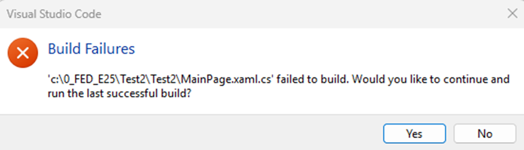

# Note – Bemærk stien i dit projekt (double path)

## Metadata

- **Lektion:** Fejlfindingsnote til MAUI-projektopsætning
- **Kursus:** Front-end udvikling (SW4FED-02)
- **Forelæser:** Jung Min Kim (Jenny)
- **Kilde:** Brightspace-note "Bemærk stien i dit projekt (double path)"
- **Emner dækket:**
  - Problem med dobbelt sti efter oprettelse af nyt MAUI-projekt
  - Hvor svaret findes (Brightspace discussion section)

---

## Problemet

*(I will write in danish first, and in english at the bottom)*

Hvis I ser sådan et problem efter, I har oprettet et nyt MAUI-projekt:

Skærmbilledet viser en "Build Failures"-dialog fra Visual Studio Code:

> `'c:\0_FED_E25\Test2\Test2\MainPage.xaml.cs' failed to build. Would you like to continue and run the last successful build?`

Bemærk stien: `Test2\Test2` – projektnavnet optræder to gange. Det er det, "double path" refererer til.

I have written the response in the **discussion section** in Brightspace (I will summarize here again, when I find a bit more time), so check the reason and solution, if anyone else has same problem.

<!-- Kildenoten indeholder ikke selve løsningen; den henviser kun til discussion-sektionen i Brightspace. Symptomet fremgår dog af skærmbilledet: projektmappen ligger inde i en mappe med samme navn (Test2\Test2), hvilket sker når man åbner den forkerte af de to mapper i VS Code. -->
