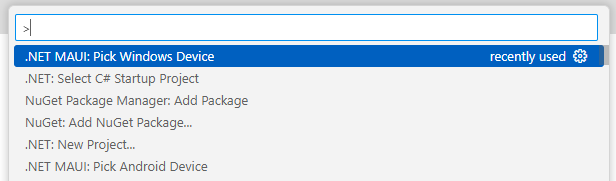

# Note – MAUI-program kører ikke

## Metadata

- **Lektion:** Fejlfindingsnote til MAUI
- **Kursus:** Front-end udvikling (SW4FED-02)
- **Forelæser:** Poul Ejnar Rovsing / Jung Min Kim
- **Kilde:** Brightspace-note "MAUI program won't run"
- **Emner dækket:**
  - Undgå netværksdrev (OneDrive, Google Drive, iDrive)
  - Undgå dybe mappestrukturer
  - Exit code -1073740940 (0xc0000374) og valg af start device
  - Debugging via breakpoint i MauiProgram.cs
  - Manuelle build- og run-kommandoer på Windows

---

## 1. Avoid net-drives

Do **NOT** place your source code on OneDrive, Google Drive, iDrive or similar net-drives, because this is known to give strange errors when you try to build and run your program.

## 2. Avoid deep folders

Do **NOT** place your projects in the bottom of a deep tree structure, as this is also known to give strange errors when you try to build and run your program.

## 3. Other errors

If you get this error:

```text
The program '[41656] appName.exe' has exited with code -1073740940 (0xc0000374).
```

Then try to set the **Start device** for the project.

(Open VS Code => press "Ctrl + Shift + P", then you can see the image below.)

In VS Code: **.NET MAUI: Pick Windows Device** eller **Android Device**.



**If your program still won't run, then set a break point in `MauiProgram.cs` and run debug.**

## 4. Manuelle kommandoer

Sometimes this will help on Windows:

```bash
dotnet build -f net8.0-windows10.0.19041.0 -c Debug -p:PublishReadyToRun=true -p:WindowsPackageType=None
```

And then:

```bash
dotnet run -f net8.0-windows10.0.19041.0 -c Debug -p:PublishReadyToRun=true -p:WindowsPackageType=None
```

<!-- Bemærk: target framework i kommandoerne er net8.0. Bruger du .NET 10, som anbefales i lab 01, skal moniker'en ændres tilsvarende. -->
