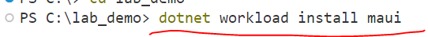
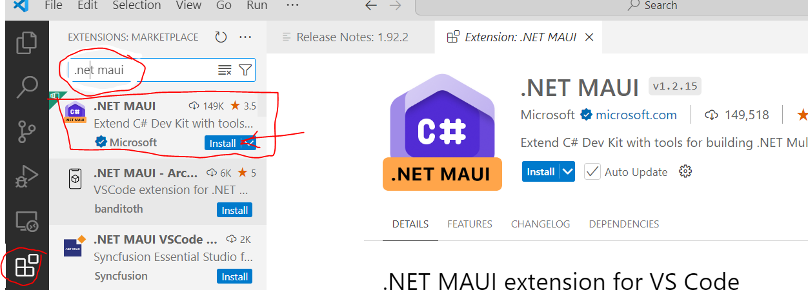
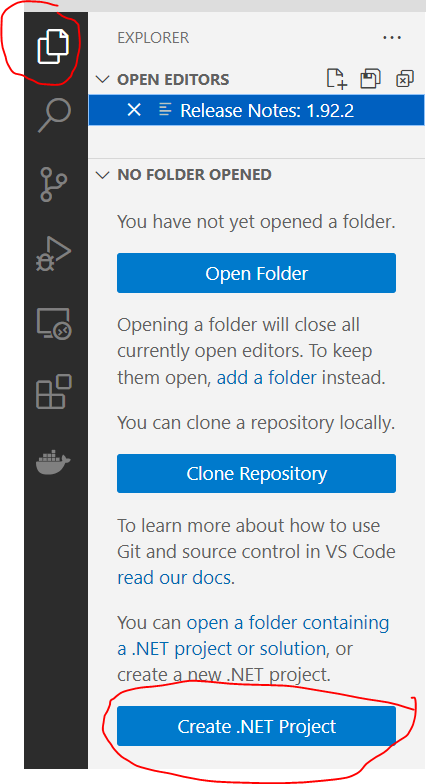
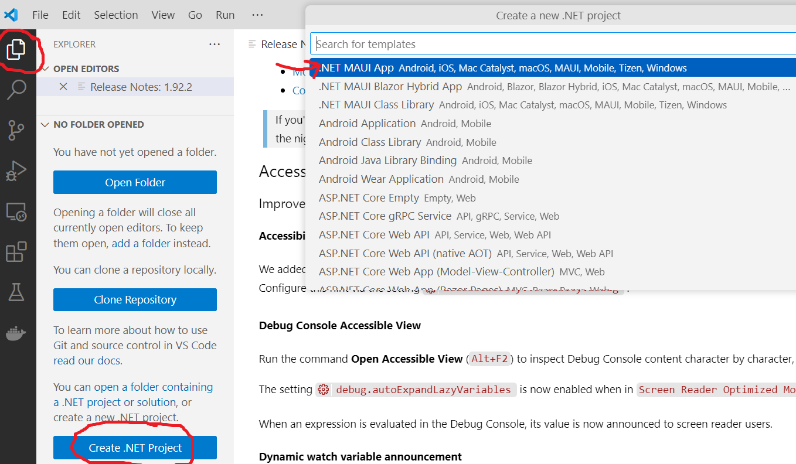
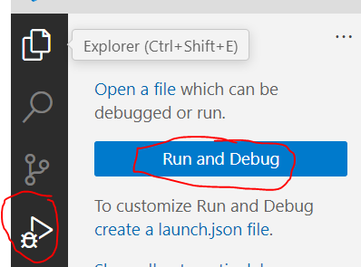
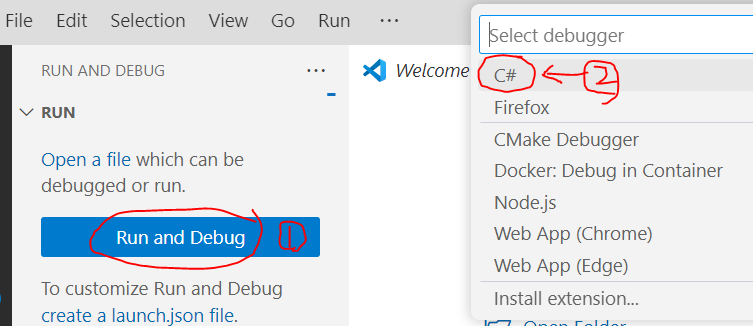
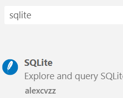
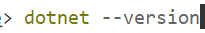

# Note – VS Code setup til MAUI (i stedet for Visual Studio)

## Metadata

- **Lektion:** L01 – Værktøjsopsætning
- **Kursus:** Front-end udvikling (SW4FED-02)
- **Forelæser:** Jung Min Kim (Jenny)
- **Kilde:** Brightspace-note om VS Code-opsætning (eksporteret som "Untitled - Copy (2).html")
- **Emner dækket:**
  - Visual Studio vs. VS Code til .NET MAUI
  - Installation af MAUI workload på Windows
  - Installation af .NET MAUI-extensions i VS Code
  - Oprettelse af et .NET-projekt fra VS Code
  - Valg af C#-debugger ved Run and Debug
  - Installation af SQLite-pakker fra terminalen
  - Kontrol af .NET-version (version 10 anbefales)

---

## 1. Visual Studio eller VS Code?

*(Note) You can always use Visual Studio instead of VS Code.*

- **Microsoft made the most optimal to fit in Visual Studio** with .NET MAUI app.
- But if you really want to work on VS Code instead of Visual Studio:
  - First, you must install .NET MAUI if it is your first time with .NET MAUI.
  - After installing .NET MAUI, then also the extension later.
- Follow the steps to install .NET MAUI **before** installing extensions in VS Code.

## 2. How to install .NET MAUI in Visual Studio Code (Windows)

*You only need to do this the very first time, and afterward you won't need to do it again.*

**1) Open Visual Studio Code and go to Terminal in VS Code**

**2) In Terminal:**

```bash
dotnet workload install maui
```



- It will start to install.

*… (it takes time, and when it is completed, it will show like this) …*

> **Successfully installed workload(s) maui.**

- Done.

**3) Go to this icon, then install .NET MAUI extensions**



Next:



**(If you can't see this button – Create .NET Project – then press "Ctrl+Shift+P" (this can always be used to create a new .NET project), then you can see a pull-down list that looks like the next image)**

Next:



Next:



Done. (You need to choose **C#** – it will appear – when you press "Run and Debug":)



## 3. How to install local database SQLite in Visual Studio Code (Windows)

Go to Terminal (command line) in Visual Studio Code and write:

```bash
dotnet add package sqlite-net-pcl
dotnet add package sqlite-net-sqlcipher
```

### Troubleshooting

If these commands are not working, then go to the Extensions symbol in VS Code:


Search **SQLite** and press the install button:



## 4. Tjek din .NET-version

***If you continuously face problems with .NET MAUI in VS Code, check your .NET version in the terminal in VS Code:***



```bash
dotnet --version
```

- We recommend that you use .NET version **10**.
- If you need to change .NET version, you can prompt ChatGPT "How to set .net10 in visual studio code"; it provides a detailed guide. Follow that and then check in your terminal, `dotnet --version` again.
