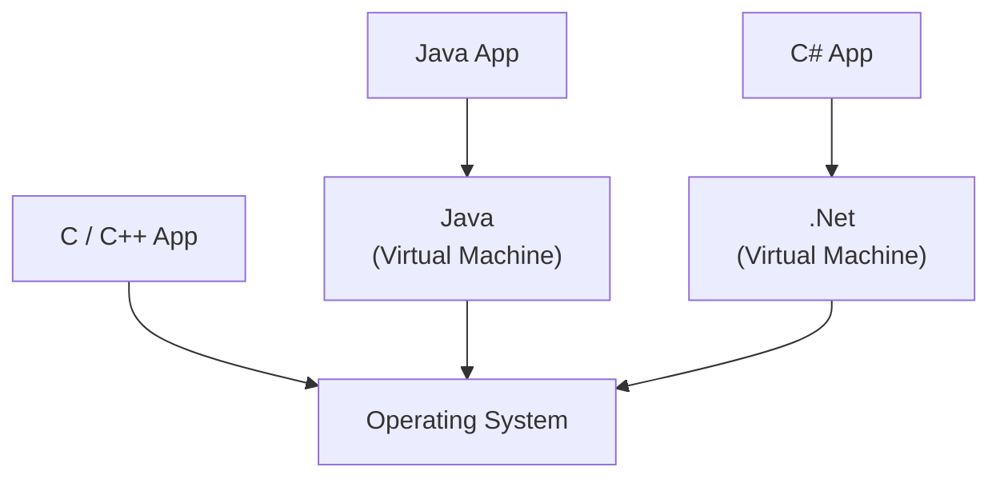
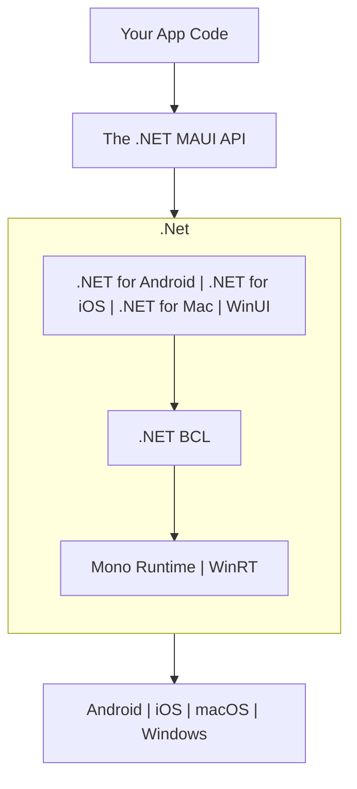
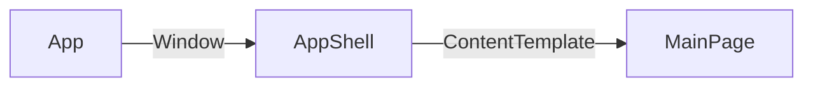

# L01 – Introduktion til .NET MAUI

## Metadata

- **Lektion:** L01 – MAUI introduction (Architecture overview)
- **Kursus:** Front-end udvikling (SW4FED-02)
- **Forelæser:** Poul Ejnar Rovsing / Jung Min Kim
- **Kilde:** L01/MAUI introduction.pdf (29 slides)
- **Emner dækket:**
  - Hvad .NET er, og hvordan runtime/virtual machine-modellen adskiller sig fra native C/C++
  - Hvad .NET MAUI er, og hvilke platforme det targeter
  - MAUI's lagdelte arkitektur oven på .NET (BCL, Mono Runtime, WinRT, platform-SDK'er)
  - XAML som UI-markup
  - Installation af .NET SDK, MAUI build tools, workloads (VS Code og Visual Studio)
  - Oprettelse, build, kørsel og debugging af et MAUI-projekt
  - Anatomien af en MAUI-app: MauiProgram → App → AppShell → MainPage
  - Sammenhængen mellem XAML-træet og den viste UI
  - Platformsspecifikke entry points (AppDelegate, MainActivity)

---

## 1. Arkitekturoverblik: hvad er .NET?

Slide 3 viser et lagdiagram, der sammenligner tre eksekveringsmodeller ovenpå det samme operativsystem:

- En **C/C++ App** kompileres direkte til maskinkode og taler direkte med operativsystemet — ingen mellemliggende runtime.
- En **Java App** kører ovenpå en **Java virtual machine**, som så taler med operativsystemet.
- En **C# App** kører ovenpå **.NET**, som fungerer som virtual machine på samme måde som JVM'en gør for Java.



Pointen er, at C#-kode ikke rammer OS'et direkte. Den kompileres til intermediate code, som .NET-runtimen eksekverer. Det er præcis det, der gør cross-platform muligt: den samme kode kan køre alle steder, hvor der findes en .NET-runtime.

## 2. Hvad er MAUI?

.NET Multiplatform App UI (MAUI) er et framework fra Microsoft til at bygge cross platform UI-applikationer, der targeter Windows, macOS, iOS og Android.

Al logik kan skrives i et .NET-sprog (C#, F# eller VB.Net), og UI'et kan defineres enten i XAML eller i det samme .NET-sprog.

## 3. MAUI og .NET — lagdelingen

Slide 5 viser MAUI's fulde arkitekturstak nedefra og op. Dette diagram er kernen i lektionen:



Lagene læst nedefra:

1. **Operativsystemerne** nederst: Android, iOS, macOS, Windows.
2. **Runtimes:** Mono Runtime dækker Android, iOS og macOS; WinRT dækker Windows.
3. **.NET BCL** (Base Class Library) ligger som ét fælles klassebibliotek ovenpå begge runtimes. Det er dette lag, der gør det samme C#-API tilgængeligt uanset platform.
4. **Platform-bindings:** .NET for Android, .NET for iOS, .NET for Mac og WinUI — de fire platformsspecifikke lag, der eksponerer de native SDK'er.
5. **The .NET MAUI API** ligger ovenpå alle fire og abstraherer dem væk til ét fælles UI-API.
6. **Your App Code** øverst — det er kun her, du normalt skriver kode.

De tre midterste lag (platform-bindings, BCL, runtimes) er på slidet indrammet som "".Net"" — de udgør tilsammen .NET-platformen, mens MAUI-API'et er det, der lægges ovenpå.

## 4. At bygge en MAUI-app

Du bygger en cross-platform applikation ved at skrive .NET MAUI-kode. Hvis du vil, kan du stadig skrive platform- eller OS-specifik kode i din applikation, men du behøver det ikke. .NET MAUI tager din kode og kompilerer den til target-platformen.

Det er ikke nødvendigt at forstå, hvordan .NET MAUI bygger applikationen til de forskellige platforme, for at kunne bygge en MAUI-applikation — men en god forståelse af platformene er en fordel.

## 5. XAML

XAML (eXtensible Application Markup Language) er de facto-valget til at bygge brugergrænseflader i .NET MAUI. Det er et XML-baseret markup-sprog til at definere et UI — på samme måde som HTML gør for web apps, eller som den almindelige XML, Kotlin bruger til at bygge Android-UI'er.

```xml
<?xml version="1.0" encoding="utf-8" ?>
<ContentPage xmlns="http://schemas.microsoft.com/dotnet/2021/maui"
             xmlns:x="http://schemas.microsoft.com/winfx/2009/xaml"
             x:Class="MauiApp1.MainPage">

   <ScrollView>
       <VerticalStackLayout
           Padding="30,0"
           Spacing="25">
```

## 6. Installation af .NET SDK

Hent .NET fra Microsofts download-side (Linux, macOS og Windows). Slidet viser download-badgen for **.NET 10.0 (Long Term Support)**, SDK version 10.0.102, released January 13, 2026.

Listning af installerede SDK'er:

```bash
dotnet --list-sdks
```

Terminal-outputtet på slidet viser flere sideløbende installationer:

```
6.0.321 [C:\Program Files\dotnet\sdk]
7.0.100 [C:\Program Files\dotnet\sdk]
7.0.120 [C:\Program Files\dotnet\sdk]
8.0.417 [C:\Program Files\dotnet\sdk]
10.0.101 [C:\Program Files\dotnet\sdk]
10.0.102 [C:\Program Files\dotnet\sdk]
```

Flere SDK-versioner kan altså sagtens ligge side om side. For at tjekke om installerede SDK'er og runtimes er opdaterede:

```bash
dotnet sdk check
```

## 7. Installation af MAUI build tools

### VS Code

Installér Visual Studio Code, hvis du ikke allerede har det. Åbn **Extensions** og tilføj **.NET MAUI**-extensionen. Screenshottet viser extensions-panelet med .NET MAUI markeret blandt de installerede: ".NET MAUI — Extend C# Dev Kit with tools for building .NET Multi-pla…" fra Microsoft. Ved siden af ligger de relaterede extensions **.NET Install Tool**, **C#** (Base language support for C#) og **C# Dev Kit** (Official C# extension from Microsoft) — de tre er reelt forudsætninger for at MAUI-extensionen kan noget.

### Visual Studio (alternativ)

Installér Visual Studio, hvis du ikke allerede har det. Åbn **Visual Studio Installer** og tilføj **.NET MAUI workload**. I installer-dialogen findes den under **Desktop & Mobile** som **".NET Multi-platform App UI development — Build Android, iOS, Windows, and Mac apps from a single codebase using C# with .NET MAUI."**

## 8. Nyt projekt

### I VS Code

Screenshottet på slide 13 nummererer fremgangsmåden:

1. Klik på **Explorer**-ikonet i sidebaren (med "NO FOLDER OPENED"), og vælg **Create .NET Project**.
2. Vælg projekttype i template-listen — vælg **.NET MAUI App** (mærket Android, iOS, Mac Catalyst, MAUI, Mobile, Tizen, Windows). Bemærk at der også findes **.NET MAUI Blazor Hybrid App** og **.NET MAUI Class Library**, som ikke er dem, du skal bruge her.
3. Vælg folder i filvælgeren.
4. Indtast projektnavn.
5. Vælg **slnx** som solution-format.

### I Visual Studio (alternativ)

Dialogen **Create a new project** — filtrér på C# og søg på "MAUI". Vælg **.NET MAUI App**: "A project for creating a .NET MAUI application for iOS, Android, Mac Catalyst, WinUI and Tizen". Klik **Next**.

## 9. Det scaffoldede projekt

Screenshottene af det genererede projekt viser projekttræet, som er identisk i begge IDE'er:

- `Platforms/` — undermapper pr. platform: Android, iOS, MacCatalyst, Tizen, Windows
- `Properties/`
- `Resources/`
- `App.xaml` og `App.xaml.cs`
- `AppShell.xaml` og `AppShell.xaml.cs`
- `MainPage.xaml` og `MainPage.xaml.cs`
- `MauiProgram.cs`
- `<Projektnavn>.csproj` og `.slnx`

Editoren har `MainPage.xaml` åben — den fulde scaffoldede fil, som den ses i Visual Studio-screenshottet (slide 16), er:

```xml
<?xml version="1.0" encoding="utf-8" ?>
<ContentPage xmlns="http://schemas.microsoft.com/dotnet/2021/maui"
             xmlns:x="http://schemas.microsoft.com/winfx/2009/xaml"
             x:Class="AlohaWorld.MainPage">

    <ScrollView>
        <VerticalStackLayout
            Padding="30,0"
            Spacing="25">
            <Image
                Source="dotnet_bot.png"
                HeightRequest="185"
                Aspect="AspectFit"
                SemanticProperties.Description="dot net bot in a race car number eight" />

            <Label
                Text="Hello, World!"
                Style="{StaticResource Headline}"
                SemanticProperties.HeadingLevel="Level1" />

            <Label
                Text="Welcome to &#10;.NET Multi-platform App UI"
                Style="{StaticResource SubHeadline}"
                SemanticProperties.HeadingLevel="Level2"
                SemanticProperties.Description="Welcome to dot net Multi platform App U I" />

            <Button
                x:Name="CounterBtn"
                Text="Click me"
                SemanticProperties.Hint="Counts the number of times you click"
                Clicked="OnCounterClicked"
                HorizontalOptions="Fill" />
        </VerticalStackLayout>
    </ScrollView>

</ContentPage>
```

## 10. Installation af workload

Du kan blive nødt til at tilføje ekstra workloads, før appen kan køre:

```bash
dotnet restore
```

Terminal-outputtet på slide 17 viser den typiske fejl, man rammer:

```
C:\Program Files\dotnet\sdk\10.0.102\Sdks\Microsoft.NET.Sdk\targets\Microsoft.NET.Sdk.ImportWorkloads.targets(38,5): error NETSDK1147:
  To build this project, the following workloads must be installed: wasm-tools
  To install these workloads, run the following command: dotnet workload restore

Restore failed with 1 error(s) in 1,0s
```

Løsningen er derfor:

```bash
dotnet workload restore
```

som giver output i stil med:

```
Updated advertising manifest microsoft.net.workloads.
Installing workload version 10.0.102.
Downloading microsoft.net.workloads.10.0.100.msi.x64 (10.102.0)
Installing microsoft.net.workloads.10.0.100.msi.x64 ..... Done
Downloading microsoft.net.workload.emscripten.current.manifest-10.0.100.msi.x64 (10.0.102)
```

## 11. Kørsel og debugging

Kommandoerne:

```bash
dotnet restore
dotnet build
dotnet run --framework net10.0-windows10.0.19041.0
```

Eller tryk **F5** for at debugge.

Callout på slidet: `--framework`-argumentet er det, der bestemmer, at appen kører på Windows. Du skal vælge det framework, der er relevant for din egen computer, ud fra listen i `*.csproj`-filen.

### Debugging i Visual Studio

Tryk **F5**. På Windows kræver det, at maskinen er sat i developer mode. Screenshottet viser dialogen **"Enable Developer Mode for Windows"** med teksten "This device needs to be set up correctly to develop this type of app for Windows. If you don't, then you can't install and test your app before you submit it to the Windows Store." Løsningen er at gå til Windows-indstillingerne under **Til udviklere** (Settings → For developers) og slå kontakten øverst **til**.

### Valg af target

Screenshottet på slide 20 viser Visual Studios run-target-dropdown med de tilgængelige mål: **Windows Machine**, **Framework (net7.0-android)**, **Android Emulators** (her en Pixel 5 – API 33, Android 13.0), **iOS Local Devices**, **iOS Remote Devices** og **iOS Simulators**. Den kørende app vises både som Windows-vindue og i Android-emulatoren — samme UI, to platforme: Home-titel, dotnet-bot-billedet, "Hello, World!", "Welcome to .NET Multi-platform App UI" og en "Click me"-knap.

## 12. Anatomien af en .NET MAUI-app

En .NET MAUI-app starter med `CreateMauiApp`-metoden i `MauiProgram.cs`, launcher en instans af `App`-klassen, og viser en `Page`, der er tildelt `MainPage`-property'en på `App`-klassen.

Slide 21 viser opstartskæden som tre kasser forbundet af navngivne pile:



`App` skaber altså et **Window**, der indeholder en **AppShell**, og AppShell'ens **ContentTemplate** peger på **MainPage**.

### MauiProgram.cs

```csharp
public static MauiApp CreateMauiApp()
{
    var builder = MauiApp.CreateBuilder();
    builder
        .UseMauiApp<App>()
        .ConfigureFonts(fonts =>
        {
            fonts.AddFont("OpenSans-Regular.ttf", "OpenSansRegular");
            fonts.AddFont("OpenSans-Semibold.ttf", "OpenSansSemibold");
        });

    return builder.Build();
}
```

### App.xaml

```xml
<?xml version = "1.0" encoding = "UTF-8" ?>
<Application xmlns="http://schemas.microsoft.com/dotnet/2021/maui"
             xmlns:x="http://schemas.microsoft.com/winfx/2009/xaml"
             xmlns:local="clr-namespace:AlohaWorld"
             x:Class="AlohaWorld.App">
    <Application.Resources>
        <ResourceDictionary>
            <ResourceDictionary.MergedDictionaries>
                <ResourceDictionary Source="Resources/Styles/Colors.xaml" />
                <ResourceDictionary Source="Resources/Styles/Styles.xaml" />
            </ResourceDictionary.MergedDictionaries>
        </ResourceDictionary>
    </Application.Resources>
</Application>
```

### App.xaml.cs

```csharp
public partial class App : Application
{
    public App()
    {
        InitializeComponent();
    }

    protected override Window CreateWindow(IActivationState? activationState)
    {
        return new Window(new AppShell());
    }
}
```

Bemærk at det er `CreateWindow`-overridet, der binder de to første kasser i diagrammet sammen: App laver et `Window`, hvis indhold er en `AppShell`.

### MainPage.xaml

```xml
<?xml version="1.0" encoding="utf-8" ?>
<ContentPage xmlns="http://schemas.microsoft.com/dotnet/2021/maui"
             xmlns:x="http://schemas.microsoft.com/winfx/2009/xaml"
             x:Class="AlohaWorld.MainPage">

   <ScrollView>
       <VerticalStackLayout
           Spacing="25"
           Padding="30,0"
           VerticalOptions="Center">

            <Image
                Source="dotnet_bot.png"
                SemanticProperties.Description="Cute dot net bot waving hi to you!"
                HeightRequest="200"
                HorizontalOptions="Center" />

            <Label
                Text="Hello, World!"
```

### MainPage.xaml.cs

```csharp
namespace AlohaWorld
{
    public partial class MainPage : ContentPage
    {
        int count = 0;

        public MainPage()
        {
            InitializeComponent();
        }

        private void OnCounterClicked(object sender, EventArgs e)
        {
            count++;

            if (count == 1)
                CounterBtn.Text = $"Clicked {count} time";
            else
                CounterBtn.Text = $"Clicked {count} times";

            SemanticScreenReader.Announce(CounterBtn.Text);
        }
    }
}
```

Callout på slidet: en **page** er et fuldskærms-view, og et **view** er noget, der vises på skærmen.

## 13. OS-variationer

På Windows er den beskrevne proces præcis, som den er. Men på macOS, iOS og Android findes der specifikke entry points, som operativsystemets SDK'er forventer for at starte en app. .NET MAUI giver dig instanser af disse, som du kan tilpasse, hvis du har behov:

- `AppDelegate`-klassen til macOS og iOS
- `MainActivity`-klassen til Android

## 14. Definition af UI'et — XAML-træet vs. skærmen

Slide 27 sætter det færdige app-vindue side om side med XAML-strukturen og trækker pile fra hvert tag til det tilsvarende element på skærmen. Sammenhængen er:

- `<ContentPage>` → hele vinduet (titelbaren "AlohaWorld" / "Home")
- `<ScrollView>` → hele det scrollbare indholdsområde
- `<VerticalStackLayout>` → den lodrette stak, der arrangerer børnene under hinanden
- `<Image />` → dotnet-bot-billedet (racerbilen)
- første `<Label />` → "Hello, World!"
- anden `<Label />` → "Welcome to .NET Multi-platform App UI"
- `<Button />` → den blå "Click me"-knap nederst

```xml
<ContentPage >
    <ScrollView >
        <VerticalStackLayout >
            <Image />
            <Label />
            <Label />
            <Button />
        </VerticalStackLayout>
    </ScrollView>
</ContentPage>
```

Nesting-dybden i XAML svarer altså direkte til den visuelle indlejring på skærmen: det yderste tag er den yderste ramme, og rækkefølgen af søskende-elementer er den rækkefølge, de tegnes i.

## 15. Alle views er klasser

Alle views i .NET MAUI-apps er C#-klasser. Det gælder både `ContentPage`-views (komplette applikationssider) og controls (elementer, der vises på en side).

Når du bruger en XAML-fil, bruger du XAML-markup til at fortælle viewet, hvordan UI'et skal vises — men viewet selv er stadig en klasse.

Du kan godt have et .NET MAUI-view, der er en C#-fil uden en XAML-fil, men du kan ikke have et XAML-view uden C#.

## 16. Referencer og links

- *.NET MAUI in Action*, Manning — kapitel 1 og 2
- [Download .NET (Linux, macOS, and Windows)](https://dotnet.microsoft.com/download)
- [Build your first .NET MAUI app](https://learn.microsoft.com/en-us/dotnet/maui/get-started/first-app?tabs=vswin&pivots=devices-android)
