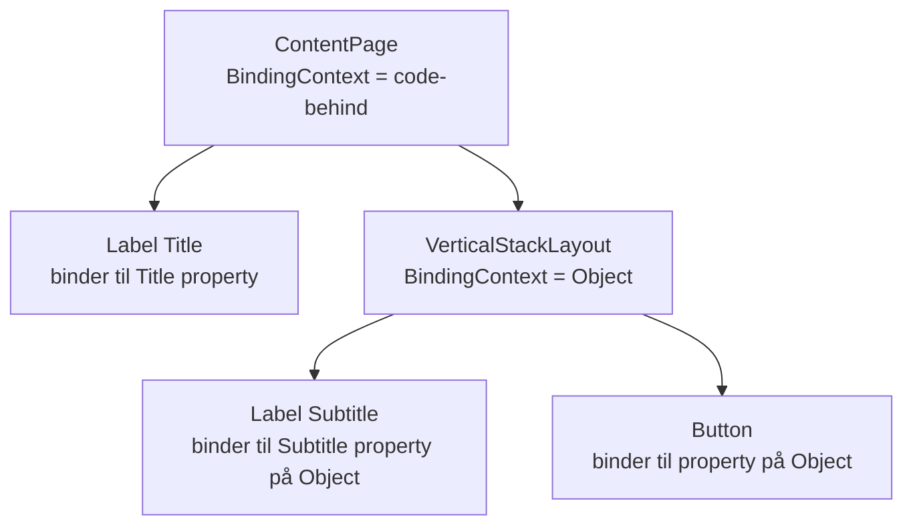

# L02.2 – Data Binding Basics

## Metadata

- **Lektion:** L02 – Data Binding Basics
- **Kursus:** Front-end udvikling (SW4FED-02)
- **Forelæser:** Poul Ejnar Rovsing / Jung Min Kim
- **Kilde:** L02/Lectures/Data Binding Basics.pdf (25 slides)
- **Emner dækket:**
  - Source og target i .NET MAUI data binding
  - BindableObject og bindable properties
  - Data binding i kode kontra i XAML
  - BindingContext og hvordan den nedarves i view-hierarkiet
  - Views: pages, layouts og controls
  - View-to-view bindings med `x:Reference`
  - CollectionView, DataTemplate og ItemTemplate
  - ObservableCollection og change notification
  - ItemsSource i code-behind og i XAML

---

## 1. .NET MAUI data binding

.NET MAUI data binding forbinder et par af properties mellem to objekter: en **source** og en **target**. Som regel er ét af objekterne et user-interface-objekt. Ændringer i den ene property reflekteres automatisk i den anden.

**Source** er det objekt (og den property), som data bindingen refererer til. Det er den autoritative data — det, vi vil vise.

**Target** er det objekt (og den property), som data bindingen sættes på. Det er objektet, der reflekterer dataene på en eller anden måde — fx en kontrol, der viser værdier eller skifter farve på baggrund af værdierne.

## 2. Data binding og BindableObject

Data binding binder en property til en anden property: når den ene ændrer sig, gør den anden også.

Target-propertyen skal tilhøre et objekt, der nedarver fra baseklassen `BindableObject`. Alle indbyggede UI-kontroller i .NET MAUI nedarver `BindableObject`.

Target-propertyen bindes til source'en — target er dér, hvor bindingen sættes.

Source-propertyen kan tilhøre et objekt af hvilken som helst type, men skal matche target-propertyens type. Hvis target- og source-propertyerne ikke er samme type, kan en value converter bruges.

## 3. Data binding i kode

Data binding i kode kræver to trin:

1. `BindingContext`-propertyen på target-objektet skal sættes til source-objektet.
2. `SetBinding`-metoden — ofte brugt sammen med `Binding`-klassen — skal kaldes på target-objektet for at binde en property på det objekt til en property på source-objektet.

Target-propertyen skal være en bindable property, hvilket betyder at target-objektet skal nedarve fra `BindableObject`. Fx er en property på `Label`, såsom `Text`, associeret med den bindable property `TextProperty`.

## 4. Data binding i XAML

Data binding i XAML kræver også to trin, men `Binding` markup extension erstatter `SetBinding`-kaldet og `Binding`-klassen.

Når man definerer data bindings i XAML, er der flere måder at sætte `BindingContext` på target-objektet:

- Nogle gange sættes den fra code-behind-filen.
- Nogle gange med en `StaticResource`- eller `x:Static`-markup extension.
- Nogle gange som indholdet af `BindingContext` property-element-tags.

## 5. Binding Context

En Binding Context er et objekt, der holder data, som bindings kan referere til.

Binding context nedarves og kaskaderer fra parent til child-komponenter i et view.

Binding contexts kan defineres eksplicit for ethvert view. Men hvis du ikke eksplicit definerer en binding context for en kontrol i en `ContentPage`, vil binding contexten være den samme som `ContentPage`'ens. Hvis du eksplicit sætter binding contexten for et layout eller en collection, nedarver child-kontrollerne den.

`BindingContext`-propertyen specificerer source-objektet. At forstå binding contexts er vigtigt.

### To eksempler på binding context (fra slidesene)

Første eksempel: binding contexten for en page er sat til pagens code-behind. En Title og en Button nedarver denne binding context og binder til properties på `ContentPage`'ens code-behind.

Andet eksempel: binding contexten for en `VerticalStackLayout` er sat til en objekt-property i code-behind. En Subtitle og en Button inde i dette layout nedarver denne binding context og binder til properties på det objekt.



## 6. Views

Views inddeles i tre kategorier:

- **Page** — en særlig slags view, der (som regel) fylder hele skærmen og kan navigeres til. En Page indeholder ét child layout, som igen kan indeholde flere andre layouts.
- **Layout** — et view brugt til at arrangere elementer på skærmen. Eksempler: `ScrollView` og `Grid`.
- **Control** — et view, der eksplicit enten viser noget på skærmen eller modtager brugerinput. Eksempler: `Label` og `Entry` er controls.

## 7. View-to-view bindings

View-to-view bindings kan sættes i XAML til at binde properties i et view uden nogen indgriben i code-behind. De definerer data bindings, der forbinder properties på to views på samme page.

I dette tilfælde sættes `BindingContext` på target-objektet med `x:Reference` markup extension.

### Markup for view-to-view bindings

```xml
<VerticalStackLayout VerticalOptions="Center"
                     HorizonalOptions="Center"
                     Spacing="20"
                     WidthRequest="200">
    <Label FontSize="Title"
           BindingContext="{x:Reference TextEntry}"
           Text="{Binding Text}"
           HorizontalTExtAlignment="Center"/>
    <Entry x:Name="TextEntry"
           Placeholder="Enter some text..." />
</VerticalStackLayout>
```

`BindingContext="{x:Reference TextEntry}"` sætter binding contexten for dette view til et andet view. `Text="{Binding Text}"` sætter binding source til `Text`-propertyen på binding contexten. `x:Name="TextEntry"` giver `Entry`'en det navn, der refereres til.

<!-- Bemærk: HorizonalOptions og HorizontalTExtAlignment er stavefejl i selve slidesene og er bevaret her. -->

### Bindings-appen: Image bundet til Slider

Bindings-appen har `Scale`-propertyen på et `Image` bundet til `Value`-propertyen på en `Slider`:

```xml
...
<Slider x:Name="ZoomSlider"/>

<Image Source="dotnet_bot.png"
       WidthRequest="300"
       HorizontalOptions="Center"
       BindingContext="{x:Reference ZoomSlider}"
       Scale="{Binding Value}"/>
```

`BindingContext="{x:Reference ZoomSlider}"` sætter binding contexten for image-kontrollen til `ZoomSlider`. `Scale="{Binding Value}"` sætter `Scale`-propertyen på billedet, og bindingen går til en property kaldet `Value`.

## 8. CollectionView

Data binding er en kraftfuld feature i .NET MAUI, og den gør meget mere end at fjerne boilerplate-kode. Den åbner en række muligheder, vi ikke ville have uden den.

En af de mest kraftfulde anvendelser af data binding er at sætte en binding source for en `CollectionView` — en property, der hedder `ItemsSource`.

En `CollectionView` viser en collection af items, fx en `List<T>`, på skærmen. Collections eller lister er kernen i mange apps i .NET MAUI. Data binding kan bruges til at definere, hvordan hvert enkelt item i collectionen skal vises.

Den mest kraftfulde feature ved `CollectionView` er brugen af en `DataTemplate`.

## 9. DataTemplate

En `DataTemplate` er definitionen af, hvordan ting skal vises på skærmen.

Med en `DataTemplate` kan man definere et vilkårligt layout og binde aspekter af det layout til properties på binding contexten.

DataTemplates kan defineres inline, men kan også være uafhængige, genbrugelige views.

## 10. ItemTemplate

`ItemTemplate` er en property på en `CollectionView`. Den specificerer den template, der skal anvendes på hvert item i collectionen af items, der skal vises. Typen er `DataTemplate`.

Forskellen på ItemTemplate og DataTemplate: en `DataTemplate` definerer, hvordan et item vises på skærmen. En `ItemTemplate` er den specifikke `DataTemplate`, der er i brug for den pågældende `CollectionView`. Binding contexten for en `ItemTemplate` er selve item'et.

## 11. Eksempel: CollectionView, ItemTemplate, DataTemplate

```xml
<CollectionView Grid.Row="4” x:Name="TodosCollection">
    <CollectionView.ItemTemplate>
        <DataTemplate>
            <Grid WidthRequest="350"
                  Padding="10"
                  Margin="0, 20"
                  ColumnDefinitions="2*, 5*"
                  RowDefinitions="Auto, 50"
                  x:Name="TodoItems">
                <CheckBox VerticalOptions="Center"
                           HorizontalOptions="Center"
                           Grid.Column="0"
                           Grid.Row="0"/>
                <Label Text="{Binding Title}"
                        FontAttributes="Bold"
                        LineBreakMode="WordWrap"
                        HorizontalOptions="StartAndExpand"
                        FontSize="Large"
                        Grid.Row="0"
                        Grid.Column="1" />
                <Label Text="{Binding Due, StringFormat='{0:dd MMM yyy}'}"
                        Grid.Column="1"
                        Grid.Row="1" />
            </Grid>
        </DataTemplate>
    </CollectionView.ItemTemplate>
</CollectionView>
```

Gennemgangen fra slidesene, linje for linje:

`CollectionView` tilføjes og gives navnet `TodosCollection`, så den kan refereres i kode. Inde i `CollectionView` tilføjes et element, der definerer `ItemTemplate`-propertyen. En `DataTemplate` tilføjes for at definere, hvordan hvert item i collectionen præsenteres, og den tildeles `ItemTemplate`-propertyen ved at være nested som direkte child.

`Grid`'et tilføjes og gives navnet `TodoItems`, og `CollectionView`'et (XAML) bindes til en `ObservableCollection` (code-behind) af `TodoItems`.

Det første `Label` binder `Text`-propertyen til `Title`-propertyen på item'et. Det andet `Label` binder `Text` til `Due`-propertyen — og da `Due` er en `DateTime`, angives en formateringsregel via `StringFormat`.

`CollectionView` definerer altså et specifikt layout for præsentationen af hvert item, fx i to-do-listen. Vi har tilføjet en `CollectionView` og angivet en definition af, hvordan hvert item i collectionen skal vises — men vi har endnu ikke bundet den til en collection. Det bliver en `ObservableCollection` i code-behind.

## 12. ObservableCollection

En `ObservableCollection` er en generisk collection ligesom en `List`.

`ObservableCollection` er automatisk koblet op gennem XAML-engine'en, så den giver notification når items tilføjes eller fjernes, uden at vi behøver gøre noget ekstra i koden.

En `ObservableCollection` er en speciel type collection, der sender notifications når dens indhold ændrer sig, til code-behind, og som bindes som kilde for de items, `CollectionView`'et skal vise. Det opdaterer automatisk `CollectionView`'et i UI'et, hvis vi tilføjer eller fjerner to-do-items.

## 13. ItemsSource

`ItemsSource` er en property på en `CollectionView`.

.NET MAUI `CollectionView` har følgende properties, der definerer de data der skal vises, og deres udseende:

- **ItemsSource** — specificerer collectionen af items, der skal vises. Type: `IEnumerable`.
- **ItemTemplate** — specificerer den template, der skal anvendes på hvert item i collectionen. Type: `DataTemplate`.

### ItemsSource-eksempel

`ItemsSource` i code-behind (i constructoren):

```csharp
TodosCollection.ItemSource = Todos;
```

`ItemsSource` i XAML:

```xml
<CollectionView Grid.Row="4"
                ItemsSource="{Binding Todos}"
                x:Name="TodosCollection">
```

## 14. References & Links

- *.NET MAUI in Action* af Matt Goldman
- Data Binding Basics: https://learn.microsoft.com/en-us/dotnet/maui/xaml/fundamentals/data-binding-basics
