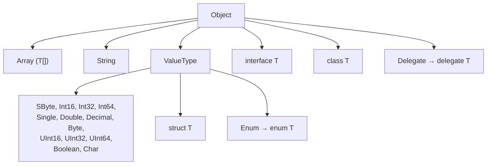

# L03.2 – .NET (og C#) typesystem

## Metadata

- **Lektion:** L03 – .NET's type system
- **Kursus:** Front-end udvikling (SW4FED-02)
- **Forelæser:** Poul Ejnar Rovsing / Jung Min Kim
- **Kilde:** L03/FED .Nets type system.pdf (21 slides)
- **Emner dækket:**
  - Common Type System (CTS) og typehierarkiet i .NET
  - Datatyper på tværs af sprog (CLR, C++, C#, VB.NET, Java)
  - Reference types kontra value types og hvor de allokeres
  - Unified type system, boxing og unboxing
  - `char` og Unicode
  - `string`, immutability og hvad concatenation koster
  - `switch` på strings
  - `StringBuilder` og `StringWriter`
  - `Regex`
  - Implicit typing med `var`

---

## 1. Common Type System, CTS

Datatyperne i .NET udgør et hierarki med `Object` i toppen.

Under `Object` ligger blandt andet `Array` (`T[]`), `String`, `ValueType`, `interface T`, `class T` og `Delegate` (`delegate T`).

Under `ValueType` ligger de primitive typer: `SByte`, `Int16`, `Int32`, `Int64`, `Single`, `Double`, `Byte`, `UInt16`, `UInt32`, `UInt64`, `Boolean`, `Char` samt `Decimal`. Desuden `struct T` og `Enum` (`enum T`).

`Decimal`, `Byte`, `UInt16`, `UInt32`, `UInt64`, `Boolean` og `Char` er ikke required by CTS.

De grå typer i diagrammet er UDT — user defined types: `interface T`, `class T`, `delegate T`, `struct T` og `enum T`.



## 2. Datatyper pr. sprog

| CLR | C++ | C# | VB.NET | Java |
| --- | --- | --- | --- | --- |
| Object | (void) | object | Object | object |
| String | string | string | String | string |
| Boolean | bool | bool | Boolean | Boolean |
| Char | char | char | Char | char |
| Single | float | float | Single | float |
| Double | double | double | Double | double |
| Decimal | - | decimal | Decimal | - |
| SByte | char | sbyte | - | byte |
| Byte | unsigned char | byte | Byte | - |
| Int16 | short | short | Short | short |
| UInt16 | unsigned short | ushort | - | - |
| Int32 | int | int | Integer | int |
| UInt32 | unsigned int | uint | - | - |
| Int64 | long long int | long | Long | long |
| UInt64 | - | ulong | - | - |

Slidesene viser derudover typerne som de ser ud i ILDASM.

## 3. Instantiering af reference objects

```csharp
class HelloClass
{ public void SayHi() {...}
}

class HelloApp
{
  public static int Main(string[] args)
    {
    // Make instance of HelloClass.
    HelloClass c1 = new HelloClass();
    c1.SayHi();

    // Make another instance of HelloClass
    HelloClass c2;
    c2 = new HelloClass();
    ...
    }
}
```

Diagrammet på sliden viser, at referencerne `c1` og `c2` ligger på stakken, mens selve objekterne ligger på heapen.

## 4. Instantiering af value objects

```csharp
struct HelloStruct
{
  public void SayHi() {...};
  public int x;
}

class HelloApp
{
  public static int Main(string[] args)
    {
    // Make instance of HelloStruct.
    HelloStruct c1 = new HelloStruct ();
    c1.SayHi();
    // Make another instance of HelloStruct.
    HelloStruct c2; // Use of new is optional
    c2.x = 10;
    c2.SayHi();
}
```

Her ligger både `c1` (med værdien 0) og `c2` (med værdien 10) på stakken. Brug af `new` er valgfri for value types.

## 5. Unified type system — "Everything is an object"

```csharp
int i = 123;
object o = i;      // "Boxing"

object p = o;

int j = (int)o;    // "Unboxing"
int k = j;

Console.Writeline(i.ToString());
```

Ved boxing kopieres værdien 123 fra stakken ind i et `System.Int32`-objekt på heapen, og `o` peger på det objekt. Ved unboxing kopieres værdien tilbage til stakken.

## 6. Hvorfor boxing?

Målet var "to create a language in which everything really is an object".

C# bruger boxing og unboxing til at bygge bro mellem primitive typer og class types, så data af alle typer kan behandles som et objekt.

Og C# introducerer value types, der allokeres på stakken, hvilket i mange tilfælde kræver mindre hukommelse og giver hurtigere programafvikling.

## 7. Reference types kontra value types

- Reference types giver "ægte" objekter.
- Value types giver formatteret memory.
- I C# og VB er alle klasser reference types.
- I C# og VB er primitives, structs og enums value types.
- Instanser af value types har ikke en object header.
- Instanser af value types garbage collectes ikke uafhængigt.

## 8. char

`char` er et alias for BCL's `System.Char`.

`char` er en value datatype, men kan ikke bruges til beregninger:

```csharp
char ch = 'H';
ch += 2;                    // Not allowed!
int i = (int) ch;
i += 2;
```

`\` er et særligt escape character, fx `'\n'`.

`char`-datatypen fylder 2 bytes, og karaktertabellen er Unicode:

```csharp
ch = 'α';            // ~ 'α'
```

`03B1` er en 4-cifret hexadecimal character code.

## 9. string

`string` er et alias for BCL's `System.String`.

`string` er en indbygget type i alle .NET-sprog og er understøttet af CLR.

`string` er forskellig fra et array af `char`, men der findes funktioner til at konvertere mellem de to typer.

`string` er en reference type.

```csharp
string str = "Hello";
```

I hukommelsen holder `str` en reference til et objekt, der indeholder længden (5) efterfulgt af tegnene H, e, l, l, o. Der er ingen null-terminering. Hvert `char` fylder 2 bytes, fordi det er Unicode.

## 10. String er immutable

Instanser repræsenterer en enkelt, immutable streng af tegn i hukommelsen. Tegnene kan ikke ændres.

Metoder på `System.String` returnerer en ny instans: `ToUpper()`, `Substring()`, `Split()` osv. String concatenation-udtryk skaber nye instanser.

```csharp
string str = "Hello";
char ch = str[3];
str[3] = 'w';
str.ToUpper();
str = str.ToUpper();
str = str + " World";
```

De mellemliggende strenge — fx resultatet af `str.ToUpper()`, når det ikke tildeles — bliver garbage collected. Til sidst peger `str` på en ny streng af længde 11: "HELLO World".

<!-- Bemærk: linjen str[3] = 'w'; er på sliden vist som illustration af at strings er immutable; den kan ikke compile i C#. -->

## 11. Switch på string

`switch`-statementet understøtter at switche på strings.

```csharp
Color ColorFromFruit(string s) {
   switch (s.ToLower()) {
      case "apple":
         return Color.Red;
      case "banana":
         return Color.Yellow;
      case "carrot":
         return Color.Orange;
      default:
         throw new InvalidArgumentException();
   }
}
```

## 12. System.Text.StringBuilder

`StringBuilder` vedligeholder en intern voksende buffer og giver random read-write-adgang til tegnene.

`ToString()` returnerer en `String`-instans, der bruger `StringBuilder`-objektets buffer. Det er meget effektivt.

Tommelfingerreglen: brug `String` til statiske strenge, og brug `StringBuilder` til at skabe dynamiske strenge. `StringBuilder` er måden at bygge instanser af `System.String` inkrementelt.

## 13. StringWriter

`StringWriter`-klassen fra namespacet `System.IO` kan også bruges til at bygge en lang streng effektivt.

`StringWriter` har medlemsfunktioner med forskellige overloads af `Write()` og `WriteLine()`. De virker som forventet, men gemmer tegnene i en buffer, som efterfølgende kan kopieres til en `String`.

```csharp
StringWriter sw = new StringWriter();

for (int i = 0; i < 100000; i++)
  sw.WriteLine("A part of a very long string. ");

string str = sw.ToString();
```

## 14. Regex

`string`-klassen har mange medlemsfunktioner og nogle få properties, som gør det let at arbejde med tekststrenge i C# — læs mere om dem i online-hjælpen.

Men når det kommer til de mere avancerede operationer på strenge, såsom at parse dem fra en specifik syntaks, er der en anden klasse, man ofte kan bruge: **Regex** fra namespacet `System.Text.RegularExpressions`.

Klassen har så mange faciliteter, at der er skrevet en hel bog om den alene — men man kan sagtens nøjes med at bruge et lille hjørne af dens muligheder.

## 15. Implicit typing af lokale variable

Man kan bede compileren om at inferere typerne af lokale variable. Man erstatter blot type-delen af en normal lokal variabeldeklaration med `var`.

```csharp
MyType myVariable1 = GetNewMyType();

var myVariable2 = GetNewMyType();

var variable3 = 0; // Won't compile
```

Compileren sætter typen af `myVariable2` til den type, `GetNewMyType()` returnerer. `myVariable2` er stadig statisk typet.

<!-- Sliden markerer var variable3 = 0; som "Won't compile" med begrundelsen "No type information so compiler can't infer the type!" — i praksis infererer moderne C# her int; kommentaren gengives som på sliden. -->

## 16. References & Links

- C# programming guide: https://docs.microsoft.com/en-us/dotnet/csharp/programming-guide/
- C# naming guideline: https://docs.microsoft.com/en-us/dotnet/standard/design-guidelines/capitalization-conventions og https://csharpcodingguidelines.com/
- C# reference: https://docs.microsoft.com/en-us/dotnet/csharp/language-reference/
- C# Language Specification: https://docs.microsoft.com/en-us/dotnet/csharp/language-reference/language-specification/introduction
