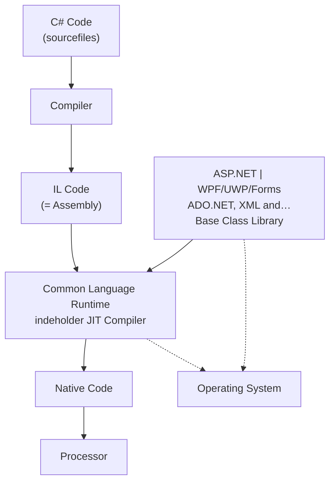
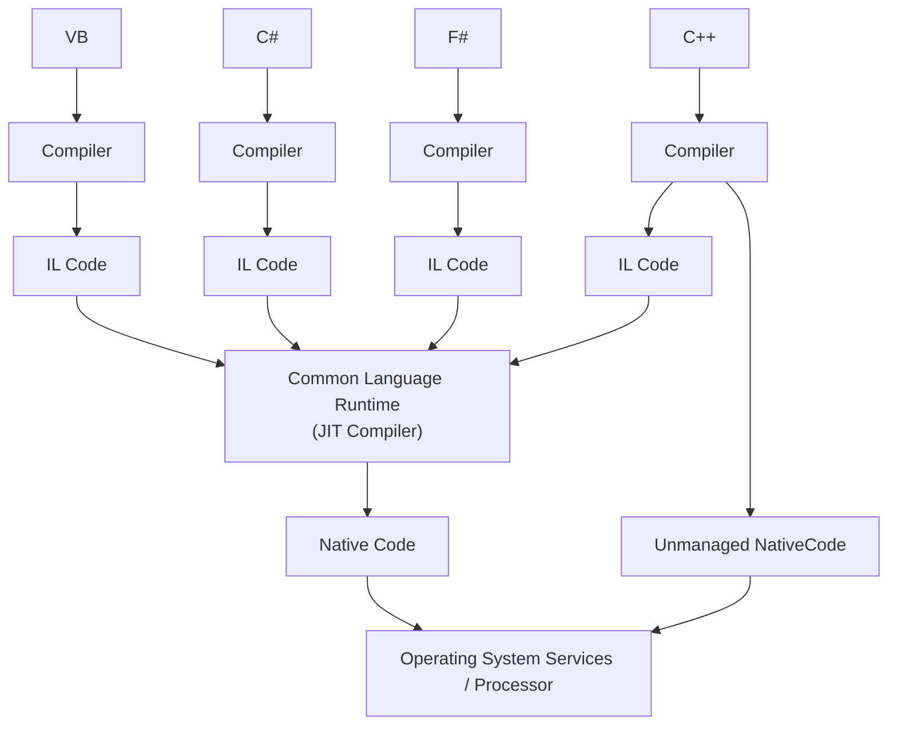
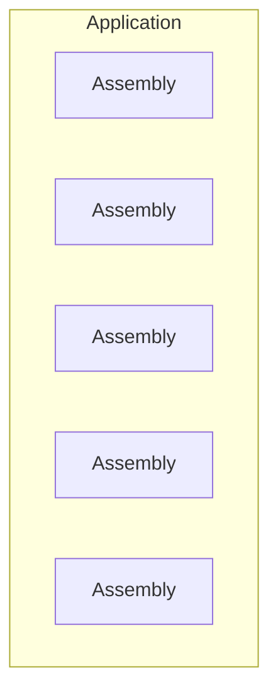
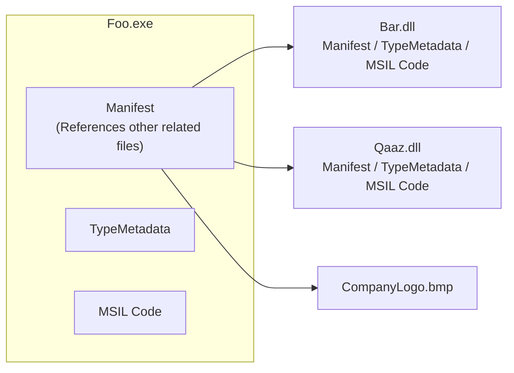

# L04 – .NET Architecture

## Metadata

- **Lektion:** L04 – .NET Architecture
- **Kursus:** Front-end udvikling (SW4FED-02)
- **Forelæser:** Poul Ejnar Rovsing / Jung Min Kim
- **Kilde:** L04/L4 NET Architecture.pdf (26 slides)
- **Emner dækket:**
  - Hvad .NET er: CLR som runtime engine plus .NET Framework som klassebiblioteker
  - Kompileringskæden: source code → IL code → JIT → native code
  - .NET Framework Execution Model på tværs af sprog (VB, C#, F#, C++)
  - .NET Native og AOT-kompilering vs. JIT
  - .NET Framework-arkitekturens lag: CLS, BCL, CLR
  - .NET-versioner, LTS vs. STS, .NET 10 og C# 14
  - Common Language Runtime's interne komponenter
  - .NET's designmål: robusthed, sikkerhed, simpel deployment, multi-language
  - Assemblies: unit of deployment, manifest, metadata, MSIL
  - Single file vs. multi file applications, fysisk vs. logisk view

---

## Agenda

- What is .NET?
- Architecture
- Assemblies

---

## 1. Hvad er .NET?

Kernen i .NET er en **Runtime Engine** (en virtual machine) kaldet **CLR**, plus et sæt kodebiblioteker kaldet **.NET Framework**.

Slide 3 viser hele kæden fra kildekode til processor som et flowdiagram med to lodrette spor, der mødes:

Venstre spor — kompileringskæden:

1. **C# Code** (mærket "Sourcefiles" med rød pil)
2. **Compiler**
3. **IL Code** (mærket "Assembly" med rød pil — dvs. det er på dette niveau, en assembly opstår)
4. **Common Language Runtime**, som indeholder en **JIT Compiler**
5. **Native Code**
6. **Processor**

Højre spor — bibliotekerne, tegnet som en stak af klodser med en klamme over toppen:

- **ASP.NET** og **WPF/UWP/Forms** øverst
- **ADO.NET, XML and…** i midten
- **Base Class Library** nederst

Bibliotekerne peger med en pil ind i **Common Language Runtime** — dvs. CLR'en er det, der leverer dem til den kørende kode. Både CLR'en og bibliotekerne har stiplede pile ned til **Operating System**, som ligger ved siden af Processor.

Pointen: C#-kildekoden kompileres aldrig direkte til maskinkode. Compileren producerer IL (Intermediate Language), og først CLR'ens JIT-compiler oversætter IL til native code, som processoren så eksekverer.

## 2. .NET Framework Execution Model

Slide 5 udvider billedet til flere sprog. Diagrammet har to navngivne rækker i venstre margen: **Source code** øverst og **Managed code** derunder.

Øverst fire sprogkasser: **VB**, **C#**, **F#** og **C++**. Under hver ligger en **Compiler**. Under hver compiler ligger en kasse med **IL Code** — fire identiske IL-kasser. Alle fire IL-kasser har pile ned i den samme brede **Common Language Runtime**-blok, som indeholder **JIT Compiler**. Derfra går det til **Native Code** og videre ned til **Operating System Services / Processor**.

Ved siden af C++-compileren stikker der en gren ud til højre: **Unmanaged NativeCode**, som går uden om hele CLR-blokken og direkte ned i Operating System Services / Processor.

Det centrale er skellet mellem **managed code** (alt der går gennem IL og CLR) og **unmanaged native code** (C++-grenen, der springer runtimen over). Managed code får CLR'ens services — garbage collection, type-safety, exception handling — unmanaged gør ikke.

## 3. .NET Native

Typisk kompileres apps, der targeter .NET Framework, til intermediate language (IL). Ved run time oversætter just-in-time (JIT)-compileren IL'en til native code.

**.NET Native** kompilerer derimod Windows Store-apps direkte til native code. Det er **AOT (Ahead-of-time)**-kompilering, som forbedrer startup time: hurtigere start, men længere kompilering, beregnet til UWP. .NET Native bruger ikke en Just-in-time (JIT) — i stedet oversættes IL til native machine code allerede på build-tidspunktet.

Fordele ved .NET Native:

- Konsistent hurtige startup times
- Hurtige execution times

Begrænsninger:

- Kræver trimming
- Tungere build-proces
- Større binaries (mere native code)

## 4. .NET Framework Architecture

Slide 7 viser arkitekturen som en muret stak set i 3D, nedefra og op:

1. **Operating System** (grå, nederst)
2. **Common Language Runtime** (rød, fremhævet med en blå pil) — dette er det lag, forelæsningen peger på
3. **Base Class Library** (blå, bred blok)
4. Et lag af biblioteker: **ADO.NET**, **XML**, **Entity**, **LINQ**, **WCF**, **…**
5. Et lag af application frameworks: **ASP .NET**, **Windows Forms**, **WPF**, **UWP**
6. **Common Language Specification** (orange, bred blok)
7. Øverst sprogene: **VB**, **C++**, **C#**, **F#**, **…**

En klamme i venstre side markerer, at lagene fra Common Language Runtime og op til Common Language Specification tilsammen udgør "**.Net**" — operativsystemet er altså udenfor.

Callout-boksen til højre forklarer BCL:

> **BCL: a core set of libraries.** Indeholder klasserne:
> - Data types, collections, file I/O, networking class, date/time classes, threading classes, etc.
> - Inkluderer diverse namespaces: `System`, `System.IO`, `System.Collections`, `System.Threading`, `System.Net.Http.HttpClient`, etc.

**Common Language Specification (CLS)** er det, der gør flersprogethed mulig: den definerer den fælles delmængde af regler, alle .NET-sprog skal overholde, så typer defineret i ét sprog kan bruges fra et andet.

## 5. .NET 10 og C# 14

Slidet viser Microsofts to annonceringsgrafikker: "Announcing .NET 10" og "Introducing C# 14" (de karakteristiske lilla ubåde). Links:

- https://devblogs.microsoft.com/dotnet/announcing-dotnet-10/
- https://devblogs.microsoft.com/dotnet/introducing-csharp-14/

## 6. .NET-versioner og supportpolitik

Slide 9 er en tidslinje over release-kadencen med supportvinduer tegnet som bjælker:

| Version | Release | Supporttype |
|---|---|---|
| .NET 8 | Nov 2023 | Long Term Support (lilla bjælke, løber til ca. .NET 11-tidspunktet) |
| .NET 9 | Nov 2024 | Standard Term Support (grå bjælke, kortere) |
| .NET 10 | Nov 2025 | **Latest release** — Long Term Support (markeret med stor pil) |
| .NET 11 | Nov 2026 | Standard Term Support |
| .NET 12 | Nov 2027 | Long Term Support |

Legenden nederst:

- **LONG TERM SUPPORT** — patches i 3 år
- **STANDARD TERM SUPPORT** — patches i 2 år

Mønsteret er altså: en ny major version hver november, hvor lige versionsnumre (8, 10, 12) er LTS med 3 års patches, og ulige (9, 11) er STS med 2 års patches.

---

## 7. Common Language Runtime — de interne komponenter

CLR er et **run-time environment**, der kører koden og leverer services, som gør udviklingsprocessen lettere.

Slide 11 viser CLR'ens indre som en blok af sub-komponenter, arrangeret i lag:

- Øverst: **Base Class Library Support**
- Dernæst to kolonner: **Thread Support** | **COM Marshaler**
- **TypeChecker** | **Exception Manager**
- **SecurityEngine** | **DebugEngine**
- Tre side om side: **IL to Native Compiler (JIT)** | **Code Manager** | **Garbage Collector**
- Nederst, bredt: **Class Loader**

Læst nedefra er det opstartsrækkefølgen: Class Loader indlæser typer, JIT'en oversætter deres IL til native, Code Manager styrer eksekveringen, og Garbage Collector rydder op. Lagene ovenover er de services, der kører sideløbende — typekontrol, exceptions, sikkerhed, debugging, tråde og COM-interop.

## 8. .NET's designmål: Robust and Secure

### Automatic lifetime management

- Alle .NET-objekter er garbage-collected — ingen stray pointers, ingen problemer med circular references
- Multi-generational mark-and-compact GC
- Concurrent, self-configuring, dynamically tuned

### Exception handling

- Error handling er et 1st class concept
- Ingen error return codes — kun exceptions
- Exceptions kan sendes på tværs af components og languages

### Code correctness and type-safety

- IL kan verificeres for at garantere type-safety
- Ingen unsafe casts
- Ingen uninitialized variables
- Ingen out-of-bounds array indexing

### Intermediate Language code

- IL (Intermediate Language) ~ CIL (C for Common) ~ MSIL (MS for Microsoft) — tre navne for det samme
- Ingen interpreter
- Install-time (Ngen) eller run-time IL-til-native-kompilering (JIT)

### Native code

- Hurtige execution times
- Konsistent hurtige startup times
- Lave deployment- og update-omkostninger
- Optimeret app memory usage

## 9. .NET's designmål: Simplify Deployment

### Assemblies

- Enheden for deployment, versioning og security
- Self-describing gennem **manifest**

### Zero-impact install

- Applikationer og komponenter kan være shared eller private

### Side-by-side execution

- Flere versioner af den samme komponent kan sameksistere, endda i den samme proces — hvis der bruges strong named assemblies

## 10. .NET's designmål: Make It Simple To Use

### Organization

- Kode organiseres i hierarkiske namespaces og classes

### Unified type system

- F.eks.: én string-type!
- Alt er et objekt — enten **Reference Types** eller **Value Types** (primitive types)

### Component Oriented

- Properties, methods, events og attributes er first class constructs
- Design-time functionality

## 11. .NET's designmål: Factored And Extensible

Frameworket er ikke en "blackbox". Mange .NET-klasser er tilgængelige for dig at udvide gennem inheritance. Og der er **cross-language inheritance** — du kan arve fra en klasse skrevet i et andet .NET-sprog.

## 12. .NET's designmål: Multi-language Platform

### Friheden til at vælge sprog

- Alle features i .NET-platformen er tilgængelige for ethvert .NET-programmeringssprog
- Applikationskomponenter kan skrives i flere sprog

### Highly leveraged tools

- Debuggers, profilers, code coverage analyzers osv. virker for alle sprog

## 13. Languages

.NET-platformen er **language neutral** — alle .NET-sprog er first class players.

**Common Language Specification** skelner mellem to slags sprog:

- **Consumer Languages** (script languages): kan bruge .NET Framework
- **Extender Languages**: kan udvide .NET Framework

Microsoft leverer VB, C++, C#, F# (+ Iron Python, +…). Tredjeparter tilbyder APL, COBOL, Pascal, Eiffel, Haskell, Perl, Python, Scheme, Smalltalk m.fl.

---

## 14. Assemblies

En **assembly** er den fundamentale enhed for deployment og versioning.

### Unit of deployment

- En eller flere filer, uafhængigt af packaging
- Self-describing via **metadata** og **manifest**

### Versioning

- Fanges af compileren

### Mediate type import and export

- Typenavne er relative til assembly'en

### Fysisk form

En **Assembly (DLL eller EXE)** er en `.dll`- eller `.exe`-fil, der indeholder compiled code + metadata.

### Logical view of an Assembly

Slidet viser assembly'ens logiske indhold som seks kasser:

| | | |
|---|---|---|
| Classes | Enumerations | Delegates |
| Interfaces | Resources | Structures |

### Application-diagrammet

Til højre viser slidet en **Application** som en grå ramme, der indeholder fem **Assembly**-kasser. En pil går fra den logiske assembly-visning til Application-boksen: en applikation er sammensat af flere assemblies.

Kilde: https://learn.microsoft.com/en-us/dotnet/standard/assembly/

## 15. Applications

- Applications er **configurable units**
  - Består af en eller flere assemblies
  - Application-specifikke filer eller data
- Assemblies lokaliseres ud fra…
  - Deres logiske navn, og
  - Den applikation, der loader dem
- Applications kan have **private versions** af assemblies
  - Private version foretrækkes frem for shared
- Shared assemblies skal installeres i **Global Assembly Cache** (en undermappe ved navn `assembly` i Windows-mappen)

## 16. A Single File Application

Slide 23 viser `Foo.exe` som én blok delt i fire vandrette sektioner med stiplede skillelinjer. En rød pil mærket "Assembly" peger på hele blokken — dvs. hele filen er assembly'en:

| Sektion | Indhold |
|---|---|
| **Manifest** | Assembly's name and version; a file table (hvilke filer udgør assembly'en); reference list (external dependencies) |
| **Type Metadata** | Binær information: hvilke typer og members der er defineret; struktureret beskrivelse af f.eks. typer og members |
| **MSIL Code** | Microsoft Intermediate Language, genereret af compileren fra en eller flere source code-filer |
| **(Optional) Resources** | Valgfri — billeder, strenge osv. |

En single file application er altså selvbeskrivende: manifest, metadata og kode ligger i samme fil.

## 17. A Multi File Application

Slide 24 viser en applikation fordelt over fire filer:

- **Foo.exe** — indeholder Manifest (som **refererer til de andre relaterede filer**), TypeMetadata og MSIL Code
- **Bar.dll** — Manifest, TypeMetadata, MSIL Code
- **Qaaz.dll** — Manifest, TypeMetadata, MSIL Code
- **CompanyLogo.bmp** — en ren ressourcefil

Orange pile går fra `Foo.exe`'s **Manifest** ud til alle tre andre filer: `Bar.dll`, `Qaaz.dll` og `CompanyLogo.bmp`.

Det er altså manifestet i hovedfilen, der binder de spredte filer sammen til én logisk assembly.

## 18. To konceptuelle "views" af en assembly

Slide 25 sætter de to måder at se en assembly på over for hinanden.

### Physical view of an Assembly

Fire kasser — det, der faktisk ligger i filen:

| | |
|---|---|
| Manifest | Type Metadata |
| Code | Resources |

### Logical view of an Assembly

Seks kasser — det, en udvikler ser:

| | | |
|---|---|---|
| Classes | Enumerations | Delegates |
| Interfaces | Resources | Structures |

En taleboble peger på den logiske visning med teksten **"All data types"** — pointen er, at den logiske visning er hele typeuniverset, som assembly'en eksponerer, mens den fysiske visning bare er de fire byte-sektioner i filen.

## 19. Referencer og links

- .NET fundamentals — https://learn.microsoft.com/en-us/dotnet/fundamentals/
- Introduction to .NET — https://learn.microsoft.com/en-us/dotnet/core/introduction?WT.mc_id=dotnet-35129-website
- .NET Version — https://dotnet.microsoft.com/en-us/platform/support/policy/dotnet-core
- .NET Developer News — https://devblogs.microsoft.com/dotnet/
- Assembly in .NET — https://learn.microsoft.com/en-us/dotnet/standard/assembly/
- .NET 10 — https://learn.microsoft.com/en-us/dotnet/core/whats-new/dotnet-10/overview
- C# version 14 — https://learn.microsoft.com/en-gb/dotnet/csharp/whats-new/csharp-14
