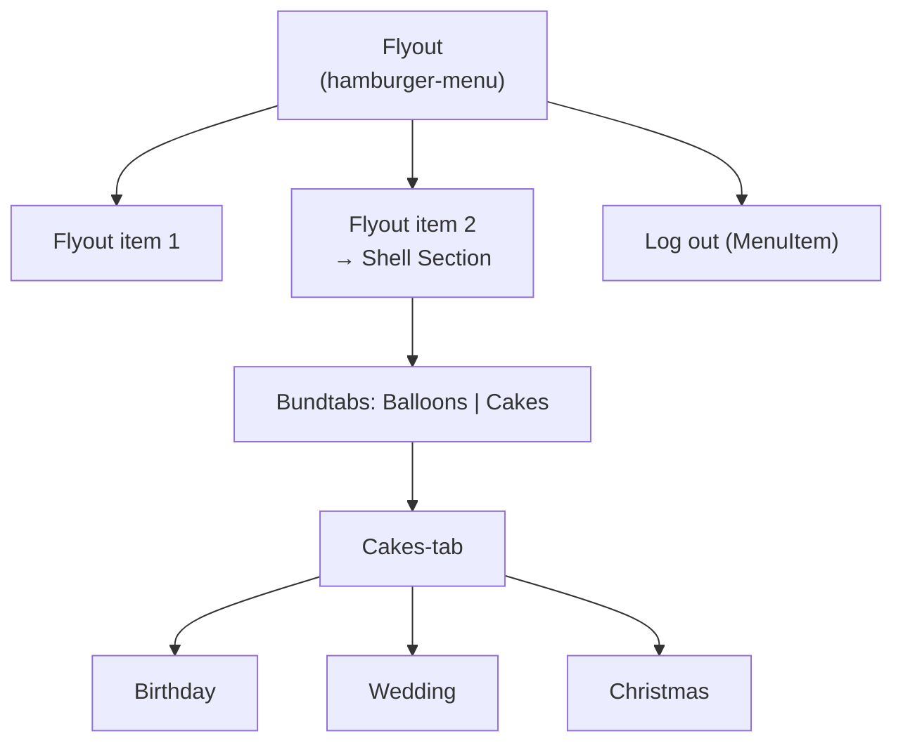
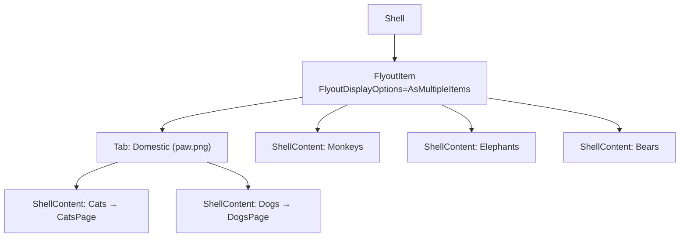

# L06 – Shell og Routes

## Metadata

- **Lektion:** L06 – Shell and Routes
- **Kursus:** Front-end udvikling (SW4FED-02)
- **Forelæser:** Poul Ejnar Rovsing / Jung Min Kim
- **Kilde:** L06/Shell and Routes.pdf (24 slides)
- **Emner dækket:**
  - Hvad Shell er, og hvilke problemer det løser
  - De tre fordele: hele appen i én fil, dependency resolution, route-based navigation
  - Flyout menu: header, footer, menu items, flyout items
  - `MenuItem` vs. `FlyoutItem` — kode vs. navigation
  - Tabs, `TabBar`, `Tab` og `ShellContent`, og deres hierarki
  - Sammenligning: `NavigationPage` (stack) vs. Shell (URI)
  - `Routing.RegisterRoute` til sider uden tab eller flyout
  - `Shell.Current.GoToAsync` og route-parametre via `Dictionary<string, object>`
  - `[QueryProperty]`-attributten til at modtage parametre på målsiden

---

## 1. Introduktion til Shell

Shell i .NET MAUI gør det muligt at definere, hvordan en applikation er lagt ud — ikke i form af faktiske visuals, men ved at definere ting som, om du vil have dine sider vist i tabs eller bare én side ad gangen.

Det gør det også muligt at definere en **flyout**, som er en sidemenu i en applikation. Du kan vælge at have den altid synlig eller lade den glide ind/ud, og det kan variere efter enheds- eller platformstype.

Shell reducerer desuden kompleksiteten i app-udvikling ved at levere de grundlæggende features, som de fleste apps kræver:

- Ét sted at beskrive appens visuelle hierarki
- En fælles navigation user experience
- Et URI-baseret navigationsskema, der tillader navigation til enhver side i appen
- En integreret search handler

I .NET MAUI-apps er Shell en simpel måde at beskrive appens page navigation hierarchy i XAML. Det giver en simpel måde at strukturere hele appen på ved hjælp af `flyouts` og `tabs` til at navigere rundt. Hvis et app-design er baseret på flyout navigation eller tabbed navigation (eller begge), kan Shell være det bedre valg.

Med Shell er en app opdelt i **Shell Sections**. Hver Shell Section kan indeholde en eller flere sider eller collections af sider, organiseret f.eks. efter tabs. Et `ShellContent`-objekt repræsenterer `ContentPage`-objektet for hvert `FlyoutItem` eller `Tab`.

## 2. Fordele ved at bruge Shell

Shell giver tre fordele:

### Whole app mapped in one file

Selve Shell-filen er et nemt one-stop shop til at se, hvordan hele appen er organiseret navigationsmæssigt. Det er let at se, hvordan appens sider passer sammen, og lige så let at flytte rundt på dem, hvis der er behov.

### Dependency resolution

Med Shell bliver alle dependencies, der constructor-injectes ind i siderne, automatisk resolvet for dig — præcis som controller dependencies i en ASP.NET Core-app.

### Route-based navigation

Med Shell er hver side i appen tilgængelig via en URL. Det giver to features:

1. **Deep linking** bliver simplere — appen kan åbnes eksternt direkte på en bestemt side (særligt nyttigt ved push notifications).
2. **Query parameters** — du kan sende data til dine sider som del af URL'en.

---

## 3. Flyout menu

Shell leverer en flyout menu, der kan bruges til navigation såvel som til at give adgang til features eller funktionalitet hvor som helst i appen — med en customizable header og footer, hvor man tilføjer *flyout items* til navigation og *menu items* til at eksekvere funktionalitet.

Flyout-menuen i Shell består af disse dele:

- En customizable **header**
- En **footer**
- **Menu items** til at eksekvere funktionalitet
- **Flyout items** til navigation

Slide 6 viser flyoutens anatomi som en wireframe af en telefonskærm med pile, der navngiver hvert område ovenfra og ned:

```
┌─────────────────────────────┐
│  [logo] CelebratR       ☰   │  ← Flyout header
├─────────────────────────────┤
│                             │
│      Flyout item 1          │  ← Flyout items
│      Flyout item 2          │
│                             │
│      Log out                │  ← Menu item
│                             │
│  My .NET app      v1.0.1    │  ← Flyout footer
└─────────────────────────────┘
```

### Flyout Header

Er let at customize. Skriv XAML UI direkte inde i `AppShell.xaml`-filen, eller brug en control template.

### Flyout footer

Man kan skrive XAML UI direkte inde i Shell til footeren, eller bruge control templates eller importerede views.

### Slå flyouten til

Vigtig detalje fra callout'en på slidet: `Shell.FlyoutBehavior` skal sættes til `"Flyout"` — **default er `"Disabled"`**, så flyouten vises slet ikke, hvis du glemmer det.

```xml
<Shell
    x:Class="Lab6.AppShell"
    xmlns="http://schemas.microsoft.com/dotnet/2021/maui"
    xmlns:x="http://schemas.microsoft.com/winfx/2009/xaml"
    xmlns:local="clr-namespace:Lab6"
    xmlns:views="clr-namespace:Lab6.Views"
    Shell.FlyoutBehavior="Flyout"
    Title="Lab6">
```

Screenshottet ved siden af viser resultatet: en app med hamburger-ikonet øverst til venstre, en åben flyout-liste med posterne *Domestic*, *Monkeys*, *Elephants*, *Bears* og *About* — og i det bagvedliggende indhold en tab-række med *…hants*, *Bears* og *About*. En callout peger på listeposterne med teksten **FlyoutItem**.

Den tilhørende XAML, hvor `FlyoutDisplayOptions="AsMultipleItems"` er fremhævet (det er den, der får et `FlyoutItem` til at optræde som flere separate poster i flyouten frem for én samlet):

```xml
<FlyoutItem FlyoutDisplayOptions="AsMultipleItems">
    <Tab Title="Domestic"
        <ShellContent Title="Cats" ..
        <ShellContent Title="Dogs" ..
    </Tab>
    <ShellContent Title="Monkeys" ..
    <ShellContent Title="Elephants" ..
    <ShellContent Title="Bears" ..
    <ShellContent
</FlyoutItem>
```

<!-- XAML'en er beskåret på slidet — attributterne efter Title er ikke synlige -->

## 4. Menu Items

Et **Menu item** kan bruges til at eksekvere noget kode i stedet for at navigere til en side i appen.

Menu items kan valgfrit tilføjes til flyouten, og hvert menu item repræsenteres af et `MenuItem`-objekt.

Positionen af `MenuItem`-objekter i flyouten afhænger af deres **deklarationsrækkefølge** i shell visual hierarchy. Derfor vil `MenuItem`-objekter, der er deklareret **før** `FlyoutItem`-objekter, optræde før dem i flyouten, og dem deklareret **efter** vil optræde efter.

`MenuItem`-typen har en `Clicked` event handler og en `Command` property. Begge kan bruges til at kalde den kode, du vil eksekvere, når brugeren tapper eller klikker på menupunktet.

På wireframen (Example 1) er det posten **"Log out"**, der er markeret som Menu item — den ligger under flyout items og over footeren.

### Tilføj et MenuItem

Tilføj et `MenuItem` til Shell'en og sæt `Text`-property'en til "Logout" og `IconImageSource`-property'en til filnavnet på det logout-ikonbillede, vi har importeret. Tilføj dette **før** det afsluttende `</Shell>`-tag:

```xml
<MenuItem Text="Logout"
          IconImageSource="icon_logout.png"/>
```

Slide 8 viser resultatet i to trin med screenshots (MenuItem Example 2):

1. Brugeren trykker på hamburger-ikonet øverst til venstre i `InputPage` (som har tab-rækken *Input* / *Reports*, teksten "Input Page" og en knap "Go to product").
2. Flyouten glider ind og viser flyout-headeren med MauiStockTake-logoet i en cirkel, og under det den tilføjede MenuItem — et logout-ikon med teksten "Log…" (markeret med rød stiplet ramme).

## 5. Flyout items

Flyout items giver adgang til sider eller grupper af sider i en app. `FlyoutItem`-typen tillader flere children og kan tilføje en enkelt side eller en collection af sider.

Slide 9 viser to skærme side om side: til venstre den åbne flyout med *Flyout item 1* og *Flyout item 2* (begge markeret med en klamme og etiketten "A *FlyoutItem* in Shell"), til højre den side, man lander på. En rød pil mellem dem er mærket **"access to a page"** — dvs. ét flyout item svarer til én side. Målsiden hedder "Home" og har en bundlinje med to ikoner (hus og tandhjul).

## 6. Eksempel: Tilføj en flyout header

Du kan tildele et vilkårligt layout til `Shell.FlyoutHeader`, så det er ligetil at bygge. Her bruges et `Grid` til at positionere kontrollerne og vise et `Image` med appens logo, clipped så det bliver cirkulært, og et `Label` nedenunder med appens titel.

```xml
<Shell.FlyoutHeader>
    <Grid RowDefinitions="20, *,*"
          Padding="20">
        <Image Grid.Row="1"
               Source="surfshack_logo.jpeg"
               WidthRequest="100"
               HeightRequest="100"
               HorizontalOptions="Center"
               VerticalOptions="Center">
            <Image.Clip>
                <EllipseGeometry Center="50, 50"
                                 RadiusX="50"
                                 RadiusY="50"/>
            </Image.Clip>
        </Image>
        <Label Grid.Row="2"
               HorizontalOptions="Center"
               VerticalOptions="Center"
               Text="MauiStockTake" />
    </Grid>
</Shell.FlyoutHeader>
```

Screenshottet ved siden af viser resultatet: øverst i flyouten det cirkulært klippede logo med teksten "MauiStockTake" under (området markeret med stiplet ramme = headeren), og derunder Logout-menupunktet.

Bemærk `RowDefinitions="20, *,*"`: række 0 er en tom 20-pixels spacer, række 1 rummer billedet og række 2 labelen. `EllipseGeometry` med `Center="50,50"` og radius 50 i begge retninger klipper præcis det 100×100 store billede til en cirkel.

---

## 7. Tabs

Tabs er organiseret **hierarkisk** i Shell. Når du bruger Shell, ligger de tabs, du tilføjer først, på det højeste niveau i hierarkiet. Sider kan indlejres i en `tab` og derefter være individuelt tabbede.

Slide 11 viser hierarkiet med to skærme og tre callouts:

- Venstre skærm: flyouten med *Flyout item 1*, *Flyout item 2* (rødt markeret), *Log out*. Callout: **"Flyout Item 2 navigates to a Shell Section"**.
- Højre skærm: den Shell Section, man lander i. Øverst titlen "Cakes" og en tab-række **Birthday** (valgt) | **Wedding** | **Christmas**, med en liste af kageemner nedenunder. Callout: **"Within the Cake tab are three additional tabs, providing access to content at the next tier down; e.g. Birthday, Wedding, Christmas"**.
- Nederst på højre skærm en bundnavigation med to ikoner (ballon og kage). Callout: **"Two tabs are accessible via a balloon icon and a cake icon"**.

Det er altså tre niveauer af navigation samtidig:



Øverste niveau er flyouten, næste niveau er bundtabs (ballon/kage), og inde i kage-tabben ligger endnu et niveau af tabs (Birthday/Wedding/Christmas).

## 8. Eksempel: Tilføj TabBar

Åbn `AppShell.xaml` og slet den eksisterende `ShellContent`. Tilføj en `Tab` for hver af f.eks. `InputPage` og `ReportPage`, og tildel hver `Tab` en `Title` og et `Icon`.

```xml
<Shell
    x:Class="MauiStockTake.UI.AppShell"
    xmlns="http://schemas.microsoft.com/dotnet/2021/maui"
    xmlns:x="http://schemas.microsoft.com/winfx/2009/xaml"
    xmlns:local="clr-namespace:MauiStockTake.UI"
    xmlns:pages="clr-namespace:MauiStockTake.UI.Pages"
    Shell.FlyoutBehavior="Disabled">
      ..
    <TabBar>
        <Tab Title="Input"
             Icon="icon_input.svg">
            <ShellContent ContentTemplate="{DataTemplate pages:InputPage}" />
        </Tab>
        <Tab Title="Reports"
             Icon="icon_report.svg">
            <ShellContent ContentTemplate="{DataTemplate pages:ReportPage}" />
        </Tab>
    </TabBar>
</Shell>
```

Callouts på slidet forklarer de to nøglelinjer:

- **`<Tab Title="Input" …>`** — "Add a `Tab` and sets the `Title` property to a descriptive title for the page"
- **`<ShellContent ContentTemplate="…" />`** — "Add a `ShellContent`, sets the `ContentTemplate` property using the `DataTemplate` markup extension, and assigns one of the pages in the app". Og: "A `ShellContent` object represents the `ContentPage` object for each `FlyoutItem` or `Tab`".

Solution Explorer-udsnittet til højre viser mappen **Pages** med `InputPage.xaml`, `LoginPage.xaml` og `ReportPage.xaml` — dvs. de sider, `pages:`-namespacet peger på.

Bemærk `Shell.FlyoutBehavior="Disabled"` her: i dette eksempel bruges kun tabs, ingen flyout.

---

## 9. Routes and Navigation — Shell vs. NavigationPage

Slide 14 stiller de to navigationsmodeller op i en tabel:

| | How | Navigation Forward | Navigation Back |
|---|---|---|---|
| **NavigationPage** | Uses page instances | `Navigation.PushAsync(new MyPage())` | `Navigation.PopAsync()` |
| **Shell** | Uses Routes | `Shell.Current.GoToAsync("mypage")` | `Shell.Current.GoToAsync("..")` |

Bemærk at `".."` i Shell betyder "gå ét niveau tilbage" — samme konvention som i et filsystem.

### NavigationPage

- **Stack-based** navigation (`PushAsync`, `PopAsync`)
- Når din app kun har få sider
- Du behøver ikke en tab bar eller flyout menu
- Til simpel push/pop-navigation

### Shell

- High-level container til Tabs, Flyouts og **URI-based** navigation (`GoToAsync`)
- Med flere sider og sektioner at navigere mellem
- Når du skal navigere til specifikke sider via routes
- Mere skalerbar og moderne måde at navigere på

## 10. Routes and Navigation i Shell

De fleste sider tilgås via en `Tab` eller et `FlyoutItem`. Shells hovedformål er at gøre navigation lettere, og denne forenklede tilgang er default. Men det er stadig muligt at navigere programmatisk, hvis du har brug for det.

For at navigere programmatisk med Shell bruger vi `GoToAsync`-metoden:

```csharp
await Shell.Current.GoToAsync("myroute");
```

Med Shell bruger du `GoToAsync` med en **route** frem for en **instans af en side** (som i hierarchical navigation). I Shell navigerer du efter route-navn med `GoToAsync`, ikke ved at oprette et nyt page-objekt.

## 11. Shell Tab og Route-property'en

Det er nødvendigt at registrere routen ved hjælp af `Tab` eller `FlyoutItem`, da de begge har en `Route`-property. Hvis vi opretter en route for de to sider, kan vi også bruge tabs sådan her:

```xml
<TabBar>
    <Tab Title="Input"
         Icon="icon_input.svg"
         Route="input">
        <ShellContent ContentTemplate="{DataTemplate pages:InputPage}" />
    </Tab>
    <Tab Title="Reports"
         Icon="icon_report.svg"
         Route="reports">
        <ShellContent ContentTemplate="{DataTemplate pages:ReportPage}" />
    </Tab>
</TabBar>
```

### TabBar

- `TabBar`-containeren definerer top- eller bundmenusæt. En `TabBar` kan indeholde en eller flere `Tab`s.
- Passer til 3-5 menuer i toppen eller bunden af din app, f.eks. mobilapp med bundmenuer.
- Bemærk: `TabBar` viser Flyout.

Reference: https://learn.microsoft.com/en-us/dotnet/maui/fundamentals/shell/tabs

### ShellContent

- Repræsenterer en enkelt side i en app
- Skal wrappe én side ad gangen (via `ContentTemplate`)

## 12. Shell Tab Example

```xml
<FlyoutItem FlyoutDisplayOptions="AsMultipleItems">
  <Tab Title="Domestic"
       Icon="paw.png">
      <ShellContent Title="Cats"
                    Icon="cat.png"
                    ContentTemplate="{DataTemplate views:CatsPage}"
                    />
      <ShellContent x:Name="dogsItem"
                    Title="Dogs"
                    Icon="dog.png"
                    ContentTemplate="{DataTemplate views:DogsPage}"
                    />
  </Tab>
```

Screenshottet ved siden af viser den kørende app: titelbaren "CatsPage", derunder en tab-række med **Domestic** (med pote-ikon og en pil op, der markerer at den er ekspanderet) og **Monke…**, og under Domestic en udfoldet dropdown med de to underpunkter **Cats** (kat-ikon) og **Dogs** (hunde-ikon).

Pile i XAML'en peger på `Tab Title="Domestic" Icon="paw.png"` og på hver af de to `ShellContent`-blokke — de tre ting, der bliver til henholdsvis den ydre tab og de to poster i dropdownen.

- En `Tab` grupperer **flere `ShellContent`-sider** sammen under én "section".
- **FlyoutItem**
  - Stor/kompleks app, der har brug for en side flyout menu til mange top-level sider
  - Passer til desktop-style app med en stor sidemenu
  - Tabs definerer **local sub-navigation** (tabs for relaterede sider inde i et enkelt flyout item)

Hierarkiet er altså:



---

## 13. Routes og navigation uden tabs eller flyout

De sider, vi hidtil har registreret routes for, er let tilgængelige via tab baren. Men der er andre sider, som ikke vil være tilgængelige via hverken tabs eller flyout item:

- Hvis siderne ikke har et tab- eller flyout item
- Hvis siderne ikke ligger i UI-menuer — f.eks. **supporting pages** (Login-, Registration-sider, som kan være startsiden, hvis appen ikke er menu-baseret før login) eller **multistep pages** (`PaymentPage`, `ConfirmPage` osv.)

Fremgangsmåden:

1. Brug `RegisterRoute`-metoden på `Routing`-klassen og send to parametre:
   - **Først:** en string, der bruges som route
   - **Dernæst:** typen af den side, routen skal repræsentere
2. Brug `GoToAsync`-metoden til at tilgå den

## 14. Registrér page route: RegisterRoute

Registrér en route for en `Page` uden tabs eller flyout:

- Åbn `AppShell.xaml.cs`
- Registrér en route i **konstruktøren**
- Brug `RegisterRoute` på `Routing`-klassen med de to parametre

```csharp
public AppShell()
{
    InitializeComponent();
    Routing.RegisterRoute("login", typeof(LoginPage));
    Routing.RegisterRoute("productdetails", typeof(ProductPage));
}
```

Solution Explorer på slidet viser, hvilke sider der findes i projektet: `InputPage.xaml` (+ `.cs`), `LoginPage.xaml` (+ `.cs`), `ProductPage.xaml` (+ `.cs`) og `ReportPage.xaml` (+ `.cs`). En stor pil peger fra `ProductPage.xaml` op på `RegisterRoute("productdetails", typeof(ProductPage))` — dvs. det er præcis den klasse, route-strengen `"productdetails"` mapper til.

Callout: "Registering route for the pages **without** tabs or flyoutitem".

## 15. Udfør navigation: GoToAsync

Efter at have registreret en page route kan navigation til siden udføres ved at kalde `GoToAsync`-metoden på Shell-objektet. Den har sin `Location`-property sat til string- eller URI-argumentet.

```csharp
private async void Button_Clicked(object sender, EventArgs e)
{
    var product = new Product
    {
        Name = "MauiStockTake",
        ManufacturerName = "BeachBytes"
    };

    var pageParams = new Dictionary<string, object>
    {
        { "Product", product }
    };

    await Shell.Current.GoToAsync("productdetails", pageParams);
}
```

Callout: "Uses the `GoToAsync` method, with the route registered in `AppShell.xaml.cs` (`productdetails`) and a dictionary of `<string, object>` as the navigation state". En anden pil peger på `"productdetails"`-strengen med teksten "string or URI to indicate the page to route".

## 16. Route Parameters

Samme mønster med andre data (slide 21):

```csharp
private async void Button_Clicked(object sender, EventArgs e)
{
    var product = new Product
    {
        Name = "RouteDemo",
        ManufacturerName = "Front-end(FED)"
    };

    var pageParams = new Dictionary<string, object>
    {
        { "Product", product }
    };

    await Shell.Current.GoToAsync("productdetails", pageParams);
}
```

Diagrammet på slidet trækker to pile:

- En blå bue fra `pageParams`-dictionary'ets deklaration ned til `pageParams`-argumentet i `GoToAsync`-kaldet, mærket **"pass values"**.
- En grå pil op på `"productdetails"`-strengen, mærket **"The page which registered route"**.

Nøglen `"Product"` i dictionary'et er den, målsiden skal matche i sin `[QueryProperty]`-attribut.

## 17. Navigation med query parameters: QueryProperty-attributten

Brug `QueryProperty`, når du vil have en side til at modtage parametre fra `GoToAsync`.

`QueryProperty`-attributten bruges til at dekorere en side (`[QueryProperty]`) eller en sides `BindingContext`, så siden automatisk kan modtage værdier fra `GoToAsync` under URI-baseret navigation i Shell.

`QueryProperty` linker en navigationsparameter fra `GoToAsync` til en property i din side (eller ViewModel), så Shell udfylder parameteren automatisk.

Attributten har en konstruktør, der tager to argumenter:

```csharp
[QueryProperty(string propertyName, string queryId)]
```

- **Først:** navnet på property'en i din page eller ViewModel, som skal modtage værdien
- **Dernæst:** navnet på query-parameteren, der blev sendt med i `GoToAsync`-kaldet — altså dictionary-nøglen

Slidet illustrerer det med to pile ned til hvert argument: "name of the property on the page (the parameter maps to)" og "name of the query parameter or the dictionary key of the object".

## 18. Brug af QueryPropertyAttribute på modtagersiden

Brug `QueryPropertyAttribute` på den side, vi vil modtage parametre på (dvs. sende parametre til page-klassen):

```csharp
[QueryProperty(nameof(Product), nameof(Product))]
public partial class ProductPage : ContentPage
{
    public ProductPage()
    {
        InitializeComponent();
        BindingContext = this;
    }

    Product _product;
    public Product Product
    {
        get { return _product; }
        set
        {
            _product = value;
            ProductName = _product.Name;
            ManufacturerName = _product.ManufacturerName;
        }
    }

    string _productName;
    public string ProductName
    {
        get => _productName;
        set
        {
            _productName = value;
            OnPropertyChanged();
        }
    }
    ..
}
```

Callouts på slidet forklarer de fire vigtige punkter:

- På attributten: "binds the parameter to a string called here, in this case, `Product`, on the page you are navigating to"
- På andet argument: "**Parameter to receive**, Used `nameof` to avoid typos"
- På `public Product Product`: "Add a `Product` called `Product` to match the key in the navigation state"
- På `OnPropertyChanged()`: "Call the `OnPropertyChanged` method to update the UI"

Kæden hænger altså sådan sammen:

```mermaid
flowchart LR
    A["pageParams<br/>{ \"Product\", product }"] --> B["GoToAsync(\"productdetails\", pageParams)"]
    B --> C["Routing.RegisterRoute(\"productdetails\", typeof(ProductPage))"]
    C --> D["[QueryProperty(nameof(Product), nameof(Product))]"]
    D --> E["public Product Product { set { … } }"]
    E --> F["ProductName / ManufacturerName<br/>+ OnPropertyChanged() → UI opdateres"]
```

Bemærk `BindingContext = this;` i konstruktøren: det er den, der får sidens egne properties til at være bindable fra XAML'en.

## 19. Referencer og links

- *.NET MAUI in Action*, Matt Goldman
- .NET MAUI Pages:
  - ContentPage — https://learn.microsoft.com/en-us/dotnet/maui/user-interface/pages/contentpage
  - FlyoutPage — https://learn.microsoft.com/en-us/dotnet/maui/user-interface/pages/flyoutpage
  - NavigationPage — https://learn.microsoft.com/en-us/dotnet/maui/user-interface/pages/navigationpage
  - TabbedPage — https://learn.microsoft.com/en-us/dotnet/maui/user-interface/pages/tabbedpage
- Shell — https://learn.microsoft.com/en-us/dotnet/maui/fundamentals/shell/
- Flyout — https://learn.microsoft.com/en-us/dotnet/maui/fundamentals/shell/flyout
