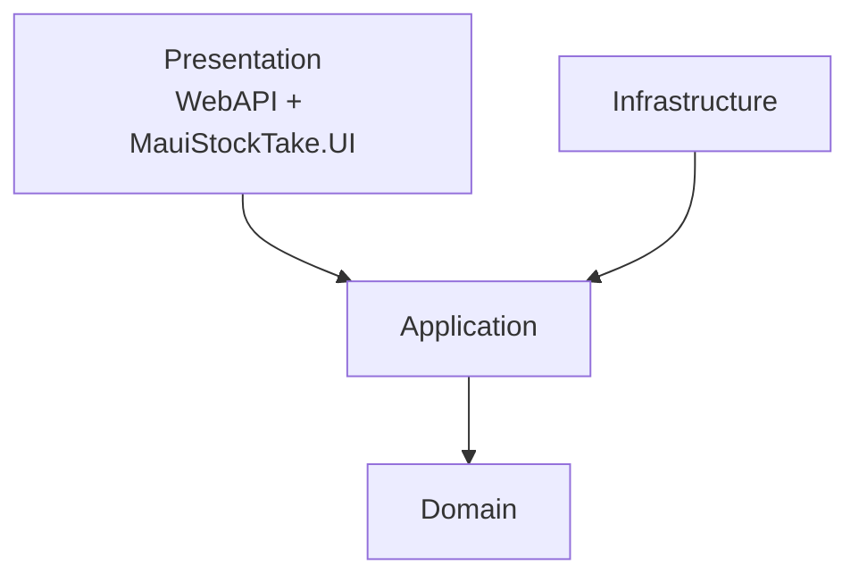

# Enterprise App development i .NET MAUI

## Metadata

- **Lektion:** L07.2 – Enterprise Application Development in .NET MAUI
- **Kursus:** Front-end udvikling (SW4FED-02)
- **Forelæser:** Poul Ejnar Rovsing / Jung Min Kim
- **Kilde:** L07/Enterprise App development in .NET MAUI.pdf (13 slides)
- **Emner dækket:**
  - Hvad enterprise application development er
  - De typiske problemer i enterprise-apps
  - Enterprise App development patterns
  - Full-stack app architecture
  - Clean Architecture og dependency rule
  - Projektorganisering i MauiStockTake-solutionen
  - Presentation layer
  - Cross-cutting concerns og kodedeling

---

## 1. Enterprise Application Development

Ofte udgør den software, vi bygger, en del af et enterprise-økosystem.

Enterprise-logik udgør ofte kernen i økosystemer og leverer logik og typer, der er relevante på tværs af hele enterprise-applikationen. Den er dermed adskilt fra domæne- og problemspecifikke typer og spørgsmål.

Forestil dig eksempelvis en række applikationer i en virksomhed, hvor hver enkelt hjælper med en specifik forretningsområde. De har hver deres krav, men deler noget fælles funktionalitet — f.eks. user management og authentication, ud over forretningslogik. Det er vigtigt, at disse applikationer opretholder konsistens, så de føles som del af en sammenhængende helhed.

## 2. Enterprise Application Patterns med .NET MAUI

Enterprise-applikationer står over for en række svære problemer:

- Konstant skiftende forretningskrav
- Behov for hurtig turnaround time (hurtige ændringer)
- Understøttelse af flere platforme
- Integration med flere systemer

På grund af disse problemers varierende natur er det vigtigt, at applikationens arkitektur tillader den at være modulær, ændringsvenlig og udvidelig over tid. Det er vigtigt at bygge apps, der let kan modificeres eller udvides over tid.

.NET MAUI adresserer disse vanskeligheder med MVVM-mønstret, dependency injection, navigation, configuration, loose coupling af komponenter og øvrige enterprise-hensyn.

## 3. Enterprise App development patterns

En effektiv måde at tackle disse udfordringer på er at partitionere en app i diskrete, loosely coupled komponenter, som let kan integreres sammen til en app.

Patterns:

- MVVM Pattern
- Dependency Injection og Generic Host Builder
- Communication between loosely coupled components
- Navigation
- Validation
- Authentication and Authorization
- Accessing remote data
- Unit testing

## 4. Full-stack app architecture

Når din app ikke er en standalone mobile- og desktop-applikation, men del af en større løsning, der også omfatter cloud/web-komponenter og en database, er den samlede løsning en full-stack app med frontend, backend og database.

En full-stack app kræver authentication for at sikre kommunikationen mellem .NET MAUI-appen og cloud-API'et.

I en full-stack app kræves en tilstrækkelig arkitektur — for eksempel hvordan man organiserer en solution, så code sharing og effektivitet maksimeres.

## 5. Clean Architecture

Clean Architecture placerer forretningslogikken og applikationsmodellen i centrum af applikationen.

I stedet for at forretningslogikken afhænger af data access eller andre infrastructure concerns, inverteres denne afhængighed: infrastruktur og implementeringsdetaljer afhænger af Application Core.

Det opnås ved at definere abstraktioner, altså interfaces, i Application Core, som derefter implementeres af typer defineret i Infrastructure-laget.

En almindelig måde at visualisere denne arkitektur på er en række koncentriske cirkler, som et løg. Til full-stack inklusive backend bruges ASP.NET Core.

## 6. Projektorganisering

Mange projekter organiseres efter Clean Architecture-principper. Mange Web API'er er f.eks. baseret på Clean Architecture (CA)-templaten og følger clean architecture-principperne.

Code-sharing-teknikkerne gør det muligt at integrere et .NET MAUI-UI i enhver full-stack .NET-arkitektur. Clean Architecture giver en logisk, struktureret måde at organisere kode i en solution, og strukturen hjælper med at illustrere, hvordan kode kan deles mellem API'et og .NET MAUI-appen.

Kernereglen i CA: **alle dependencies peger indad.**

- Core (Domain og Application) indeholder entities og forretningslogik.
- Application afhænger af Domain, og Domain har ingen dependencies.
- Infrastructure og Presentation afhænger af Application, og .NET MAUI-appen er en del af Presentation.

MauiStockTake-appen er et eksempel på en app, der følger CA-principperne.

## 7. Presentation layer

Presentation-laget er der, hvor fokus ligger på at bygge et UI. Solutionen er arrangeret i mapper, der repræsenterer de forskellige lag i CA.

Projekter i Presentation-mappen i MauiStockTake:

| Projekt | Beskrivelse |
|---|---|
| `WebAPI` | Et ASP.NET Core-projekt, der leverer REST controllers og endpoints, som tillader omverdenen at kommunikere med forretningslogikken og dataene i API'et. .NET MAUI-appen kommunikerer med dette over HTTP for at interagere med resten af solutionen |
| `MauiStockTake.UI` | .NET MAUI-projektet, vi tilføjede. Her bygges appen til at optælle lagerbeholdning |
| `MauiStockTake.Client` | Et class library med typer og logik, der kan bruges i et .NET UI-projekt til at interagere med API'et. Det indeholder data transfer objects (DTOs) og services, samt noget autogenereret client-kode |

Deployment-slidet illustrerer, at flere instanser af `MauiStockTake.UI` (på forskellige enheder) kommunikerer med den samme `MauiStockTake.API`.

## 8. Cross-cutting concerns

I CA er det en streng regel, at dependencies peger indad, og at Domain ikke har eksterne dependencies. Typisk er Application en del af Core sammen med Domain, og Application må gerne have dependencies — bare ikke dependencies, der peger udad.

De dele af solutionen, der løber vinkelret på dependency-flowet, kaldes **cross-cutting concerns**.

MauiStockTake er en full-stack solution skrevet i C#. Derfor er der ingen grund til at duplikere kode, da den kan deles på tværs af stakken. Kode, der deles på denne måde, kaldes cross-cutting concerns.

### Cross-cutting concerns i praksis

I MauiStockTake findes cross-cutting concerns i form af DTO'er, der er nødvendige for Application-projektet, WebAPI-projektet og .NET MAUI-appen — selvom de leveres til .NET MAUI-appen via API client-projektet.

I MauiStockTake ligger disse DTO'er i et projekt kaldet **Shared** i en solution-mappe kaldet **Common**. Dette Shared-projekt er en dependency for Application-projektet, WebAPI-projektet og MauiStockTake.Client-projektet. Med denne tilgang kan kode deles mellem backend og frontend uden besvær.

<!-- Bemærk: i råteksten er projektnavnene "Shared" og "Common" forvansket af PDF-udtrækningen (Şḥắsêđ / Cộņņộŋ); de er normaliseret her. -->

Fordelene ved at dele kode på denne måde er betydelige:

- "Don't repeat yourself"-princippet gør udvikling lettere.
- Det giver sikkerhed for, at ændringer i én del af solutionen afspejles øjeblikkeligt andre steder.
- Ændrer man strukturen på en DTO, er den samme DTO allerede i brug overalt, så eventuelle breaking changes er øjeblikkeligt synlige.

Da vi bygger en full-stack .NET-solution, kan vi tage det et skridt videre: hvis vi senere beslutter at tilføje et web-UI, f.eks. med Blazor, kan `MauiStockTake.Client`-pakken også bruges i Blazor-UI'et. Det giver en full-stack cloud-, mobile-, desktop- og web-løsning, der maksimerer code re-use på tværs af hele stakken.

## 9. Referencer og links

- *.NET MAUI in Action*
- Enterprise Application Patterns Using .NET MAUI — https://learn.microsoft.com/en-us/dotnet/architecture/maui/
