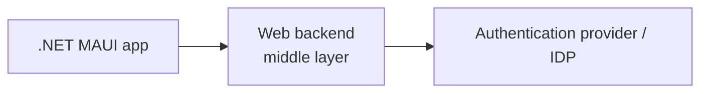
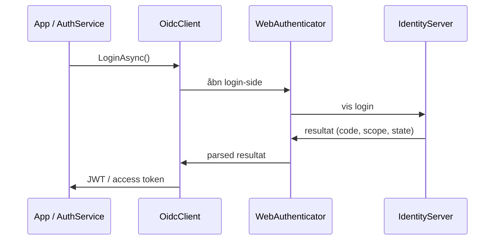

# Authentication i .NET MAUI

## Metadata

- **Lektion:** L07.4 – Authentication in .NET MAUI
- **Kursus:** Front-end udvikling (SW4FED-02)
- **Forelæser:** Poul Ejnar Rovsing / Jung Min Kim
- **Kilde:** L07/Authentication in .NET MAUI.pdf (27 slides)
- **Emner dækket:**
  - Authentication kontra authorization
  - Code flow som anbefalet flow for mobile apps
  - `WebAuthenticator` i .NET MAUI
  - Backend som middle layer mod IDP'en
  - IdentityServer, OIDC og JWT
  - OidcClient og dens `IBrowser`-interface
  - Registrering af custom URL scheme på Android, iOS/Mac og Windows
  - `Constants`-klassen med IDP-værdier
  - `AuthBrowser`- og `AuthService`-implementeringerne

---

## 1. Definitioner

**Authentication** er processen med at verificere, at "you are who you say you are".

**Authorization** er processen med at verificere, at "you are permitted to do what you are trying to do".

Det anbefalede flow, når man bruger en mobile app, er **code flow**.

## 2. WebAuthenticator

Mange apps kræver user authentication, og det betyder ofte, at brugerne skal kunne logge ind med deres eksisterende Microsoft-, Facebook-, Google- eller Apple Sign In-konto.

Vil man bruge sin egen web service til authentication, er det muligt at bruge `WebAuthenticator` til at implementere client-side-funktionaliteten.

`WebAuthenticator` forenkler OAuth-workflows i applikationen med et enkelt kald. Den tager sig af at åbne URL'en i browseren og at vente, indtil callback'et modtages.

## 3. Brug backend som middle layer

Mange authentication providers er gået over til kun at tilbyde explicit eller two-legged authentication flows for at sikre bedre sikkerhed. Det betyder, at man skal bruge en client secret fra provideren for at fuldføre authentication-flowet.

Mobile apps er desværre ikke et godt sted at opbevare secrets, og alt, hvad der ligger i en mobile apps kode, binaries eller andet, betragtes som usikkert.

Best practice er at bruge en web backend som middle layer mellem mobile app'en og authentication-provideren.



## 4. Identity, authentication og authorization

Identity er et stort emne, som ikke kan dækkes fuldt ud i denne forelæsning, men det er vigtigt at have en vis fortrolighed med.

I denne forelæsning bruges **IdentityServer**, fordi den er inkluderet i ASP.NET Core-templates. Dermed kræver den ikke tilmelding til en tredjepartstjeneste, og den er allerede kendt fra backend-kurset.

Man behøver ikke bruge IdentityServer i sine apps. Det er blevet stadig mere populært at outsource identity til en cloud-baseret identity provider (IDP) som Azure Active Directory B2C eller Auth0. De tager ofte også hånd om funktionalitet som sikker opbevaring af refresh tokens.

I denne forelæsning bruges IdentityServer med backenden (Web API i MauiStockAuth-appen) som middle layer mellem appen og authentication-provideren, med OAuth2 som cloud-baseret IDP. Det virker også med enhver OIDC-compliant IDP, herunder de fleste kommercielle cloud-tilbud.

## 5. Authentication i .NET MAUI

I lab-øvelsens app bruger MauiStockTake-API'et IdentityServer, et OpenID Connect (OIDC)-compliant framework til ASP.NET Core-applikationer.

OIDC, en udvidelse af OAuth2, lader brugere authenticate via deres webbrowser for at få et token, der kan bruges til at tilgå beskyttede resources.

Vi skal bygge en authentication service i .NET MAUI-appen, som kan logge brugere ind med IdentityServer og få et JSON web token (JWT), der kan bruges til at authenticate kald til API'et.

### OAuth2 authentication

Med OAuth2 authentication sendes brugernavn og password ikke fra din app til IDP'en. I stedet åbner din app en webbrowser på IDP'ens login-side.

Denne metode betragtes som mere sikker, fordi din app aldrig har adgang til brugerens password. Brugeren logger direkte ind hos IDP'en, og når de er logget ind, bliver de redirected tilbage til appen med en code, der kan bruges til at få et access token.

## 6. Sådan opnås authentication i .NET MAUI

Vi bruger en kombination af den indbyggede `WebAuthenticator`, der følger med .NET MAUI, og en NuGet-pakke kaldet `IdentityModel.OidcClient` til at opnå authentication i `IAuthService`, som blev oprettet i dependency injection.

`OidcClient` er lavet af de samme folk, der laver IdentityServer, og forenkler processen med at parse det OAuth2-response, IdentityServer returnerer for en logget ind bruger.

### OidcClient og IBrowser

`OidcClient` bruges til at parse et OIDC-response, men leverer ikke selv en måde at dirigere brugeren til en IDP's login-side.

Når man opretter en `OidcClient`-instans, skal man levere en implementering af `OidcClient`s `IBrowser`-interface, som definerer en metode til at udføre denne handling.

Vi bygger en implementering af dette interface, som bruger `WebAuthenticator` til at udføre login og derefter sender resultaterne tilbage til `OidcClient`, som udtrækker de tokens, vi har brug for, og returnerer dem til vores authentication service.

**NOTE:** Vi skal bruge det fully qualified name for `IBrowser`, da .NET MAUI også har et interface kaldet `IBrowser` med et andet use case. Vi skal derfor bruge dette using-alias:

```csharp
using IBrowser = IdentityModel.OidcClient.Browser.IBrowser;
```

## 7. OAuth2 login flow med redirect URI

Når vi bruger et OAuth2 login flow med en webbrowser, angiver vi som del af requestet en **redirect URI**.

Når brugeren er authenticated, returnerer IDP'en brugeren til redirect URI'en sammen med en authorization code, som kan veksles til tokens.

I vores lab-case ønsker vi ikke at sende brugeren til et website, men til vores app. Det gør vi ved at registrere et **custom URL scheme** hos operativsystemet, så OS'et ved, at URL'er bundet til adresser, der starter med det scheme, skal sendes til vores app.

Når man åbner en URL, åbnes den med den default-applikation, der er registreret hos OS'et til at håndtere det pågældende scheme. For HTTP og HTTPS er det din default webbrowser. Ved at bruge et custom scheme kan vi associere det med vores app, så enhver URL, der starter med det scheme, åbnes i vores app.

### Flowets seks trin

1. Kald `LoginAsync`-metoden på `OidcClient`-pakken.
2. `OidcClient`-pakken kalder `WebAuthenticator` og viser login-siden på IdentityServer.
3. Brugeren logger ind på IdentityServer.
4. IdentityServer returnerer resultatet via `WebAuthenticator`.
5. Det parsede resultat returneres til `OidcClient`.
6. `OidcClient` udtrækker JWT'en fra resultatet og returnerer den til kalderen af `LoginAsync`-metoden.



## 8. Registrering af scheme på target-platformene

I lab-applikationen bruges eksemplet `auth.com.mildredsurf.stocktake://callback` som redirect URI. Her er `auth.com.mildredsurf.stocktake` selve schemet, så det skal registreres hos target-platformene. Processen er lidt forskellig for hver platform.

Når man authenticater mod en IDP, angives en redirect URL. Ved succesfuld authentication sendes et response tilbage til redirect URL'en.

- For en **webapplikation** er dette redirect som regel adressen på den webapplikation, hvor authentication-requestet stammede fra.
- For en **mobile eller desktop app** bruger URL'en et custom scheme, som OS'et associerer med appen, så responset fra IDP'en sendes til appen.

### Android

Registrering af et custom URL scheme til Android kræver to trin:

1. Opret en `Activity`, der modtager web-callback'et.
2. Tilføj et intent til manifestet, som lader os åbne browseren.

Tilføj en fil i `Platforms/Android` kaldet `WebCallbackActivity.cs`:

```csharp
using Android.App;
using Android.Content;
using Android.Content.PM;

namespace MauiStockTake.UI.Platforms.Android;

[Activity(NoHistory = true, LaunchMode = LaunchMode.SingleTop, Exported = true)]
[IntentFilter(new[] {Intent.ActionView}, Categories = new[] { Intent.CategoryDefault,
Intent.CategoryBrowsable }, DataScheme = "auth.com.mildredsurf.stocktake",
                                        DataHost = "callback")]
public class WebCallbackActivity : WebAuthenticatorCallbackActivity
{
}
```

Og i `AndroidManifest.xml` tilføjes følgende før `</manifest>`:

```xml
<?xml version="1.0" encoding="utf-8"?>
<manifest xmlns:android="http://schemas.android.com/apk/res/android">
 <application android:allowBackup="true" android:icon="@mipmap/appicon"
android:roundIcon="@mipmap/appicon_round"
android:supportsRtl="true"></application>
 <uses-permission android:name="android.permission.ACCESS_NETWORK_STATE" />
 <uses-permission android:name="android.permission.INTERNET" />
 <queries>
  <intent>
    <action android:name="android.support.customtabs.action.CustomTabsService" />
  </intent>
 </queries>
</manifest>
```

### iOS og Mac

Åbn `info.plist` med en teksteditor. Inde i `<dict>`...`</dict>`-taggene tilføjes en ny entry i dictionary'et med nøglen `CFBundleURLTypes`. Værdien er et array, som også indeholder et dictionary. Tilføj disse før det lukkende `</dict>`-tag:

```xml
..
<key>CFBundleURLTypes</key>
<array>
    <dict>
        <key>CFBundleURLName</key>
        <string>Auth</string>
        <key>CFBundleURLSchemes</key>
        <array>
            <string>auth.com.mildredsurf.stocktake</string>
        </array>
        <key>CFBundleTypeRole</key>
    <string>Viewer</string>
    </dict>
</array>
</dict>
</plist>
```

Husk at gentage disse trin i **både** iOS- og MacCatalyst-platformsmapperne.

### Windows — virker ikke endnu

For at registrere det custom URL scheme på Windows skal `Package.appxmanifest`-filen opdateres. Åbn filen i en teksteditor (i Visual Studio: højreklik og vælg View Code, eller klik på filen i Solution Explorer og tryk F7). Find `Applications`-noden og `Application`-noden med id `App` inde i den, og tilføj koden direkte efter det åbnende `<Application …>`-tag.

**Caution:** Listing 8.11 i bogen virker ikke med `WebAuthenticator` og forårsager et problem. På nuværende tidspunkt virker `WebAuthenticator` ikke på Windows — det er dokumenteret af Microsoft.

Reference: https://learn.microsoft.com/en-us/dotnet/maui/platform-integration/communication/authentication?tabs=windows#get-started

Workaround for WebAuthenticator på Windows:

- https://www.youtube.com/watch?v=gQoqg4P-uJ0
- https://dotmorten.github.io/WinUIEx/concepts/WebAuthenticator.html

## 9. Definér IdentityServer-værdierne

Når vi interagerer med en OAuth2-IDP, skal nogle værdier være defineret, så vi kan lokalisere IDP'en og angive de detaljer, login-interaktionen kræver. Specifikt: URI'en på IDP'en, client ID (som repræsenterer en client defineret i IDP'en — her MauiStockTake-appen), de scopes vi anmoder om adgang til, og redirect URI'en.

Gør alle disse værdier constant og klassen static, så de er lette at tilgå fra hele appen. Tilføj en ny klasse i roden af `MauiStockTake.UI`-projektet kaldet `Constants`.

Generér ngrok og brug de genererede ngrok-URL'er til test (se appendix A). Udskift disse URL'er med dine egne ngrok-URL'er, når appen skal køre.

```csharp
namespace MauiStockTake.UI;

public static class Constants
{
    public const string BaseUrl = "https://8284-159-196-124-207.ngrok.io";

    public const string RedirectUri = "auth.com.mildredsurf.stocktake://callback";

    public const string AuthorityUri = "https://8284-159-196-124-207.ngrok.io";

    public const string ClientId = "com.mildredsurf.stocktake";

    public const string Scope = "openid profile offline_access MauiStockTake.WebUIAPI";
}
```

Forklaring til hver konstant:

- `BaseUrl`: base address for kald til API'et.
- `RedirectUri`: sendes til IdentityServer med login-requestet, så et succesfuldt login kan returneres tilbage til vores app. Bemærk at URL-schemet er det scheme, vi registrerede tidligere.
- `AuthorityUri`: bruges til authentication requests. Bemærk at den her er den samme som API-URI'en, fordi vi kører et API med IdentityServer indbygget.
- `ClientId`: værdien skal matche et gyldigt client Id i IDP'en.
- `Scope`: holder et array af scopes, space-delimited. Disse scopes skal alle være gyldige for IDP'en.

## 10. AuthBrowser: invoke WebAuthenticator

`AuthBrowser`-klassen implementerer det `IBrowser`-interface, der er defineret i OidcClient NuGet-pakken.

Fremgangsmåde:

- Installér `IdentityModel.OidcClient` i `MauiStockTake.UI`-projektet.
- Tilføj en mappe kaldet `Helpers` og heri en klasse kaldet `AuthBrowser`.
- Erklær at `AuthBrowser` implementerer `IBrowser` — men da .NET MAUI også har et `IBrowser`-interface, skal vi bruge det fully qualified name inklusive namespace.
- `IBrowser` definerer en metode kaldet `InvokeAsync`, som vi skal implementere.
- Metoden returnerer typen `BrowserResult`. Den har en enkelt string-property kaldet `Response`, som leverer de værdier, en IDP returnerer, formateret på en måde `OidcClient` kan parse.
- I `InvokeAsync` invoker vi `WebAuthenticator`, som leverer værdierne fra IDP'en i et dictionary kaldet `Properties`.
- Vi skriver endnu en metode til at læse disse og tilføje de værdier, `OidcClient` forventer, til en string formateret, så den kan læses. Derefter sættes stringen som `Response`-propertyen på et `BrowserResult`, som returneres til kalderen.

```csharp
using IdentityModel.OidcClient.Browser;

namespace MauiStockTake.UI.Helpers;

public class AuthBrowser : IdentityModel.OidcClient.Browser.IBrowser
{
    public async Task<BrowserResult> InvokeAsync(BrowserOptions options, CancellationToken cancellationToken = default)
    {
        WebAuthenticatorResult authResult = await WebAuthenticator.AuthenticateAsync(new
Uri(options.StartUrl), new Uri(Constants.RedirectUri));

        return new BrowserResult()
        {
            Response = ParseAuthenticationResult(authResult)
        };

    }

    private string ParseAuthenticationResult(WebAuthenticatorResult result)
    {
        string code = result?.Properties["code"];
        string scope = result?.Properties["scope"];
        string state = result?.Properties["state"];
        string sessionState = result?.Properties["session_state"];
        return $"{Constants.RedirectUri}#code={code}&scope={scope}&state={state}&session_state={sessionState}";
    }
}
```

Denne klasse giver os en metode til at åbne en webbrowser på IDP'ens login-side og returnere et formateret resultat, som `OidcClient` kan behandle.

## 11. AuthService: brug WebAuthenticator

I `Services`-mappen oprettes en klasse kaldet `AuthService`, som implementerer `IAuthService`-interfacet. Interfacet definerer en enkelt metode kaldet `LoginAsync`.

I `AuthService` implementeres `LoginAsync` ved hjælp af `OidcClient`. Når vi instantierer klienten, kræver den nogle options i sin constructor, som vi bygger ud fra en kombination af værdierne i `Constants`-klassen og den `IBrowser`-implementering, vi lavede.

`OidcClient` bruger `WebAuthenticator` til at invoke en browser session og opfange den returnerede session state. Den nøgledel, vi har brug for til at authenticate mod API'et, er access token'et. Her tjekker vi blot resultatet for fejl. Er der ingen, ved vi, at vi er authenticated, har et access token og kan returnere `true` fra metoden — ellers returneres `false`.

```csharp
using IdentityModel.OidcClient;
using MauiStockTake.Client.Authentication;
using IBrowser = IdentityModel.OidcClient.Browser.IBrowser;

namespace MauiStockTake.UI.Services;

public class AuthService : IAuthService
{
    private readonly OidcClientOptions _options;

    public AuthService(IBrowser browser)
    {
        _options = new OidcClientOptions
        {
            Authority = Constants.AuthorityUri,
            ClientId = Constants.ClientId,
            Scope = Constants.Scope,
            RedirectUri = Constants.RedirectUri,
            Browser = browser
        };
    }

    public async Task<bool> LoginAsync()
    {
        var oidcClient = new OidcClient(_options);
        var loginResult = await oidcClient.LoginAsync(new LoginRequest());

        if (loginResult.IsError)
        {   return false;     }

        AuthHandler.AuthToken = loginResult.AccessToken;

        return true;
    }
}
```

## 12. Referencer og links

- *.NET MAUI in Action*
- Authentication and Authorization — https://learn.microsoft.com/en-us/dotnet/architecture/maui/authentication-and-authorization?source=recommendations
- Web Authenticator — https://learn.microsoft.com/en-us/dotnet/maui/platform-integration/communication/authentication?tabs=windows
- Workaround for Windows:
  - https://www.youtube.com/watch?v=gQoqg4P-uJ0
  - https://dotmorten.github.io/WinUIEx/concepts/WebAuthenticator.html
