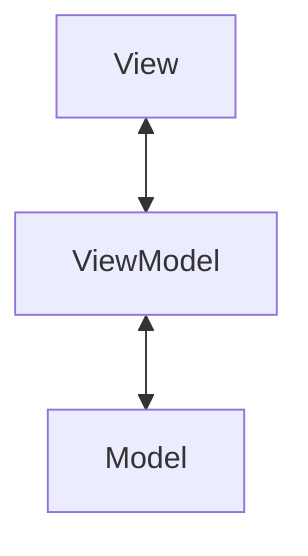
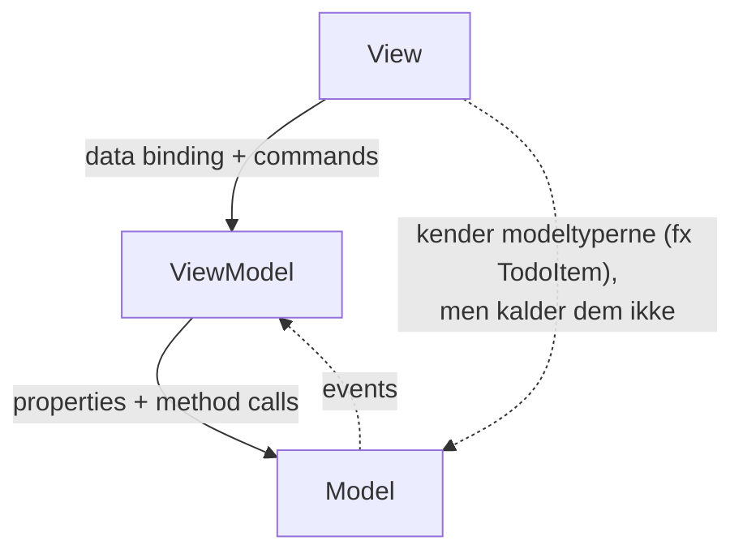
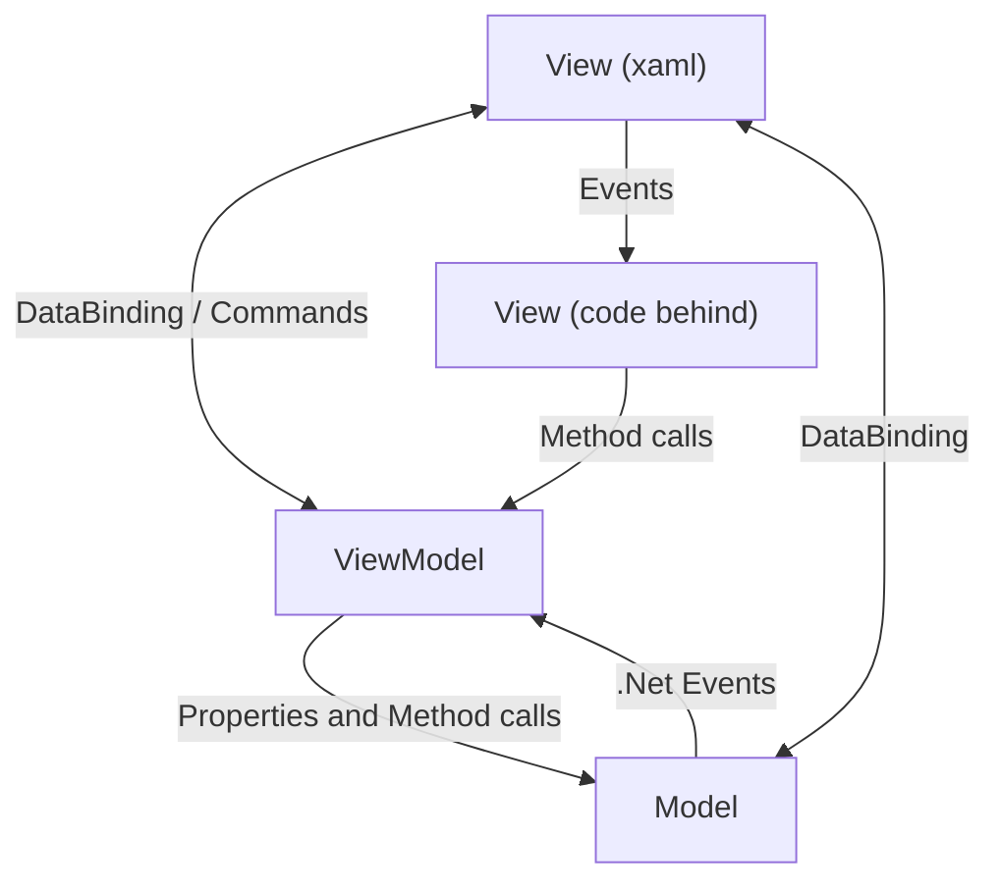
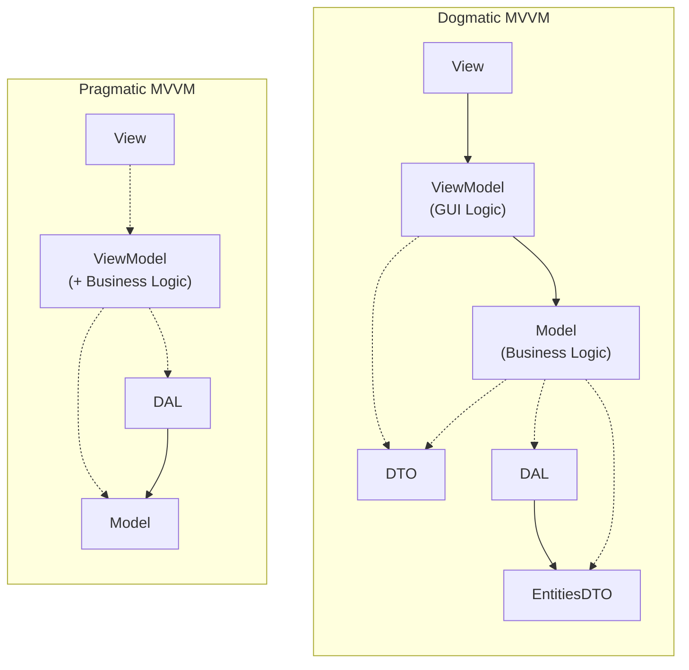

# L08 – MVVM-mønstret

## Metadata

- **Lektion:** L08 – The MVVM Pattern (Model, View, ViewModel)
- **Kursus:** Front-end udvikling (SW4FED-02)
- **Forelæser:** Poul Ejnar Rovsing / Jung Min Kim
- **Kilde:** L08/The MVVM Pattern.pdf (30 slides)
- **Emner dækket:**
  - Hvad MVVM er, og hvilke tre slags logik de tre lag rummer
  - MVVM's oprindelse: Presentation Model / MVP, John Gossman, Martin Fowler
  - MVVM-strukturen og afhængighedsretningen (hvem kender hvem)
  - Commands i MAUI: `ICommand`, `Command`, `Command<T>`, `RelayCommand`
  - Event to Command Behavior fra CommunityToolkit.Maui
  - Sammenligning MVC vs. MVVM
  - MVVM og N-layer arkitektur: dogmatisk vs. pragmatisk MVVM
  - Refaktorering af MauiTodo-appen til MVVM, trin for trin
  - `INotifyPropertyChanged` og `OnPropertyChanged`
  - To måder at sætte `BindingContext` på: code behind eller XAML

---

## 1. Hvad er MVVM?

MVVM er et software design pattern, der fremmer organisering af kode ved at holde **business logic**, **presentation logic** og **UI** adskilt.

MVVM-mønstret blev introduceret af Microsoft med Windows Presentation Foundation og er blevet **standarden for apps udviklet med XAML**.

Titeldiagrammet (og slide 2) viser de tre lag stablet lodret med dobbeltpile imellem — dvs. kommunikation begge veje mellem naboer, men aldrig direkte mellem View og Model:



Slide 2 sætter en beskrivelse på hvert lag:

| Lag | Type logik | Indhold |
|---|---|---|
| **View** | UI logic | Layouts og UI behavior som animation og text formatting |
| **ViewModel** | Presentation logic | UI state — f.eks. værdierne af properties i UI'et — og logik til at reagere på user actions |
| **Model** | Business logic | Regler for at behandle user input, eller kommunikere med et API eller data store. *Modellen er problemdomænet repræsenteret i kode.* |

## 2. Model View ViewModel (MVVM) — baggrund

- Er Microsofts specialisering af **Presentation Model Pattern (MVP)**
- MVVM er målrettet apps udviklet med XAML, f.eks. WPF og MAUI
- MVVM blev designet til at udnytte specifikke funktioner i frameworket (primært **data binding**) for bedre at facilitere adskillelsen af View-laget fra Model-laget ved at fjerne stort set al "code behind" fra View-laget
- I stedet for at kræve, at Interactive Designers skriver View-kode, kan de bruge XAML (Expression Blend) og oprette bindings til ViewModellen, som skrives og vedligeholdes af applikationsudviklere
  - I de fleste virksomheder er udvikleren dog også ansvarlig for XAML-koden

## 3. Ånden i MVVM

MVVM handler om at bygge UI'er, der udnytter platform enhancements i frameworket til at give god adskillelse mellem UI og business logic, så UI'erne bliver lettere at vedligeholde for udviklere og designere.

**John Gossman** (opfinder af MVVM):

> Model/View/ViewModel is tailored for modern UI development platforms where the View is the responsibility of a designer rather than a classic developer. The designer is generally a more graphical, artistic focused person, and does less classic coding than a traditional developer.

**Martin Fowler** (kommentar til PresentationModel):

> It's useful for allowing you to test without the UI, support for some form of multiple view and a separation of concerns which may make it easier to develop the user interface.

## 4. MVVM Structure — afhængighedsretningen

Dette er lektionens centrale diagram, og det er værd at læse omhyggeligt.

Slide 5 viser to diagrammer. Det store til venstre er et UML-agtigt diagram med tre kasser på række — **View**, **ViewModel**, **Model** — og fire noter hæftet på forbindelserne:

- **Data Binding** (note over forbindelsen View ↔ ViewModel)
- **Commands** (note under forbindelsen View → ViewModel)
- **properties and method calls** (note over forbindelsen ViewModel ↔ Model)
- **Events** (etiket på forbindelsen Model → ViewModel)

Pilene mellem View og ViewModel går begge veje (data binding er tovejs, commands går fra View til ViewModel). Mellem ViewModel og Model går der ligeledes pile begge veje: properties og method calls fremad, events tilbage.

Det lille diagram til højre er det vigtige: tre kasser (View, ViewModel, Model) med **fuldt optrukne pile** fra View → ViewModel → Model, og en **stiplet pil** fra View hele vejen ned til Model uden om ViewModel.

Reglerne, som slidet fremhæver med fed:

- The View er forbundet til ViewModellen gennem **data binding** og sender **commands** til ViewModellen.
  - **The ViewModel is unaware of the View.**
- The ViewModel kan interagere med Model gennem properties, method calls og kan modtage events fra modellen.
  - **The Model is unaware of the ViewModel.**



Kernen er, at **afhængighederne kun peger nedad**. ViewModellen har ingen reference til View'et — den ved ikke, om der overhovedet er et UI. Det er præcis dét, der gør ViewModellen unit-testbar uden UI, som Fowler nævner ovenfor.

## 5. Elementer i MVVM: Model

Som i det klassiske MVC-mønster refererer modellen til enten:

- En **object model**, der repræsenterer det reelle state-indhold (objektorienteret tilgang), eller
- **Data access layer**, der repræsenterer det indhold (data-centrisk tilgang)

## 6. Elementer i MVVM: View

Som i det klassiske MVC-mønster refererer view'et til alle elementer, der vises af GUI'en — vinduer, knapper, grafik og andre controls.

Et View kan repræsentere hele vinduet/siden — eller det kan repræsentere kun en del af et vindue/en side, typisk et user control eller et `DataTemplate`.

## 7. Elementer i MVVM: ViewModel

ViewModellen er en **"Model of the View"**. Det betyder, at den er en abstraktion af View'et, som samtidig tjener til data binding mellem View og Model.

Den kan ses som et specialiseret aspekt af det, der ville være en **Presenter** (i MVP-mønstret), som fungerer som en data binder/converter, der omdanner Model-information til View-information og videresender commands fra View'et ind i Modellen.

ViewModellen eksponerer public:

- **Properties**
- **Commands**

— som View'et kan binde til.

---

## 8. Commands i MAUI

### Custom Commands

En **Command** er en implementation af `ICommand`-interfacet, som definerer en `Execute`-property — dvs. kode, der køres, når `ICommand`'en invokes.

Konstruktøren for `Command` accepterer en funktion, som tildeles `Execute`-property'en. Du kan deklarere den inline med et lambda expression, eller du kan sende en metode ind.

Commands kan acceptere **parametre** (hvilket løser problemet med at identificere det konkrete to-do item).

MAUI har en indbygget `Command`, men flere MVVM-frameworks har deres egen implementation af `ICommand`. Kurset anbefaler **`RelayCommand`** og **`RelayCommand<T>`** fra `CommunityToolkit.Mvvm`-pakken — men i denne lektion bruges den indbyggede `Command`.

### Event to Command Behavior

Kun få controls eksponerer en `Command`-property. Det problem løses med en **behavior**.

Behaviors gør det muligt at udvide funktionaliteten af UI controls. En behavior kan hæftes på enhver property eller metode på en control og affyre en `Command` som reaktion på et event.

.NET MAUI Community Toolkit har en **Event to Command Behavior**, som vi kan bruge.

## 9. Fra MVC til MVVM

Slide 12 sætter de to mønstre op ved siden af hinanden.

**MVC-mønstret** (venstre): tre kasser — **Controller** (orange), **View** (grøn) og **Model** (mørkeblå). Der er dobbeltpile mellem Controller og View (mærket "or", altså at indgangen kan være enten den ene eller den anden), og pile fra begge ned til Model og tilbage igen. Der er ingen streng lagdeling — både Controller og View taler direkte med Modellen.

**MVVM-mønstret** (højre) er derimod klart lagdelt i fire kasser:

- **View(xaml)** (grøn, øverst, bred)
- **View(code)** (grøn, lille, til højre — code behind)
- **ViewModel** (lilla, i midten)
- **Model** (mørkeblå, nederst, bred)

Med disse navngivne forbindelser:

- **View(xaml) ↔ ViewModel**: `DataBinding` og `Commands` (to separate pilepar)
- **View(xaml) → View(code)**: `Events`
- **View(code) → ViewModel**: `Method calls`
- **View(xaml) ↔ Model**: `DataBinding` (den lange pil helt ude til venstre)
- **ViewModel ↔ Model**: `Properties and Method calls` nedad, `.Net Events` opad



Pointen ved sammenligningen: hvor MVC har en controller, der aktivt styrer view'et, har MVVM ingen aktiv styring — bindingerne er deklarative, og ViewModellen kender ikke sit View.

## 10. MVVM og N-layer Architecture

Slide 14 er et af de vigtigste diagrammer i lektionen. Det viser to måder at kombinere MVVM med en klassisk tre-lags arkitektur, adskilt af vandrette stiplede linjer, der markerer lagene **GUI**, **BLL** (Business Logic Layer) og **DAL** (Data Access Layer).

### Dogmatisk MVVM (venstre, med en tankeboble "Dogmatic MVVM")

- I **GUI**-laget: `View` → `ViewModel`. ViewModellen indeholder "GUI Logic".
- I **BLL**-laget: `Model`, som indeholder "Business Logic", og som producerer en `DTO`.
- I **DAL**-laget: `DAL` → `EntitiesDTO`.
- Stiplede pile: ViewModel → DTO (ViewModellen arbejder på DTO'er, ikke på entiteter), Model → DAL, Model → EntitiesDTO.

Her er MVVM-trekanten helt indeholdt i GUI-laget, og `Model` i MVVM-forstand er BLL'ens model. Kommunikation ud af laget sker via DTO'er.

### Pragmatisk MVVM (højre, med tankebobler "Pragmatic MVVM")

- I **GUI**-laget: `View` → `ViewModel`, men ViewModellen strækker sig ned over lagsgrænsen.
- ViewModellen bærer selv "Business Logic".
- I **DAL**-laget: `DAL` → `Model`, og ViewModellen har stiplede pile direkte ned til både `DAL` og `Model`.

Her er BLL-laget reelt kollapset ind i ViewModellen, og der er ingen separat DTO-oversættelse — ViewModellen bruger domænemodellen direkte.



Afvejningen: dogmatisk MVVM giver renere lagdeling og bedre testbarhed, men koster mere kode (DTO'er og mapping). Pragmatisk MVVM er hurtigere at skrive, men GUI-laget kender datamodellen direkte.

---

## 11. Sådan anvendes MVVM på en MAUI-app

Resten af lektionen refaktorerer MauiTodo-appen til at bruge MVVM.

### Uden MVVM

Slide 16 viser dataflowet i appen, **før** MVVM indføres, som tre bokse med pile imellem:

1. **UI (XAML)** — indeholder en "Add"-knap, et tekstfelt "Enter to-do item title…" og en datovælger "Due date: 25th May 2022".
2. **UI (code-behind)** — indeholder en **Clicked event handler**, som "Creates a new TodoItem with values from the UI", og et **TodoItem** med felterne `DateTime due` og `String title`.
3. **SQLite database** (tegnet som en cylinder).

Pilene er mærket:

- "User clicks Add button." (UI → event handler)
- "Event handler gets title and due date from the UI controls." (event handler → tilbage til UI-kontrollerne)
- "Saves the TodoItem to the database" (TodoItem → SQLite)

Konklusionen på slidet: **UI'et for MauiTodoApp håndterer alt, inklusive kommunikationen med databasen.** Det er præcis det problem, MVVM skal løse — code-behind er blevet både presentation logic og data access.

### Med MVVM

Slide 17 viser det samme dataflow **efter** refaktoreringen, som tre kolonner:

**MainPage** (View) til venstre med UI-elementerne:

- Tekstfeltet "Todo Item Title"
- Tekstfeltet "Due Date"
- Knappen "Add"
- En liste med afkrydsningsfelter: "First item / 25th May 2022", "Second item / 25th May 2022" (afkrydset), "Third item / 25th May 2022"

**MainViewModel** i midten med de bindbare medlemmer:

```csharp
string NewTodoTitle
DateTime NewTodoDate
ICommand AddTodoCommand
ObservableCollection<TodoItem> Todos
ICommand CompleteTodoCommand
```

**SQLite database** til højre (cylinder).

Pile fra hvert UI-element til dets modsvarende ViewModel-medlem:

| UI-element | ViewModel-medlem |
|---|---|
| Todo Item Title (Entry) | `string NewTodoTitle` |
| Due Date (DatePicker) | `DateTime NewTodoDate` |
| Add (Button) | `ICommand AddTodoCommand` |
| Listen af items | `ObservableCollection<TodoItem> Todos` |
| Afkrydsningsfelt på et item | `ICommand CompleteTodoCommand` |

Og fra ViewModellen går der pile videre til SQLite-databasen fra `AddTodoCommand`, `Todos` og `CompleteTodoCommand`.

Forskellen på de to diagrammer er hele pointen: databasen er nu **kun** forbundet til ViewModellen, ikke til UI'et.

## 12. Opret ViewModellen

Første skridt er at oprette ViewModellen. Du navngiver ViewModellen efter navnet på View'et og erstatter `Page` eller `View` med `ViewModel` i navnet. Vi opretter en ViewModel til vores `MainPage`, så den hedder `MainViewModel`.

Opret en mappe kaldet `ViewModels` og opret klassen `MainViewModel`.

## 13. INotifyPropertyChanged

Vores `MainViewModel` skal implementere `INotifyPropertyChanged`-interfacet.

`INotifyPropertyChanged` definerer en event handler, der **notificerer UI'et, når en property på ViewModellen er ændret**. Dette trin er nødvendigt, når man bruger MVVM.

Hvis du har mere end én ViewModel i din app, så implementér `INotifyPropertyChanged` i en `BaseViewModel` og lad de øvrige ViewModels arve fra den — eller brug et MVVM-framework som MVVM Toolkits `ObservableObject`.

### Implementation

```csharp
public class MainViewModel : INotifyPropertyChanged
{
    #region INotifyPropertyChanged
    public event PropertyChangedEventHandler PropertyChanged;

    protected void OnPropertyChanged([CallerMemberName] string propertyName = "")
    {
        PropertyChanged?.Invoke(this, new PropertyChangedEventArgs(propertyName));
    }

    public void RaisePropertyChanged(params string[] properties)
    {
        foreach (var propertyName in properties)
        {
            PropertyChanged?.Invoke(this, new PropertyChangedEventArgs(propertyName));
        }
    }
    #endregion
}
```

Bemærk `[CallerMemberName]`: den gør, at `OnPropertyChanged()` kaldt fra en property-setter automatisk får den kaldende propertys navn med — man behøver ikke skrive navnet som streng. `RaisePropertyChanged` er en hjælper, der kan notificere om flere properties på én gang.

## 14. Tilføj ViewModellens properties og fields

Fields bruges til at holde private data internt i ViewModellen, men **public properties skal bruges til binding**.

```csharp
public ObservableCollection<TodoItem> Todos { get; set; } = new();
public string NewTodoTitle { get; set; }
public DateTime NewTodoDue { get; set; } = DateTime.Now;
public ICommand AddTodoCommand { get; set; }
public ICommand CompleteTodoCommand { get; set; }
private readonly Database _database;
```

`ObservableCollection<T>` er valgt frem for `List<T>`, fordi den selv rejser collection-changed-events, så UI'et opdateres, når der tilføjes eller fjernes elementer.

## 15. Tilføj metoder til ViewModellen

```csharp
public async Task AddNewTodo()
{
    var todo = new TodoItem
    {
        Due = NewTodoDue,
        Title = NewTodoTitle
    };
    var inserted = await _database.AddTodo(todo);
    if (inserted != 0)
    {
        Todos.Add(todo);
        NewTodoTitle = String.Empty;
        NewTodoDue = DateTime.Now;
        RaisePropertyChanged(nameof(NewTodoDue), nameof(NewTodoTitle));
    }
}
```

Bemærk `RaisePropertyChanged` til sidst: `Todos.Add` opdaterer selv listen i UI'et (fordi den er en `ObservableCollection`), men de to almindelige properties `NewTodoTitle` og `NewTodoDue` gør ikke — derfor skal der eksplicit notificeres, for at de tømte inputfelter opdateres på skærmen.

## 16. Tilføj konstruktør

Tilføj en konstruktør til `MainViewModel`, som tildeler en ny instans af databasen til det private field. Og wire de to `ICommand`-properties op ved at tildele dem nye instanser af `Command`-typen, med deres respektive metoder sat som `Execute`-property.

Til update-metoden kan vi bruge et `TodoItem` som type argument. Sidste skridt er, at konstruktøren kalder `Initialize`-metoden — og da den metode er async, bruger vi **discard-operatoren** (`_ =`).

```csharp
public MainViewModel()
{
    _database = new Database();
    AddTodoCommand = new Command(async () => await AddNewTodo());
    CompleteTodoCommand = new Command<TodoItem>(async (item) =>
             await CompleteTodo(item));
    _ = Initialize();
}
```

Bemærk forskellen: `Command` uden type-argument til knappen, `Command<TodoItem>` når kommandoen skal modtage det konkrete item som parameter.

## 17. Opdatér code behind

Fjern næsten al koden, da funktionaliteten er flyttet til ViewModellen. Og efter `InitializeComponent()`-kaldet sættes `BindingContext` til en instans af `MainViewModel`.

Slide 24 fremhæver, at der er **to muligheder — brug én af dem**, ikke begge.

### Mulighed 1: i code behind (`MainPage.xaml.cs`)

```csharp
public partial class MainPage : ContentPage
{
    public MainPage()
    {
        InitializeComponent();
        BindingContext = new MainViewModel();
    }
}
```

Callout: "Now we are binding ViewModel to Page ('this ViewModel is bound to this Page')".

### Mulighed 2 (ELLER): i XAML (`MainPage.xaml`)

```xml
<ContentPage.BindingContext>
    <vm:MainViewModel />
</ContentPage.BindingContext>
```

Callout: "However, alternatively, it can be in xaml file too with a different syntax (løsningsforslag) instead here."

Den fulde XAML-variant, som vist på slide 29:

```xml
<ContentPage xmlns="http://schemas.microsoft.com/dotnet/2021/maui"
             xmlns:x="http://schemas.microsoft.com/winfx/2009/xaml"
             xmlns:vm="clr-namespace:MauiApp.ViewModels"
             x:Class="MauiApp.MainPage">
    <ContentPage.BindingContext>
        <vm:MainViewModel />
    </ContentPage.BindingContext>
```

Bemærk at XAML-varianten kræver `xmlns:vm`-namespace-deklarationen, der peger på ViewModels-mappen.

## 18. Opdatér UI'et til at bruge binding

Fjern binding context-tildelingen fra XAML, hvis vi nu gør det i kode. Tilføj binding til properties:

```xml
<Entry Grid.Row="1"
       HorizontalOptions="Center"
       Placeholder="Enter a title"
       SemanticProperties.Hint="Title of the new todo item"
       WidthRequest="300"
       Text="{Binding NewTodoTitle}"
       />
```

Og tilføj binding til commands:

```xml
<Button Grid.Row="3"
        Text="Add"
        Command="{Binding AddTodoCommand}"
        />
```

## 19. Brug af behaviors til at udvide dine controls

Modellen har en `Done`-property, og UI'et har en `Checkbox`, men vi mangler stadig en måde at forbinde dem. Det problem løses ved at bruge en **behavior**.

Installér MVVM Toolkit: `CommunityToolkit.Maui` NuGet-pakken i MauiTodo-appen.

I **Visual Studio**: gennem NuGet-manageren — screenshottet viser søgeresultatet "CommunityToolkit.Maui by Microsoft, 7.26M downloads, version 14.0.0" med beskrivelsen "The .NET MAUI Community Toolkit is a collection of Animations, Behaviors, Converters, and Custom Views for development with .NET MAUI. It simplifies and demonstrates common developer tasks building iOS, Android, macOS and Windows apps with .NET MAUI."

I **Visual Studio Code**:

```bash
dotnet add package CommunityToolkit.Maui
```

Og initialisér den derefter i `MauiProgram.cs`.

## 20. MauiProgram.cs

```csharp
using Microsoft.Extensions.Logging;
using CommunityToolkit.Maui;

namespace MauiTodo
{
    public static class MauiProgram
    {
        public static MauiApp CreateMauiApp()
        {
            var builder = MauiApp.CreateBuilder();
            builder
                .UseMauiApp<App>()
                .UseMauiCommunityToolkit()
                .ConfigureFonts(fonts =>
                {
                    fonts.AddFont("OpenSans-Regular.ttf", "OpenSansRegular");
                    fonts.AddFont("OpenSans-Semibold.ttf", "OpenSansSemibold");
                })
            return builder.Build();
        }
    }
}
```

Pilen på slidet peger på `.UseMauiCommunityToolkit()` med teksten **"add"** — det er den ene linje, der skal tilføjes.

## 21. Opdatér MainPage.xaml med EventToCommandBehavior

Tilføj dette namespace til din `MainPage.xaml`:

```xml
xmlns:toolkit="http://schemas.microsoft.com/dotnet/2022/maui/toolkit"
```

Opdatér `CheckBox`-tagget:

```xml
<CheckBox VerticalOptions="Center"
          HorizontalOptions="Center"
          Grid.Column="0"
          Grid.Row="0"
          IsChecked="{Binding Done}"
          >
    <CheckBox.Behaviors>
        <toolkit:EventToCommandBehavior
            EventName="CheckedChanged"
            Command="{Binding Source={x:Reference PageTodo},
            Path=BindingContext.CompleteTodoCommand}"
            CommandParameter="{Binding .}"/>
    </CheckBox.Behaviors>
</CheckBox>
```

Slidets callouts forklarer hver del:

| Kodeelement | Forklaring fra slidet |
|---|---|
| `IsChecked="{Binding Done}"` | "binding with `Done` property into check box" |
| `<CheckBox.Behaviors>` | "Behavior into UI control" |
| `<toolkit:EventToCommandBehavior` | "Use Event to behavior from CommunityToolkit.Maui" |
| `EventName="CheckedChanged"` | "Listen this EventName" |
| `Command="{Binding Source={x:Reference PageTodo}, Path=…}"` | "Command binding" — og "It must be defined with same name in xaml file: e.g., `x:Name="PageTodo"`" |
| `CommandParameter="{Binding .}"` | "Bind to the current object itself" |

To ting er værd at forstå her:

1. **`Source={x:Reference PageTodo}`** er nødvendig, fordi vi står inde i en liste-template, hvor `BindingContext` er det enkelte `TodoItem`, ikke ViewModellen. Ved at referere til siden ved navn og gå via dens `BindingContext` når vi ud til `CompleteTodoCommand` på ViewModellen. Siden skal derfor have `x:Name="PageTodo"` i sit rod-tag.
2. **`CommandParameter="{Binding .}"`** sender det aktuelle `TodoItem` med som parameter — det er derfor, kommandoen blev deklareret som `Command<TodoItem>`.

## 22. Forbind View og ViewModel — opsummering

Slide 29 gentager de to muligheder side om side.

I codebehind:

```csharp
public MainPage()
{
    InitializeComponent();
    BindingContext = new MainViewModel();
}
```

Eller i XAML:

```xml
<ContentPage xmlns="http://schemas.microsoft.com/dotnet/2021/maui"
             xmlns:x="http://schemas.microsoft.com/winfx/2009/xaml"
             xmlns:vm="clr-namespace:MauiApp.ViewModels"
             x:Class="MauiApp.MainPage">
    <ContentPage.BindingContext>
        <vm:MainViewModel />
    </ContentPage.BindingContext>
```

## 23. Referencer og links

- *.NET MAUI in Action*
- .NET Multi-platform App UI (.NET MAUI) Community Toolkit documentation (indeholder `EventToCommandBehavior`) — https://learn.microsoft.com/en-us/dotnet/communitytoolkit/maui/
- Introduction to the MVVM Toolkit — https://learn.microsoft.com/en-us/dotnet/communitytoolkit/mvvm/
