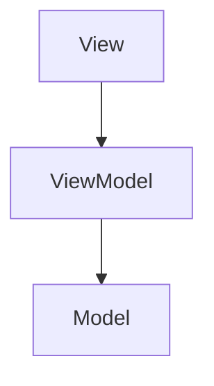

# L09 – MVVM Community Toolkit

## Metadata

- **Lektion:** L09 – MVVM Community Toolkit
- **Kursus:** Front-end udvikling (SW4FED-02)
- **Forelæser:** Poul Ejnar Rovsing / Jung Min Kim
- **Kilde:** L09/MVVM Community Toolkit.pdf (25 slides)
- **Emner dækket:**
  - Recap af MVVM-mønsteret (View, ViewModel, Model)
  - Data binding og BindingContext i MVVM
  - Dependency injection til opsætning af BindingContext
  - `x:DataType` og compiled bindings / intellisense
  - CommunityToolkit.Mvvm: principper og pakkeindhold
  - Source generators og reduktion af boilerplate
  - `ObservableObject` og `[ObservableProperty]`
  - `[NotifyPropertyChangedFor]` og custom setters
  - `RelayCommand`, `[RelayCommand]`, navngivningskonvention
  - Command parameters, `CanExecute` og `[NotifyCanExecuteChangedFor]`
  - Messaging med `IMessenger`

---

## 1. MVVM Enhancements

Der findes flere MVVM-frameworks og -biblioteker med varierende grad af hjælpefunktioner, når man implementerer MVVM-mønsteret i en app. I dette kursus anbefales pakken **CommunityToolkit.Mvvm**.

## 2. Recap: MVVM-mønsteret

Mønsteret består af tre lag, hvor View kender ViewModel, og ViewModel kender Model — men ikke omvendt.



**View**

- Ofte en `ContentPage` eller en `ContentView`.
- En View kan også være repræsenteret af en data template eller en custom control.
- En data template brugt som view har ingen code-behind og er designet til en specifik view model-type.

**ViewModel**

- ViewModel fungerer som bro mellem View og Model.
- Man eksponerer properties og commands på ViewModel, som View binder til.

**Model**

- Model-klasser indkapsler applikationens data.

## 3. Data binding og MVVM

En binding giver en mekanisme, hvor både View og ViewModel kan sende og modtage opdateringer. `BindingContext` for et view er normalt en instans af viewmodellen. I binding-terminologi er ViewModel **source** og View **target**.

Nogle properties defineres som **two-way**, fordi ViewModel-klassen er data-binding source og View er data-binding target, når data bindings bruges sammen med MVVM. Pointen med MVVM-bindings er, at hvert view på siden initialiseres med værdien af den tilsvarende property i viewmodellen — men ændringer i view skal også påvirke viewmodel-propertyen.

## 4. Hvordan sættes BindingContext?

Det er ofte at foretrække at bruge dependency injection. ViewModels og deres afhængigheder registreres i ioc-containeren.

### Kodeeksempel

```csharp
builder.Services.AddSingleton<IDatabase, Database>();
builder.Services.AddSingleton<MainPage>();
builder.Services.AddTransient<MainViewModel>();
```

Derefter bruges constructor injection.

```csharp
public MainPage(MainViewModel vm)
{
    InitializeComponent();
    BindingContext = vm;
}
```

```csharp
public partial class MainViewModel : ObservableObject
{
    readonly IDatabase _database;

    public MainViewModel(IDatabase database) {
        _database = database;
        _ = Initialize();
    }
}
```

## 5. Sådan får man korrekt intellisense

Man skal manuelt angive den datatype, der bruges til binding, i XAML-filen via `x:DataType`.

### Kodeeksempel

```xml
<ContentPage xmlns="http://schemas.microsoft.com/dotnet/2021/maui"
             xmlns:x="http://schemas.microsoft.com/winfx/2009/xaml"
             xmlns:tk="http://schemas.microsoft.com/dotnet/2022/maui/toolkit"
             xmlns:vm="clr-namespace:MVVMToolkitDemo.ViewModels"
             xmlns:m="clr-namespace:MVVMToolkitDemo.Models"
             x:Class="MVVMToolkitDemo.MainPage"
             x:DataType="vm:MainViewModel"
             x:Name="PageTodo"
             >
```

Bemærk at `x:DataType` også sættes på den enkelte `DataTemplate`, fordi bindingskonteksten dér er det enkelte element i kollektionen — ikke viewmodellen.

```xml
<CollectionView Grid.Row="4"
                ItemsSource="{Binding Todos}"
                >
    <CollectionView.ItemTemplate>
        <DataTemplate x:DataType="m:TodoItem">
```

## 6. CommunityToolkit.Mvvm (MVVM Toolkit)

Pakken `CommunityToolkit.Mvvm` kaldes også **MVVM Toolkit**. Det er et moderne, hurtigt og modulært MVVM-bibliotek. Det er en del af .NET Community Toolkit og er bygget omkring følgende principper:

- **Platform and Runtime Independent** — uafhængigt af platform og runtime.
- **Simple to pick-up and use** — ingen strikse krav til applikationsstruktur eller kodeparadigmer (ud over selve "MVVM'ness"), altså fleksibel brug.
- **À la carte** — frihed til at vælge, hvilke komponenter man vil bruge.
- **Reference Implementation** — leverer implementationer af interfaces, der findes i Base Class Library, men mangler konkrete typer, man kan bruge direkte.

MVVM Toolkit vedligeholdes og udgives af Microsoft og er en del af .NET Foundation. Installation sker via NuGet, og pakken indeholder blandt andet `EventToCommand`.

## 7. Source generators

CommunityToolkit.Mvvm indeholder **source generators**, som hjælper med at reducere boilerplate, når man skriver kode efter MVVM-arkitekturen. Efterhånden som man skriver kode, sørger MVVM Toolkit-generatoren for at generere ekstra kode bag kulisserne. Denne kode kompileres og inkluderes i applikationen, så resultatet er det samme, som hvis man havde skrevet den ekstra kode manuelt.

## 8. Features i MVVM Community Toolkit

- `CommunityToolkit.Mvvm.ComponentModel`
  - `ObservableObject`
  - `ObservableProperty`
  - `ObservableRecipient`
- `CommunityToolkit.Mvvm.Input`
  - `RelayCommand`
  - `RelayCommand<T>`
- `CommunityToolkit.Mvvm.Messaging`
  - `IMessenger`
  - `StrongReferenceMessenger`
  - `WeakReferenceMessenger`

## 9. ObservableObject

`ObservableObject` er en baseklasse for objekter, der er observerbare, ved at implementere interfacene `INotifyPropertyChanged` og `INotifyPropertyChanging`. Den kan bruges som udgangspunkt for alle slags objekter, der har brug for at understøtte property change notifications.

### Kodeeksempel

```csharp
public partial class MainViewModel : ObservableObject
{
    readonly IDatabase _database;

    public MainViewModel(IDatabase database) {
        _database = database;
        _ = Initialize();
    }
}
```

## 10. ObservableProperty

Antag at man vil lave en property `fullname`. Med attributten `[ObservableProperty]` genererer propertyen automatisk change notifications, så data binding og View opdateres, når propertyen ændres.

### Kodeeksempel — uden CommunityToolkit.Mvvm

```csharp
private string? fullname;
public string? FullName
{
   get => fullname;
   set => {
            fullname = value;
            NotifyPropertyChanged();
          };
}
```

### Kodeeksempel — med CommunityToolkit.Mvvm

```csharp
[ObservableProperty]
private string? fullname;
```

`ObservableProperty`-attributten genererer properties. Hvis der er flere properties, der skal genereres, sættes attributten på hver enkelt property. Attributten genererer (usynligt) den public property med stort begyndelsesbogstav samt dens `OnPropertyChanged`-metode.

Man har brug for den public property til data binding, fordi man kun kan binde til en public property.

## 11. Notifying dependent properties

Forestil dig, at du har en `FullName`-property, som du vil rejse en notifikation for, hver gang `FirstName` ændres.

### Kodeeksempel

```csharp
[ObservableProperty]
[NotifyPropertyChangedFor(nameof(FullName))]
private string? firstName
```

## 12. Custom observable property

Nogle gange har man brug for at tilpasse setteren.

### Kodeeksempel

```csharp
public class User : ObservableObject
{
  private string name;
  public string Name
  {
    get => name;
    set => {
      // Insert custom code here
      SetProperty(ref name, value);
      // Or here
    }
  }
}
```

## 13. RelayCommand

`RelayCommand` og `RelayCommand<T>` er `ICommand`-implementationer, der kan eksponere en metode eller delegate til viewet. Disse typer fungerer som en måde at binde commands mellem viewmodel og UI-elementer.

`AsyncRelayCommand` og `AsyncRelayCommand<T>` er `ICommand`-implementationer, der udvider funktionaliteten fra `RelayCommand` med understøttelse af asynkrone operationer.

## 14. RelayCommand-attributten

`[RelayCommand]` kan bruges på en metode, som vi vil forbinde til viewet gennem en `RelayCommand`. `[RelayCommand]` udløser en analyser, der kører en source generator, som skriver selve `RelayCommand`.

Sammenhængen kan illustreres sådan: `ObservableObject` implementerer `INotifyPropertyChanged`, og oven på den lægger `[ObservableProperty]` og `[RelayCommand]` deres genererede kode.

### Kodeeksempel

```csharp
[RelayCommand]
public async Task SwipeDone(TodoItem todoitem)
{
    todoitem.Done = !todoitem.Done;
    var completed = await _database.UpdateTodo(todoitem);
    OnPropertyChanged(nameof(Todos));
}
```

Den genererede command bindes fra XAML. Her bruges `RelativeSource AncestorType`, fordi bindingskonteksten inde i templaten er det enkelte `TodoItem` og ikke viewmodellen.

```xml
Command="{Binding Source={RelativeSource AncestorType={x:Type vm:MainViewModel}},
                  Path=SwipeDoneCommand}"
                  CommandParameter="{Binding .}"/>
```

## 15. RelayCommand — navngivningskonvention

Navnet på den genererede command dannes ud fra metodenavnet. Generatoren bruger metodenavnet og tilføjer `"Command"` til sidst, og den fjerner præfikset `"On"`, hvis det er til stede. For asynkrone metoder fjernes suffikset `"Async"` desuden, før `"Command"` tilføjes.

### Kodeeksempel

```csharp
[RelayCommand]
private void OnGreetUser()
{
  Console.WriteLine("Hello!");
}
```

Dette giver den genererede `GreetUserCommand()`.

## 16. Command parameters

`[RelayCommand]`-attributten understøtter at oprette commands for metoder med en parameter.

### Kodeeksempel

```csharp
[RelayCommand]
private void GreetUser(User user)
{
  Console.WriteLine($"Hello {user.Name}!");
}
```

Det resulterer i følgende genererede kode:

```csharp
private RelayCommand<User>? greetUserCommand;
public IRelayCommand<User> GreetUserCommand =>
         greetUserCommand ??= new RelayCommand<User>(GreetUser);
```

## 17. Enabling og disabling af commands

Det er ofte nyttigt at kunne aktivere eller deaktivere commands baseret på værdien af en eller flere properties. For at understøtte dette eksponerer `RelayCommand`-attributten propertyen `CanExecute`, som angiver en target property eller metode, der skal bruges til at evaluere, om en command kan udføres.

### Kodeeksempel

```csharp
[RelayCommand(CanExecute = nameof(CanGreetUser))]
private void GreetUser(User? user)
{
  Console.WriteLine($"Hello {user!.Name}!");
}

private bool CanGreetUser(User? user)
{
  return user is not null;
}
```

## 18. Notifying dependent commands

Hvis du har en command, hvis execution state afhænger af værdien af en property — altså hvor command'ens execution state skal invalideres og beregnes igen, hver gang propertyen ændres — skal `ICommand.CanExecuteChanged` rejses igen. Det opnås med attributten `NotifyCanExecuteChangedFor`.

### Kodeeksempel

```xml
<Button Content="Greet user" Command="{Binding GreetUserCommand}"
                             CommandParameter="{Binding SelectedUser}"/>
```

```csharp
[ObservableProperty]
[NotifyCanExecuteChangedFor(nameof(GreetUserCommand))]
private User? selectedUser;
```

## 19. Messaging

En `Messenger` kan bruges til at afkoble forskellige moduler i en applikation uden at skulle holde strong references til de typer, der refereres. Det er også muligt at sende beskeder til specifikke kanaler, unikt identificeret af et token, og at have forskellige messengers i forskellige dele af en applikation.

### Kodeeksempel

Definér først en message-type.

```csharp
public sealed class LoginCompletedMessage { }
```

Registrér derefter din recipient for denne message.

```csharp
Messenger.Default.Register<MyRecipientType, LoginCompletedMessage>(this, (r, m) =>
{
    // Handle the message here...
});
```

Send til sidst en message, når det er nødvendigt.

```csharp
Messenger.Default.Send<LoginCompletedMessage>();
```

## 20. References & Links

- Introduction to the MVVM Toolkit — https://learn.microsoft.com/en-us/dotnet/communitytoolkit/mvvm/
