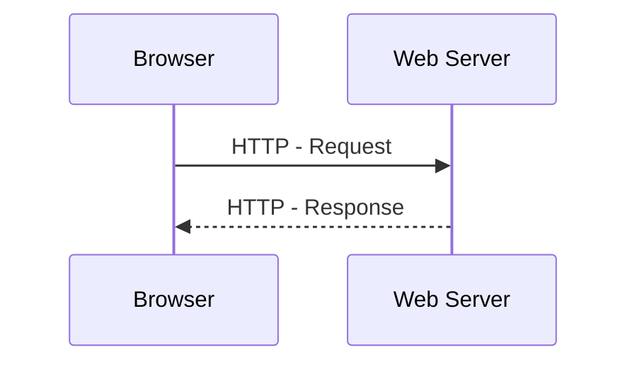

# L13 – Websites og Web apps

## Metadata

- **Lektion:** L13 – Web Sites and Web Apps
- **Kursus:** Front-end udvikling (SW4FED-02)
- **Forelæser:** Poul Ejnar Rovsing / Jung Min Kim
- **Kilde:** L13/BED WebSitesAndWebApps.pdf (28 slides)
- **Emner dækket:**
  - WWW's oprindelse og de fem grundbestanddele
  - HTML's historie og standardisering (W3C, WHATWG)
  - URL, URI og URL-regler
  - HTTP, HTTP/2 og HTTP/3 (QUIC)
  - HTTP verbs og status codes
  - Web client og web server
  - Dynamic web pages og server-side scripting
  - Client-side scripting og Ajax / Web API
  - Web dev tools: browsere, editors, validering, debugging

---

## 1. Agenda

- The Basic Web architecture: The Origins of the WWW, HTML, URL, HTTP, The Web Server, The Browser
- Web enhancements: Dynamic html generation, CSS, Java applets, Java script, Ajax / Web API
- Web Dev Tools

## 2. WWW's oprindelse

WWW blev opfundet af Tim Berners-Lee (fysiker) på CERN i 1989-1992. Hovedformålet var **hypertext across the Internet** — som erstatning for FTP.

Fem grundbestanddele:

| Bestanddel | Rolle |
| --- | --- |
| HTML | Mark-up language for hypertext |
| URL | Notation for locating files on servers |
| HTTP/HTTPS | High-level protocol for file transfers |
| Web server | Sender en fil som http response, når den bliver anmodet om det |
| Browser | Modtager HTML-dokumenter og renderer dem som synlige sider |

## 3. HTML's oprindelse

HTML er et akronym for **Hyper Text Mark-up Language**. HTML 1.0 var en forenkling af SGML (Standard Generalized Markup Language) med tilføjelsen af Link-elementet.

| År | Version |
| --- | --- |
| 1991 | HTML Tags, et uformelt CERN-dokument, blev første gang nævnt offentligt. |
| 1992 | HTML 1.0. Første uformelle udkast til HTML-standarden. Tim Berners-Lees forslag. |
| 1995 | HTML 2.0 udgivet som IETF RFC 1866. |
| 1996 | HTML-standarden udvikles nu af W3C. |
| 1997 | HTML 3.2 udgivet som W3C Recommendation. Browser-krigen slutter. |
| 1997/98 | HTML 4.0. Style sheets introduceres — CSS. |
| 2000-02 | XHTML 1.0 udgivet som W3C Recommendation. En XML-version af HTML 4.01. |
| 2008 | HTML5 udgivet som Working Draft af W3C. |
| 2014 | HTML5 udgivet som W3C Recommendation. |
| 2016 | HTML5.1 udgivet som W3C Recommendation. |
| 2017 | HTML5.2 udgivet som W3C Recommendation. |

HTML defineres nu af WHATWG — et akronym for Web Hypertext Application Technology Working Group, en organisation dannet af folk, der arbejder på de mest populære webbrowsere. Se https://whatwg.org/ og HTML Living Standard.

## 4. HTML

HTML beskriver den logiske struktur af et dokument. HTML bruger tags `<tag>` til at strukturere teksten.

### Kodeeksempel

```html
<html>
  <head>
    <title>SW4FED</title>
  </head>
  <body>
    <h1>Front end</h1>
    <h2>SW4FED</h2>
    <p>Til Web-applikationer anvendes <b>HTML</b>,
       CSS og Javascript.</p>
  </body>
</html>
```

## 5. Uniform Resource Locator — URL

En web-ressource lokaliseres med en URL:

```text
http://www.ece.au.dk:1234/path/file.html?x=2&y=7
```

Delene er: **Scheme** (`http`), **Server** (`www.ece.au.dk`), **Port** (`1234` — 80 er default), **Path** (`/path/file.html`) og **Query** (`x=2&y=7`).

En relativ URL:

```text
path/file.htm
```

Fragment identifier:

```text
http://www.iha.dk/path/file.html/#section4
```

Her er `#section4` fragment-id'et.

## 6. URI

URL'er er en delmængde af det mere generelle begreb **Uniform Resource Identifiers** (URI). Den generelle URI-syntaks er meget fleksibel:

```text
scheme:scheme-specific-part
```

Mange forskellige schemes er defineret ud over `http`: `ftp`, `file`, `mailto`, `imap`, `https`, `dict`, `geo` med flere.

Det officielle register over schemes vedligeholdes af Internet Assigned Numbers Authority (IANA): http://www.iana.org/assignments/uri-schemes.html

## 7. URL-regler

Alle URL'er følger visse regler:

- `/` indebærer en hierarkisk struktur.
- `?` adskiller den queryable ressource fra query-strengen.
- `#` adskiller en fragment identifier fra URI'en.
- Specialtegn escapes med notationen `%NN`, hvor NN er tegnets hexadecimale kode — for eksempel er `%20` et mellemrum.

## 8. HTTP — HyperText Transfer Protocol

Client-server-model, der følger et request-response-mønster.

- Version v1.1 (RFC 2068) fra 1997.
- HTTP/2 (RFC 7540) fra maj 2015.
- Nuværende version er HTTP/3. Den 6. juni 2022 udgav IETF HTTP/3 som Proposed Standard i RFC 9114, og den understøttes allerede af 75 % af kørende webbrowsere og ifølge W3Techs af 26 % af de 10 millioner største websites.



## 9. HTTP/2

HTTP/2-specifikationen blev udgivet som RFC 7540 i maj 2015. Specifikationen blev udviklet af Hypertext Transfer Protocol Bis (httpbis) working group under IETF.

Mål for HTTP 2.0 omfatter:

- **Asynchronous connection multiplexing** — en af flaskehalsene i HTTP v1.1-implementationer er, at HTTP baserer sig på flere forbindelser for at opnå concurrency.
- **Header compression** — reducerer overhead.
- **Server push technologies** — lader serveren levere data, den ved en browser får brug for.

Resultat: page load speedup fra 11,81 % til 47,7 %.

HTTP/2 er bagudkompatibel med semantikken i HTTP 1.1. Det element, der er ændret, er hvordan data framees og transporteres mellem klient og server.

## 10. HTTP/3

Både HTTP/1.1 og HTTP/2 bruger TCP som transport. HTTP/3 bruger **QUIC**.

- QUIC er en transport layer-netværksprotokol, som bruger user space congestion control oven på User Datagram Protocol (UDP).
- Skiftet til QUIC sigter mod at løse et stort problem i HTTP/2 kaldet **head-of-line blocking**: fordi den parallelle natur af HTTP/2's multiplexing ikke er synlig for TCP's loss recovery-mekanismer, forårsager en tabt eller ombyttet pakke, at alle aktive transaktioner stalder — uanset om den enkelte transaktion var påvirket af den tabte pakke.
- Fordi QUIC leverer native multiplexing, påvirker tabte pakker kun de streams, hvor data er gået tabt.

Reference: https://en.wikipedia.org/wiki/HTTP/3

## 11. Network Layers

Både browser og server har den samme lagdeling.

| Lag | Browser | Server |
| --- | --- | --- |
| The application layer | HTTP | HTTP |
| The transport layer | TCP eller QUIC+UDP | TCP eller QUIC+UDP |
| The internet layer | IP | IP |
| Link layer | MAC (Ethernet, WiFi, …) | MAC (Ethernet, WiFi, …) |

## 12. HTTP Verbs

Klienten sender en HTTP request-besked til serveren, og serveren returnerer en response-besked til klienten. Responsen indeholder completion status-information om requesten og kan også indeholde det anmodede indhold (for eksempel et html-dokument) i sin message body.

HTTP er en simpel protokol med kun få request-metoder (verbs):

- `GET` — fetch an existing resource
- `POST` — create a new resource
- `PUT` — update an existing resource
- `DELETE` — delete an existing resource
- Og enkelte andre

## 13. HTTP Status Codes

Klienten initierer requests til serveren med URL'er og verbs. Til gengæld svarer serveren med status codes og message payloads.

- **1xx: Informational Messages**
- **2xx: Successful**
  - 200 OK
  - 201 Created
  - 204 No content
- **3xx: Redirection**
  - 301 Moved Permanently
  - 302 Found / Moved Temporarily
  - 304 Not Modified
- **4xx: Client Error**
  - 400 Bad Request
  - 401 Unauthorized
  - 403 Forbidden
  - 404 Not Found
- **5xx: Server Error**
  - 500 Internal Server Error
  - 503 Service Unavailable

## 14. Web Client

- Forbundet til internettet, når det er nødvendigt.
- Normalt en webbrowser (som Chrome, Firefox, Edge eller Safari).
- Bruger HTTP/HTTPS.
- Anmoder om websider, filer eller data fra serveren.
- Renderer den modtagne html på skærmen.

## 15. Web Server

- Konstant forbundet til internettet.
- Kører web server-software (som Apache, Internet Information Server, Kestrel eller Node.js).
- Bruger HTTP.
- Modtager requests om en webside.
- Svarer på requesten og transmitterer status code, webside og tilhørende filer eller data.

## 16. Dynamic web pages

Dynamic web pages er websites, der genereres på det tidspunkt, en bruger tilgår dem, eller som ændrer sig som resultat af interaktion med brugeren.

Et program, der kører på webserveren (**server-side scripting**), bruges til at ændre webindholdet på de sider, der sendes tilbage til klienten. Typiske server-side-sprog er PHP, JSP, Perl, Ruby, C# (Razor), Java, Go og JavaScript.

## 17. Dynamic Html Generation

Dynamiske websider består normalt af en statisk del (HTML) og en dynamisk del, som er kode, der genererer HTML. Koden, der genererer HTML'en, kan gøre det baseret på variabler i en template eller på kode. Teksten, der skal genereres, kan komme fra en database, hvilket gør det muligt dramatisk at reducere antallet af sider på et site.

Betragt eksemplet med en ejendomsmægler med 500 huse til salg. På et statisk website ville mægleren skulle oprette 500 websider for at gøre informationen tilgængelig. På et dynamisk website kunne mægleren potentielt forbinde en enkelt dynamisk webside til en databasetabel med 500 records.

## 18. Client Side Scripting

Client-side scripting er at ændre interface-adfærd inden for en specifik webside som reaktion på mus- eller tastaturhandlinger, eller på angivne timing events. I dette tilfælde sker den dynamiske adfærd inden for præsentationen. Client-side-indholdet genereres på brugerens lokale computersystem. Client-side scripting-sproget er **JavaScript**.

## 19. Ajax / Web API

- HTTP er ikke kun til at servere websider.
- Det er også en kraftfuld platform til at bygge API'er, der eksponerer services og data.
- HTTP-services kan nå en bred vifte af klienter, herunder browsere, SPA'er, mobile enheder, embedded systems og traditionelle desktop-applikationer.
- Alle moderne browsere har en global `fetch`-metode til at initiere asynkrone ressource-requests (AJAX-kald).

## 20. Web Dev Tools — Browsere

Webapplikationer udvikles typisk til at ramme alle/de fleste browsere og på forskellige platforme. Derfor skal man teste sine sider/apps i forskellige browsere og på forskellige platforme. Installér derfor alle de almindelige browsere på din udviklingsmaskine, og brug så services på internettet til at visualisere dine sider på de resterende browsere og platforme.

## 21. Editor eller IDE?

**På Windows**

- MS Visual Studio
- Visual Studio Code
- Eller bare en simpel editor som Notepad++

**Alle platforme (Windows, Mac, Linux)**

- Visual Studio Code
- JetBrains WebStorm
- Brackets
- Sublime Text
- Atom

## 22. Validation

Nogle IDE'er har integreret validering af HTML og CSS, men hvis dit værktøj ikke inkluderer denne service, kan du finde den på internettet.

**HTML validation**

- http://validator.w3.org/
- http://html5.validator.nu
- http://lint.brihten.com/html

**CSS validation**

- http://jigsaw.w3.org/css-validator/

**JavaScript validation**

- https://eslint.org/
- http://www.jslint.com/

## 23. Debugging

De fleste browsere har en indbygget debugging-hjælp (tryk F12 og vælg inspect). Google Chrome er formentlig den bedste — se https://developers.google.com/chrome-developer-tools/ og http://www.dotsauce.com/chrome-developer-tools/

Men nogle gange er det nyttigt at bruge forskellige browsere til debugging.

## 24. Testing Environment

- Til statiske websider har man kun brug for browsere.
- Hvis man bruger et framework som ASP.NET, PHP osv., har man brug for en lokal webserver til test og debugging.
- Bruger man Visual Studio, installerer det IIS Express lokalt, eller man kan bruge Kestrel.

## 25. References & Links

- Wikipedia
- Web Development and Design Foundations with HTML5 — http://webdevfoundations.net/
