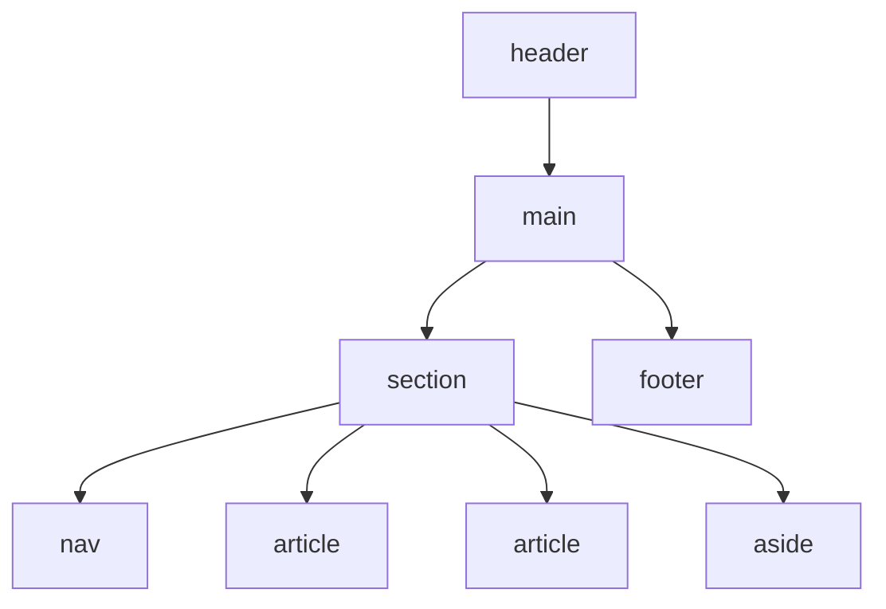

# L13 – HTML5 structural elements

## Metadata

- **Lektion:** L13 – HTML5 structural elements (aka Semantic Elements)
- **Kursus:** Front-end udvikling (SW4FED-02)
- **Forelæser:** Poul Ejnar Rovsing / Jung Min Kim
- **Kilde:** L13/FED HTML5 structural elements.pdf (10 slides)
- **Emner dækket:**
  - Oversigt over semantiske elementer i HTML5
  - `<main>` og ARIA role
  - `<header>` og subtitles
  - `<footer>`
  - `<nav>`
  - `<aside>`
  - `<section>` og `<article>`
  - `<div>` som ikke-semantisk fallback

---

## 1. Semantic Elements i HTML5

| Tag | Beskrivelse |
| --- | --- |
| `<article>` | Definerer en artikel |
| `<aside>` | Definerer indhold ved siden af sidens indhold |
| `<details>` | Definerer yderligere detaljer, som brugeren kan vise eller skjule |
| `<figcaption>` | Definerer en billedtekst til et `<figure>`-element |
| `<figure>` | Billede, tegning, kodelistninger osv. |
| `<footer>` | Definerer en footer for et dokument eller en sektion |
| `<header>` | Angiver en header for et dokument eller en sektion |
| `<main>` | Angiver hovedindholdet i et dokument |
| `<mark>` | Definerer markeret/fremhævet tekst |
| `<nav>` | Definerer navigationslinks |
| `<section>` | Definerer en sektion i et dokument |
| `<summary>` | Definerer en overskrift til et `<details>`-element |
| `<time>` | Definerer en dato/tid |

## 2. main

- Nyt HTML 5.1-element.
- `main` er tænkt til at indeholde det centrale indhold på en webside — derfor kan der kun være ét `main`-tag pr. side.
- `main` kan ikke være child-element af `header`, `footer`, `article`, `aside` eller `nav`.
- Tagget bør have en ARIA role af `main` for langsigtet kompatibilitet med accessibility-enheder.

### Kodeeksempel

```html
...
</header>
<main role="main">
  <p>some text and other stuff.</p>
</main>
<footer>
...
```

## 3. header

- Indeholder overskrifterne for enten et websidedokument eller et område i dokumentet, såsom en section eller article.
- `<header>`-elementet bør bruges som container for introducerende indhold.

### Kodeeksempel

```html
<header>
    <h1>Lighthouse&nbsp;Island&nbsp;Bistro</h1>
    <h2>the best coffee on the coast</h2>
</header>
```

Hvis man vil tilføje en subtitle på sine HTML-sider, kan man bruge et snippet som dette, som anbefalet i specifikationen.

```html
<header>
   <h1>
       5 deprecated features of HTML5
       <span>Sometimes specifications are changed
       and you need to refactor your code</span>
   </h1>
   <p>In this article we'll discuss...</p>
</header>
```

## 4. footer

- Indeholder footer-indholdet på en webside eller i et specifikt område i dokumentet, såsom en section eller article.
- Et `<footer>`-element bør indeholde information om det element, det er indeholdt i.

### Kodeeksempel

```html
<footer>
      <p>Copyright &copy; 2015 Acme International Inc.</p>
</footer>
```

## 5. nav

- Indeholder en sektion af navigations-hyperlinks — altså en menu.
- Ændrer **ikke** styling. Man skal stadig bruge CSS til at style linkene som en menu.

### Kodeeksempel

```html
<nav>
<a href="/item1.html">Item 1</a> <br>
<a href="/item2.html">Item 2</a> <br>
<a href="/item3.html">Item 3</a> <br>
<a href="/item4.html">Item 4</a> <br>
</nav>
```

## 6. aside

Indeholder en del af siden, som er perifert relateret til indholdet omkring `aside`-elementet — såsom en sidebar, en note eller andet tangentielt indhold.

### Kodeeksempel

```html
<p>The February special sandwich …
February only.</p>

<aside>
   <p>Watch for the March Madness Wrap next month!</p>
</aside>
```

OBS: Kræver CSS3-styling (`float`-propertyen) for at opnå det ønskede layout.

## 7. section og article

**Section Element**

- Indeholder en "sektion" af et dokument, såsom et kapitel eller et emne.
- Har semantisk betydning — det indebærer, at indholdet er relateret på en eller anden måde.

**Article Element**

- Indeholder en selvstændig post, såsom et blogindlæg, en kommentar eller en artikel, der kunne stå alene.

En mulig sidestruktur med semantiske elementer ser sådan ud: øverst `header`, derefter `main`, som indeholder en `section` med `nav` til venstre, to `article`-elementer i midten og `aside` til højre, og nederst `footer`.



## 8. div

- Er et strukturelt element, som konfigurerer et strukturelt blokområde på en webside med tomt rum over og under, uden nogen semantisk betydning.
- Brug `div`, hvor ingen af de semantiske elementer er passende.

## 9. References & Links

- Semantics in HTML — https://developer.mozilla.org/en-US/docs/Glossary/Semantics
