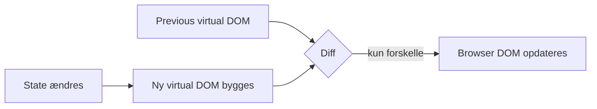

# L16 – React Overview

## Metadata

- **Lektion:** L16 – React Overview
- **Kursus:** Front-end udvikling (SW4FED-02)
- **Forelæser:** Poul Ejnar Rovsing / Jung Min Kim
- **Kilde:** L16/FED React Overview.pdf (35 slides)
- **Emner dækket:**
  - Hvad React er, og hvad det ikke er (library, ikke framework)
  - Komponentbaseret arkitektur og `UI = f(state)`
  - Virtual DOM og React's diffing/update-procedure
  - Single Page Applications (SPA)
  - Vite som build tool: scaffold, dev-server, production build
  - JSX vs. `React.createElement`
  - Functional components vs. class components
  - Props, one-way data flow og `props.children`
  - Fragments
  - State via `useState` og events i React
  - Stateful vs. stateless (container vs. presentational) components

---

## 1. Hvad er React?

React (også kaldet React.js) er et JavaScript-**library** til at bygge user interfaces. Det er skabt og vedligeholdt af Facebook.

React er kun et UI-library — ikke et fuldt framework som Angular. Men vælger man React sammen med Redux og React Router, ender man med noget, der i praksis minder om et framework på niveau med Angular.

## 2. Apps består af komponenter

Man bruger React til at bygge komponenter, som man kombinerer og indlejrer i hinanden for at bygge en fuld WebApp. En komponent kan indeholde andre komponenter, og på den måde bygges hele applikationens UI op som et træ.

## 3. Synkronisering af state og UI

Den centrale idé i React kan skrives som en formel:

```text
UI = f(state)
```

Når en værdi i en komponents state ændrer sig, re-renderer React user interface'et. Man beskriver altså ikke *hvordan* UI'et skal opdateres — man beskriver, hvordan UI'et skal se ud som funktion af den aktuelle state, og React sørger for resten.

## 4. React's diffing- og update-procedure

React holder en **previous virtual DOM** i hukommelsen. Når state ændrer sig, bygger React en **new virtual DOM** ud fra komponenternes returværdier. De to træer sammenlignes (diffing), og kun de faktiske forskelle bliver skrevet til browserens rigtige DOM.



## 5. Virtual DOM

React bygger og vedligeholder en virtual DOM af **react elements**. React opdaterer derefter DOM'en i browseren, når en del af den virtuelle DOM ændrer sig.

Der er altså to lag: react elements (React's egne, billige JavaScript-objekter) og html elements (de rigtige, dyre DOM-noder i browseren).

## 6. React-økosystemet

React-kernen er renderer-agnostisk. Oven på React sidder flere renderers og libraries:

- **React DOM** — web browsers på desktop og mobil
- **React Native** — iOS og Android
- **React VR** — VR-enheder
- **Andre libraries** — server (node.js)

Det betyder, at samme React-kerne kan drive vidt forskellige platforme.

## 7. Dine hovedopgaver som front-end udvikler

- Del din app op i komponenter.
- Beslut hvor state skal ligge (local, shared, global).
- Implementér `f` — altså hvordan state omsættes til html. Det er her React (og eventuelle 3.-parts libraries til state management) kommer ind.
- Kommunikér med serveren.
- Style app'en.
- Test app'en.

## 8. React components

En komponent modtager inputs kaldet **props** og returnerer React elements, som beskriver hvordan user interface'et skal se ud.

Komponenter lader dig splitte UI'et op i uafhængige, genbrugelige stykker, så du kan tænke på hvert stykke isoleret.

## 9. Separation of concerns (SRP)

Angular og React løser separation of concerns forskelligt:

- **Angular** separerer presentation (template-fil) og UI-logik (typescript-fil).
- **React** separerer i stedet concerns med løst koblede enheder kaldet "components", der indeholder *både* markup og logik. React ser det som kunstigt at adskille teknologier ved at lægge markup og logik i separate filer.

## 10. Hvad er en Single Page Application?

En Single Page Application (SPA) er en enkelt webside — ofte kaldet en web app — der kører i browseren og kun henter ét dokument fra serveren.

- Den behøver ikke page reloading undervejs.
- Brugeren kan skifte view uden et page reload fra serveren.
- En SPA bruger typisk JSON til at tale med et REST Web API. Andre formater som GraphQL og XML bruges også.

Gmail, Facebook, Trello og Google Maps er alle Single Page Applications, der giver en fremragende brugeroplevelse i browseren uden page reloading.

## 11. Hvad er Vite?

Vite (fransk for "hurtig", udtales "veet") er et build tool, der har som mål at give en hurtigere og lettere udvikleroplevelse for moderne webprojekter.

Vites hovedanvendelser er:

- At scaffolde en ny Web App
- At køre Web App'en lokalt under udvikling
- At bygge en optimeret produktionsversion (via Rollup)

Vite er opinionated og kommer med fornuftige defaults ud af boksen. Vite kan scaffolde mange slags Web Apps — React er blot én af mange muligheder.

### Kodeeksempel

Scaffold en vilkårlig app-type:

```bash
npm create vite@latest
```

Man kan bruge `degit` til at scaffolde en af community-templates. Fx en minimal React-app:

```bash
npx degit lzm0x219/template-vite-react myapp
```

Flere templates: https://github.com/vitejs/awesome-vite#templates

## 12. Kør app'en under udvikling

```bash
cd react-demo
npm install
npm run dev
```

## 13. Build til deployment

Når du er klar til at deploye til produktion:

```bash
npm run build
```

Det laver et optimeret build af din app i build-mappen.

For at teste production-buildet lokalt:

```bash
npm run preview
```

## 14. Rendering Elements

Et **element** beskriver, hvad du vil se på skærmen. Elements er de mindste byggeklodser i React-apps.

```jsx
const element = <h1>Hello, world</h1>;
```

I modsætning til DOM-elementer er React elements almindelige objekter — de er billige at oprette og opdatere.

React elements er **immutable**: når du først har oprettet et element, kan du ikke ændre dets children eller attributes. Men du kan kalde render-funktionen igen for at lave en ny version af elementet — React propagerer kun ændringerne i den virtuelle DOM videre til browserens DOM. Oftest laver man dog i stedet en stateful komponent til at håndtere ændringer i UI'et.

## 15. JSX

JavaScript XML (JSX) er en udvidelse af JavaScript-sproget. JSX ligner HTML i udseende og giver en måde at strukturere komponenters rendering på. JSX bruges i return-statementet i en komponents render-funktion.

Bemærk: browsere kan ikke forstå JSX direkte. Vi har brug for et build tool (Vite, som bruger Babel) til at konvertere JSX til JavaScript.

### Kodeeksempel — native JavaScript vs. JSX

Native JavaScript:

```javascript
// Display a "Like" <button>

const e = React.createElement;
// …
return e(
  'button',
  { onClick: () => this.setState({
    liked: true }) },
  'Like'
);
```

JSX:

```jsx
// Display a "Like" <button>

return (
  <button onClick={() => setLiked(true)}>
    {liked ? 'Liked!' : 'Like'}
  </button>
);
```

## 16. JSX i detaljer — form-eksemplet

Det ønskede HTML:

```html
<form>
  <label for="email">Email:</label>
  <input type="email" id="email" class="form-control" />
</form>
```

Sådan repræsenteres det med native JavaScript i React:

```javascript
React.createElement(
   "form",
   null,
   React.createElement(
     "label",
     { htmlFor: "email" },
     "Email:"
   ),
   React.createElement(
     "input",
     { type: "email", id: "email", className: "form-control" }
   )
);
```

Sådan repræsenteres det med JSX:

```jsx
<form>
  <label htmlFor="email">Email:</label>
  <input type="email" id="email" className="form-control" />
</form>
```

Bemærk navneskiftene: `for` bliver til `htmlFor`, og `class` bliver til `className`, fordi `for` og `class` er reserverede ord i JavaScript.

## 17. LikeButton med JSX

### Kodeeksempel

```jsx
import { useState } from 'react';
import './App.css';

function LikeButton() {
  const [liked, setLiked] = useState(false);

  return (
    <button onClick={() => setLiked(true)}>
      {liked ? 'You liked this.' : 'Like'}
    </button>
  );
}

export default function App() {
  return (
    <div className="App">
      <h1>My first React app</h1>
      <LikeButton />
    </div>
  );
}
```

## 18. To typer komponenter

**Functional Component — brug denne!**

```jsx
function Welcome(props) {
  return <h1>Hello, {props.name}</h1>;
}
```

**Class Component**

```jsx
class Welcome extends React.Component {
  render() {
    return <h1>Hello, {this.props.name}</h1>;
  }
}
```

Enhver JavaScript-funktion, der tager et enkelt objekt-argument ved navn "props" med data og returnerer et React element, er en gyldig React-komponent.

Med Hooks har functional components de samme features som class components — men der er stadig mindre forskelle mellem de to.

### Kodeeksempel — samme komponent i begge stilarter

Functional Component (brug denne):

```jsx
function ProfilePage(props) {
  const showMessage = () => {
    alert('Followed ' + props.user);
  };

  const handleClick = () => {
    setTimeout(showMessage, 3000);
  };

  return (
    <button onClick={handleClick}>Follow</button>
  );
}
```

Class Component:

```jsx
class ProfilePage extends React.Component {
  showMessage = () => {
    alert('Followed ' + this.props.user);
  };

  handleClick = () => {
    setTimeout(this.showMessage, 3000);
  };

  render() {
    return <button onClick={this.handleClick}>Follow</button>;
  }
}
```

Reference: https://overreacted.io/how-are-function-components-different-from-classes/

## 19. Rendering af en komponent

Return-funktionen (render-funktionen) skal være **pure**:

- Den må ikke modificere component state.
- Den må ikke interagere direkte med browseren.

## 20. Fragment

Fragments lader dig gruppere en liste af children uden at tilføje ekstra noder til DOM'en.

### Kodeeksempel

```jsx
return (
  <React.Fragment>
    <ChildA />
    <ChildB />
    <ChildC />
  </React.Fragment>
);
```

Den nye korte syntaks for fragments er et tomt tag:

```jsx
return (
  <>
    <ChildA />
    <ChildB />
    <ChildC />
  </>
);
```

Dette er især nyttigt, hvor ekstra DOM-noder ville være ugyldige — fx i en tabelrække:

```jsx
return (
  <>
    <td>Hello</td>
    <td>World</td>
  </>
);
```

## 21. User-defined components

React elements kan repræsentere enten DOM-tags eller user-defined components.

### Kodeeksempel

```jsx
function Welcome(props) {
  return <h1>Hello, {props.name}</h1>;
}

function App() {
  return (
    <>
      <Welcome name="Sara"/>
    </>
  )
}
```

Når React ser et element, der repræsenterer en user-defined component, sender den JSX-attributterne videre til komponenten som ét enkelt objekt. Dette objekt kalder vi **props**.

Start altid komponentnavne med **stort begyndelsesbogstav** — React behandler komponenter, der starter med lille bogstav, som DOM-tags.

## 22. Composing Components

Komponenter kan referere til andre komponenter i deres output. Det lader os bruge samme komponent-abstraktion på alle detaljeniveauer. Det anbefales at splitte komponenter op i mindre komponenter.

### Kodeeksempel — monolitisk version

```jsx
function MonolitComment(props) {
  return (
    <div className="Comment">
      <div className="UserInfo">
        
        <div className="UserInfo-name">
          {props.author.name}
        </div>
      </div>
      <div className="Comment-text">
        {props.text}
      </div>
      <div className="Comment-date">
        {formatDate(props.date)}
      </div>
    </div>
  );
}
```

### Kodeeksempel — opsplittet version

```jsx
function Avatar(props) {
  return (
    
  );
}

function UserInfo(props) {
  return (
    <div className="UserInfo">
      <Avatar user={props.user} />
      <div className="UserInfo-name">
        {props.user.name}
      </div>
    </div>
  );
}

function CompositComment(props) {
  return (
    <div className="Comment">
      <UserInfo user={props.author} />
      <div className="Comment-text">
        {props.text}
      </div>
      <div className="Comment-date">
        {formatDate(props.date)}
      </div>
    </div>
  );
}
```

## 23. Component Children

```jsx
<Counts>
  <TweetsCount />
  <FollowingCount />
  <FollowersCount />
  <LikesCount />
</Counts>
```

De indre komponenter (`TweetsCount`, `FollowingCount` osv.) kaldes **children** af den ydre komponent `Counts`.

Inde i definitionen af `Counts` kan vi tilgå listen af children via den specielle `props.children`-property.

## 24. Components og Props

Props er **read-only** indefra komponenten:

- En komponent må aldrig modificere sine egne props.
- One-way data binding flow — data flyder én vej, fra parent til child.

### Kodeeksempel

```jsx
export default function App() {
  const comment = {
    date: new Date(),
    text: 'I hope you enjoy learning React!',
    author: {
      name: 'Hello Puppy',
      avatarUrl: 'https://placedog.net/133',
    },
  };

  return (
    <div className="App">
      <Comment
        date={comment.date}
        text={comment.text}
        author={comment.author}
      />
    </div>
  );
}
```

```jsx
function CompositComment(props) {
  return (
    <div className="Comment">
      <UserInfo user={props.author} />
      <div className="Comment-text">
        {props.text}
      </div>
      <div className="Comment-date">
        {formatDate(props.date)}
      </div>
    </div>
  );
}
```

## 25. State

State lader React-komponenter ændre deres output over tid som svar på brugerhandlinger, netværkssvar osv.

State er **privat** og fuldt kontrolleret af komponenten — men kan sendes videre til child-komponenter som props.

En functional components state sættes med `useState`-hooket.

### Kodeeksempel

```jsx
function Hello(props) {
  const [date, setDate] = useState(new Date());

  function handleClick() {
    setDate(new Date());
  }
  // ...
}
```

Tommelfingerregel fra slidesene: "states change, props don't and don't declare a state if it's never gonna change".

## 26. Events

At håndtere events med React elements ligner meget at håndtere events på DOM-elementer, men der er nogle syntaktiske forskelle:

- React-events navngives med **camelCase** i stedet for lowercase.
- Med JSX sender du en **funktion** som event handler, ikke en string.

HTML:

```html
<button onclick="activateLasers()">
Activate Lasers
</button>
```

JSX:

```jsx
<button onClick={activateLasers}>
Activate Lasers
</button>
```

## 27. Stateful vs. Stateless components

Dan Abramovs klassiske skelnen:

- **Stateful components** (aka container components) — er optaget af *hvordan ting virker*.
- **Stateless components** (aka presentational components) — er optaget af *hvordan ting ser ud*.

Reference: https://medium.com/@dan_abramov/smart-and-dumb-components-7ca2f9a7c7d0

## 28. References & Links

- "React Hooks in Action" af John Larsen
- "React in Action" af Mark Tielens Thomas
- https://react.dev/
- Writing Markup with JSX
- JavaScript in JSX with Curly Braces – React
- Importing and Exporting Components – React
- Vite: https://vite.dev/
- React+TypeScript Cheatsheets:
  - https://github.com/typescript-cheatsheets/react-typescript-cheatsheet#reacttypescript-cheatsheets
  - https://dev.to/diemax/react-typescript-the-good-parts-428f
- JSX In Depth: https://reactjs.org/docs/jsx-in-depth.html
