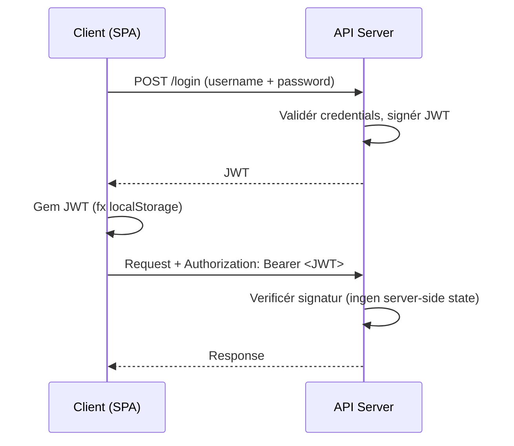

# L19 – Fetch (client side of Web API)

## Metadata

- **Lektion:** L19 – Fetch
- **Kursus:** Front-end udvikling (SW4FED-02)
- **Forelæser:** Poul Ejnar Rovsing / Jung Min Kim
- **Kilde:** L19/FED Fetch.pdf (18 slides)
- **Emner dækket:**
  - Hvad `fetch` er, og hvorfor SPA'er har brug for det
  - Oversigt over networking-libraries i JavaScript
  - GET med `await` og med `.then()`
  - Fejlhåndtering (`response.ok`, try/catch, `.catch()`)
  - POST med `await` og med `.then()`, samt alle fetch-options
  - Parallelle fetch-kald med `Promise.all`
  - Authentication: API keys, cookies, JWT-tokens
  - Login-flow og lagring af JWT i localStorage
  - `fetchWithAuth`-wrapper med Authorization-header

---

## 1. Hvad er fetch?

Alle moderne browsere har en global `fetch`-metode til at igangsætte asynkrone resource requests (AJAX-kald). Man bruger `fetch` til at kalde et Web-api fra JavaScript.

Flowet er det klassiske: klienten sender en HTTP-Request, serveren svarer med en HTTP-Response.

## 2. Hvorfor?

Når man bygger en Single Page Application, har man ofte behov for at kommunikere med en eller flere Web-api-servere. Alt data hentes efter den første sideindlæsning via netværkskald frem for via page reloads.

## 3. Networking i JavaScript — oversigt

Slidesene viser en sammenligningstabel over de forskellige libraries og API'er:

| library / API | All Browsers | Node | Concise Syntax | Promises (built-in) | Native | Single Purpose | Formal Specification |
|---|---|---|---|---|---|---|---|
| XMLHttpRequest | ✓ | | | | ✓ | ✓ | ✓ |
| `fetch()` | | | ✓ | ✓ | ✓ | ✓ | ✓ |
| Node HTTP | | ✓ | | | ✓ | ✓ | ✓ |
| Fetch polyfill | ✓ | | ✓ | ✓ | | ✓ | ✓ |
| node-fetch | | ✓ | ✓ | ✓ | | ✓ | ✓ |
| isomorphic-fetch | ✓ | ✓ | ✓ | ✓ | | ✓ | ✓ |
| superagent | ✓ | ✓ | ✓ | | | ✓ | |
| axios | ✓ | ✓ | ✓ | ✓ | | ✓ | |
| jQuery | ✓ | | ✓ | | | | |

Axios lægger til download-bundlet, men kan være en anelse lettere at arbejde med.

## 4. GET — eksempel med await

- Default web method for `fetch` er **GET**.
- Modtager du json-data, skal du huske at kalde `response.json()`.
- Kalderen skal bruge `await` eller `.then(products => { …})`.

### Kodeeksempel

```javascript
async function getProducts() {
    let products = await get('/api/products');
    // Update local model / UI with the new data
}

// Obs: no error handling!
async function get(url) {
    let response = await fetch(url);
    return await response.json()
}
```

## 5. Handling errors

Læg fetch-kaldet i en try-blok. Bemærk at `fetch` **ikke** kaster ved HTTP-fejlstatuskoder — man skal selv tjekke `response.ok`.

### Kodeeksempel

```javascript
// With error handling
async function getUserAsync(name) {
    try {
        let response = await fetch(`https://api.github.com/users/${name}`);
        if (response.ok) {
            return await response.json();
        } else {
            throw new error ({
                 status: response.status,
                 statusText: response.statusText
            })
        }
    } catch (err) {
         console.error(err);
         // Handle errors here
    }
}
```

## 6. GET — eksempel med .then og fejlhåndtering

### Kodeeksempel

```javascript
fetch('./api/some.json')
  .then(response => {
      if (!response.ok) {
        throw new Error('Network error. Status Code: ' + response.status);
      }
      return response.json()
  })
  .catch(err => {
    console.log('Fetch Error :-S', err);
  });
```

## 7. POST med brug af await

### Kodeeksempel

```javascript
function postProduct(e) {
    // Read data from form or ?
    let product = {};
    product.name = document.forms[0].Name.value;
    let productFromServer = await post('/api/products', product);
    console.log(JSON.stringify(productFromServer));
    // Maybe you should return productFromServer
}

// Obs: no error handling!
async function post(url, data) {
    let response = await fetch(url, {
        method: 'POST',
        body: JSON.stringify(data),
        headers: {
            'Content-Type': 'application/json'
        }
    });
    return await response.json();
}
```

<!-- Bemærk: `postProduct` er i kilden erklæret uden `async`, selvom den bruger `await`. Gengivet som i slidesene. -->

## 8. POST — How to (alle options)

Dette eksempel viser hele paletten af fetch-options. Defaults er markeret med `*`.

### Kodeeksempel

```javascript
postData('http://example.com/answer', {answer: 42})
  .then(data => console.log(data)) // JSON from `response.json()` call
  .catch(error => console.error(error))

function postData(url, data) {
  // Default options are marked with *
  return fetch(url, {
    body: JSON.stringify(data), // must match 'Content-Type' header
    cache: 'no-cache', // *default, no-cache, reload, force-cache, only-if-cached
    credentials: 'same-origin', // include, same-origin, *omit
    headers: { 'user-agent': 'Mozilla/4.0 MDN Example', 'content-type': 'application/json' },
    method: 'POST', // *GET, POST, PUT, DELETE, etc.
    mode: 'cors', // no-cors, cors, *same-origin
    redirect: 'follow', // *manual, follow, error
    referrer: 'no-referrer', // *client, no-referrer
  })
  .then(response => response.json()) // parses response to JSON
}
```

## 9. POST med brug af .then

### Kodeeksempel

```javascript
var url = 'https://example.com/profile';
var data = {username: 'example'};

fetch(url, {
  method: 'POST', // or 'PUT'
  body: JSON.stringify(data),
  headers: { 'Content-Type': 'application/json'}
}).then(res => res.json())
.catch(error => console.error('Error:', error))
.then(response => console.log('Success:', response));
```

## 10. Et typisk studenterspørgsmål

Slide 11 er et screenshot af en e-mail fra en studerende til Poul. Den studerende beskriver et problem med at bruge den angivne formel med JWT-token i headeren til opgave 2 i FED: requesten giver 200 og 204 som response, men variablen `response` bliver `undefined`. Login virkede fint, men Get/post-requests og datatræk fra databasen driller.

Pointen bag eksemplet: en 204-response har **ingen body**, så et kald til `response.json()` kan ikke give data. Man skal tjekke statuskoden, før man forsøger at parse body'en.

<!-- Selve billederne, den studerende refererer til ("billede 1"), er ikke gengivet i råteksten. -->

## 11. Multiple fetch calls

Sekventielle `await`-kald akkumulerer ventetiden. Parallelisér med `Promise.all`.

### Kodeeksempel — don't do this

```typescript
export async function loader({ params }: Route.LoaderArgs) {
  const product = await fetchProduct(params.productId!); // 400ms
  const reviews = await fetchProductReviews(params.productId!); // 300ms
  const variations = await fetchProductVariations(params.productId!); // 200ms
  return { product, reviews, variations }; // total: ~900ms
}
```

### Kodeeksempel — do this (parallelized with Promise.all)

```typescript
export async function loader({ params }: Route.LoaderArgs) {
  const id = params.productId!;
  const [product, reviews, variations] = await Promise.all([
    fetchProduct(id), // 400ms
    fetchProductReviews(id), // 300ms
    fetchProductVariations(id), // 200ms
  ]);
  return { product, reviews, variations }; // total: ~400ms
}
```

Den samlede tid går fra summen (~900 ms) til den langsomste enkeltdel (~400 ms).

## 12. Authentication

**API keys**

- Den service, der driver web-API'et, giver sine brugere et ClientID, som kan bruges til at tilgå API'et.

**Cookies**

- Serveren vedligeholder state.
- Sendes automatisk med hver request af browseren.

**Security Tokens — ofte JWT**

- Signed claims. Et claim er et udsagn, som en requestor fremsætter (fx name, ID, privilege). Et JWT er en samling af claims.
- Server-genereret signatur:

```text
HMACSHA256( secret, base64UrlEncode(header) + "." + base64UrlEncode(payload))
```

- Web-app'en skal **manuelt** gemme et modtaget jwt-token og manuelt tilføje det til headeren på hver request til serveren.

## 13. Authentication flow

Slide 15 viser flowet som et diagram. Pointen fremhævet på sliden er, at **ingen data gemmes af serveren** — al session-state bæres af tokenet hos klienten.



## 14. Client — Login

For at sign-in skal du sende en POST-request til api-endpointet for login med et username og password. Går alt vel, får du JWT'et tilbage, og du kan gemme det et sted — som regel i local storage.

### Kodeeksempel

```javascript
let response = await fetch(url, {
    method: "POST",
    body: JSON.stringify(this.form), // Assumes data is in an object called form
    headers: new Headers({
        "Content-Type": "application/json"
    })
});

if (response.ok) {
    let token = await response.json();
    localStorage.setItem("token", token.jwt);
    // Change view to some other component
    // …
}
```

## 15. Tilføj Authorization-headeren til en request

### Kodeeksempel

```javascript
export async function fetchWithAuth(url, options = {}) {
    const token = localStorage.getItem('token');
    const headers = {
        ...options.headers,
        'Authorization': 'Bearer ' + token,
        'Content-Type': 'application/json',
    };

    return fetch(url, { ...options, headers });
}
```

Wrapperen spreder de eksisterende options og headers ud, så kaldere stadig kan sætte `method`, `body` osv., mens Authorization-headeren automatisk kommer med.

## 16. References & Links

- Fetch API: https://developer.mozilla.org/en-US/docs/Web/API/Fetch_API
- Using Fetch:
  - https://css-tricks.com/using-fetch/
  - https://developers.google.com/web/updates/2015/03/introduction-to-fetch
  - https://developer.mozilla.org/en-US/docs/Web/API/Fetch_API/Using_Fetch
- Fetch standard (status: Living Standard): https://fetch.spec.whatwg.org/
- Replace axios with a simple custom fetch wrapper: https://kentcdodds.com/blog/replace-axios-with-a-simple-custom-fetch-wrapper
- Axios: https://github.com/axios/axios
- XMLHttpRequest: https://developer.mozilla.org/en-US/docs/Web/API/XMLHttpRequest/Using_XMLHttpRequest
