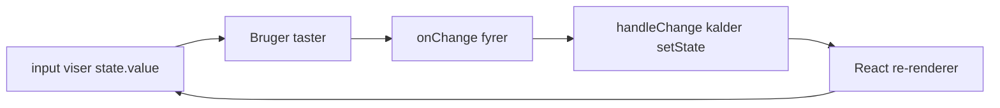

# L22 – React Forms (med underviserens kommentarer)

## Metadata

- **Lektion:** L22 – React Forms, kommenteret variant
- **Kursus:** Front-end udvikling (SW4FED-02)
- **Forelæser:** Poul Ejnar Rovsing / Jung Min Kim
- **Kilde:** L22/(Comments) FED React Forms.pdf (18 slides)
- **Emner dækket:**
  - Samme slides som L22.1, men med underviserens håndskrevne annotationer
  - Trin-for-trin gennemgang af data-flowet i en controlled form
  - Hvorfor `preventDefault()` er nødvendig
  - Hvornår controlled vs. uncontrolled er det rigtige valg
  - Detaljeret forklaring af regexp'erne i filtered/masked input
  - Detaljeret gennemgang af spread + computed property i multiple inputs
  - Hvornår React Hook Form er bedre end håndrullede forms

> **Bemærk:** Dette er den kommenterede variant af `SW4FED-02_L22.1_React_Forms.md`. Slidesenes hovedtekst er den samme; det værdifulde her er underviserens tilføjede kommentarer, som er markeret nedenfor med **Kommentar:**.

---

## 1. Forms i React

Der findes **ikke** et særligt sæt API'er til forms.

- Men det er på vej i version 19.
- Og `react-router-dom` har en `Form`-control, man kan bruge nu.

At arbejde med forms i React er blot mere af det, vi har set indtil nu i React: **komponenter**. Man bruger komponenter, state, props og events til at lave forms.

MEN HTML form-elementer fungerer en smule anderledes end andre DOM-elementer i React, fordi form-elementer naturligt holder noget intern state.

De to måder at håndtere dette:

- **Controlled forms**
- **Uncontrolled forms**

## 2. Controlled Components / forms

I HTML holder form-elementer som `<input>`, `<textarea>` og `<select>` typisk deres egen state og opdaterer den baseret på brugerinput.

I React holdes mutable state typisk i komponenternes state-property og opdateres kun med `useState` eller `useReducer`.

Vi kan kombinere de to ved at lade React-state være **"single source of truth"**. Så kontrollerer den React-komponent, der renderer en form, også hvad der sker i den form ved efterfølgende brugerinput.

Et input form-element, hvis værdi styres af React på denne måde, kaldes en **"controlled component"**.

## 3. Controlled form — med kommentarer

### Kodeeksempel

```jsx
import { useState } from "react";

export function ControlledForm() {
  const initialState = { value: '' };
  const [state, setState] = useState(initialState);

  function handleChange(event) {
    setState({ value: event.target.value });
  }

  function handleSubmit(event) {
    alert('A name was submitted: ' + state.value);
    event.preventDefault();
  }

  return (
    <form onSubmit={handleSubmit}>
      <label>
        Name:
        <input type="text" value={state.value} onChange={handleChange} />
      </label>
      <input type="submit" value="Submit" />
    </form>
  );
}
```

**Kommentar (state):** State holder de aktuelle værdier.

**Kommentar (event-parameteren):** `event` er et **SyntheticEvent** (React event object) — en wrapper omkring browserens native event. Den kan kun ændres gennem state.

**Kommentar (`event.target.value`):** Det er den nye værdi, der er tastet ind.

**Kommentar (`setState`):** State-variabler trigger en re-render.

**Kommentar (`preventDefault()`):** Forhindrer, at hele siden re-renderes. Den forhindrer browserens default action for eventet.

**Kommentar (`value={state.value}` + `onChange`):** Dette gør inputtet til en controlled form — dvs. React kontrollerer input-formen, ikke browseren. Inputtets værdi er altid lig med din React-state.

**Kommentar — data-flowet trin for trin:**

1. Inputtet viser, hvad end der står i `state.value`
2. Brugeren skriver i formen, `onChange`-eventet fyrer i browseren
3. `handleChange` event handler kører
4. State får React til at re-rendere
5. Inputtets value er opdateret



**Kommentar (hvornår er controlled godt?):** Godt til real time validation — fx validering af input-regler som "skal have minimum 6 cifre med stort bogstav" osv.

## 4. Uncontrolled form — med kommentarer

### Kodeeksempel

```jsx
import { useRef } from "react";

export function UncontrolledForm() {
  const inputRef = useRef();

  function handleSubmit(event) {
    alert('A name was submitted: ' + inputRef.current.value);
    event.preventDefault();
  }

  return (
    <form onSubmit={handleSubmit}>
      <label>
        Name:
        <input type="text" ref={inputRef} />
      </label>
      <input type="submit" value="Submit" />
    </form>
  );
}
```

**Kommentar (ref):** Brug en `ref` til at hente form-værdier fra DOM'en.

**Kommentar (`inputRef.current.value`):** Der tilgås DOM-elementet for input-feltet direkte.

**Kommentar (`ref={inputRef}`):** Det er en uncontrolled form, fordi den ikke er forbundet til React-state — DOM-elementet lægges direkte ind i `inputRef`.

**Kommentar (hvornår er uncontrolled godt?):** Godt ved stor skala, hvor performance er vigtig — man bliver ikke bremset af re-rendering ved hver lille ændring, fx ved hvert eneste tastetryk.

## 5. Events

Almindelige event handlers:

**onChange**

- Fyres når et input-element ændrer sig.
- Du kan tilgå den nye værdi af form-elementet med `event.target.value`.

**onClick**

- Fyres når et element bliver klikket.

**onSubmit**

- Fyres fra en submit-knap.
- Håndterer du submit-kaldet manuelt, skal du huske `event.preventDefault();`

## 6. Properties og metoder på et synthetic event i React

| Property | Return type |
|---|---|
| `bubbles` | boolean |
| `cancelable` | boolean |
| `currentTarget` | DOMEventTarget |
| `defaultPrevented` | boolean |
| `eventPhase` | number |
| `isTrusted` | boolean |
| `nativeEvent` | DOMEvent |
| `preventDefault()` | |
| `isDefaultPrevented()` | boolean |
| `stopPropagation()` | |
| `isPropagationStopped()` | boolean |
| `target` | DOMEventTarget |
| `timeStamp` | number |
| `type` | string |

## 7. Filtered input — med kommentarer

Hvis du ikke opdaterer state-værdien, når data er indtastet, opdateres input-feltet ikke. Det kan du bruge til kun at tillade visse inputs — altså til at filtrere inputtet.

### Kodeeksempel

```jsx
export function HexColor() {
  const [color, setColor] = useState("BADA55");
  const onChange = (evt) =>
    setColor(evt.target.value.replace(/[^0-9a-f]/gi, "").toUpperCase());

  return (
    <form style={{ display: "flex" }}>
      <label>
        Hex color:
        <input value={color} onChange={onChange} style={inputStyle}/>
      </label>
      <span style={outputStyle} />
    </form>
  );
}
```

**Kommentar (overordnet):** Der filtreres input i real time.

**Kommentar (`evt.target.value`):** Det er brugerens input.

**Kommentar (`.replace(/[^0-9a-f]/gi, "").toUpperCase()`):** Tillader kun 0–9 og A–F og gør stort — altså kun gyldige hex color-tegn tillades.

**Kommentar (`value={color}`):** Dette er state'en.

**Kommentar (`onChange={onChange}`):** Opdaterer inputtet.

**Kommentar (formtype):** Det er en Controlled Input — inputtet styres af React-state.

## 8. Masked input — med kommentarer

Eksempel: ticket numbers er defineret som tre alfanumeriske tegn, efterfulgt af en bindestreg, efterfulgt af tre alfanumeriske tegn — fx `R1S-T2U`.

Vi vil:

- vise tegnene i uppercase, uanset om brugeren indtaster dem sådan
- tilføje en bindestreg efter de første tre tegn
- begrænse inputtet til kun 7 tegn i alt

### Kodeeksempel

```jsx
export function TicketNumber() {
  const [ticketNumber, setTicketNumber] = useState("");

  const onChange = (evt) => {
    const [first = "", second = ""] = evt.target.value
      .replace(/[^0-9a-z]/gi, "")
      .slice(0, 6)
      .match(/.{0,3}/g);
    const value = first.length === 3 ? `${first}-${second}` : first;
    setTicketNumber(value.toUpperCase());
  };

  const isValid = ticketNumber.length === 7;

  return (
    <form style={{ display: "flex" }}>
      <label>
        Ticket number:
        <input
          value={ticketNumber}
          onChange={onChange}
          placeholder="E.g. R1S-T2U"
        />
      </label>
      <span>{isValid ? "✓" : "✗"}</span>
    </form>
  );
}
```

**Kommentar (`.replace(/[^0-9a-z]/gi, "")`):** Fjern ugyldige tegn — alt der ikke er 0–9 eller A–Z.

**Kommentar (`.slice(0, 6)`):** Slice 0 til 6 — beholder kun de første 7 tegn.

<!-- Underviserens kommentar siger "de første 7 tegn", men `.slice(0, 6)` beholder de første 6. Gengivet som skrevet i kilden. -->

**Kommentar (`.match(/.{0,3}/g)`):** Matcher mellem 0 og 3 tegn. Splitter værdien op i to grupper af op til 3 tegn. Se https://www.w3schools.com/jsref/jsref_regexp_g.asp

**Kommentar (`first.length === 3 ? ...`):** Resultatet er fx `["AAA", "111", ""]` → altså `AAA-111`.

## 9. Handling Multiple Inputs

Når du skal håndtere flere controlled input-elementer, kan du tilføje en `name`-attribut til hvert element og lade handler-funktionen vælge, hvad den skal gøre, baseret på værdien af `event.target.name`.

## 10. Multiple Inputs demo — med kommentarer

### Kodeeksempel

```jsx
const initialState = {
  isGoing: true,
  numberOfGuests: 2
};

const [state, setState] = useState(initialState);

function handleInputChange(event) {
  const target = event.target;
  const value = target.type === 'checkbox' ? target.checked : target.value;
  const name = target.name;

  setState(state => {
    return {
      ...state,
      [name]: value
    };
  });
}
```

```jsx
<form onSubmit={handleSubmit}>
  <label>
    Is going:
    <input
      name="isGoing"
      type="checkbox"
      checked={state.isGoing}
      onChange={handleInputChange} />
  </label>
  <br />
  <label>
    Number of guests:
    <input
      name="numberOfGuests"
      type="number"
      value={state.numberOfGuests}
      onChange={handleInputChange} />
  </label>
  <input type="submit" value="Submit" />
</form>
```

**Kommentar (`target.type === 'checkbox' ? target.checked : target.value`):** Håndtér forskellige input-typer.

**Kommentar (`setState(state => ...)`):** Forrige state, og opdatér det ændrede.

**Kommentar (`...state`):** Her spredes fx `isGoing: true` ud.

**Kommentar (`[name]: value`):** Her sættes fx `numberOfGuests: 7`.

**Kommentar (resultatet):** Det samlede returnerede objekt bliver:

```javascript
return {
  isGoing: true,
  numberOfGuests: "7"
};
```

Bemærk at værdien fra et `type="number"`-input kommer som en **string** (`"7"`), ikke som et tal.

## 11. Form validation

Spørgsmålene man skal stille sig:

- Hvad er datakravene for applikationen?
- Baseret på disse constraints, hvordan kan du hjælpe dine brugere til at levere meningsfulde data?
- Er der måder, hvorpå du kan eliminere inkonsistenser i de data, brugerne leverer?

For at tilføje validation og sanitization til din komponent skal du hooke ind i update-processen. Til det formål skriver du general-purpose validation- og sanitization-funktioner.

## 12. Basic validation — med kommentarer

Bemærk: dette eksempel er fra slidesene skrevet som en **class component** — kurset bruger ellers hooks.

### Kodeeksempel

```jsx
class CreatePost extends Component {
    constructor(props) {
        super(props);
        this.state = {
           content: '',
           valid: false,
        };
        this.handleSubmit = this.handleSubmit.bind(this);
        this.handlePostChange = this.handlePostChange.bind(this);
    }

    handlePostChange(event) {
        const content = event.target.value;
        this.setState(() => {
           return {
              content,
              valid: content.length <= 280
           };
        });
    }

    handleSubmit() {
        if (!this.state.valid) {
            return;
        }
        const newPost = {
            content: this.state.content,
        };
        console.log(newPost);
    }
}
```

**Kommentar (`valid: content.length <= 280`):** Dette er selve valideringen.

## 13. React Hook Form

- Performant, fleksible og udvidelige forms med letanvendelig validation.
- React Hook Form er et lillebitte library uden nogen dependencies.
- Det omfavner uncontrolled elements, men kan arbejde med controlled elements.
- React Hook Form har gjort det let at integrere med eksterne UI component libraries.

Installation:

```bash
npm install react-hook-form
```

## 14. React Hook Form demo — med kommentarer

### Kodeeksempel

```jsx
import { useForm } from 'react-hook-form';

export function ReactHookFormDemo() {
  const { register, handleSubmit } = useForm();
  const onSubmit = (data) => {
    alert(JSON.stringify(data));
  };

  return (
    <div className="react-hooks-form">
      <form onSubmit={handleSubmit(onSubmit)}>
        <div>
          <label htmlFor="firstName">First Name</label>
          <input placeholder="bill" {...register("firstName")} />
        </div>
        <div>
          <label htmlFor="isDeveloper">Is an developer?</label>
          <input
            type="checkbox"
            value="yes"
            {...register("isDeveloper")}
          />
        </div>
        <input type="submit" />
      </form>
    </div>
  );
}
```

**Kommentar (`useForm`):** Der bruges hooket `useForm`.

**Kommentar (`register`):** Der bruges `register` (i stedet for state) til (uncontrolled) input.

**Kommentar (`handleSubmit(onSubmit)`):** `handleSubmit` står for både submission og validation.

**Kommentar (`{...register("firstName")}`):** `firstName` lægges ind i register.

**Kommentar (`{...register("isDeveloper")}`):** `isDeveloper`-værdien lægges ind i register.

**Kommentar (fordelen):** Mindre kode plus validation.

**Kommentar (hvornår skal man bruge det?):** Til store/komplekse forms er React Hook Form bedre.

## 15. MUI (Material-UI)

React-komponenter, der implementerer Googles Material Design.

### Kodeeksempel

```jsx
import React from "react";
import ReactDOM from "react-dom";
import Button from "@mui/material/Button";

function App() {
    return (
        <Button variant="contained"
                color="primary">
            Hello World
        </Button>
    );
}
ReactDOM.render(<App />, document.querySelector("#app"));
```

Demo: https://codesandbox.io/s/4j7m47vlm4

## 16. Opsummering af kommentarernes hovedpointer

De kommentarer, underviseren har lagt oven på slidesene, koger ned til fire beslutningspunkter:

- **Controlled form** — React-state er single source of truth. Re-render ved hvert tastetryk. Vælg denne, når du vil have real time validation.
- **Uncontrolled form** — værdien læses direkte fra DOM'en via en `ref`. Ingen re-render pr. tastetryk. Vælg denne, når performance ved store forms er vigtig.
- **`preventDefault()`** — nødvendig, fordi browserens default submit ellers reloader hele siden.
- **React Hook Form** — kombinerer det uncontrolled-agtige performance-billede med indbygget validation og mindre kode. Vælg denne til store/komplekse forms.

## 17. References & Links

- "React Quickly, Second Edition" af Morten Barklund og Azat Mardan, Manning
- "React Hooks in Action" af John Larsen, Manning
- "React in Action" af Mark Tielens Thomas, Manning
- Forms documentation: https://reactjs.org/docs/forms.html
- Material UI:
  - https://mui.com/
  - Learn React & Material UI - #1 Intro: https://www.youtube.com/watch?v=xm4LX5fJKZ8
  - Learn React & Material UI - #8 Forms (Part 1): https://www.youtube.com/watch?v=L6HC1bqrLRQ
- React Hook Form: https://react-hook-form.com/get-started
- React-router-dom's form: https://reactrouter.com/en/main/components/form
