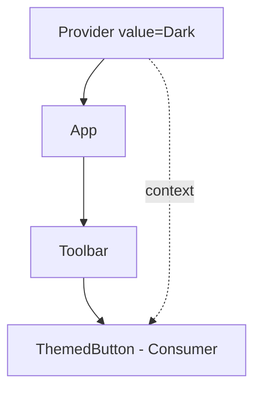

# L24 – React: Managing Application State

## Metadata

- **Lektion:** L24 – React Managing application state
- **Kursus:** Front-end udvikling (SW4FED-02)
- **Forelæser:** Poul Ejnar Rovsing / Jung Min Kim
- **Kilde:** L24/FED React managing application state.pdf (32 slides)
- **Emner dækket:**
  - Recap: deling af state via props, fra parent til child og tilbage
  - Default-værdier for props via destructuring
  - `useCallback` — bevar function identity på tværs af renders
  - `useMemo` — memoization af dyre beregninger
  - Racing responses ved data fetching i `useEffect` og cleanup-funktionen
  - Context API: `createContext`, `Provider`, `useContext`
  - Custom provider med indbygget hook
  - Multiple contexts vs. ét stort context-objekt og re-render-konsekvenser

---

## 1. Sharing state — recap

### Videregivelse af delt state til child-komponenter

Når forskellige komponenter bruger de samme data til at bygge deres UI, er den mest eksplicitte måde at dele disse data på at sende dem som en prop fra parent til children. Parent-komponenten holder state og sender den til child-komponenterne som en prop — en attribut i JSX'en.

### Kodeeksempel

```jsx
export default function Colors() {
  const availableColors = ["skyblue", "goldenrod", "teal", "coral"];
  const [color, setColor] = useState(availableColors[0]);

  return (
    <div className="colors">
      <ColorPicker colors={availableColors} color={color} setColor={setColor} />
      <ColorChoiceText color={color} />
      <ColorSample color={color} />
    </div>
  );
}
```

## 2. Modtagelse af props

Når React kalder komponenten, sender den som komponentens første argument et objekt, der indeholder alle de props, parent har sat. I TypeScript defineres en props-type, som destructures i signaturen.

### Kodeeksempel

```tsx
import './ColorChoiceText.css';

type ColorChoiceTextProps = {
  color: string;
};

export default function ColorChoiceText({ color }: ColorChoiceTextProps):
import("react/jsx-runtime").JSX.Element {
    return color ? (
      <p className="colorChoiceText">The selected color is {color}!</p>
    ) : (
      <p className="colorChoiceText">No color has been selected!</p>
    );
  }
```

## 3. Default-værdi for props

Object destructuring giver os mulighed for at tildele en default-værdi, hvis ingen er angivet af parent.

### Kodeeksempel

```tsx
import './ColorSample.css';

type ColorSampleProps = {
  color: string;
};

export default function ColorSample({ color = 'white' }: ColorSampleProps) {
    return color ? (
      <div className="colorSample" style={{ background: color }} />
    ) : null;
  }
```

## 4. Afsendelse af data fra child til parent

En child-komponent kan modtage en updater-funktion fra en parent som en prop og derefter bruge updater-funktionen til at ændre state på parenten.

### Kodeeksempel

```jsx
const availableColors = ["skyblue", "goldenrod", "teal", "coral"];
const [color, setColor] = useState(availableColors[0]);

return (
  <div className="colors">
    <ColorPicker colors={availableColors} color={color} setColor={setColor} />
```

```tsx
type ColorPickerProps = {
  colors?: string[];
  color: string;
  setColor: (color: string) => void;
};
export default function ColorPicker({ colors = [], color, setColor }:
ColorPickerProps) {
  return ( // Code missing
  onClick={() => setColor(c)}
```

<!-- Resten af ColorPicker-koden er ikke vist på sliden -->

## 5. useCallback — bevar function identity

### Afhængighed af funktioner, vi sender ind som props

Når `setBookable` er en updater-funktion returneret af `useState`, er den garanteret ikke at ændre værdi, og data-fetching-effekten kører derfor kun én gang.

```jsx
export default function BookablesList ({bookable, setBookable}) {
  const [bookables, setBookables] = useState([]);

  useEffect(() => {
    getData("http://localhost:4001/bookables")
      .then(bookables => {
         setBookable(bookables[0]);
         setBookables(bookables);
         setIsLoading(false);
      })
      .catch(error => {
         setError(error);
         setIsLoading(false);
      });
  }, [setBookable]);
```

### Afsendelse af en custom funktion som prop

Når vi sender en custom funktion til en child, giver vi den en *ny version* af funktionen, hver gang parent renderer. Det kan forårsage et infinite loop — og det gør det, hvis en effect afhænger af den.

```jsx
export default function BookablesView () {
  const [bookable, setBookable] = useState();
  function updateBookable(selected) {
    if (selected) {
      selected.lastShown = Date.now();
      setBookable(selected);
    }
  }

 return (
   <Fragment>
     <BookablesList bookable={bookable} setBookable={updateBookable}/>
```

### useCallback hook

Vi kan bevare function identity med `useCallback`-hooket. Vi sender funktionen til `useCallback`, og React returnerer den samme funktion fra hooket ved hver render — og redefinerer den kun, hvis en af funktionens dependencies ændrer sig.

```jsx
const updateBookable = useCallback(selected =>
{
    if (selected) {
      selected.lastShown = Date.now();
      setBookable(selected);
    }
  }, []);
```

Det tomme array er dependencies-listen.

## 6. Caching state med useMemo — managing performance

### Brug af dyre algoritmer

Kald kun dyre beregninger, hvis det er absolut nødvendigt. I eksemplet nedenfor køres de dyre algoritmer ved hver render — også selvom der ikke er nogen ændring i `sourceText`.

```jsx
export default function App() {
  const [sourceText, setSourceText] = useState("demo");
  const [useDistinct, setUseDistinct] = useState(false);
  const [showAnagrams, setShowAnagrams] = useState(false);

 const anagrams = getAnagrams(sourceText);
 const distinct = getDistinct(anagrams);

 return <UI>
```

### Undgå redundante funktionskald

Vi har brug for en måde at bede React om kun at køre de dyre funktioner, hvis deres output sandsynligvis vil være anderledes. Vi kan bruge `useMemo` til at fortælle React, at en funktion kun skal køres, hvis dens dependencies har ændret sig.

```jsx
export default function App() {
  const [sourceText, setSourceText] = useState("demo");
  const [useDistinct, setUseDistinct] = useState(false);
  const [showAnagrams, setShowAnagrams] = useState(false);

 const anagrams = useMemo(() => getAnagrams(sourceText), [sourceText]);
 const distinct = useMemo(() => getDistinct(anagrams), [anagrams]);

 return <UI>
```

## 7. Memoizing af dyre funktionskald med useMemo

```javascript
const memoizedValue = useMemo( () => expensiveFn(a, b), [a, b] );
```

Processen med at gemme et resultat for et givet sæt argumenter kaldes memoizing.

- Ved hvert kald sammenligner `useMemo` dependency-listen med den forrige liste
- Hvis hver liste indeholder de samme værdier i den samme rækkefølge, kan `useMemo` returnere den gemte værdi
- Hvis en værdi i listen har ændret sig, kalder `useMemo` funktionen og gemmer og returnerer funktionens returværdi

## 8. Bookings demo

Bookings-grid'ets rendering-adfærd for forskellige events:

| Event | Render with |
| --- | --- |
| Initial render | Blank grid |
| Data fetching | Loading indicator |
| Data loaded | Bookings in cells |
| Booking selected | Highlighted selection |

Vi vil ikke regenerere de underliggende grid-data ved hver re-render, så vi bruger `useMemo`-hooket og angiver `bookable` og startdatoen for ugen som dependencies. `getGrid` indeholder et dyrt fetch-kald.

```jsx
export default function BookingsGrid (
  {week, bookable, booking, setBooking}
) {
  const [bookings, setBookings] = useState(null);
  const [error, setError] = useState(false);

  const {grid, sessions, dates} = useMemo(

    () => bookable ? getGrid(bookable, week.start) : {},

    [bookable, week.start]
  );
```

## 9. Overforbrug ikke useMemo

Der er også noget overhead forbundet med at kræve, at React gemmer funktioner, returværdier og dependency-værdier, så vi vil ikke memoize alting. Men nogle gange kan dyre funktioner påvirke performance negativt, så det er godt at have `useMemo`-hooket i sit værktøjsbælte.

## 10. Racing responses ved data fetching i useEffect

Når man fetcher data inde i et kald til `useEffect`, kombineres en lokal variabel og cleanup-funktionen til at matche et data-request med dets response.

```jsx
useEffect(() => {
    let doUpdate = true;
      getBookings(bookable.id, week.start, week.end)
        .then(resp => {
          if (doUpdate) {
            setBookings(transformBookings(resp));
          }
        })
        .catch(setError);
      return () => doUpdate = false;
  }, [week, bookable, setBooking]);
```

Før en ny `useEffect` køres, kalder React cleanup-funktionen fra det forrige kald, og den sætter `doUpdate` til `false`. Et forsinket response fra et forældet request bliver dermed ignoreret.

## 11. Managing state med Context API — useContext

### Hvorfor har vi brug for Context?

- Context giver en måde at sende data gennem komponenttræet uden at skulle sende props manuelt ned på hvert niveau
- Context er designet til at dele data, der kan betragtes som "globale" for et træ af React-komponenter, såsom den aktuelt autentificerede bruger, tema eller foretrukket sprog
- Når React renderer en context Consumer, læser den den aktuelle context-værdi fra den nærmeste matchende Provider over den i træet

Modellen er en Provider, der leverer en `value`, og én eller flere Consumers, der læser den. Alternativet — prop drilling — kræver, at værdien sendes gennem hvert mellemliggende niveau i komponenttræet, selv i komponenter der ikke selv bruger den.



### Kodeeksempel — Context demo

```jsx
import ThemeContext from './context/ThemeContext';
import Toolbar from './components/Toolbar';

function App() {
  return (
    <ThemeContext.Provider value="Dark" >
      <div className="App" >
        <Toolbar />
      </div>
    </ThemeContext.Provider>
  );
}
```

```jsx
function Toolbar(props) {
  return (
    <div>
      <ThemedButton />
    </div>
  );
}
```

```jsx
// ThemeContext.js
import { createContext } from "react";
const ThemeContext = createContext('light');
export default ThemeContext;
```

```jsx
import { useContext } from "react";
import ThemeContext from "../context/ThemeContext";

export default function ThemedButton(props) {
  const theme = useContext(ThemeContext);
  return (
    <div className={theme}>
      <button className={theme} >Demo</button>
    </div>
  );
}
```

## 12. React.createContext

```javascript
const MyContext = CreateContext(defaultValue);
```

- Opretter et Context-objekt
- Når React renderer en komponent, der subscriber til dette Context-objekt, læser den den aktuelle context-værdi fra den nærmeste matchende Provider over den i træet
- `defaultValue`-argumentet bruges kun, når en komponent ikke har en matchende Provider over sig i træet. Denne default-værdi kan være nyttig, når man tester komponenter isoleret uden at wrappe dem

## 13. Context.Provider

```jsx
<ThemeContext.Provider value="dark" >
  <SomeComponent>
</ThemeContext.Provider>
```

- Hvert Context-objekt kommer med en Provider React-komponent, der tillader consuming components at subscribe til context-ændringer
- Provider-komponenten accepterer en `value`-prop, der sendes til consuming components, som er descendants af denne Provider
- Én Provider kan være forbundet til mange consumers
- Providers kan nestes for at override værdier dybere nede i træet

## 14. useContext

```javascript
const theme = useContext(ThemeContext);
```

- Accepterer et context-objekt (værdien returneret fra `React.createContext`) og returnerer den aktuelle context-værdi for den context
- Den aktuelle context-værdi bestemmes af `value`-proppen på den nærmeste `<ThemeContext.Provider>` over den kaldende komponent i træet

## 15. Current user som context

```jsx
import {useState} from "react";
import UserContext from "./Users/UserContext";

export default function App () {
  const [user, setUser] = useState();

 return (
   <UserContext.Provider value={user}>
     <Router>
     // Code missing
     <UserPicker user={user} setUser={setUser}/>
```

```jsx
import {useState, useContext} from "react";
import UserDetails from "./UserDetails";
import UserContext from "./UserContext"; // impo

export default function UsersPage () {
   const [user, setUser] = useState(null);
   // get the user from context
   const loggedInUser = useContext(UserContext);
```

```jsx
export default function UserPicker ({user, setUser}) {
  const [users, setUsers] = useState(null);

  function handleSelect (e) {
    const selectedID = parseInt(e.target.value, 10);
    const selectedUser = users.find(u => u.id === selectedID);

      setUser(selectedUser);
  }
```

## 16. Oprettelse af en custom provider

Contexten indeholder her både værdi og en update-funktion, og `useMemo` bruges for at undgå unødvendige opdateringer. Den eksporterede `useCount`-hook kaster en fejl, hvis den bruges uden for en `CountProvider`.

```jsx
// count-context.js
import * as React from 'react'

const CountContext = React.createContext()

function useCount() {
  const context = React.useContext(CountContext)
  if (!context) {
    throw new Error(`useCount must be used within a CountProvider`)
  }
  return context
}

function CountProvider(props) {
    const [count, setCount] = React.useState(0)
    const value = React.useMemo(() => [count, setCount], [count])
    return <CountContext.Provider value={value} {...props} />
}

export { CountProvider, useCount }
```

Fra: https://kentcdodds.com/blog/application-state-management-with-react

### Brug af count context

```jsx
import { CountProvider } from './context/count-context';
import { CountDisplay } from './components/CountDisplay';
import { Counter } from './components/Counter';
function App() {
  return (
    <CountProvider>
      <CountDisplay />
      <Counter />
    </CountProvider>
  );
}
```

```jsx
import { useCount } from '../context/count-context'

export function Counter() {
  const [count, setCount] = useCount()
  const increment = () => setCount(c => c + 1)
  return <button onClick={increment}>{count}</button>
}
```

```jsx
import { useCount } from '../context/count-context'

export function CountDisplay() {
  const [count] = useCount()
  return <div>The current counter count is {count}</div>
}
```

## 17. Multiple contexts

Man kan have mange properties i sit context-objekt. Men en ændring af én af propertyerne får alle komponenter, der bruger contexten, til at re-rendere.

```javascript
value = {
  theme: "lava",
  user: 1,
  language: "en",
  animal: "Red Panda"
};
```

### Opdeling af context-værdier på flere providers

Man kan bruge så mange contexts, man har brug for, og nestede komponenter kan kalde `useContext`-hooket på præcis de contexts, de forbruger.

```jsx
<ThemeContext.Provider value="lava">
  <UserContext.Provider value=1>
    <LanguageContext.Provider value="en">
      <AnimalContext.Provider value="Red Panda">
        <App/>
      </AnimalContext.Provider>
    </LanguageContext.Provider>
  </UserContext.Provider>
</ThemeContext.Provider>
```

## 18. Context — opsummering

**Pros:**

- En let teknik til at tilføje global state til en app

**Cons:**

- Anvend det sparsomt, da det gør component reuse sværere

## 19. References & Links

- "React Hooks in Action" af John Larsen
- Application State Management with React — https://kentcdodds.com/blog/application-state-management-with-react
- Passing Data Deeply with Context — https://react.dev/learn/passing-data-deeply-with-context
