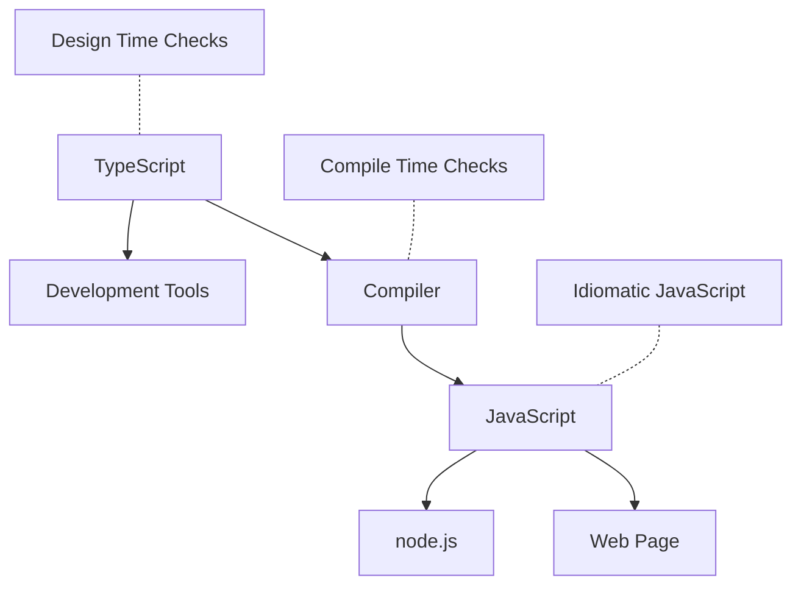
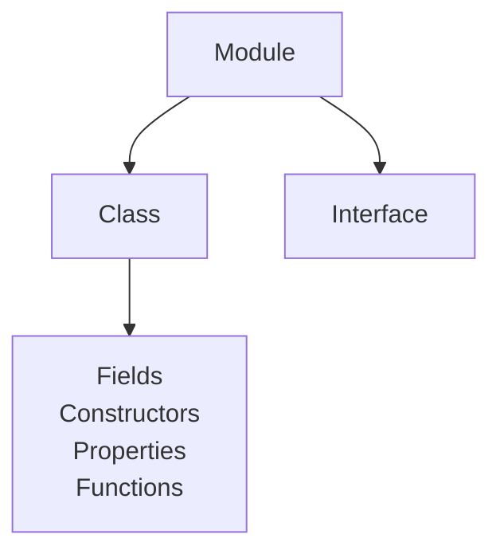

# L25 – TypeScript

## Metadata

- **Lektion:** L25 – TypeScript
- **Kursus:** Front-end udvikling (SW4FED-02)
- **Forelæser:** Poul Ejnar Rovsing / Jung Min Kim
- **Kilde:** L25/FED Typescript.pdf (25 slides)
- **Emner dækket:**
  - Motivationen: JavaScript i storskala-projekter, Atwood's Law
  - Hvad TypeScript er: et typed superset af JavaScript
  - TypeScript life cycle: design time, compile time, runtime
  - Installation og kompilering (`npm install -g typescript`, `tsc`)
  - Type system: structural typing, type inference, generics, declaration files
  - Classes, interfaces, modules og code hierarchy
  - Type annotations og transpileret JavaScript-output
  - Decorators
  - React + TypeScript: props-typer, `.tsx`, typer til hooks
  - Værktøjer: Typewriter, C# to TypeScript, DefinitelyTyped

---

## 1. Motivation

Titelsliden: **TypeScript is a language developed by Microsoft** (illustreret med en gammel skrivemaskine — et ordspil på "type").

Slidene 2-6 er en række illustrationer, der opstiller problemet:

- Et Picard-meme: **"WTF — one more language?"** — den forventede reaktion på endnu et sprog.
- **Enterprise Projects**: et enormt, uoverskueligt ArchiMate-diagram med hundredvis af sammenkoblede kasser (Business/Application/Technology-lag, business processes, application components, nodes, devices, networks) og et virvar af krydsende relationer. Pointen er visuel snarere end teknisk: enterprise-projekter er komplekse, og den kompleksitet skal koden kunne bære.
- **Atwood's Law:** *"Any application that can be written in JavaScript, will eventually be written in JavaScript."* (kilde: http://www.codinghorror.com/blog/2007/07/the-principle-of-least-power.html)
- **"JavaScript was originally developed for applications with a few hundred lines of code!"** — "Netscape", 1995.
- Et "Disaster Girl"-meme: **"I just let somebody else maintain my JavaScript"** — vedligeholdelsesproblemet med utypet JavaScript i stor skala.

Argumentkæden er altså: JavaScript blev designet til nogle hundrede linjer kode, men bruges i dag til alt — og det er derfor et sprog som TypeScript er nødvendigt.

Slide 9 opsummerer TypeScript symbolsk som en ligning af tre billeder: bogen **"JavaScript: The Good Parts"** + en kop mærket **`Cup<T>`** (generics) + et sæt **værktøjer** (hammer, skruetrækker, svensknøgle — tooling). Altså: JavaScripts gode dele plus et typesystem plus værktøjsunderstøttelse.

## 2. Hvad er TypeScript?

- **Et sprog til large scale JavaScript development**
- **Et typed superset af JavaScript, der kompilerer til plain JavaScript**

Med løfterne:

- **Any browser**
- **Any host**
- **Any OS**
- **Open Source**

URL: https://github.com/Microsoft/TypeScript

At det er et *superset* betyder, at al gyldig JavaScript også er gyldig TypeScript — man kan indføre typer gradvist i en eksisterende kodebase.

## 3. TypeScript life cycle

Slide 10 viser livscyklussen som et flowdiagram med tre trin i midten (blå kasser), tre noter i venstre side (gule) og tre mål i højre side:



Læsning af diagrammet:

- **TypeScript**-kilden får **Design Time Checks** — dvs. fejl fanges allerede i editoren — og driver samtidig **Development Tools** (autocomplete, refactoring, navigation).
- **Compiler**-trinnet udfører **Compile Time Checks**.
- Outputtet er **JavaScript**, og noten fremhæver, at det er **Idiomatic JavaScript** — altså læsbar, almindelig JS, ikke uigennemskuelig maskingenereret kode.
- Den producerede JavaScript kan køre både i en **Web Page** og i **node.js**.

De tre kontrol-noter markerer, hvor i processen typerne giver værdi: to gange før koden nogensinde kører, og aldrig i runtime — typerne findes ikke i outputtet.

## 4. Installation

Der er to hovedmåder at få TypeScript-værktøjerne:

- Via **npm**
- Via **Visual Studio's Web Workload**

For NPM-brugere:

```bash
npm install -g typescript
```

## 5. Kompilering

Kør TypeScript-compileren:

```bash
tsc fileName.ts
```

Du kan blive nødt til at opdatere `PATH`-miljøvariablen manuelt.

## 6. Type System

### Structural typing og type inference

I praksis er meget få type annotations nødvendige. TypeScript bruger **structural typing** — det er formen på typen, der afgør kompatibiliteten, ikke navnet — kombineret med **type inference**, der udleder typer fra kontekst.

### Generics

Øger typesystemets nøjagtighed og udtrykskraft.

### Virker med eksisterende JavaScript-biblioteker

**Declaration files** kan skrives og vedligeholdes separat — dvs. man kan lægge typer oven på et utypet bibliotek uden at ændre det.

### Types enable tooling

Typerne giver verifikation og assistance, **men ikke hårde garantier**. Det er en vigtig nuance: typerne fjernes ved kompilering, så de beskytter ikke mod noget i runtime.

## 7. Classes, Interfaces, Modules

### Scalable application structuring

Classes, interfaces og modules muliggør **klare kontrakter i koden**.

### Aligned with standards

Class- og lambda-syntaksen flugter med ECMAScript 6.

### Understøtter populære module systems

CommonJS- og AMD-moduler i ethvert ECMAScript 3/5-miljø, eller ES2015-moduler. Afhængigt af det module target, der specificeres under kompilering, genererer compileren passende kode til Node.js (CommonJS), require.js (AMD), UMD, SystemJS eller ECMAScript 2015 native modules (ES6).

## 8. Code Hierarchy

Slide 15 viser sprogets strukturelle hierarki som stablede kasser:

- Øverst (sort): **Module** — den yderste indpakning
- Midt (mørkeblå): **Class**, med **Interface** (turkis) placeret ved siden af på samme niveau
- Nederst (mørkeblå): klassens medlemmer — **Fields**, **Constructors**, **Properties**, **Functions**



Interface og Class er sideordnede — begge kan ligge i et modul — men kun Class har medlemmerne nedenunder. Det er samme opbygning, man kender fra C#, og det er formodentlig hele pointen med slidet: TypeScript strukturerer kode som et objektorienteret sprog, ikke som løse JavaScript-scripts.

## 9. Type annotations

Slide 16 sætter TypeScript-kilden og det kompilerede JavaScript op side om side.

**TypeScript:**

```typescript
function greeter(person: string) {
    return "Hello, " + person;
}

var user = "John Doe";

console.log(greeter(user));
```

**JavaScript (output):**

```javascript
function greeter(person) {
  return "Hello, " + person;
}
var user = "John Doe";
console.log(greeter(user));
```

Forskellen er præcis én ting: `: string` er væk. Annotationen findes kun på compile-tid.

## 10. Classes & Interfaces

Slide 17 viser samme før/efter-sammenligning for et større eksempel.

**TypeScript:**

```typescript
class Student {
    fullName: string;
    constructor(public firstName, public middleInitial, public lastName) {
        this.fullName = firstName + " " + middleInitial + " " + lastName;
    }
}

interface Person {
    firstName: string;
    lastName: string;
}

function greeter(person : Person) {
    return "Hello, " + person.firstName + " " + person.lastName;
}

var user = new Student("John", "M.", "Doe");
console.log(greeter(user));
```

**JavaScript (output):**

```javascript
var Student = (function () {
    function Student(firstName, middleInitial, lastName) {
        this.firstName = firstName;
        this.middleInitial = middleInitial;
        this.lastName = lastName;
        this.fullName = firstName + " " + middleInitial + " " + lastName;
    }
    return Student;
}());

function greeter(person) {
    return "Hello, " + person.firstName + " " + person.lastName;
}

var user = new Student("John", "M.", "Doe");
console.log(greeter(user));
```

To vigtige observationer:

1. `public firstName` i konstruktør-parameterlisten er en genvej — compileren genererer selv `this.firstName = firstName;`. Det kaldes parameter properties.
2. `interface Person` er **helt forsvundet** i outputtet. Interfaces er ren compile-time-information. Og bemærk at `Student` aldrig erklærer `implements Person` — den passer alligevel, fordi TypeScript bruger structural typing: `Student` *har* `firstName` og `lastName`, og det er nok.

## 11. Decorators

En **Decorator** er en speciel slags deklaration, der kan hæftes på en class declaration, method, accessor, property eller parameter.

Decorators bruger formen `@expression`, hvor `expression` skal evaluere til en funktion, som kaldes i runtime med information om den dekorerede deklaration.

De svarer til **attributes i C#**.

### Decorator-eksempel

Sådan deklareres en komponent i Angular:

```typescript
import { Component } from '@angular/core';

@Component({
  selector: 'app-root',
  templateUrl: './app.component.html',
  styleUrls: ['./app.component.css']
})
export class AppComponent {
  title = 'app';
}
```

---

## 12. React og TypeScript

Opsætning af et nyt projekt:

```bash
npx create-react-app my-ts-app --template typescript
```

Eller:

```bash
npm create vite@latest
```

Eksempel på en typet komponent:

```tsx
export interface Props {
  name: string;
  enthusiasmLevel?: number;
}

export default function Hello({ name, enthusiasmLevel = 1 }: Props) {
  if (enthusiasmLevel <= 0) {
    throw new Error('You could be a little more enthusiastic. :D');
  }
  return (
    <div className="hello">
      <div className="greeting">
        Hello {name + getExclamationMarks(enthusiasmLevel)}
      </div>
    </div>
  );
}

// helpers
function getExclamationMarks(numChars: number) {
  return Array(numChars + 1).join('!');
}
```

Callouts på slidet fremhæver to regler:

- **"You must provide types for your component's props"**
- **"Every file containing JSX must use the `.tsx` file extension. This is a TypeScript-specific extension that tells TypeScript that this file contains JSX."**

Bemærk `enthusiasmLevel?: number` — spørgsmålstegnet gør prop'en optional, og default-værdien sættes i destructureringen.

## 13. Typer til props

### Inline syntax

```tsx
export function MyButton({ title }: { title: string })
{
  return (
    <button>{title}</button>
  );
}
```

### Brug af interface (eller type)

```tsx
interface MyButtonProps {
  /** The text to display inside the button */
  title: string;
  /** Whether the button can be interacted with */
  disabled: boolean;
}

export function MyButton2({ title, disabled }: MyButtonProps) {
  return (
    <button disabled={disabled}>{title}</button>
  );
}
```

Fordelen ved interface-varianten er, at typen kan genbruges og dokumenteres — doc-kommentarerne over hver property vises i editorens tooltips.

## 14. Typer til Hooks — inferred

Typedefinitionerne fra `@types/react` inkluderer typer til de indbyggede Hooks. De er bygget til at tage højde for den kode, du skriver i din komponent, så du får **inferred types** meget af tiden. Ideelt behøver du ikke angive typerne.

`useState`-hooket genbruger den værdi, der sendes ind som initial state, til at bestemme, hvad typen af værdien skal være:

```typescript
// Infer the type as "boolean"
const [enabled, setEnabled] = useState(false);
```

## 15. Typer til Hooks — declared

Et almindeligt tilfælde, hvor du selv vil angive en type, er når du har en **union type**:

```typescript
type Status = "idle" | "loading" | "success" | "error";

const [status, setStatus] = useState<Status>("idle");
```

Et mere udbygget eksempel med en **discriminated union** til at modellere en netværksforespørgsels tilstand:

```typescript
type RequestState =
  | { status: 'idle' }
  | { status: 'loading' }
  | { status: 'success', data: any }
  | { status: 'error', error: Error };

const [requestState, setRequestState] = useState<RequestState>({ status: 'idle' });
```

Callouts på slidet: **"Try to avoid `any`!"** og **"Provide the type of the received data"** — dvs. `data: any` i eksemplet er netop det, man skal erstatte med den konkrete datatype.

Fidusen ved mønstret er, at typesystemet nu håndhæver, at `data` kun findes, når `status` er `'success'`, og `error` kun når status er `'error'`.

## 16. Værktøjer

### Typewriter

- NuGet-pakke til Visual Studio, der genererer TypeScript-filer fra C#-kodefiler ved hjælp af TypeScript Templates
- Dette lader dig oprette fuldt typede TypeScript-repræsentationer af server side API, som **automatisk opdateres**, når du ændrer din C#-kode
- https://visualstudiogallery.msdn.microsoft.com/e1d68248-f30e-4a5d-bf18-31399a0bcfa6

### C# to TypeScript — VS Code extension

- **"C# to TypeScript (Replace)"** — konverterer indholdet af det åbne dokument (eller den markerede del) og erstatter det
- **"C# to TypeScript (To Clipboard)"** (keybinding: `Alt + /`) — skriver konverteret kode til clipboard
- **"C# to TypeScript (Paste As)"** (keybinding: `Alt + .`, editor context menu) — konverterer indholdet af clipboard og indsætter det
- **"C# to TypeScript (To File)"** (explorer context menu) — konverterer den valgte fil til en ny fil

### DefinitelyTyped

- Repository'et for TypeScript type definitions af høj kvalitet
- http://definitelytyped.org/

## 17. Referencer og links

- React & TypeScript — https://react.dev/learn/typescript
- React & TypeScript - Course for Beginners — https://www.youtube.com/watch?v=FJDVKeh7RJI
- React Tutorial using TypeScript — https://handsonreact.com/docs/labs/react-tutorial-typescript
- React TypeScript Cheatsheets — https://react-typescript-cheatsheet.netlify.app/
- Anders Hejlsberg om TypeScript 2 — https://channel9.msdn.com/Blogs/Seth-Juarez/Anders-Hejlsberg-on-TypeScript-2 og https://www.version2.dk/artikel/anders-hejlsberg-typescript-compiler-giver-javascript-udviklere-mere-intelligente
- TypeScript tutorial — http://www.typescriptlang.org/docs/tutorial.html
