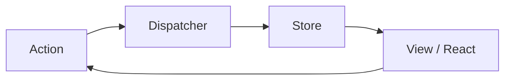

# L26 – React: Redux

## Metadata

- **Lektion:** L26 – React - Redux
- **Kursus:** Front-end udvikling (SW4FED-02)
- **Forelæser:** Poul Ejnar Rovsing / Jung Min Kim
- **Kilde:** L26/React - Redux.pdf (33 slides)
- **Emner dækket:**
  - Hvorfor og hvornår Redux — og hvornår Context rækker
  - Flux-mønsteret og unidirectional dataflow
  - De tre pakker: redux, react-redux, Redux Toolkit
  - Store, actions, action creators og reducers
  - Immutability: undgå mutations med spread, `concat`, `Object.assign`
  - Reducer-typer: lists, objects, primitives
  - Store-metoder: `getState`, `dispatch`, `subscribe`
  - Redux Toolkit: `configureStore`, `createSlice`, `Provider`
  - `useSelector` og `useDispatch`
  - Async: thunks, sagas, `createAsyncThunk` og RTK Query

---

## 1. Hvad er Redux?

Redux er et state management-bibliotek skabt af Dan Abramov. Det er et lille bibliotek (2 KB).

### Hvorfor Redux?

- Redux løser et problem, der måske ikke er klart i starten: det hjælper med at give hver React-komponent præcis det stykke state, den har brug for
- State er så gennemgribende og svært, at state management i JS kræver et dedikeret bibliotek
- Redux hjælper med at skrive applikationer, der: opfører sig konsistent, kører i forskellige miljøer (client, server og native), og er lette at teste
- Redux er framework agnostic — lær det én gang, brug det overalt (React, Vue JS, Angular osv.)

### Hvordan?

Redux holder state på ét enkelt sted.

## 2. Flux-mønsteret — unidirectional dataflow

Dan Abramov, forfatteren til Redux: *"Flux libraries are like glasses: you'll know when you need them."*

Sliden illustrerer flowet som en samtale mellem deltagerne:

- **React:** "Hey Action, someone clicked this 'Save Course' button."
- **Action:** "Thanks React! I registered an action creator with the dispatcher, so the dispatcher should take care of notifying all the stores that care."
- **Dispatcher:** "Let me see who cares about a course being saved. Ah! Looks like the Store has registered a callback with me, so I'll let her know."
- **Store:** "Hi dispatcher! Thanks for the update! I'll update my data with the payload you sent. Then I'll emit an event for the React components that care."
- **React:** "Ooo! Shiny new data from the store! I'll update the UI to reflect this!"



## 3. Hvornår skal man bruge Redux?

Man bør overveje at bruge Redux, når:

- Flere React-komponenter har brug for at tilgå den samme state, men ikke har noget parent/child-forhold
- Man begynder at føle det akavet at sende state ned til flere komponenter med props

Vær opmærksom på, at Redux ikke er nyttigt til mindre apps — men det skinner virkelig i større. Man bør overveje, om Context kan klare opgaven.

## 4. Du har brug for 3 pakker

- **React (Redux)** — en predictable state container for JavaScript-applikationer
- **React Redux** — det officielle React UI bindings layer for Redux. Det lader dine React-komponenter læse data fra en Redux store og dispatche actions til storen for at opdatere state
- **Redux Toolkit** — det officielle, opinionated, batteries-included toolset til effektiv Redux-udvikling. Det indbygger de anbefalede best practices, forenkler de fleste Redux-opgaver, forhindrer almindelige fejl og gør det lettere at skrive Redux-applikationer

## 5. Scaffold et nyt projekt med Redux

Hvis man fra starten ved, at man vil bruge redux med react, bruges templaten:

### Kodeeksempel

```bash
# Redux + Plain JS template
npx create-react-app my-app --template redux

# Redux + TypeScript template
npx create-react-app my-app --template redux-typescript

# Redux + Plain JS + Vite template
```

<!-- Kommandoen for Vite-templaten er ikke angivet på sliden -->

### Installér Redux i et eksisterende projekt

```bash
npm i react
npm i react-redux
npm i @reduxjs/toolkit
```

<!-- Sliden skriver "npm i react" under overskriften "Install redux" og gentager "Install react-redux" to gange — sandsynligvis en slidefejl -->

## 6. Mekanikken i Redux

- Hele den globale state i din app er gemt i et objekttræ inde i én enkelt store
- Den eneste måde at ændre state-træet på er at oprette en action — et objekt, der beskriver, hvad der skete — og dispatche den til storen
- For at specificere, hvordan state opdateres som respons på en action, skriver man pure reducer functions, der beregner en ny state baseret på den gamle state og actionen

## 7. Basic redux

### Opret en store med en reducer

```javascript
// Store.js
import { createStore } from 'redux'

function counterReducer(state = { value: 0 }, action) {
  switch (action.type) {
    case 'counter/incremented':
      return { value: state.value + 1 }
    case 'counter/decremented':
      return { value: state.value - 1 }
    default:
      return state
  }
}

// Create a Redux store holding the state of your app.
// Its API is { subscribe, dispatch, getState }.
export const store = createStore(counterReducer)
```

### Dispatch actions til storen

```jsx
//App.js
import { store} from './Store'
function App() {
  store.subscribe(() => console.log(store.getState()))

  store.dispatch({ type: 'counter/incremented' })
  store.dispatch({ type: 'counter/incremented' })
  store.dispatch({ type: 'counter/decremented' })

  return (
     <div className="App">
       <p>Basic redux demo</p>
       <p>Out is in the console.</p>
     </div>
  );
}
export default App;
```

## 8. Redux terminologi — actions

Den eneste måde at ændre state på er ved at sende en action til storen. Redux actions er JavaScript-objekter med en specifik struktur.

```javascript
// src/actions/index.js

export const addArticle = article => ({ type: "ADD_ARTICLE", payload: article });
```

Skriv type-strengen som `"domain/eventName"`. Da strenge er tilbøjelige til typos og dubletter, er det bedre at have action types deklareret som konstanter.

```javascript
// src/constants/action-types.js

export const ADD_ARTICLE = "ADD_ARTICLE";

// src/actions/index.js

import { ADD_ARTICLE } from "../constants/action-types";

export const addArticle = article => ({ type: ADD_ARTICLE, payload: article });
```

## 9. Action og Action creator

**Action** — er en besked, som vi skal sende videre til vores centraliserede store for at mutere state:

```javascript
const action = { type: 'CREATE_ITEM', payload: 'my new item' };
```

**Action creator** — er en funktion, der gør det lettere for os at oprette vores action-objekt:

```javascript
const createItem = (newName) => (
    { type: 'CREATE_ITEM', payload: { title: newName } });
```

Action creators er valgfrie — men Redux Toolkit opretter dem for dig.

## 10. Standard Actions

Et human-friendly standardformat for action-objekter. Det er en style guide: kun `type` er obligatorisk, alle andre properties bestemmer du selv.

En action **SKAL**:

- være et plain JavaScript-objekt
- have en `type`-property af typen string

En action **KAN**:

- have en `error`-property — sat til `true`, hvis actionen repræsenterer en fejl
- have en `payload`-property — vilkårlig værditype (data der skal ændre storen)
- have en `meta`-property — vilkårlig værditype (til ekstra information, der ikke hører til i payload)

En action **MÅ IKKE**:

- inkludere andre properties end `type`, `payload`, `error` og `meta`

```javascript
{
    type: 'ADD_TODO',
    payload: new Error(),
    error: true
}
```

## 11. Redux storen

Hele applikationens state lever inde i storen. Opret en ny fil ved navn `index.js` i `src/store` og initialisér storen:

```javascript
// src/store/index.js
import { createStore } from "redux";
import rootReducer from "../reducers/index";

const store = createStore(rootReducer);

export default store;
```

`createStore` er funktionen til at oprette Redux-storen. Den tager en reducer som første argument. Man kan (og bør) også sende en initial state til `createStore` — at sende en initial state er nyttigt ved server side rendering.

## 12. Redux reducers

I Redux producerer reducers state (eller muterer state). En reducer er blot en JavaScript-funktion, der tager to parametre — den aktuelle state og en action — og returnerer den nye state.

```javascript
// src/reducers/index.js

const initialState = {
   articles: []
};

const rootReducer = (state = initialState, action) => state;

export default rootReducer;
```

Dette er en dummy reducer, der ikke gør noget.

## 13. De vigtigste Redux-koncepter

- Applikationens state lever som et enkelt, immutable objekt inde i storen
- Når storen modtager en action, trigger den en reducer
- Reduceren returnerer den næste state
- Den eneste måde at ændre state på er ved at sende et action-objekt til storen — ved brug af `store.dispatch()`

## 14. En rigtig reducer — der bryder loven

`Array.prototype.push` er en impure funktion: den ændrer det oprindelige array.

```javascript
// src/reducers/index.js

import { ADD_ARTICLE } from "../constants/action-types";

const initialState = {
  articles: []
};
const rootReducer = (state = initialState, action) => {
   switch (action.type) {
     case ADD_ARTICLE:
       state.articles.push(action.payload);  // Mutates state!!!
       return state;
     default:
       return state;
   }
};

export default rootReducer;
```

### En rigtig reducer

At bruge `Array.prototype.concat` i stedet for `Array.prototype.push` er nok til at holde det oprindelige array immutable.

```javascript
// src/reducers/index.js

import { ADD_ARTICLE } from "../constants/action-types";

const initialState = {
   articles: []
};
const rootReducer = (state = initialState, action) => {
   switch (action.type) {
     case ADD_ARTICLE:
       return { ...state, articles: state.articles.concat(action.payload) };
     default:
       return state;
   }
};
export default rootReducer;
// Or use the spread operator
return { ...state, articles: [...state.articles, action.payload] };
```

## 15. Undgå mutations i Redux

- Brug `concat()`, `slice()` og `...spread` til arrays
- Brug `Object.assign()` og `...spread` til objekter

```javascript
let objClone = { ...obj };

return { ...state, someProperty: "New value"};
```

## 16. Reducer Types

Det er muligt at definere reducers for lists, objects og primitives.

### Object reducer

Formålet med en object reducer er enten at loade objektet eller opdatere dele af det:

```javascript
const reducer = (state = {}, action) => {
  switch(action.type) {
    case 'LOAD_ITEM':
    case 'UPDATE_ITEM':
      return { ...state, ...action.payload }
    case 'REMOVE_ITEM':
      return null;
  }
}
```

### Primitive reducer

Kan se sådan ud, hvis vi arbejder med et heltal:

```javascript
const reducer = (state = 0, action) => {
  switch(action.type) {
    case 'INCREMENT':
      return state + 1;
    case 'DECREMENT':
      return state -1;
    default:
      return state;
  }
}
```

## 17. Redux store-metoder

Redux-storen eksponerer et simpelt API til at håndtere state:

- **`getState`** — til at tilgå applikationens aktuelle state
- **`dispatch`** — til at dispatche en action
- **`subscribe`** — til at lytte på state-ændringer

```javascript
store.getState();

store.dispatch(addArticle({ name: 'React Redux Tutorial for Beginners', id: 1 }) )

store.subscribe(() => console.log('The store: '      + store.getState()));
```

## 18. Redux Toolkit

Redux Toolkit forenkler processen med at skrive Redux-logik og sætte storen op.

For at tilføje Redux til React skal man:

- Oprette en store
- Eksponere storen med en `Provider`
- Oprette en container-komponent

### Provideren gør storen tilgængelig for din app

```jsx
// index.js
import App from './App';
import { store } from './app/store';
import { Provider } from 'react-redux';

ReactDOM.render(
   <React.StrictMode>
     <Provider store={store}>
       <App />
     </Provider>
   </React.StrictMode>,
   document.getElementById('root')
);
```

```javascript
// store.js
import { configureStore } from '@reduxjs/toolkit';
import counterReducer from '../features/counter/counterSlice';

export const store = configureStore({
   reducer: {
      counter: counterReducer,
   },
})
```

Storen bygges af slices.

## 19. Opret en slice af storen

Redux Toolkit tillader os at skrive "mutating" logik i reducers. Det muterer ikke reelt state, fordi det bruger Immer-biblioteket. Man skriver reducers — RTK skriver actionsene.

```javascript
// counterSlice.js
import {createSlice } from '@reduxjs/toolkit';

const initialState = {
   value: 0,
   status: 'idle',
};

export const counterSlice = createSlice({
   name: 'counter',
   initialState,
   reducers: {
      increment: (state) => {
         state.value += 1;
      },
      decrement: (state) => {
         state.value -= 1;
      },
      incrementByAmount: (state, action) => {
         state.value += action.payload;
      },
   },
});

export const { increment, decrement, incrementByAmount } = counterSlice.actions;
export const selectCount = (state) => state.counter.value;
```

## 20. Brug af storen — useSelector og useDispatch

```jsx
// Counter.js
import { useSelector, useDispatch } from 'react-redux';
import { decrement, increment, incrementByAmount, selectCount,} from './counterSlice';
export function Counter() {
  const count = useSelector(selectCount);
  const dispatch = useDispatch();
  const [incrementAmount, setIncrementAmount] = useState('2');
  const incrementValue = Number(incrementAmount) || 0;

  return (
     <div>
       <button
         className={styles.button}
         aria-label="Decrement value"
         onClick={() => dispatch(decrement())}
       >
       <input
         className={styles.textbox}
         aria-label="Set increment amount"
         value={incrementAmount}
         onChange={(e) => setIncrementAmount(e.target.value)}
       />
       <button
          className={styles.button}
          onClick={() => dispatch(incrementByAmount(incrementValue))}
       >
       </div>
     </div>
  );
}
```

<!-- Koden på sliden er opdelt i to spalter og er ufuldstændig/uafbalanceret i JSX-strukturen; gengivet som vist -->

## 21. Tilgang til et API — thunks og sagas

- For at opdatere storen ved at foretage et API-kald skal man bruge enten thunks eller sagas
- Redux-thunk og Redux-saga er begge middleware-biblioteker til Redux. Redux middleware er kode, der intercepter actions på vej ind i storen via `dispatch()`-metoden
- Redux Toolkit (RTK) gør det lettere at oprette thunks (async actions), og det inkluderer RTK Query — et kraftfuldt data fetching- og caching-værktøj, designet til at forenkle almindelige tilfælde af dataindlæsning i en webapplikation, så man ikke selv skal håndskrive data fetching- og caching-logik

## 22. Tilføjelse af en Thunk til counterSlice

```javascript
export const counterSlice = createSlice({
  name: 'counter',
  initialState,
  reducers: {
     increment: (state) => {
        state.value += 1;
     },
  },
  // The `extraReducers` field lets the slice handle actions defined elsewhere,
  // including actions generated by createAsyncThunk or in other slices.
  extraReducers: (builder) => {
     builder
        .addCase(incrementAsync.pending, (state) => {
           state.status = 'loading';
        })
        .addCase(incrementAsync.fulfilled, (state, action) => {
           state.status = 'idle';
           state.value += action.payload;
        });
  },
});

export const incrementAsync = createAsyncThunk(
   'counter/fetchCount',
   async (amount) => {
     const response = await fetchCount(amount);
     return response.data;
   }
);
```

<!-- Slide 32 viser et diagram over "Redux integrated with React" uden yderligere tekst -->

## 23. References & Links

- Redux — https://redux.js.org/
- Redux Toolkit — https://redux-toolkit.js.org/usage/usage-guide
- React with Redux — https://redux.js.org/basics/usagewithreact
- Flux pattern — https://facebook.github.io/flux/docs/in-depth-overview.html#content
- React DevTools for a better development experience — https://reactjs.org/blog/2015/09/02/new-react-developer-tools.html#installation
- MobX (alternativ til redux) — "MobX is a battle tested library that makes state management simple and scalable by transparently applying functional reactive programming." https://mobx.js.org/README.html
