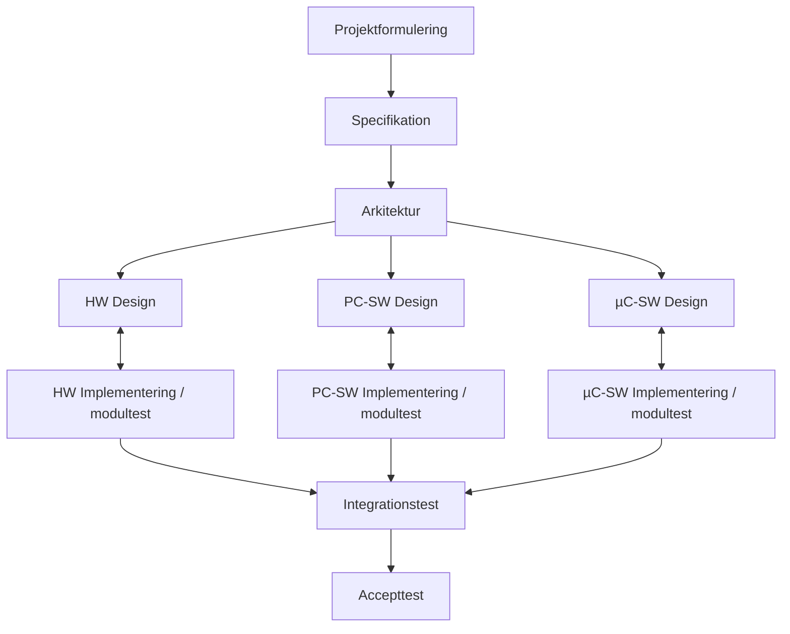
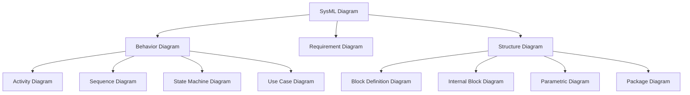
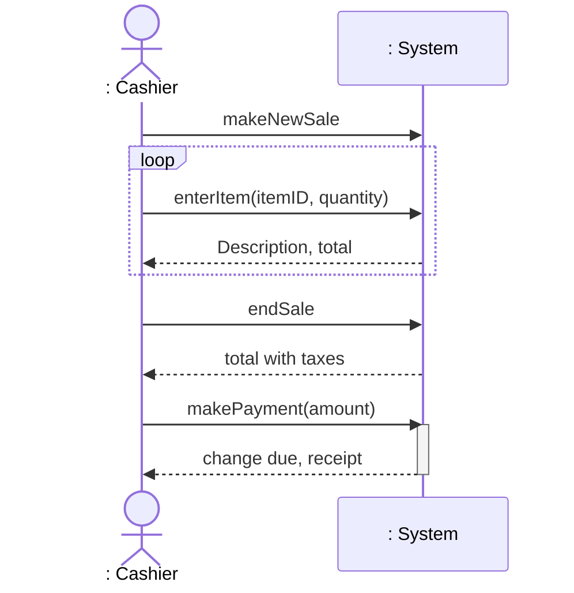
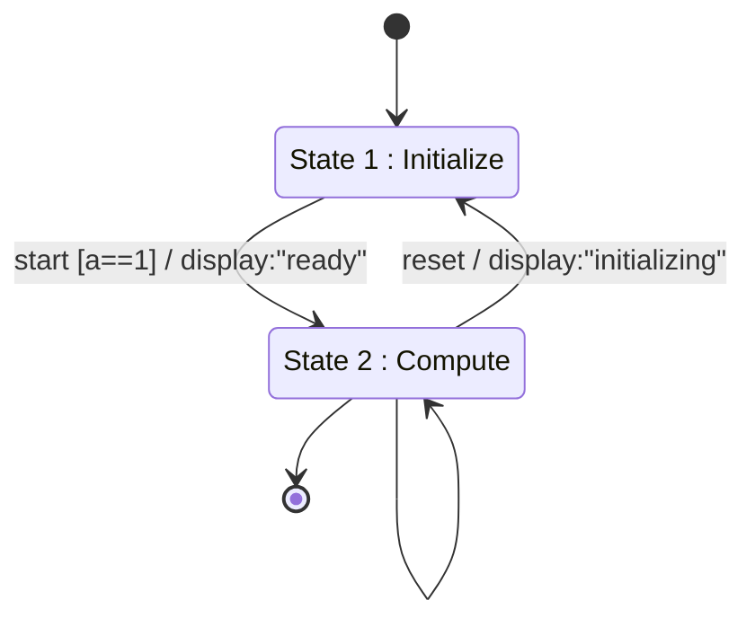

# Velkommen til SWISE — Introduction to Systems Engineering

## Metadata

| Felt | Værdi |
|---|---|
| **Lektion** | L1 — Intro (uge 35, HAJ) |
| **Kursus** | SWISE-01 Indledende System Engineering |
| **Kilde** | `Velkommen til SWISE.pptx` (konverteret; 39 slides, deckets egne numre 1–43 med huller ved 8, 12, 24, 26 — skjulte slides) |
| **Type** | slides |
| **Emner dækket** | Kursusintroduktion, undervisere, tid/sted, lektionsoversigt, gruppedannelse, obligatoriske opgaver A–D, peer-review (FeedbackFruits), godkendelse, hvad er systems engineering, SE-buzzwords, produktudvikling, ECE-modellen, use cases, SysML-diagramtyper, Access Control System-eksempel (BDD/IBD), SD- og STM-syntaks, typer af specifikation |

---

## Dagens menu

- Kursus-introduktion
- Gruppedannelse, opgaver og kommunikation (senere formuleret: "Gruppedannelse, opgaver, kommunikation og eksamen")
- Hvad er Systems Engineering?
- Case study

> Slide 2–4, 14, 21 (agenda gentages som sektionsskillere)

## Introduktion til kurset

- **Tema:** Systems Engineering
- **Formål:**
  - Metoder, processer og struktur for udvikling af systemer bestående af hardware og software
  - Teori og øvelser som fundament for effektiv projektgennemførsel

> Slide 5

## Undervisere

- **Jørn Martin Hajek** — haj@ece.au.dk — Ansvarlig underviser, fungerende kursusansvarlig. Spørgsmål om kurset, opgaver, gruppedannelse, eksamen mm.
- **Tommy Bjerre Nielsen** — tbn@ece.au.dk

> Slide 6

## Undervisning

- Tirsdage, 8-10, 5123-122
- Onsdage, 8-10, 5124-038

> Slide 7

## Materiale

- Lektionsmateriale, herunder slides
- Online videoer, artikler m.m.

> Slide 9

## Lessons and topics

| Blok | Emner |
|---|---|
| **System Specification, Quality and Process** | Specification; Funktionelle krav (Use Cases), Ikke-Funktionelle krav (FURPS+ — skrevet "FUPRS+" på sliden); System Test (Accepttest krav); Quality Assurance; Development Processes |
| **System Architecture / Design, and SysML Diagrams** | SysML structure diagrams; SysML behavior diagrams; Architecture and design; Interfaces |
| **Software/Hardware Analysis and Design, Protocols and Implementation** (slide 10: "Software Analysis and Design, …") | Domain Analysis; Application Models; Design to Implementation; Protocols |
| **Project Management** | Project Management; Scrum; Project Documentation |

På slide 11 er "Tekniske Analysis" tilføjet som en mærkat mellem første og anden blok, og *Specification*, *Funktionelle*, *Ikke-Funktionelle*, *System Architecture* og *Software/Hardware* er fremhævet.

> Slide 10–11

## Gruppedannelse

- **Gruppedannelse**
  - Underviser danner ISE-gruppen i overensstemmelse med 2.semester-projektgruppe
  - 3-4 personer i en ISE-gruppe
    - Dvs. en 2.semesterprojekt-gruppe bliver delt op i to ISE-grupper
- **Udlever & annoncer ISE-gruppe**
  - Det kommer efter 2.semester-projektgruppe af semesterkoordinatoren.
  - Det vil nok blive annonceret i Brightspace, efter 2.semester-koordinatoren er færdig med semestergruppe
  - Hvis man IKKE tager 2.semester-projekt, men tager ISE, skal man informere Jørn
- **Ændringer i gruppesammensætning**
  - Kun inden for den samme 2.semester-projektgruppe
    - Dvs. kun mellem de to ISE-grupper, der kommer fra den samme semesterprojektgruppe
  - Kun ved bekræftelse fra kursusansvarlig – Jørn.
  - Send mail til Jørn (haj@ece.au.dk) med hvem der skal byttes, herunder begge gruppenr. (fra/til), begge studienumre og begge navne.
    - Må ikke byttes, hvis begge ISE-grupper ikke er fra den samme 2.semester-projektgruppe

Bemærk: Sliden er skrevet til 2. semester (kurset hed oprindeligt SW2ISE). I efterår 2026 undervises SWISE på 4. semester, og gruppestrukturen er SW4PRJ4-projektgrupperne (se `semestergrupper.md`).

> Slide 15

## Obligatoriske opgaver

- **4 obligatoriske opgaver**
  - **A:** Specifikation og validering — peer-review
  - **B:** Systemstruktur og adfærd (SysML) — peer-review (brug af FeedbackFruits)
  - **C:** Domæneanalyse og applikationsmodel
  - **D:** Systemdesign (valgfri opgave)
- Alle 4 skal være godkendt
- Ud- og aflevering vha. Brightspace (BS)
- Flow: **Aflevering → Review (A+B) → (update, optional) → Godkendelse**
  - Opgave A og B: skal peer-reviewes
- Flow: **Aflevering (C+D) → Godkendelse**
- Tilbagemelding vha. BS

> Slide 16

### Besvarelse

- Besvares i grupperne
- 1 besvarelse = 1 fil — PDF-fil
- Brug altid standard-forside (kan findes i Brightspace, se `forsider.md`)
  - Filnavn starter med gruppenr., f.eks. `G1_AfleveringsopgaveA.pdf` eller `Grp1_....`
- Besvarelse uploades på BS

> Slide 17

### Review af opgave

- Alle grupper skal uploade deres opgave både til Brightspace → Assignments og til review-tool (FeedbackFruits).
- Detaljerede informationer om, hvordan grupper kan reviewe hinanden, kommer efter gruppedannelsen i Brightspace, og I får vejledninger i undervisningen.
- Husk altid at tjekke opslag i Brightspace – I bliver informeret om, hvornår vejledning gives, i opslag.

> Slide 18

### Godkendelse

- Tre mulige bedømmelser:
  - Godkendt
  - Ikke godkendt: genafleveres
  - Ikke godkendt
- **For sen aflevering == ikke godkendt**
- Alle 4 opgaver skal godkendes for at kunne indstilles til eksamen – på baggrund af revideret besvarelse

> Slide 19

## Hvad er systems engineering?

**Wikipedia: Systems engineering** is an *interdisciplinary* field of engineering that focuses on *how complex engineering projects should be designed and managed* over the life cycle of the project […].

Systems engineering deals with *work-processes and tools* to handle such projects, and it *overlaps with both technical and human-centered disciplines* such as control engineering, industrial engineering, organizational studies, and project management.

Underviserens sammenfatning (fremhævet boks):

> System engineering is an **interdisciplinary** field of engineering and engineering management that focuses on **how to** specify **requirements**, **architecture**, **design**, **integrate**, and manage **complex systems over their life cycles**.

Spørgsmål til diskussion: *Why do we need to do this?*

> Slide 22

## Some systems engineering buzzwords

| Buzzword | Forklaring |
|---|---|
| **Interdisciplinary** | Approach from several disciplines |
| **Technical AND Human-centered** | Think through both **System** (how it works) and **User** (how to use) |
| **Tools and methods** | Choose the right methodology and tools for your system |
| **Holistic** | Think as a **whole** view |
| **Managing complexity** | Complexity always grows – think "how to manage the complexity" from the design |
| **Art and science** | Personal characteristics of a good systems engineer: "The systems engineers like the maestro, who knows what the music should sound like (the look and function of a design) and has the skills to lead a team in achieving the desired sound (meeting the system requirements)" — from *Art and Science of Systems Engineering* (NASA, 2009) |

> Slide 23

## Et par eksempler på systemer

- What is Systems Thinking? — https://youtu.be/qGRCWF4OK0U?feature=shared
- Architecture and Systems Engineering: Manage Complex Systems — https://www.youtube.com/watch?v=yzPiP-gjpds
- Automation systems — https://www.youtube.com/watch?v=H_og0_j2pFc
- Robotics: Boston Dynamics — https://www.youtube.com/watch?v=qTDlRLeDxxM
- Constructions Technology — https://youtu.be/8tnU0ewtRE0?feature=shared
- Etc…

*Figur: collage af billeder — "Smart Systems" (Automation, Big Data, Cloud computing, Autonomous, IoT, Data Management), Smart Home, Smart Factory, Smart Farming, Smart Healthcare, smart city, selvkørende bil.*

> Slide 25

## Produktudvikling

*Figur: cirkulær proces med fem faser i en cyklus:* Product Conceptualisation → Product Architecting → Product Construction → Product Development → Product Release → (tilbage til) Product Conceptualisation.

> Slide 27

## De tre grundspørgsmål

- **Specifikation:** *Hvad* skal systemet gøre?
- **Analyse og Design:** *Hvordan* gør systemet det?
- **Verifikation og Test:** *Virker* systemet *som forventet*?

> Slide 28 (gentaget på slide 41)

## ECE Model — "Vigtigt for Semesterprojekt"

*Figur: procesdiagram med faser som bokse i en lodret kæde og dokumenter (artefakter) til højre.* Området mellem Arkitektur og Integrationstest er indrammet med rødt og mærket "Iterative, cross-disciplinary".

| Fase | Artefakt(er) |
|---|---|
| Projektformulering | Projektformulering |
| Specifikation | Kravspecifikation; Accepttestspecifikation |
| Arkitektur | Systemarkitektur (HW og SW) |
| HW Design | HW-designdokument |
| PC-SW Design / µC-SW Design | SW-designdokument |
| HW Implementering / modultest | Hardware |
| PC-SW / µC-SW Implementering / modultest | Source Code |
| Integrationstest | Logbog |
| Accepttest | Gennemført accepttest |

På slide 43 ("The ECE Process") er samme diagram vist igen med mærkaten **Technical Analysis** placeret mellem Specifikation og Arkitektur.

> Slide 29, 43

## Udfordringen i at forstå systemet?

*Figur: den klassiske "tree swing"-tegneserie i 10 ruder: How the customer explained it — How the Project Leader understood it — How the Analyst designed it — How the Programmer wrote it — How the Business Consultant described it — How the project was documented — What operations installed — How the customer was billed — How it was supported — What the customer really needed.*

> Slide 30

## Specifikation med Use Cases

*Figur: en aktør (stregmand, "Aktør") uden for en systemboks ("System") forbundet med en streg til en use case-ellipse ("Use Case") inde i boksen. Fra aktøren peger en pil ned til dokumentet "Aktør beskrivelse"; fra use casen peger en pil til dokumentet "Use Case specifikation".*

Pointen: hver aktør får en aktørbeskrivelse, hver use case får en use case-specifikation.

> Slide 31

## SysML – Systembeskrivelse med diagrammer

*Figur: taksonomi (generalisering) af SysML-diagramtyper.*

Rød ramme fremhæver de fire diagramtyper kurset bruger: **Sequence Diagram, State Machine Diagram, Use Case Diagram, Block Definition Diagram, Internal Block Diagram**. Behavior- og Structure-grenene er tegnet i "skyer".

Callout: *SysML er for jeres Arkitektur og Design i de semesterprojekter — især et system med både HW og SW.*

> Slide 32

## Eksempler

### Example: Access Control System (1/3)

*Figur: frontpanel med Card reader (lodret slids til venstre), Keys (3×4 tastatur: 1 2 3 / 4 5 6 / 7 8 9 / * 0 #), LEDs (grøn og rød) og Buzzer nederst.*

> Slide 34

### Example: Access Control System BDD (2/3)

Diagramramme: `bdd Access Control System Context`.

| Blok | Stereotype | Ports / values |
|---|---|---|
| System Context | | ports: `in ctrl: DoorCtrl`, `out Card: Card` |
| Access Control System | «system of interest» | ports: `in card: Card`, `in press: Force`, `out doorCtrl: DoorCtrl` |
| Access Card | | ports: `out cardVal: Card` |
| Door | | ports: `in ctrl: DoorCtrl` |
| User | (aktør) | — |
| Card Reader | | ports: `in card: Card`, `out id: string` |
| Keypad | | ports: `in keyPressed: GPIO[12]`, `out key: string` |
| Key | | ports: `in press: Force`, `out act: GPIO` |
| Control | | ports: `in id: string`, `in keyVal: string`, `out red: GPIO`, `out green: GPIO`, `out buzzer: GPIO`, `out doorCtrl: DoorCtrl` |
| LED | | ports: `in on: GPIO` |
| Buzzer | | ports: `in ctrl: GPIO` |
| DoorCtrl | «flowSpecification» | values: `in unlock: bool`, `in openDoor: bool`, `out status: string` |

Kompositioner (sort ruder ved helheden):

- **System Context** består af: Access Control System, Access Card, Door, User (aktør).
- **Access Control System** består af: Card Reader, Keypad, Control, LED (to part-roller: `red` og `green`), Buzzer.
- **Keypad** består af 12 × Key (multiplicitet `12`).

> Slide 35

### Example: Access Control System IBD (3/3)

Diagramramme: `ibd Access Control System`. To ydre rammer: **Access Control System Context** (øverst; parts: User, `: Access Card`, `: Door`) og **Access Control System** (nederst; parts: `: Card Reader`, `: Keypad`, `: Key`, `: Control`, `green : LED`, `red : LED`, `: Buzzer`).

Connectors (port → port) og item flows:

| Fra | Til | Type / item flow |
|---|---|---|
| `: Access Card` port `cardVal : Card` | Context boundary port `card : Card` → ACS boundary port `card : Card` → `: Card Reader` port `card : Card` | item flow `: Card` (pil mod Card Reader) |
| User | ACS boundary port `press : Force` → `: Key` port `press : Force` | item flow `: Force` (pil ned mod Key) |
| `: Key` port `act : GPIO` | `: Keypad` port `keys[12] : GPIO` | |
| `: Card Reader` port `id : string` | `: Control` port `id : string` | |
| `: Keypad` port `key : string` | `: Control` port `keyVal : string` | |
| `: Control` port `red : GPIO` | `green : LED` port `ctrl : GPIO` | (som tegnet på sliden — bemærk at *red* er forbundet til *green : LED* og *green* til *red : LED*; sandsynligvis en tegnefejl i kilden) |
| `: Control` port `green : GPIO` | `red : LED` port `ctrl : GPIO` | |
| `: Control` port `buzzer : GPIO` | `: Buzzer` port `ctrl : GPIO` | |
| `: Control` port `doorCtrl : DoorCtrl` | ACS boundary port `doorCtrl : DoorCtrl` → Context boundary port `ctrl : DoorCtrl` → `: Door` port `ctrl : DoorCtrl` | item flow `: DoorCtrl` (pil op mod Door) |

> Slide 36

### SysML : Sequence Diagram : Terminology, Syntax and Semantics

Diagramramme: `sd [Interaction] Sale Scenario [A sale scenario with cash payment]`. Lifelines: aktør `: Cashier` og blok `: System`. Tidsakse nedad (grøn pil "time"). `endSale` og `makePayment` er tegnet med udfyldt pilespids (synkron), `makeNewSale` og `enterItem` med åben pilespids; svar er stiplede returpile. Aktiveringsbjælke på System ved sidste kald.

> Slide 37

### SysML : State Machine Diagram : Terminology, Syntax and Semantics

Diagramramme: `stm [State Machine] MyFirstSTM [This is my first state machine diagram]`.

Syntaks for transitioner: `trigger [guard] / action`. Selv-transitionen på State 2 er uden label på sliden.

> Slide 38

## The System Engineering Process

*Figur: cirkulær procesmodel med tre segmenter og et lodret flow i midten.*

- Segment **System Specification and Analysis** ("Hvad skal systemet gøre?"): System Requirements → Use Case Specification / Quality Requirements → Acceptance Test → **Teknisk Analysis** (fremhævet blåt).
- Segment **System Design, Architecture and Interface** ("Hvordan gør systemet det?"): Architecture Design (Subsystems) → SW Design (Application and logical model) → HW Design (Platform and deployment) → Interface Design (Protocols).
- Segment **System Implementation and Verification** ("Virker systemet?"): Implementation / Unit test → Software Components, Interfaces (drivers, protocols), Hardware Components → System Integration Test.

> Slide 39

## Summary

Vi genbesøger hvert emne i løbet af lektionerne.

> Slide 40

## Typer af Specifikation ("Vigtigt")

Margin-note: *Kravspec laver alle deler* (kravspecifikationen laver alle dele).

- **Aktørkontekst diagram**
- **Funktionelle Krav**
  - Use Case diagram
  - Fully dressed Use Case-beskrivelser
  - Funktionalitet! — *Fungerer det? eller virker det? Funktionaliteterne virker!*
  - Callout: *Funktionelle Krav: Definer med Use Case efter definitionen, prioriter med MoSCoW for hvilken der er vigtigere*
- **IKKE-Funktionelle Krav**
  - FURPS+
  - Testbare og målbare.
  - Kvalitet! — *Fungerer godt? hvor godt? testbare og målbare!!*
  - Callout: *IKKE-Funktionelle Krav: Definer med FURPS+ efter definitionen, prioriter med MoSCoW for hvilken der er vigtigere*
- **Prioritering**
  - Hvilke kravelementer er vigtigst? ⇒ Afgrænsning/Prioritering
    - MoSCoW-prioritering
    - Prioriter både funktionelle og ikke-funktionelle med MoSCoW
    - **MoSCoW er ikke selv krav! MoSCoW er prioritering!!!**
- **Accepttest Krav**
  - Du skal også definere, hvordan man kan teste både *Funktionelle krav* og *IKKE-Funktionelle Krav*
  - Callout: *Accepttest Krav: Definer accepttestkrav baseret på både funktionelle krav og ikke-funktionelle krav*

> Slide 42
