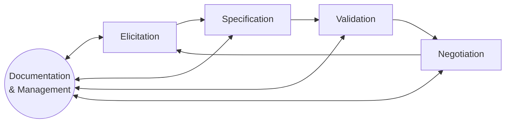

# System Specification (Specification, Part 1)

## Metadata

| Felt | Værdi |
|---|---|
| **Lektion** | L2 — Kravspecifikation |
| **Kursus** | SWISE-01 Indledende System Engineering |
| **Kilde** | `System Specification.pdf` (43 slides) |
| **Type** | slides |
| **Emner dækket** | Systemspecifikation, specifikationsprocessen, funktionelle krav, ikke-funktionelle krav (FURPS+), MoSCoW-prioritering, MTBF/MTTR/availability, elicitation-teknikker, gode krav, traceability matrix, øvelser 1–3 |

Slide-numre nedenfor er slidens footer-nummer. PDF'en har 43 sider, men footer springer nr. 11 over (PDF-side 11 = slide 12 osv.), så fra slide 12 er PDF-side = slide − 1.

---

## Agenda

- System Specification
- Types of requirements
- Specifying requirements
- Finding requirements (Elicitation)
- Good/Bad Requirements
- Traceability

> Slide 2

## System engineers view of the world

*Figur (slide 3): Fire aktører i en cirkel — Customer (nederst venstre), System (øverst, et SAS-fly), Control (højre, et printkort) og Development (nederst, en hånd på et printkort). Pile: Customer → System "Specifies/validates"; Customer → Control "Uses"; Customer → Development "Contracts"; Development → Control "Constructs"; Control → System "Track and control".*

*Figur (slide 4): Samme figur, men med hvad der går galt: Customer → System "Underspecified"; Customer → Development "Idealistic expectations"; Development → Control "Partially implements"; Control → System "Breaks"; Development → System "Delays" (rød pil); Development ↔ Customer "Misuses" / "Surprises".*

> Slide 3–4

## What is a system specification?

> "a statement that identifies a capability, characteristic, or quality factor of a system in order for it to have value by a user or a customer to solve a problem or achieve an objective"
> — Ralph Young, *Requirements Engineering Handbook*, 2004

- Do the right thing
- The **what** and not the **how**

> Slide 5

- The Stakeholders description of a desired functionality or behavior for a system to achieve an objective.
- Functional requirements state what the system is required to do.
- The primary input to the design process
- The baseline against which acceptance tests are carried out.

> Slide 6

## Why have focus on specification?

Time, Effort, Price. Correcting or changing functionality following specification koster:

| Fase | Faktor |
|---|---|
| Design phase | 3 × |
| Implementation | 5–10 × |
| After release | 10–100 × |

> Slide 7

## Vasa, *10. aug. 1628 − †10. aug. 1628

- L: 69 m, H: 52 m, B: 11,7 m, D: 5 m
- Requirements creep
- Inexperience
- Bad test conditions
- Schedule Pressure

*Figur: To fotos af det bevarede Vasa-skib i Vasamuseet.*

Kilde: [Why the Vasa Sank: 10 Problems and Some Antidotes for Software Projects, *IEEE Software*, Fairley03]. Video: https://www.youtube.com/watch?v=JEEVvKql_lg

Se `vasa-case-study.md` for artiklen (forberedelseslæsning).

> Slide 8

## What to derive from these cases?

- A specification is more than functional requirements
- The specification should attempt to address:
  - Requirements creep / Requirements Change
  - Test conditions
  - Training
  - Realistic Schedule
  - External Constraints (physical, legal)
  - Ownership and Stakeholders
  - Existing systems/hardware

> Slide 9

## Who uses a specification

| Stakeholder | Use of specification |
|---|---|
| Customer | Fullfillment of business goal; Contract |
| Manager | Scheduling; Progress measuring |
| System Engineer | Design; Functionality; Constraints |
| Test Engineer and QA personnel | Test planning; Verification; Validation |

> Slide 10

## Specification Process

*Figur: Fire kasser i en cyklus med "Documentation & Management" (ellipse) i midten, forbundet med dobbeltpile til alle fire.*

> Slide 12

## Requirements Specification

- Documentation of the specification
- Principally the outcome of elicitation
- Complete description of the behavior and constraints of the system to be developed
- Baseline for communication between stakeholders
- Often has high demands for versioning and traceability

> "Requirements are used as the basis for all development tasks in a systems engineering project." — IBM

> Slide 13

## Types of requirements

- **Functional** — What the system should do (behaviours)
- **Non-functional** (Quality-demands) — Qualities or criteria of the system, rather than specific behaviour
- Other categorizations exists:
  - Customer Requirements
  - Domain Requirements (Business Rules)

> Slide 14

## Prioritisation — MoSCoW Method

MoSCoW Method (prioritisation technique):

| Bogstav | Betydning |
|---|---|
| **M** | MUST (skal) have this |
| **S** | SHOULD (bør) have this if possible |
| **C** | COULD (kan) have this if it does not affect anything |
| **W** | WON'T (vil ikke) have this time, but WOULD like in the future |

Eksempel (kaffemaskine):

- The system **must** be able to make a cup of coffee
- The system **should** be able to indicate need of service
- The system **could** be able to add milk
- The system **won't** be able to automatically refill water

> Slide 15

## Functional Requirements

Functional requirements (FRs) describe the functionalities and services the system should provide. *"what a system is supposed to do"*

> Slide 16

- Describes system services
- Requirement for each input and output
- Behavioural requirements
- Use Cases

Definitioner:

- Functional requirement defines a function of a system or its component, where a function is described as a specification of behavior between inputs and outputs (Wikipedia)
- Functional Requirements: The necessary task, action or activity that must be accomplished (what has to be done). (System Engineering Fundamentals, US 2001/2017)

> Slide 17

## Exercise 1 — Reverse vending machine

*Figur: Fotos af en flaskeautomat (reverse vending machine / pantautomat).*

- Who would the stakeholders be?
- Write 5–10 functional requirements for the reverse vending machine (Use MoSCoW)

> Slide 18

## Non-Functional Requirements

- Traditionally, Non-Functional requirements were often described as the system qualities
  - Quality, reliability, scalability, and so on
  - they are critical elements of system behavior.
- *If the system qualities are not supported, we will fail just as badly as if we forgot some critical functional requirements.*
- **How to capture and express the nonfunctional requirements (NFRs) for the system**

> Slide 19

### Quality Demands / Non-functional Requirements

Qualities or Constraints on the services or functions offered by the system.

> Qualities are properties or characteristics of the system that its stakeholders care about and hence will affect their degree of satisfaction with the system.
> [Defining Non-Functional Requirements, Malan01]

Quality demands / NFRs should satisfy two attributes:

- Must be **verifiable** (measurable metrics)
- Should be **objective** (e.g. testable)

(NFR = Non-Functional Requirement)

> Slide 20

## Example — Treasure Robot (3. Semester project)

- Driving robot
- Obstacle sensor
- Metal detector
- GPS

*Figur: Rich picture (håndtegnet) af TreasureBot: GPS-satellit, Operator der "Defines search area", Robot med GPS og Metal Detector kører over "Valuable Objects" i jorden, "Coordinates saved to a log", "Location marked by robot", "Worker can excavate". Fotos af LEGO-robotchassis og metaldetektor-spole med printkort.*

> Slide 21

### Treasure Robot: Non-functional Requirements example

1. **Battery**
   1. Battery life **should** be minimum of 20 min when the car is in running mode
   2. Battery life **should** be minimum of 1 hours when the car is idle
2. **Robot**
   1. The robot **must** not exceed the dimension of 40 cm long, 25 cm wide and 15 cm tall
   2. The robot **must** have enough storage capacity to be able to drive and record data for 20 min.
   3. Should be able to save GPS-location every 5 sec. +/- ½ sec.
3. **Metal detection**
   1. Must be able to detect metal to a depth of min. 5 cm from sensor, when driving on dirt or grass
   2. Must be able to detect metal to a depth of min. 3 cm from sensor, when driving on gravel
4. **Obstacle sensor**
   1. Must be able to detect a black box with dimensions 10x10x10 cm, from a distance of 1 m
5. **GPS**
   1. Should have an accuracy of minimum 3 m radius on a clear day
   2. Should have an accuracy of minimum 5 m radius on a cloudy day

> Slide 22

## Types of Non-Functional Requirements — FURPS+

(Robert Grady, Hewlett-Packard)

| Bogstav | Kategori |
|---|---|
| **F** | Functionality |
| **U** | Usability |
| **R** | Reliability |
| **P** | Performance |
| **S** | Supportability |
| **+** | Design and Physical constraints, Interfaces, Legal, Test, Reuse, Economic constraints, Aesthetics, Comprehensibility, Technology tradeoffs |

System must have certain quality attributes in order to meet non-functional requirements. *"how a system is supposed to be"*

> Slide 23

### Usability

Characteristics:

- Operability
- Accessibility
- User Interface (If any)
- Documentation

Metrics:

- The system should be easy to use
- Max. number of errors made by users for a specific task over a time period.
- Time to learn a certain functionality (e.g. within 10 minutes)

> Slide 24

### Reliability (1/2)

Characteristics:

- **Reliability** — is the probability of a system to perform a required function under stated conditions
- **Availability** — is a function of how often failures occur, repair time and maintenance interval
- **Maintainability** — is the ability of a system to restore to a specified condition

> Slide 25

### Reliability (2/2)

Metrics:

- Reliability → Mean time between failure (MTBF)
- Availability
- Maintainability → Mean time to restore (MTTR)

> Slide 26

### Reliability: MTBF, MTTR

- **MTBF: Mean Time Between Failure** — a prediction of the time between the failures of a system during normal operating hours.
- **MTBF = Total uptime / # of Breakdowns**
- **Uptime**: running time — Normal operating hours or how long a piece of equipment operates without interruption.
- **Downtime**: how many times of breakdowns, how long failures

Example: Your system is supposed to be up and running 40 hours, but it wasn't working for 28 of those hours. It's only been available for 14 hours, and a total of five failures occurred.

- MTBF: 40 − 28 / 5 = 34.4 *(slidens tal: 34.4 = 40 − 28/5. Bemærk at det ikke følger slidens egen formel uptime / #breakdowns, som ville give 14 / 5 = 2.8. Sliden regner videre med 34.4.)*
- MTTR: 28 / 5 = 5.6

$$\text{Availability} = \frac{MTBF}{MTBF + MTTR} = \frac{UPTIME}{UPTIME + DOWNTIME}$$

34.4 / (34.4 + 5.6) = 0.86 (86%)

> Slide 27

### Reliability: MTTR

- **MTTR: Mean Time To Restore**
- A simple example of MTTR might look like this:
  - a pump that fails four times in one workday
  - you spend an hour repairing each of those instances of failure,
  - your MTTR would be 15 minutes (60 minutes / 4 = 15 minutes).

$$MTTR = \frac{60\ \text{minutes}}{4} = 15\ \text{minutes}$$ → Maintainability

e.g. Reliability: *System should be able to repair within 15 minutes.*

> Slide 28

### Performance

Characteristics:

- Throughput
- Response time
- Start-up time
- Capacity & Efficiency Constraints

Metrics:

- Time
- Specifics is out of scope for this course
- Eksempel: *95% of the transactions shall be processed in less than 1 second at 80 % load*

> Slide 29

### Supportability

Characteristics:

- Compatibility
- Installability
- Localizability
- Maintainability

Metrics:

- Same as with Usability
- Measure of success under specified scenarios

> Slide 30

### + (plus-kategorierne)

- **Legal** — Data Protection Act, Health and Safety act
- **Technology trade off** — Balance between two incompatible features
- **Test** — Conditions, Environment, Access
- **Reuse** — Existing systems, parts, modules
- **Environmental** — RoHS, WEEE, EMC, etc.

> Slide 31

## Exercise 2 — Coffee machine

*Figur: Foto af en Moccamaster filterkaffemaskine.*

Find 5–10 NFR / Quality requirements for this coffee machine using (F)URPS+:

- Usability
- Reliability
- Performance
- Supportability

> Slide 32

## Challenges in Elicitation

- The larger the project, the more difficult it is to grasp
- Users' expectations are often unrealistic, and compromises must be made between economy and features

*Figur: Venn-diagram med tre overlappende cirkler: Fast, Good, Cheap (det klassiske "vælg to").*

> Slide 33

## Requirements Elicitation Techniques

- Interview
- Stakeholder analysis
- Brainstorm
- Prototype
- (Requirements Workshop)
- (Task Demonstration)
- (Role Playing)

> Slide 34

### Interview

- Simple direct technique
- Context-free questions can help achieve bias-free interviews
- Convergence on some common needs will initiate a "requirements repository" for use during the project.
- A questionnaire is no substitute for an interview

> Slide 35

### Stakeholder analysis

- Who are the stakeholders?
- What are their goals?
- Which risks and costs do they see?

> Slide 36

### Brainstorm

- Brainstorming involves both idea generation and idea reduction
- The most creative, innovative ideas often result from combining, seemingly unrelated ideas
- Various voting techniques may be used to prioritize the ideas created
- Open to all suggestions
- Suggestions often spawn new ideas

> Slide 37

### Prototype session

- Preliminary model built for demonstration purposes
- The customer may be more likely to view the prototype and react to it, than to read the specification and react to it
- The prototype provides quick feedback
- Prototype displays unanticipated aspects of the systems behavior

> Slide 38

## Good Requirements

| Egenskab | Betydning |
|---|---|
| **Correct** | specifying something actually needed |
| **Unambiguous** | only one interpretation |
| **Complete** | includes all significant requirements |
| **Consistent** | no requirements conflict |
| **Verifiable** | all requirements can be proven by test |
| **Modifiable** | changes can easily be made to the requirements |
| **Traceable** | the origin of each requirement is clear |

> Slide 39

## Requirements Traceability Matrix

- Determine the two-way mapping between Requirements and Features/Test
- Are all features mapped to a requirement? And are each requirements fulfilled by a feature?
- Requirements and Test/Verification, or Requirements and Features

Eksempel på matrix (Test Cases × Requirements):

| Test Cases \ Requirements | REQ 1 | REQ 2 | REQ 3 | REQ 4 | REQ 5 |
|---|---|---|---|---|---|
| 1.1 | X | X | | | |
| 1.2 | | | X | | |
| 1.3 | | | X | | |
| 2.1 | | | X | | |
| 2.2 | X | X | | X | X |
| 2.3 | X | X | | | |
| 3.1 | X | X | X | X | X |

> Slide 40

> "A specification that will not fit on one page of 8.5x11 inch paper cannot be understood."
> — Mark Ardis, Professor, Rochester Institute of Technology

> Slide 41

## Exercise 3 — BeoSound F (pp. 13–15)

*Figur: Foto af en cylindrisk B&O-højttaler med en iPhone foran (BeoSound-koncept).*

Write 10–20 good requirements:

- (F)URPS+
  - Usability
  - Reliability: MTBF and availability
  - Performance
  - Supportability
- MoSCoW
  - Must (skal)
  - Should (bør)
  - Could (kunne)

> Slide 42

## Wrap up: Requirements

- **Functional Requirements**
  - "What a system is supposed to *do*"
  - defines a function of a system or its component — as a specification of behavior between inputs and outputs
  - necessary tasks, action or activity — that must be accomplished (what has to be done)
  - Use Case
- **Non-Functional Requirements**
  - "How a system is supposed to *be*"
  - System must have certain quality attributes in order to meet non-functional requirements
  - FURPS+
- **Prioritization**
  - MoSCoW
  - How to link with requirements (will show an example in the course)

> Slide 43

Slide 44: Questions.
