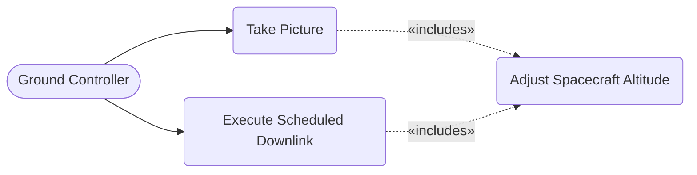
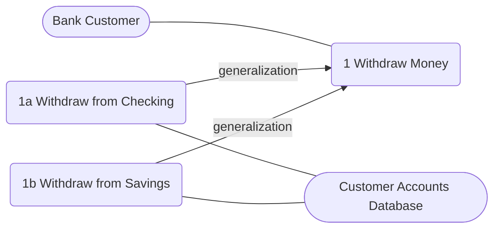

# Specification: Functional Requirement — Use Case

## Metadata

| Felt | Værdi |
|---|---|
| **Lektion** | L3 — Use Cases (funktionelle krav) |
| **Kursus** | SWISE-01 Indledende System Engineering |
| **Kilde** | `L3_Specification_FunctionalKrav_UC (Updated).pdf` (57 slides) |
| **Type** | slides |
| **Emner dækket** | Aktører (primær/sekundær/offstage), aktørbeskrivelse, actor-context diagram, system boundary, use case-definition, use case-diagram, brief vs. fully dressed use case, fully dressed-skabelon, alarm clock-eksempel, guidelines (Cockburn/Larman), include/extends/generalization |

Slide-numre er PDF-sidenumre (= slidens footer-nummer hvor det findes).

---

## Agenda

- What is a Use Case
- What use Use Cases
- Actors
  - What is an actor
  - Actor Context Diagram
- Use Case
  - Use Case Context Diagram
- Use Case Scenarios: Formats and Styles
  - Brief Use Case
  - Fully Dressed Use Case
- Guidelines: Finding and describing actors and UC's
- Good and Bad Use Cases

> Slide 2

## Actor

Before defining Use Case, you need to identify the Actors first!

> Slide 3

### Actors

- An actor describes an object, external to the system, who interacts with the system
- An actor is used to present the role of **a human**, **an organization** or **any external system** that uses some or whole of your system.
- Actors may **interact directly with the system** or indirectly through other actors. *(Note på sliden: "We focus here in the 2.semester level" — dvs. direkte interaktion.)*
- An actor is **shown as a stick figure** with the actor's name underneath.

*Figur: Stick figures med navne: "Actor name" → e.g. Bruger, eller Customer, eller Salling Group, eller PBS (Personal Banking System), ...*

Using actors to present the users of the system (User means not only human! — User means who or what does use the system)

> Slide 4

- Role — more precise translation from Swedish
- An actor describes an object, external to the system, who interacts with the system
- **Actors represents:**
  - Persons
  - Other systems
  - HW devices
- UML notation: stick figure `Customer` — alternatives — kasse med stereotype `«actor» Customer`

**OBS.** However, if your device is a part of your system, then it is NOT an actor.

> Slide 5

- **Person actors:** Describes the role played by a person who interacts with the system. The same person can play different roles over time
- **Other systems:** Describes the external systems who communicates with the system under development
- **HW devices:** A concrete HW unit can also be subdivided in different logical roles played by the HW unit or device. (OBS: If your device is a part of your system, then it is NOT an actor.)

> Slide 6

### Actor Type

| Type | Beskrivelse | Note |
|---|---|---|
| **Primary Actor** | Has goals to be fulfilled by system | Always at least one |
| **Supporting Actor** (alternatively **Secondary Actor**) | Provides service to the system | Not always |
| **Offstage Actor** | Interested in the behavior, but no contribution. Passively participates, i.e., neither initiates nor helps, but may be notified. | |

Fokus på 2. semester-niveau: Primary og Supporting/Secondary.

> Slide 7

### Actor Description (Aktørbeskrivelse)

| Felt | Eksempel |
|---|---|
| Name of actor: | Shopper |
| Alternate references | Customer |
| Type: | Primary |
| Description: | The Shopper is the sole end user of the system … Wants to ... |

> Slide 8

### Actor Description Example

| Felt | Værdi |
|---|---|
| Navn på aktør: | Bruger |
| Andre referencer: | Husejer |
| Type: | Primær |
| Beskrivelse: | Brugeren er den primære aktør af home security system. Brugeren kan bruge systemet via en konsol som kan styre lamper i hjemmet. Brugeren kan desuden programmere lamperne til at tænde og slukke på valgte tidspunkter. |

> Slide 9

### Actor-Context diagram

- Supplies overview of the actors in relation to the system boundary
- Essentially a diagram with actors, the system boundary and no use cases.

*Figur: Kasse "ATM System" i midten. Til venstre stick figure "Bank Customer" forbundet med en streg til kassen; til højre stick figure "Customer Accounts Database" forbundet med en streg til kassen. Ingen use cases.*

> Slide 10

### System Boundary

- Boundary between the inside and the outside of the system
- Determining the level of abstraction
- There may be systems within systems
  - One system may be made up of several subsystems, which interact with each other
- Identify interactions between the system and its environment (stimuli and responses)

> Slide 11

### Why money is not an actor

- No interest in the scenario
- A means to fulfill the scenario

> Slide 12

## Use Case Definitions

> Slide 13

### What is Use Case

- A use case is a specific way of using the system by performing some part of the functionality. Each use case constitutes a complete course of events initiated by an actor, and it specifies the interaction that takes place between an actor and the system
- A textual description of events between a user and a system
- In order to discover and describe Functional Requirements
- Are described from a users view or the environment (not from the systems view)
- In specification, Use Case is for Functional requirement

(Remind) Functional Requirements: To describe what the system is expected to do: outlining Features and Functionalities. To define Functional Requirements, we use the Use Case.

> Slide 14

### What is a Use Case (2/2)

> "If you design a new house and you are reasoning about how you and your family will use it, this is use case-based analysis. You consider the various ways in which you'll use the house, and these use cases drive the design."
> — Booch

> Slide 15

### What are they used for

- Used to specify the functional requirements
- Outside-in approach, where the functionality is described from the users (outside) viewpoint
  - Be careful about Users/Outside Viewpoint: This is about one Use Case (Diagram)
  - Not from the developers

> Slide 16

### Simple Use Case Example

**Buy Product**

1. Customer browses through catalog and selects items to buy
2. Customer goes to check out
3. Customer fills in shipping information
4. Customer fills in credit card information
5. System authorizes purchase
5a. [Authorization fails] Customer may go to 4. or Cancel

> Slide 17

### Use Case terminology

Samme eksempel annoteret (Martin Fowler, *UML Distilled*, 2nd Edition):

| Element | I eksemplet |
|---|---|
| **Actor** | *Customer* (og *System*) — subjektet i hvert trin |
| **Reference** | "browses through catalog" — henvisning til funktionalitet |
| **Scenario** | Trin 1–5a samlet |
| **Extensions / Alternate Flows** | 5a [Authorization fails] Customer may go to 4. or Cancel |

> Slide 18

- A use case either reach it's goal or fails.
- If only a main success scenario is given, then success is assumed
- Use Case naming rule: Described in terms of obtaining a goal for a given actor. Examples: *Withdraw Money*, *Check Balance*

> Slide 19

### Why use Use Cases

- Capturing requirements of a system
- Validating systems (all use cases are realized)
- Can drive implementation and tests
- Use Case Modelling is
  - A simple concept
  - User-friendly (allow customers to contribute)
  - Effective
- Discovery and Definition are the goals of Use Cases

> Slide 20

### Two Versions of Use Cases

- Simple Use Cases
- Fully Dressed Use Cases

> Slide 21

## Use Case Diagram

> Slide 22

### Use Case diagrams (ATM System)

*Figur (CMSC 345, S. Mitchell): Annoteret use case-diagram. System boundary = rektangel med system name "ATM System". Primary actor "Bank Customer" (stick figure, venstre; annoteret "role"). Secondary actor "Customer Accounts Database" (stick figure, højre) med alternativ notation som kasse `«actor» Customer Accounts Database`. Fire use cases (ellipser) inde i boundary, forbundet med associations (streger uden pile) til begge aktører.*

| Aktør | Use case |
|---|---|
| Bank Customer (primary) | 1 Withdraw Money |
| Bank Customer (primary) | 2 Deposit Money |
| Bank Customer (primary) | 3 Transfer Money |
| Bank Customer (primary) | 4 Check Balance |
| Customer Accounts Database (secondary) | 1, 2, 3, 4 (alle fire) |

Terminologi vist på figuren: system name, system boundary, primary actor, secondary actor, role, association, use case, alternative actor notation.

> Slide 23

- A way of visualizing the relationships
  - between actors and use cases
  - among use cases
- A graphical table of contents for the use case set

> Slide 24

### Use Case diagrams (Parkerings-automat)

*Figur: System boundary (unavngivet rektangel) med fire use cases. Aktør "Bruger" til venstre; aktører "PBS", "Database" og "Maintenance" til højre. Plain connectors uden pile.*

| Aktør | Use case |
|---|---|
| Bruger | UC1: Køb af parkeringsbillet |
| PBS | UC1: Køb af parkeringsbillet |
| Database | UC1: Køb af parkeringsbillet |
| Database | UC2: Overvågning |
| Maintenance | UC2: Overvågning |
| Maintenance | UC3: Tømning af mønter |
| Maintenance | UC4: Skiftning af bon-papir |

> Slide 25

### Diagram Purpose

- A Use Case diagram is an **overview of Use case scenarios**
- Diagrams shall **only contain Use Cases** that **actually exists**
- Do **not** join **several** Use Cases **into one** in a diagram

> Slide 26

### Example — Medical Consultation System

Draw a Use Case diagram of the following:

| Use case | Patient | Doctor | EPR/EPJ | National Board of Health |
|---|---|---|---|---|
| Make Appointment | Primary | Secondary | - | - |
| Cancel Appointment | Primary | Secondary | - | - |
| Access Patient Record | - | Primary | Secondary | Offstage |

EPR: Electronic Patient Record system, EPJ: Electronic Patient Journal system

> Slide 27

### Extra: Use Case activation

- **Actor initiated:** Actor takes initiative to activate a Use Case
- **System initiated:** Use Cases activated by the system, is possible in technical systems
  - Periodic activated Use Cases
  - Aperiodic activated Use Cases, where a Use Case is started, when a given condition is true

> Slide 28

*Figur: System "Cardionada Pacemaker". Aktør "Programmer" med pile ind til tre use cases: "Set Pacing Parameters", "Set Operational Mode", "Report Pacemaker Status" — markeret "Actor initiated". Use case "Pace the Heart" med pil ud til aktør "Heart" — markeret "System initiated".*

| Use case | Aktør | Aktivering |
|---|---|---|
| Set Pacing Parameters | Programmer | Actor initiated |
| Set Operational Mode | Programmer | Actor initiated |
| Report Pacemaker Status | Programmer | Actor initiated |
| Pace the Heart | Heart | System initiated |

> Slide 29

### Extra: Which form of connector should be used

*Figur: System "System Name" med UC1: do something, UC2: describe, UC3: describe. Primary Actor forbundet til UC1 og UC3; Secondary Actor forbundet til UC2. Alle connectors er rene streger.*

**Use the plain Form! Plain connectors without arrows.**

> Slide 30

## Use Case (scenarios)

> Slide 31

### Use Case Scenarios

- The **Main Success Scenario** is the scenario where the actor obtains its goal, is also called:
  - Sunshine scenario
  - Happy scenario
- **Extensions / Alternative Flows**
  - The alternative flows can be more comprehensive than the main scenario

> Slide 32

### Styles

- **Essential:**
  - Focus is on intent
  - Free of technology and mechanisms
  - Avoid making user interface decisions
- **Concrete:**
  - UI decisions are embedded in the use case text
  - e.g. "Admin enters ID and password in the dialog box, (see picture X)"

> Slide 33

### Scenarios Formats

Different ways of structuring use cases:

- Brief Use Case
- (Casual)
- Fully Dressed Use Case

> Slide 34

### Scenarios Formats: Brief Use Case

- 1–6 sentence description of behavior
- Mention only most significant behavior and failures
- Short enough to put many on a page
- Used to
  - Estimate complexity
  - To get a sense of subject and scope

> Slide 35

### Brief Use Case Example

**Process Sale:** A customer arrives at a checkout with items to purchase. The cashier uses the POS system to record each purchased item. The system presents a running total and line-item details. The customer enters payment information, which the system validates and records. The system updates inventory. The customer receives a receipt from the system and then leaves with the items.

(*Applying UML and Patterns*, C. Larman 2005)

> Slide 36

### Scenarios Formats: Fully dressed Use Case

- Paragraphs written in a numbered form
- Includes all step and alternate flows in detail
- Normally follows a defined template of supporting sections

> Slide 37

## Fully Dressed Use Case

A structured and detailed description of Use Case to enable a deep understanding of the functional requirements.

> Slide 38

### Fully-dressed Template

| Felt | Indhold |
|---|---|
| **Name** | Name of UC (Start with verb) |
| **Goal** | What is achieved by the UC |
| **Initiation** | Actor, System initiation |
| **Actors and Stakeholders** | List of actors; Actor role (type) |
| **References** | Other use cases referenced |
| **Number of concurrent occurrences** | 1, 2, 10, none |
| **Precondition** | What must be true on start |
| **Postcondition** | What is true on completion |
| **Main Scenario** | Sunshine or Happy path scenario |
| **Extension** | Alternate flows |
| **Data Variations List** | e.g. Data Formats |

> Slide 39

### Fully-dressed elements

- **Actors and Stakeholders** — list of stakeholders and their key interests in the use case
- **Pre/Post conditions** — assumptions before and success guarantees
- **Data Variations List** — technical variations in how data is defined

> Slide 40

### Fully-dressed example (Alarm Clock)

*Figur: Use case-diagram for system "ClockAlarm": aktør "Bruger" forbundet til tre use cases: "Indstil tid", "Sæt alarm", "Stop alarm". Foto af et digitalt vækkeur (display 10:45).*

| Felt | Værdi |
|---|---|
| **Navn:** | Sæt alarm |
| **Mål:** | Bruger ønsker at sætte alarmtiden. |
| **Initiering:** | Bruger trykker på ALARM knappen |
| **Aktører:** | Bruger - primær |
| **Samtidige forekomster:** | 1 |
| **Prækondition:** | Uret er tændt og operationel |
| **Postkondition:** | Alarmen er sat til den ønskede tid |

**Hovedscenarie:**

1. Bruger trykker på ALARM
2. Urets display viser tidligere alarm
   [Extension 1a: Ingen tidligere alarm]
3. Bruger trykker på henholdsvis HOUR og MIN
4. Uret optæller time og minut visningen for alarm
5. Bruger trykker på ALARM for at afslutte indstillingen
6. Uret skifter tilbage til at vise klokken

**Udvidelser/undtagelser:**

- [Extension 1a: Ingen tidligere alarm] Alarm indstillingen starter ved 00:00.

> Slide 41

## Use Case Guidelines

> Slide 42

### Guidelines: Building a System in UC's

1. Name the system scope
2. Brainstorm and list the primary actors
3. Brainstorm and exhaustively list user goals for the system.
4. Select one use case to expand
5. Write the main success scenario
6. Brainstorm and exhaustively list the extension conditions (dvs. "meget grundigt")
7. Write the extension-handling steps

(*Writing Effective Use Cases*, A. Cockburn, 2000)

> Slide 43

### Finding and describing use cases

- Scenario Driven
  - Find measurable value
  - Business events
  - Services actor needs / supplies
  - Information needed
- Actor/Responsibility
- Mission decomposition

> Slide 44

### Developing a Use Case

Start out by answering these questions:

- Who are the primary and secondary actors?
- What are each (primary) actor's goals?
- What preconditions must exist before the story begins?
- What main tasks or functions are performed by each actor?
- What exceptions will need to be considered as the story develops?
- What variations in the actors' interactions are possible?
- What system information will each actor acquire, produce, or change?
- What information does each actor need from the system?

> Slide 45

- Use case names should start with a verb.
  - DO: Rent Items
  - DON'T: Item Rental
- Actor names should be capitalized.
- Use cases should be written in the active voice, using actors.
  - DO: Customer arrives with videos to rent.
  - DON'T: Videos are brought to the cash register by a Customer.
- Be as terse as possible while still being clear.
  - DO: Clerk enters..., System outputs....
  - DON'T: The Clerk enters..., The System outputs...

> Slide 46

### Good Use Cases

- Keep it simple
- Use present tense
- Subject should be primary actor, system under design and secondary actors
- Must provide a meaningful result to primary actor
- Verb should be what actor does to successfully move the use case forward
- Avoid GUI: write in terms of goals, not details of the GUI

(*Applying UML and Patterns*, C. Larman 2005; *Writing Effective Use Cases*, A. Cockburn, 2000)

> Slide 47

## Exercise 3

Bilvaskehald.pdf — se `bilvaskehal-case.md`.

> Slide 48

## Extra Topic for Use Cases

> Slide 49

### Relationships between Use Cases

- You have three types of relationships:
  - Include
  - Extends
  - Generalization
- Use of these features will typically make a use case diagram more complex to read.
- So they should be used with caution.

> Slide 50

### Includes

- An include relation is a structuring mechanism
- Used primarily to avoid redundancy in the specification
  - An include use case can be used and reused in many situations

> Slide 51

*Figur: Aktør "Ground Controller" med pile til "Take Picture" og "Execute Scheduled Downlink". Begge har stiplet pil `«includes»` til "Adjust Spacecraft Altitude".*

Common functionality is here moved out and described by its own Use Case.

Note på sliden: This is just an example, this is not the focused way for this lecture. Keep in mind: Keep it simple!

> Slide 52

### Extends

- An "extends" relation is a structuring mechanism:
  - Used to describe optional extensions
  - Used to describe special situations for example errors or other exceptional scenarios
- Can be used late in the development cycle — as a way to add functionality in a structured way, without disturbing the other use cases

> Slide 53

*Figur: Example of an extension with a condition. Aktør "Customer" forbundet til use case "Perform ATM Transaction" med sektionen "Extension points: Selection". Use case "Get On-Line Help" har stiplet pil `«extends»` til "Perform ATM Transaction". Note-boks knyttet til extends-relationen: "Condition: {customer selected HELP}, extension point: Selection".*

Note på sliden: This is just an example, this is not the focused way for this lecture. Keep in mind: Keep it simple!

> Slide 54

### Generalization

*Figur (CMSC 345, Version 9/07 S. Mitchell): Aktør "Bank Customer" forbundet til "1 Withdraw Money". "1a Withdraw from Checking" og "1b Withdraw from Savings" har generalization-pil (hul trekant) til "1 Withdraw Money". 1a og 1b er hver forbundet til aktør "Customer Accounts Database".*

Note på sliden: This is just an example, this is not the focused way for this lecture. Keep in mind: Keep it simple!

> Slide 55

Slide 56: Questions?

Slide 57: *Figur: "You gotta learn how to walk first, then you fly..." / "You cannot learn to fly by flying. First you must learn to walk, to run, to climb, to dance." — Friedrich Nietzsche. Progression larve → puppe → sommerfugl: 1.semester, 2.semester, 3.semester, 4.semester, Praktik (5.Semester).*

> Slide 56–57
