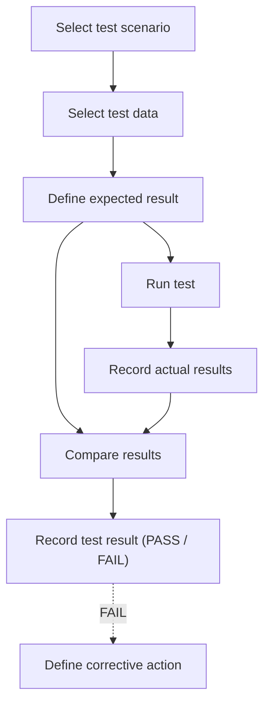
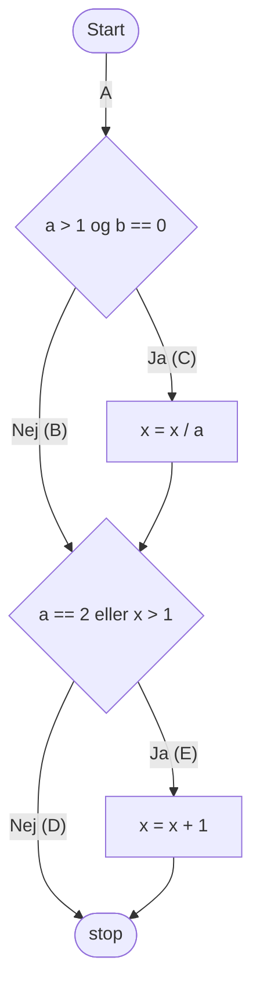
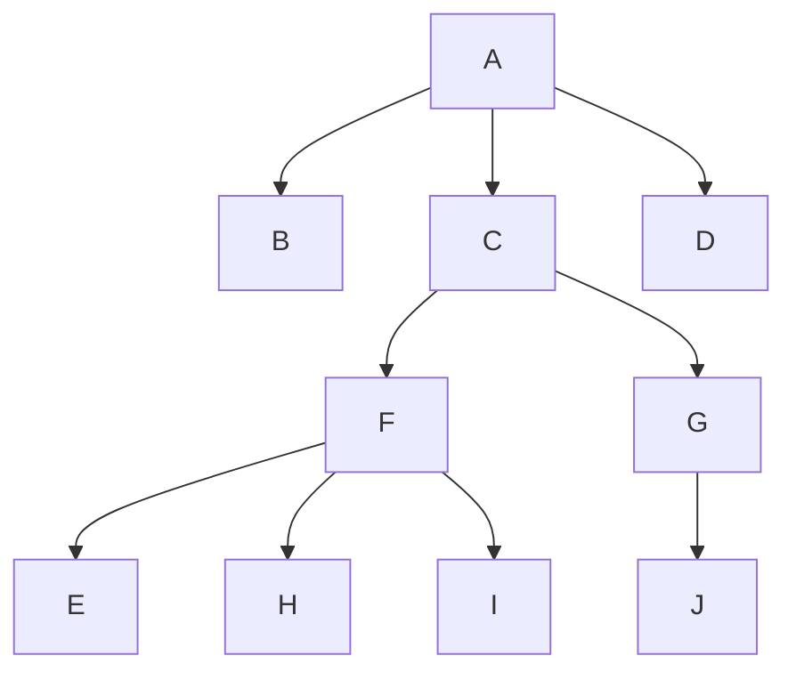

# System Test

## Metadata

| Felt | Værdi |
|---|---|
| **Lektion** | L5/L7 — Systemtest og accepttest |
| **Kursus** | SWISE-01 Indledende System Engineering |
| **Kilde** | `System Test.pdf` (31 slides, 2024-udgaven) |
| **Type** | slides |
| **Emner dækket** | Hvorfor teste, prisen for fejl, egenskaber ved en god test, testdefinition, ækvivalensklasser, black-box vs. white-box, route coverage, V-model, validation vs. verification, testniveauer (unit/integration/system/acceptance), TDD, hardware unit test (DUT), integrationsstrategier (big-bang, bottom-up, top-down, sandwich), drivers vs. stubs, use cases → accepttest, accepttestskabelon |

---

## Et faktum om test

> **Testing can only show the presence of errors, never their absence**

Diskussionsspørgsmål: Hvad betyder det? Hvad er konsekvenserne?

> Slide 2

## En kort diskussion

- What is the value of testing?
  - For the system
  - For the developer
  - For the company
  - For the customer
  - For the users
- What is the cost of testing?

> Slide 3

## Prisen for fejl (The cost of errors)

- Finding errors early is in the best interest of you and your company.

*Figur: Søjlediagram med "(cost)" på y-aksen og faserne Spec → Design → Implementation → Acceptance test → Deployment på x-aksen. Søjlerne vokser monotont fra fase til fase, og en stiplet rød linje gennem søjletoppene illustrerer, at omkostningen ved at rette en fejl stiger, jo senere den findes.*

To this, add damage done to:
- humans
- property
- company image
- loss of productivity
- follow-on sales

**The test mantra:** *Test early, test often, test enough*

> Slide 4

## Hvornår skal der testes? (When to test?)

*The nightmare, all-too-often-seen scenario.*

*Figur: Gantt-lignende tidslinje med faserne Specification → Design → Implementation → Test placeret efter hinanden i tid. Implementation-fasen er forlænget (skubber ind over testfasen), og Test-fasen ender i en rød, sammenpresset klods lige før deadline (markeret med OL-ringe som "deadline-ikon").*

Spørgsmål: What happens to the test effort in this case?

> Slide 5

## Egenskaber ved en god test

What are the properties of a good, valuable test? The test should be:
- independent
- simple
- repeatable
- fine-grained
- quick to run

> Slide 6

## At definere en test (Defining a test)

*Figur: Flowchart for testdefinition.*



Grøn callout ved "Define expected result": **Do not proceed until expected test result is defined.**

> Slide 7

## Valg af testdata og ækvivalensklasser (Equivalence Classes)

- **Definition:** An Equivalence Class is a collection of input that should be processed and react equally.
- **Characteristic:**
  - All elements in an equivalence class will either fail or pass.
  - Is used to reduce the number of tests.
- **Limitation:**
  - May require knowledge of: type of processor, programming languages or algorithms.

> Slide 8

### Simple Example

`bool Big(int x)`
- x can assume a value in the 1 - 100 range
- if x < 10: x is "small" => false
- else: x is "big" => true

At least 4 Equivalence Classes:

| Ækvivalensklasse | Vurdering | Valgt testdata |
|---|---|---|
| x < 1 | invalid, but possible input | — |
| 1 <= x < 10 | valid data | 1, 5 and 9 |
| 10 <= x <= 100 | valid data | 10, 49 and 99 — where 10 and 100 are boundary values |
| 100 < x | invalid, but possible input | — |

> Slide 9

## Testtyper: Black-box vs. white-box

### Black box testing, AKA *functional* testing
- Test only through system interfaces
- No knowledge of internal workings
- Complete test → complete set of input tested (valid and invalid)

*Figur: Stimulus → [Black box] → Response. Stimulus-blokken har to udgående signaler ind i en sort kasse, én udgang til Response.*

> Slide 10

### White box testing
- Test through system interfaces, but *with* knowledge of internal workings
- Complete test → complete *route coverage*

*Figur: Stimulus → [White box med interne blokke A, B, C, D, E og pile A→C, C→D, B→E, E→D, D→ud] → Response.*

> Slide 11

## Route coverage — eksempel

```c
void f(a, b, x)
{
  if ((a > 1) && (b == 0))
    x = x / a;
  if ((a == 2) || (x > 1))
    x = x + 1 ;
}
```

*Figur: Flowchart for `f`. Start → gren A → beslutning "a > 1 og b == 0": Ja → gren C: `x = x / a`; Nej → gren B. Begge samles og går til beslutning "a == 2 eller x > 1": Ja → gren E: `x = x + 1`; Nej → gren D. Begge samles i stop. Farvede stier (blå, grøn, brun) viser forskellige ruter gennem koden.*



> Slide 12

*Figur: Større flowchart fra A til B med en løkke: en proces-blok, tre indlejrede beslutninger, fem parallelle proces-blokke, og en afsluttende beslutning der enten går tilbage til toppen (løkke) eller videre til B.*

- 5 routes, up to 20 loops
- Independent decisions → 10^14 routes
- 1 us/test → 3.17 years

Pointe: fuldstændig route coverage er praktisk umulig for selv små programmer med løkker.

> Slide 13

## V-model og testniveauer

*Figur: V-modellen tegnet som et aktivitetsdiagram (start-node øverst til venstre, slut-node øverst til højre). Venstre ben nedad: Requirements Analysis → System Design → Architectural Design → Module Design → Module Impl. Højre ben opad: Unit test → Integration test → System test → Acceptance test. Orange stiplede pile forbinder hvert niveau vandret: Requirements Analysis ⇢ Acceptance test, System Design ⇢ System test, Architectural Design ⇢ Integration test, Module Design ⇢ Unit test. Til højre en dobbeltpil: opad "Validation", nedad "Verification".*

| Udviklingsaktivitet (venstre ben) | Testniveau (højre ben) |
|---|---|
| Requirements Analysis | Acceptance test |
| System Design | System test |
| Architectural Design | Integration test |
| Module Design | Unit test |
| Module Impl. | (bund af V'et) |

> Slide 14

## Validation & Verification

**Validation**
- Build the right thing
- Checking and testing the product against the requirements and user needs
- At the end of the development process
- External process (**System + Acceptance Test**)

**Verification**
- Build the thing right.
- Complies with a sub requirements regulation, design principles
- At any given development phase
- Internal Process (*Unit + Integration Test + System*)

> Slide 15

## Testniveau: Unit test

*Figur: V-modellen igen, med "Unit test" fremhævet med en blå ramme.*

> Slide 16

- Unit testing is *by far* the most efficient bug-squasher
- Find a bug in unit testing? → correct the bug, re-run the test (lille bombe-ikon)
- Find *same* bug in acceptance testing? → Explain to customer, schedule new test, damage control, correct bug, regression-test system, … (stor bombe-ikon)

> Slide 17

### Unit testing in software
- Write software, then write test. Run test, correct bugs, move on…
- Or better yet: Write test, then write software
  - Test Driven Development (TDD)
  - The test becomes a *specification*
  - Red-green-refactor cycle — https://www.codecademy.com/article/tdd-red-green-refactor

> Slide 18

### Unit testing in hardware
- Create component/subsystem, strap to test bench
- Deduct and apply stimulus, observe results
  - Stimuli signals and monitor expected behavior

*Figur: Testbench-opstilling. Øverst en gul "Specification"-blok, som via pile styrer både en "Stimulus"-blok (venstre) og en "Monitors"-blok (højre). I midten "DUT" (Device Under Test) med mange signal-linjer ind fra Stimulus og ud til Monitors.*

> Slide 19

### Unit testing (generelt)
- Unit testing is closely related to design and implementation
- Most often done by implementor — *a problem?*
- Automate tests whenever possible
  - Machines have no feelings

> Slide 20

## Testniveau: Integration test

*Figur: V-modellen med "Integration test" fremhævet.*

> Slide 21

- Integration test: Integrating dependent (unit-tested) components
- Various strategies:
  - Big-bang (bombe-ikon)
  - Bottom-up
  - Top-down
  - Sandwich (other hybrids)

> Slide 22

### Integration test: Mapping dependencies

*Figur: Dependency tree.*



> Slide 23

### Integration test: Bottom-up vs. Top-down

*Figur: Samme dependency tree tegnet to gange.*

- **Bottom-up — requires *drivers*:** Integrationen starter i bladene. Rammer omkranser først {F, E, H, I} og {G, J}, dernæst {C, F, G, …} og til sidst hele træet med A øverst. De endnu ikke integrerede overliggende komponenter erstattes af *drivers* (testkode der kalder ned i de integrerede komponenter).
- **Top-down — requires *stubs*:** Integrationen starter i roden. Rammer omkranser først {A, B, C, D}, dernæst udvides med {F, G}, og til sidst med bladene {E, H, I, J}. De endnu ikke integrerede underliggende komponenter erstattes af *stubs* (dummy-implementeringer der svarer som forventet).

> Slide 24

### Integration test: Discuss
- What are the benefits of top-down integration testing?
- What are the benefits of bottom-up integration testing?
- What is applicable when?
- Do we have to make a one-or-the-other choice?

(menti-afstemning)

> Slide 25

## Testniveau: Acceptance test

*Figur: V-modellen med "Acceptance test" fremhævet.*

> Slide 26

### Acceptance test: UCs versus test
- Conducted with customer — signs off.
- The Use cases (UCs) for the system must map to the acceptance test — why?
- How do we make this happen?

> Slide 27

### Mapping Use Cases to Acceptance test
- Essentially, performs the use case
  - Scenario maps to steps in the Test
  - Repeatable, because of pre-defined: Input, Output, flow
- Remember:
  - Pre conditions; are they valid?
  - Post conditions; do they hold?
  - A use case may describe multiple paths
    - *For each path you need a test scenario*
- Used to validate the use case

Exercise: **AcceptTestOvelse.pdf** (se `oevelse-accepttest.md`)

> Slide 28

## AcceptTest Skabelon

| Use case under test | |
|---|---|
| Scenarie | |
| Prækondition | |

| Step | Handling | Forventet observation/resultat | Faktisk observation/resultat | Vurdering (OK/FAIL) |
|---|---|---|---|---|
| 1 | | | | |
| 2 | | | | |
| 3 | | | | |
| … | | | | |

> Slide 29

**Validation rules** (tjekliste for en accepttestspecifikation):
- Are "Handling" cells describing inputs/actions?
- Are "Forventet" cells describing observations (outputs)?
- Are steps covering the UC steps?

> Slide 30

*(slide 31: billede af spørgsmålstegn — spørgsmål/afslutning, intet fagligt indhold)*

> Slide 31

---

## Forskelle til 2016-udgaven (30 slides)

Den ældre `System Test.pdf` (30 slides, 2016) er identisk bortset fra:
- Slide 15: Verification er "Unit + Integration Test" (uden "+ System").
- Slide 9: intervallet er skrevet `10<=x<100` med "10 and 99" som boundary values (2024: `10<=x<=100`, "10 and 100").
- Ingen "AcceptTest Skabelon"-slides med validation rules. I stedet en afsluttende slide "Exercise – System Test (Black box)" med punkterne: Find test scenarios; Find possible test objects; Think about error scenarios; Equivalence classes; samt links https://www.youtube.com/watch?v=neSLiifHEBM og https://www.youtube.com/watch?v=tprsTfIRUII, og en slide "Exercise : Subversion Basics".
