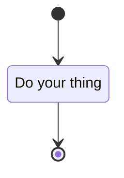
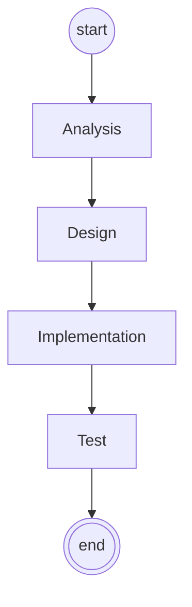
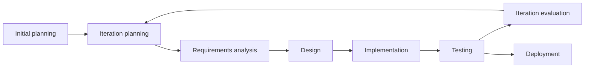
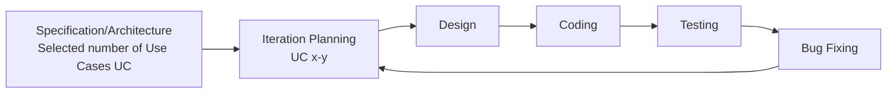
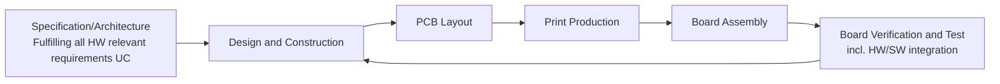
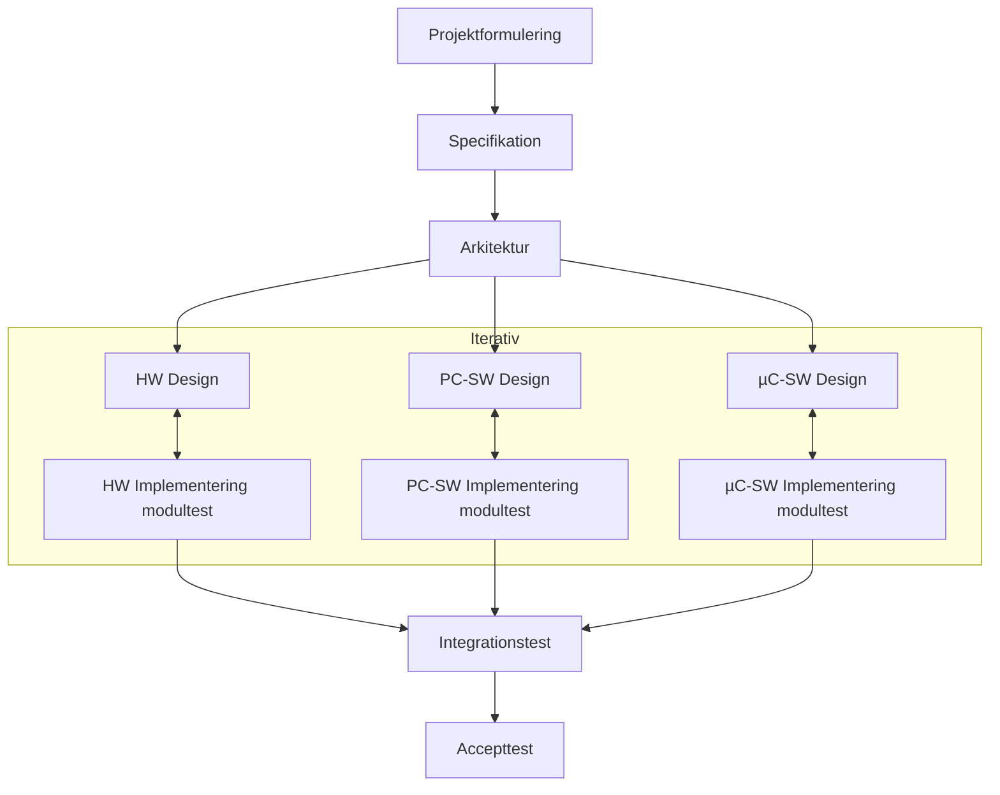

# Development Processes

## Metadata

| Felt | Værdi |
|---|---|
| **Lektion** | L8 — Udviklingsprocesser |
| **Kursus** | SWISE-01 Indledende System Engineering |
| **Kilde** | `Development Processes.pdf` (43 slides) |
| **Type** | slides |
| **Emner dækket** | Hvad er en udviklingsproces og hvorfor bruge den; traditionelle processer (null, vandfald, V-model); iterative og inkrementelle processer; SW-iterationer og HW board spins; embedded HW/SW-projektplan; Semesterprojektmodellen (ECE-modellen); RUP (faser, discipliner, artefakter); agile metoder, det agile manifest, 12 principper, XP; "the state of things" |

---

## Introduction

- What is a (development) process?
- Why do we need a development process?
- Some examples
  - Traditional, iterative, agile and the ASE processes

> Slide 2

## Systems engineering – skematisk set

*Figur: Fire kasser og en pil. Til venstre kassen "Krav, Ønsker, Visioner, Rammer, Platform" → tilstand **A**. En buet pil mærket **Proces** fører fra A til tilstand **B** → kassen "System, Dokumentation, Kvalitet, Tilfredshed". Nedefra peger en kasse "Udviklingstid, Udviklingsresurser" op på Proces-pilen — det er ressourcerne, processen forbruger.*

Med andre ord: processen transformerer input (krav, ønsker, visioner, rammer, platform) til output (system, dokumentation, kvalitet, tilfredshed) under forbrug af udviklingstid og udviklingsressourcer.

> Slide 3

## What is a development process?

- A process is the action of taking something through a defined set of steps to transform something into something else
  - Milk → cheese, metal → car, thoughts → products, etc.
- A development process is a process defined to support development (of HW, SW, …)
- A development process may define…
  - How to arrive at a product
  - What input is needed at what times
  - What (secondary) output there should be
  - …

> Slide 4

## Why use a development process?

- Using a development process may seem to incur an overhead
  - E.g., you may not actually "produce" anything before "late" in the process
- So…why do we use it?
- Because we are engineers, so we are *concerned*
  - …that we are producing the right thing
  - …with the right capabilities
  - …at the right time
  - …at the right cost
  - …

> Slide 5

*Figur: Den klassiske "tree swing"-tegneserie i 10 paneler: "How the customer explained it" (gynge med tre reb), "How the Project Leader understood it" (gynge, brættet blokeret af stammen), "How the Analyst designed it" (stammen savet over og hængt op), "How the Programmer wrote it" (gynge bundet om stammen, ubrugelig), "How the Business Consultant described it" (lænestol i sofa hængende fra træet), "How the project was documented" (tomt landskab), "What operations installed" (et reb uden bræt), "How the customer was billed" (rutsjebane), "How it was supported" (træstub), "What the customer really needed" (et bildæk i et reb). Pointe: uden en proces går forståelsen tabt mellem hvert led.*

> Slide 6

- Development processes answers some important questions:
  - What are you going to produce?
  - When will you be done?
  - What will it cost?
  - How will you handle changes?
- Answers to these questions are important to the customer
- Are the answers important to you? To your business? Why?

> Slide 7

## Examples: Traditional development processes

- The "null" process
- The waterfall process
- The V-model

> Slide 8

### The "null" process

*Figur: UML-aktivitetsdiagram: startnode → én aktivitet "Do your thing" → slutnode.*

> Slide 9

### The waterfall process

*Figur: Aktivitetsdiagram trappet nedad (vandfald): startnode → Analysis → Design → Implementation → Test → slutnode. Ingen pile tilbage.*

> "…a flawed, non-working model"
> — Winston R. Royce, 1970

> "A 1999 review of failure rates in a sample of earlier DoD projects […]: Of a total $37 billion for the sample set, 75% of the projects failed or were never used, and only 2% were used without extensive modification."
> — S. Jarzombek, 1999

> Slide 10

### The V-model

*Figur: V-formet aktivitetsdiagram. Venstre ben (nedad): Requirements Analysis → System Design → Architectural Design → Module Design → Module Impl. (bunden). Højre ben (opad): Unit test → Integration test → System test → Acceptance test → slutnode. Orange stiplede pile på tværs forbinder hvert venstre trin med sit test-niveau til højre: Requirements Analysis ↔ Acceptance test, System Design ↔ System test, Architectural Design ↔ Integration test, Module Design ↔ Unit test. Til højre er de to øverste niveauer mærket **Validation** (acceptance test) og de nederste **Verification** (system/integration/unit test).*

| Udviklingstrin (venstre ben) | Tilhørende test (højre ben) | Kategori |
|---|---|---|
| Requirements Analysis | Acceptance test | Validation |
| System Design | System test | Verification |
| Architectural Design | Integration test | Verification |
| Module Design | Unit test | Verification |
| Module Impl. | (bunden af V'et) | — |

> "V-model means Verification and Validation model. Just like the waterfall model, the V-Shaped life cycle is a sequential path of execution of processes. Each phase must be completed before the next phase begins. Testing of the product is planned in parallel with a corresponding phase of development" .. *Try to improve quality*
> — ISTQB Certification

> Slide 11

### When to use the V-model?

- The V-shaped model should be used for **small to medium sized projects** where requirements are clearly defined and fixed.
- The V-Shaped model should be chosen when ample **technical resources are available** with needed technical expertise.
- **High confidence of customer** is required for choosing the V-Shaped model approach. Since, no prototypes are produced, there is a very high risk involved in **meeting customer expectations**.

Kilde: http://istqbexamcertification.com/what-is-v-model-advantages-disadvantages-and-when-to-use-it/

> Slide 12

### Discussion

- What is the difference?

*Figur: Vandfaldsdiagrammet (Analysis → Design → Implementation → Test) side om side med V-modellen. Over V-modellen står "Improves quality!". Under V-modellen en stor buet pil fra slutningen tilbage mod starten med teksten "Possible to repeat?".*

> Slide 13

## Iterative and incremental development processes

- *Iterative* refers to the repetitive nature of the process
  - An *iteration* is a single repetition of the same sub-process.
  - The sub-process result is a partial working system of *production-quality*
- *Incremental* refers to the *continued expansion* of system capabilities.

> Slide 14

### Iterative vs. incremental

- Iterative *and* incremental

*Figur: Søjlediagram med y-akse "Req. fulfilment" (25 %, 50 %, 75 %, 100 %) og x-akse Use case 1, Use case 2, Use case 3, Use case 4. I den renderede slutversion står alle fire use cases på 100 %. Sliden er formentlig animeret (opbygning trin for trin — iterativt: alle use cases hæves lidt ad gangen; inkrementelt: én use case ad gangen til 100 %); kun sluttilstanden kan læses fra PDF'en.*

> Slide 15

### Iterations

*Figur: Cirkulært flow (grøn ring) med aktiviteterne: Iteration planning → Requirements analysis → Design → Implementation → Testing → Iteration evaluation → (tilbage til Iteration planning). En rød pil fra "Initial planning" fører ind i ringen ved Iteration planning; en rød pil ud af ringen efter Testing/Iteration evaluation fører til "Deployment".*

Callouts på figuren:

- Iterations are *short* and *timeboxed* – reduce requirements, do not extend deadline
- Each iteration produces an internal or external *production-grade system*
- Iterations are evaluated (what did we learn?)

> Slide 16

### Iterations – another view

*Figur: Tidslinje med Iteration 1 … Iteration 8 hen ad x-aksen. Hver iteration tegnes som en grøn zigzag: nedad gennem Requirements analysis → Design → Implementation, opad gennem Testing → Deployment/evaluation. To vandrette stiplede linjer angiver niveauet "Internal deliveries" (lavere) og "External deliveries" (højere). Iteration 1, 2, 4, 5, 7 topper ved internal deliveries; iteration 3 og 6 topper ved external deliveries. En rød pil "Initial planning" starter iteration 1, og en rød pil "Final delivery" afslutter iteration 8. I iteration 2 er trinene mærket "Iteration planning, Requirements analysis, Design, Implementation, Testing".*

> Slide 17

### Typical SW Iterations

*Figur: Fem cirkler i en ring med pile: Iteration Planning (UC x-y) → Design → Coding → Testing → Bug Fixing → tilbage til Iteration Planning. En pil ind i ringen fra teksten "Specification/Architecture — Selected number of Use Cases (UC)".*

> Slide 18

### Typical HW Board Spins (Iterations)

*Figur: Samme ringstruktur for hardware: Design and Construction → PCB Layout → Print Production → Board Assembly → Board Verification and Test → tilbage til Design and Construction. Input-pil fra "Specification/Architecture — Fulfilling all HW relevant requirements (UC)". Rød boks ved Board Verification and Test: "Including HW/SW integration".*

> Slide 19

### Embedded (HW/SW) Development — Overall Project Plan

*Figur: Chevron-tidslinje fra "Project start" til "Project end": Specification → System Architecture → HW Board Spin 1 → HW Board Spin 2 → Pre-production → Release. Under HW-sporet et parallelt SW-spor der starter efter System Architecture: SW Iteration 1 → SW Iteration 2 → SW Beta test, som munder ud i Release. Røde dobbeltpile mærket "HW/SW integration" forbinder SW Iteration 1 ↔ HW Board Spin 1, SW Iteration 2 ↔ HW Board Spin 2 og SW Beta test ↔ Pre-production.*

| Fase (HW-spor) | Parallelt SW-spor | HW/SW integration |
|---|---|---|
| Specification | — | — |
| System Architecture | (SW-sporet starter) | — |
| HW Board Spin 1 | SW Iteration 1 | ja |
| HW Board Spin 2 | SW Iteration 2 | ja |
| Pre-production | SW Beta test | ja |
| Release | (SW-sporet leverer ind) | — |

> Slide 20

### Embedded (SW) Development — Product Life-time

*Figur: Chevron-tidslinje "Product life (months)" 1–6. Under måned 2–3: SW Iteration 3 → Beta Test → Release V 1.2 (pil op i måned 3). Under måned 5–6: SW Iteration 4 → Beta Test → Release V 2.2 (pil op i måned 6). Pointe: SW-iterationer fortsætter efter produktet er i drift og leverer releases ind i produktets levetid.*

> Slide 21

## Semesterprojektmodellen

- This is the process you are going to use in your semester project
- A use case-driven, "middleweight" semi-iterative development process
- Accounts for both hardware and software development
  - Here the essential architecture needs to be fixed early in the project

> Slide 22

*Figur: Lodret procesdiagram med dokumentudgange (røde pile til dokumentikoner til højre og venstre):*

| Fase | Producerer (dokument) |
|---|---|
| Projektformulering | Projektformulering |
| Specifikation | Kravspecifikation; Accepttestspecifikation |
| Arkitektur | Systemarkitektur (HW og SW) |
| **Iterativ** (rød ramme): tre parallelle spor — HW: HW Design ↔ Implementering modultest; PC-SW: SW Design ↔ Implementering modultest; µC-SW: SW Design ↔ Implementering modultest | HW-designdokument, Hardware (HW-sporet); SW-designdokument, Source Code (SW-sporene) |
| Integrationstest | Logbog |
| Accepttest | Gennemført accepttest |

*Pile: Arkitektur forgrener sig til de tre design-aktiviteter; design og implementering/modultest i hvert spor er forbundet med dobbeltpil (iteration); de tre implementeringer samles i Integrationstest, som fører til Accepttest.*

> Slide 23

### Analyse og Design

- Fastlæggelse af systemarkitekturen

*Figur: Ramme "Arkitektur". Øverst blokken "Systemarkitektur" med rød pil til dokumentet "Systemarkitektur, grænseflader, HW/SW-arkitektur (CPU'er)". Fra Systemarkitektur udgår pile til fem blokke: X.10 Enhed (CPU3) HW-arkitektur; X.10 Kontroller (CPU2) HW-arkitektur; PC (CPU1) SW-arkitektur; X.10 Kontroller (CPU2) SW-arkitektur; X.10 Enhed (CPU3) SW-arkitektur. HW-blokkene er blå, SW-blokkene grønne. Eksemplet er et X.10-hjemmeautomationssystem med tre CPU'er.*

> Slide 24

### Refleksion

- Læs s. 4 – 10 i "Vejledning til udviklingsprocessen for projekt 2" og især arkitektur s. 9 - 10
- Sammenlign semesterprojektmodellen og vandfaldsmodel?
- Hvilke elementer fra V-modellen er også med?
- Hvordan er der indbygget kvalitet i semesterprojektet modellen?
- Hvad målet med arkitekturfasen?
- Hvad skal beskrivelsen af systemarkitekturen indeholde?

> Slide 25

## Example: Rational Unified Process

- Rational Unified Process (RUP)
  - Developed by Rational Software (now IBM)
  - Developed from the Unified Process — Jacobson, Booch, Rumbaugh
- Actually a process framework from which processes can be instantiated

> Slide 26

### RUP: Phases and disciplines

- RUP defines 4 (sequential) phases
  - Inception — Understand what to build
  - Elaboration — Understand how to build it
  - Construction — Build it
  - Transition — Use/sell/ship it
- RUP defines 9 (concurrent) disciplines

> Slide 27

*Figur (slide 28 og 29): Det klassiske RUP-"hump chart". Kolonner = faser: Inception, Elaboration, Construction, Transition; nederst iterationer: Initial, Elab #1, Elab #2, Const #1, Const #2, Const #3, Tran #1, Tran #2. Rækker = de 9 discipliner: Business Modelling, Requirements, Analysis & Design, Implementation, Test, Deployment, Configuration & Change Management, Project Management, Environment. Hver disciplin har en "pukkel" der viser indsatsen over tid: Business Modelling og Requirements topper i Inception/Elaboration; Analysis & Design topper i Elaboration/tidlig Construction; Implementation og Test topper i Construction; Deployment topper i Transition; Configuration & Change Management vokser gennem projektet; Project Management og Environment er små, jævne pukler i hver iteration. Slide 28 fremhæver fasekolonnerne med røde rammer, slide 29 fremhæver disciplinrækkerne.*

| Disciplin | Hvor indsatsen ligger (aflæst af hump chart) |
|---|---|
| Business Modelling | Inception, aftagende gennem Elaboration |
| Requirements | Inception–Elaboration, mindre bølger i Construction |
| Analysis & Design | Elaboration, fortsætter i Construction |
| Implementation | Construction (størst), lidt i Elaboration og Transition |
| Test | Construction–Transition |
| Deployment | Transition |
| Configuration & Change Management | Stigende fra Elaboration, højt i Construction/Transition |
| Project Management | Jævnt i alle iterationer |
| Environment | Lille, primært ved start af hver fase |

> Slide 28–29

### RUP: Inception phase

- Life-cycle objectives of the project are stated, so that the needs of every stakeholder are considered.
- Scope and boundary conditions, acceptance criteria and some requirements are established.
- Activities:
  - Problem description
  - Product limitations
  - Requirements definition (use cases)
  - Acceptance test plan
  - Risk analysis
  - High-level architectural considerations

> Slide 30

### RUP: Elaboration phase

- Determine risks, stability of vision of what the product is to become
- Determine stability of architecture and expenditure of resources
- Activities:
  - Requirements elaboration, prioritization and allocation to Construction iterations
  - Risk mitigation
  - Domain analysis and design
  - HW/SW architectural considerations
  - Interface specifications

> Slide 31

### RUP: Construction phase

- Manufacture produce
- Manage risk, resources, etc. to optimize cost, schedule and quality
- Detailed iteration planning and tracking
- Activities:
  - Construction, unit/integration/system tests
  - Per-iteration working system prototype
  - Continuous focus on risk mitigation, planning etc.

> Slide 32

### RUP: Transition phase

- Marketing, packaging, installing, configuring
- Supporting user community, making corrections, updates, etc.
- Activities:
  - Acceptance test (alpha/beta test if planned)
  - Corrections, configuration control
  - User education
  - Production tests and documentation
  - Marketing
  - Market implementation

> Slide 33

### RUP: Artifacts

- RUP defines a lot of *artifacts* associated to the disciplines
  - *Documents*
  - *Models* (or *model elements*) with associated *reports*
- Is RUP a "light" or "heavy" process?

*Figur: Afhængighedsgraf over RUP-artefakter: Stakeholder Requests → Vision → Business Case → Risk List; Software Requirements Specification (indeholder Supplementary Specification og Use-Case Model) → Glossary; Vision/Business Case/Risk List → Software Development Plan → Deployment Plan; Software Development Plan og SRS → Software Architecture Document; SRS → Analysis Model → Design Model ← Software Architecture Document; Design Model → Implementation Model; Analysis Model, Design Model og Implementation Model → Test Plan.*

> Slide 34

## What's the problem?

*Figur: Et spektrum. Venstre pol: "Disciplined execution" (figur: forretningsmand med "CEO"-bogstaver) — "Plans, deadlines, documents". Tekst: "Disciplined execution kills innovation". Højre pol: "Continuous innovation" (figur: en skør professor) — "Open environment, no 'management'". Tekst: "Innovation requires 'no discipline'". En dobbeltpil mellem polerne.*

> Slide 35

## Agile methods

- Agile: *adræt, rapfodet, fleksibel, agil*
- Claiming that the traditional processes are fundamentally flawed and that many iterative processes are heavy, *agile* processes emerged in the 1990's.
- Defined in the *agile manifesto* in 2001 by 17 signatories.
- The agile "bottom line": Faith in *people* rather than *paper*
- **Mostly used for pure software development**

> Slide 36

### Agile methods: The agile manifesto

- Individuals and interactions over processes and tools
- Working software over comprehensive documentation
- Customer collaboration over contract negotiation
- Responding to change over following a plan

> That is, while there is value in the items on the right, we value the items on the left more.

> Slide 37

### The danger of Agile methods

*Figur: Dilbert-stribe (Scott Adams, 2007). Chefen: "We're going to try something called agile programming." — "That means no more planning and no more documentation. Just start writing code and complaining." Wally: "I'm glad it has a name." Chefen: "That was your training."*

> Slide 38

### Agile methods – how do you climb a mountain?

> "Like a climber planning a route over glaciers and up a mountain face, the destination is clear, but getting a safe route up the mountain and back down again takes a mixture of careful planning and an adaptive approach to events. The climbers may find impassable chasms, dangerous overhangs or unpredictable changes in weather. The plan will probably change"
> — P.G. Armour, "The Laws of the Software Process"

*Figur: Baggrundsfoto af en klippefyldt bjergside i tåge.*

> Slide 39

### Agile methods: Some of the 12 agile principles

- Satisfy the customer through early and continuous delivery of valuable software
- Welcome changing requirements, even late in development
- Business people and developers must work together daily throughout the project
- Working software is the primary measure of progress
- Simplicity – the art of maximizing the amount of work not done – is essential

> Slide 40

### Example: eXtreme Programming (XP) (Software)

- Developed by Beck, Cunningham and others
  - First coined in 1996
- Some characteristics:
  - Focus on customer satisfaction
  - Permanent on-site customer presence
  - Short development cycles
  - Incremental planning
  - Continuous feedback
  - Evolutionary design
  - Pair programming

> Slide 41

### Discussion

- Imagine you are the developer in a team. What would make you feel more comfortable – RUP or an agile process? Why?
- Now imagine you are the customer. What would make you feel more comfortable – RUP or an agile process? Why?
- Do you think it is easier to work in an agile project than in a RUP project?

> Slide 42

## The state of things

- The days of the standard process are over…
- The most commonly seen process today is tailored to meet the business needs
- Usually the process will be highly iterative with selected agile elements (team, iterations, customer involvment, etc.)
- Usually, it will be managed by Scrum (which we'll learn about later)

> Slide 43
