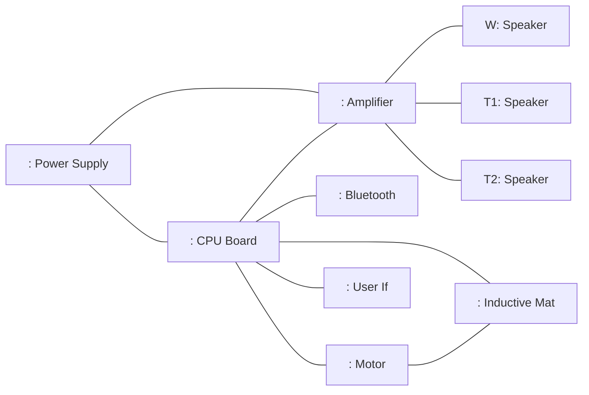

# BeoSound F — BDD og IBD

## Metadata

| Felt | Værdi |
|---|---|
| **Lektion** | L6–L11 — SysML strukturdiagrammer (BDD/IBD), BeoSound F-referencecase |
| **Kursus** | SWISE-01 Indledende System Engineering |
| **Kilde** | `BeoSoundF_BDD_IBD.pdf` (3 slides: titel, BDD, IBD) og `BeosoundF BDD.pdf` (1 side, kun BDD; ligger i `csfiles/home_dir/I2ISE Lessons/`) |
| **Type** | eksempel (rene figurer, ingen tekst) |
| **Emner dækket** | Block Definition Diagram med komposition og part-navne; Internal Block Diagram med parts og connectors; forskellen på blok (type) og part (instans-rolle, fx `T1: Speaker`) |

Begge PDF'er er rene diagrammer uden forklarende tekst. De er tegnet af underviseren på baggrund af det elektroniske blokdiagram i `BeoSoundF_ConceptReport.pdf` s. 27 (se `beosound-f-concept-report.md`). Der findes to versioner af BDD'en, som afviger på ét punkt (Inductive Mat). Diagrammerne er læst fra PNG-renderinger ved 200 dpi.

---

## BDD — `bdd BeoSoundF`

### Version A: `BeosoundF BDD.pdf` (1 side, den mest komplette)

Rammen er mærket `bdd BeoSoundF`. Én toplevel-blok «block» **BeoSoundF** med udfyldt rombe (komposition) i sin underkant. Fra romben går én linje ned til en vandret samleskinne, hvorfra der går en linje ned til hver af otte blokke. Alle otte er dermed parts af BeoSoundF (composite association). Ingen multipliciteter er angivet. Kun én composition-linje bærer et rollenavn: linjen til Speaker er mærket **T1, T2, W** (tre parts af typen Speaker: to tweetere og en woofer).

| Blok | Stereotype | Parts (dele) | Ports | Values |
|---|---|---|---|---|
| BeoSoundF | «block» | Speaker (roller T1, T2, W), Amplifier, CPU Board, Bluetooth, Power Supply, Motor, Inductive Mat, UserIF | ingen vist | ingen vist |
| Speaker | «block» | — | ingen vist | ingen vist |
| Amplifier | «block» | — | ingen vist | ingen vist |
| CPU Board | «block» | — | ingen vist | ingen vist |
| Bluetooth | «block» | — | ingen vist | ingen vist |
| Power Supply | «block» | — | ingen vist | ingen vist |
| Motor | «block» | — | ingen vist | ingen vist |
| Inductive Mat | «block» | — | ingen vist | ingen vist |
| UserIF | «block» | — | ingen vist | ingen vist |

Relationstabel:

| Helhed (whole) | Relation | Del (part) | Rollenavn / part-navn | Multiplicitet |
|---|---|---|---|---|
| BeoSoundF | komposition (udfyldt rombe ved BeoSoundF) | Speaker | T1, T2, W | ikke angivet (3 parts ifølge rollenavnene) |
| BeoSoundF | komposition | Amplifier | — | ikke angivet |
| BeoSoundF | komposition | CPU Board | — | ikke angivet |
| BeoSoundF | komposition | Bluetooth | — | ikke angivet |
| BeoSoundF | komposition | Power Supply | — | ikke angivet |
| BeoSoundF | komposition | Motor | — | ikke angivet |
| BeoSoundF | komposition | Inductive Mat | — | ikke angivet |
| BeoSoundF | komposition | UserIF | — | ikke angivet |

Blokkene er kun tegnet med navnerum (ét rum med «block» + navn). Der er ingen value-, part-, operation- eller port-compartments.

> BeosoundF BDD.pdf, s. 1

### Version B: `BeoSoundF_BDD_IBD.pdf`, slide 2 "BeoSoundF BDD"

Samme opbygning (ramme `bdd BeoSoundF`, komposition fra BeoSoundF ned til en samleskinne), men med kun **syv** blokke: Speaker, Amplifier, CPU Board, Bluetooth, Power Supply, Motor, UserIF. **Inductive Mat mangler**, og rollenavnet "T1, T2, W" på Speaker-linjen mangler. IBD'en på slide 3 indeholder dog både Inductive Mat og de tre Speaker-parts, så version A er den konsistente.

> BeoSoundF_BDD_IBD.pdf, slide 1–2

### Mapping til konceptrapportens blokdiagram

| BDD-blok | Blokke i rapportens elektroniske diagram (s. 27) |
|---|---|
| Power Supply | 230 / ADAPTER WITH MULTIPLUG / DC/DC / BATTERY / POWER MANAGER |
| CPU Board | DSP/uC (+ MOTOR DRIVER, INDUCTIVE MAT DRIVER) |
| Bluetooth | BLUETOOTH + ANTENNA |
| Amplifier | AMPLIFIER |
| Speaker (T1, T2, W) | SPEAKERS (2 × Visaton K 23 SQ tweeter/mid + 1 × Peerless 2" woofer) |
| Motor | MOTOR |
| Inductive Mat | INDUCTIVE MAT |
| UserIF | BUTTONS + BATTERY LEVEL INDICATOR |

*(Mappingen er min afledning ud fra navnene, ikke noget der står i kilderne.)*

---

## IBD — `ibd BeoSoundF`

Rammen er mærket `ibd BeoSoundF` og repræsenterer blokken BeoSoundF. Inde i rammen er 11 parts tegnet som rektangler med part-navn `rolle : Type`. Anonyme parts skrives `: Type`. Connectors er rene streger (ingen pile, ingen port-kasser, ingen item flow-labels).

### Parts

| Part (som skrevet i diagrammet) | Rolle | Type (blok) | Placering |
|---|---|---|---|
| `: Power Supply` | anonym | Power Supply | øverst til venstre |
| `: CPU Board` | anonym | CPU Board | midt (største rektangel) |
| `: Amplifier` | anonym | Amplifier | midt til højre |
| `W: Speaker` | W | Speaker | højre, øverst |
| `T1: Speaker` | T1 | Speaker | højre, midt |
| `T2: Speaker` | T2 | Speaker | højre, nederst |
| `: Bluetooth` | anonym | Bluetooth | nederst til venstre |
| `: Motor` | anonym | Motor | nederst, midt-venstre |
| `: Inductive Mat` | anonym | Inductive Mat | nederst, midt |
| `: User If` | anonym | UserIF (skrevet "User If" i IBD, "UserIF" i BDD) | nederst til højre |

### Ports

Ingen ports er tegnet. Alle connectors ender direkte på partens kant (ikke på port-symboler).

### Connectors

| # | Fra part | Til part | Bemærkning |
|---|---|---|---|
| 1 | `: Power Supply` | `: CPU Board` | fra Power Supply's højre kant til CPU Board's venstre kant |
| 2 | `: Power Supply` | `: Amplifier` | fra Power Supply's overkant, vandret over CPU Board, ned i Amplifier's overkant |
| 3 | `: CPU Board` | `: Amplifier` | vandret, CPU Board's højre kant → Amplifier's venstre kant |
| 4 | `: Amplifier` | `W: Speaker` | fra Amplifier's højre kant |
| 5 | `: Amplifier` | `T1: Speaker` | fra Amplifier's højre kant |
| 6 | `: Amplifier` | `T2: Speaker` | fra Amplifier's højre kant |
| 7 | `: CPU Board` | `: Bluetooth` | fra CPU Board's underkant |
| 8 | `: CPU Board` | `: Motor` | fra CPU Board's underkant |
| 9 | `: CPU Board` | `: Inductive Mat` | fra CPU Board's underkant |
| 10 | `: CPU Board` | `: User If` | fra CPU Board's højre kant (nederste del) |
| 11 | `: Motor` | `: Inductive Mat` | vandret mellem de to parts (mekanisk kobling: motoren ruller matten ind/ud) |

### Item flows

Ingen item flows er angivet i diagrammet (ingen pile eller «itemFlow»-labels). Ud fra konceptrapporten ville de naturlige flows være: strøm fra Power Supply til CPU Board og Amplifier; digitalt audio (I2S) fra CPU Board til Amplifier; forstærket audio fra Amplifier til W/T1/T2; Bluetooth-audiostream fra Bluetooth til CPU Board; styresignal fra CPU Board til Motor; drev-/ladestrøm fra CPU Board til Inductive Mat; knaptryk fra User If til CPU Board. Det er afledning, ikke diagramindhold.

### Forenklet gengivelse (topologi, ikke SysML-notation)

> BeoSoundF_BDD_IBD.pdf, slide 3

---

## Pointer til eksamen/projekt

- BDD viser **typer** (blokke) og deres komposition; IBD viser **parts** (instanser i en rolle) inde i én blok og hvordan de er forbundet. Samme blok (Speaker) optræder én gang i BDD'en men tre gange i IBD'en som `W`, `T1`, `T2` — rollenavnene på composition-linjen i BDD'en (T1, T2, W) er det der giver de tre parts.
- CPU Board er "hub'en": den er forbundet til alt undtagen højttalerne, som kun hænger på Amplifier.
- Power Supply er kun forbundet til CPU Board og Amplifier — de to strømtunge parts. De øvrige parts får implicit strøm via CPU Board (ikke vist).
- Diagrammerne er bevidst minimale: ingen ports, ingen item flows, ingen multipliciteter, ingen value properties. Det er et niveau under det, der forventes af et fuldt SysML-modelleringsarbejde, men det er nok til at vise dekomponeringen.
