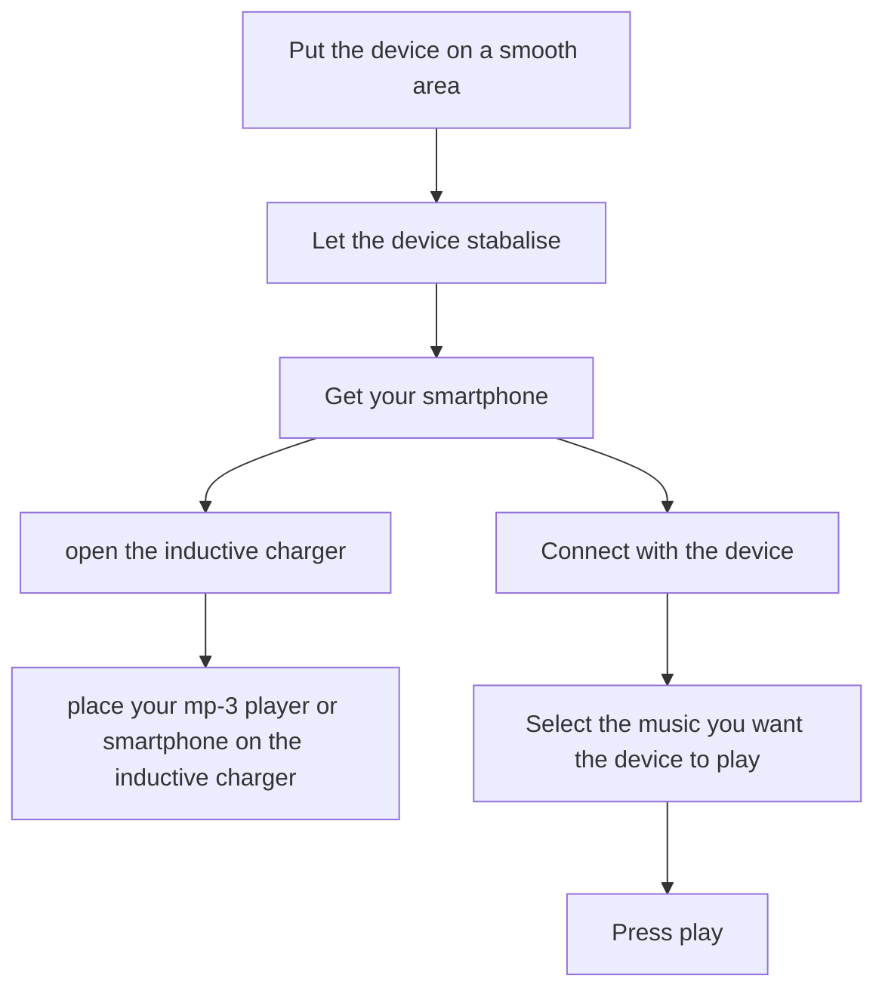
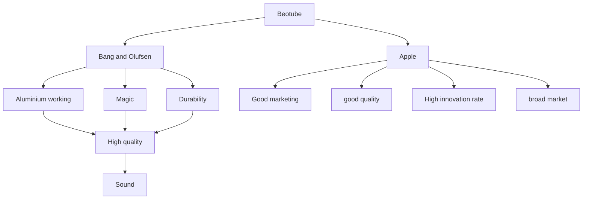
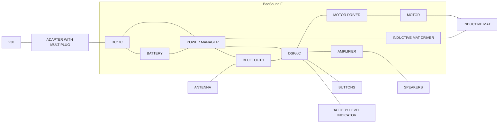

# BeoSound F — Concept Report (referencecase)

## Metadata

| Felt | Værdi |
|---|---|
| **Lektion** | L6–L11 — SysML (BDD/IBD) og kravspecifikation; BeoSound F bruges som gennemgående referencecase |
| **Kursus** | SWISE-01 Indledende System Engineering |
| **Kilde** | `BeoSoundF_ConceptReport.pdf` (49 sider; rapportens egne sidetal 1–48, forside og abstract er begge nummereret 1) |
| **Type** | eksempel (konceptrapport, studenterprojekt for et B&O-lignende produkt) |
| **Emner dækket** | persona → scenarier → life cycle → interaction model → user requirements (hierarkisk nummererede, med Importance/Feasible/Probability/Resolvable with) → House of Quality → SWOT → product description → mekanisk/elektronisk/software-løsning → safety → solution requirements → business model canvas |

Rapportens egen tekst er gengivet på originalsproget (engelsk) og ordret, inkl. stave- og grammatikfejl, så krav-formuleringer og identifiers kan citeres præcist. Figurbeskrivelser, sidehenvisninger og noter er på dansk. Sidehenvisninger (`> s. N`) refererer til rapportens trykte sidetal.

Rapporten er dateret implicit til juli 2011 (henviser til Apple-nyheder 7/7-2011 og 11/7-2011). BDD og IBD for samme system findes i `beosound-f-bdd-ibd.md`; bemærk at BDD'ens blokke (Speaker, Amplifier, CPU Board, Bluetooth, Power Supply, Motor, Inductive Mat, UserIF) svarer til blokkene i rapportens elektroniske blokdiagram (s. 27).

---

## Forside

**BeoSound F** — *A Mobile Accessory Device*

**The Team:** Morton Bang, Wout Zwiep, Marek Gutt-Mostowy, Eduardo Rodrigues, William Slater, Tereza Elfmarkova, Venusega Kumarasegaram

*Figur (forside): 3D-rendering af produktet — et poleret aluminiumsrør liggende vandret, med et rundt, hvidt betjeningsfelt (cirkel med fire retningsmarkeringer og centerknap) på oversiden, et cirkulært højttalergitter på siden, et gitter i rørets ende, og en tynd, flad mat rullet ud under røret hvorpå en iPhone ligger (induktiv opladning).*

> s. 1

## Abstract

This document is intended to act as a formal accompaniment to the prototype BeoSound F device and explain the finer points of our interpretation of what the final product should be.

This device is intended to act as a mobile accessory device for the affluent youth of today. It consists of three major components that all serve to foster the freedom of the potential user. These main components are, the rollable induction charger, which may be used to charge any device required, although we have in mind chiefly the consumers mobile phone. Second of these key features is the portable speaker and streaming system, with which the user can stream audio files in real time from his phone to the device. Finally the portability and durability of this device will allow the user to take it anywhere s/he wants.

Please remember that this device is still in its early incarnations and should not be taken at face value. More research is needed to come to a final product, but the key features and spirit of the design are covered here.

> s. 1

## Table of Contents

| Afsnit | Side |
|---|---|
| BeoSound F / The Team | 1 |
| Abstract | 1 |
| Table of Contents | 2 |
| Team Description | 3 |
| Assignment | 5 |
| Scenario Exploration | 7 |
| Life Cycle Analysis | 9 |
| Idea Description | 12 |
| User Requirements | 13 |
| House of Quality | 16 |
| SWOT Analysis | 17 |
| Product Description | 19 |
| Product Integration | 21 |
| Design | 22 |
| Mechanical Solution | 25 |
| Electronic Solution | 27 |
| Software Solution | 34 |
| Safety Aspects | 38 |
| Solution Requirements | 40 |
| Shop Proposal | 42 |
| Conclusion | 44 |
| References and Bibliography | 45 |
| General Business Model | 46 |

> s. 2

## Team Description

| Rolle | Name | Age | School | Education | Country | Job description |
|---|---|---|---|---|---|---|
| Team Leader | Morton Bang | 26 | School of Engineering in Aarhus | Mechanical Engineering | Denmark | Team Leader |
| Process manager / Organizer | Wout Zwiep | 23 | Hanzehoogeschool Groningen | Human Technology (2nd class) | The Netherlands | Second In Command |
| Conceptual Department | Marek Gutt-Mostowy | 22 | Cracow University of Technology | — | Poland | Product Technology Specialist |
| Conceptual Department | Eduardo Rodrigues | 23 | V. Minho | Industrial Mechanical Engineering | Portugal | Conceptual Prototype Deployment Specialist |
| Software Design | William Slater | 20 | University of Newcastle Upon Tyne | Course: Computer Science w/ Games and Virtual Environments | UK | Software and Emulation Specialist |
| Design | Tereza Elfmarková | 21 | Tomas Bata University | Industrial design | Czech Republic | Industrial Product Design Specialist |
| Design | Venusega Kumararegaram | 17 | Struer Stats Gymnasium | Gymnasium | Denmark | E-Commerce Specialist |

> s. 3–4

## Assignment

The assignment is derived informally from a given persona, a persona being an aspect or aspect in this case of someone's personality perceived by others. In this case, our persona was named Andrew Desmarais.

> "Andrew Desmarais is a second generation affluent young male of 21 years old. At present he lives with his parents in Hampstead, London but is looking to move out, hopefully to an apartment in The East End of London. Andrew 's father is a self made businessman, and he has a stay at home mother. Andrew does not have any brothers and sisters but, is a very social person as he has a large number of friends. They go to pubs and music venues when socialising."

> "Andrew is a design student, and relies on his parents for financial support. He enjoys extreme sports and wants to be an artist or a musician. He currently plays in a post-punk band, but he has not found the right thing yet to settle into. Andrew has a girlfriend who is a design student as well; they met at the design school. An important hobby of Andrew is that he likes to travel to new cities. Has been to New York, Buenos Aires and Belgrade in the last year. However, because of this busy live he does not have allot of time for his family."

What is important when analysing a persona is to arrive at a central theme of the person to focus on, or more succinctly, arrive at a particular aspect of his personality to appeal to with a new product.

When one analyses what is important to Andrew, it becomes clear that his sense of freedom is what is most important to him. And not only a sense of physical freedom, but also emotional freedom and freedom of expression as well.

Let us focus on those three fundamental types of freedom. Physical freedom is perhaps the most obvious. Andrew is a very physically free person, and we can observe this firstly in his fondness for extreme sports. Such activities offer a great amount of physical freedom, depending on the choice, such as rock climbing or skiing. Another kind of freedom is seen in his travelling to great cities. Being of an affluent family, he is able to travel vast distances to see these places, money often grants a greater degree of physical freedom that the less affluent do not enjoy.

Secondly there is the emotional aspect to his freedom. We can see this kind of freedom in that Andrew is of certain age, 21 years old. It is at this age that many young people are attempting to figure out their place in the world, and form their own identity separate from their parents. Note that Andrew hopes to move to an East End flat in the near future. Having been supported entirely by parents for his lifetime, this is an important moment in his life, and indeed anyone's. Again we can mention the extreme sports that Andrew enjoys. The fear and climax given from these experiences contributes greatly to his emotional freedom, as does travelling to new cities and exploring new cultures.

Finally, there is a freedom of expression routed deep within Andrew. The fact that he is a design student shows that he is interested in expressing himself, and we can see this again in aspects of his emotional freedom that we discussed earlier. We can appeal to his personality by creating a new and innovative design, that stands out and "isn't afraid to express what it is".

So, freedom is what we shall maintain our focus on when creating this project, how can we enhance a concept as general as freedom, even broken down into these three categories? This is a question we will answer in time. As talked about in the abstract of this document, we have been tasked with creating a mobile accessory device. How will this kind of device encourage his freedom? All will become clear.

> s. 5–6

## Scenario Exploration

It is important that we discuss what kind of scenarios the device might be used in. For example, if the device needs to survive at 50 fathoms depth, there will need to be some design considerations to deal with that. What follows is a brief account of the sort of scenario's we will be expecting for this product. There are also a number of storyboards presented here from our idea factory sessions to illustrate these dynamics more effectively.

**Travelling** — As this is a mobile accessory and mobile phones are inherently of a mobile nature, the device will need to be portable enough. It could be used whilst travelling to charge ones phone while in foreign countries where a convenient charging device may not be available.

**Listening to Music** — Through correct usage, a wireless communication system can connect Andrews phone and the device, allowing them to work together and play music that the smart phone has stored on its memory.

**Moving out** — Andrew is at the age when he is trying to form his own identity independent from his parents. He is hoping to move into a London East End flat, this choice in itself says something about attitudes of the consumer.

**Extreme Sports** — Although it is not specified which extreme sports Andrew partakes in, we can imagine some likely candidates. Climbing, surfing, skating, skiing and other extreme sports are all likely contenders given Andrew's age group. All of these sports are in the open air and take a large amount of leisure time. During this time Andrew might need a recharge of his mobile or want to listen music.

*Figur (s. 7): Håndtegnet storyboard "ANDREW 21" i fire ruder: Andrew taler i telefon; "STUDY DESIGN" — Andrew ved en tegneplade/computer; "HAVE MONEY" — Andrew i jakkesæt; "DO SPORTS" — Andrew på mountainbike; "HAVE A GIRLFRIEND" — par der holder i hånd; sidste rude: Andrew i stribet trøje.*

**Artistry** — Andrew is trying to find his identity and his own style in the world of art. A transportable radio might me useful so he can take it to his studio and other places of inspiration and listen to intuitive music while making art.

**Travelling New Cities** — The device should be inherently portable, so that it could be transported round an area and remain in a state of operation, such as being taken around the cities that Andrew might be visiting on his travels. The device should also retain all possible functionality that it has when not being transported.

**In the Home** — A transportable device would be more useful if it would be handy to use at home. a docking station might be a nice addition to this end. We want the device to be just as useful at home as it is in transit. A truly all purpose device.

*Figur (s. 8): Håndtegnet storyboard "ANDREW'S STORY" i fire ruder: "AT HOME" — Andrew i sofa med røret på sofabordet og lydbølger; "AT PARTY" — mennesker omkring enheden der spiller musik; "FOR TRANSPORT" — Andrew går med rullekuffert, enheden stikker op af rygsækken; "AIRPORT" — Andrew i lufthavn med kuffert.*

> s. 7–8

## Life Cycle Analysis

It is important that we assess the life cycle of our product, particularly for a device that could spend a lot of time moving around and in transit. Durability will need to be high, wear and tear will be rife. There are a number of key functions associated with the device, we will address each of these and look at how they will affect the life cycle of the device.

| Task | Task/ Action | Attention |
|---|---|---|
| **Usage** | | |
| listening music | - Set the device down. - Let the device stabilize. - Get your smartphone. - Connect with the device. - Control the device with your smartphone. - Select the song you want to play. - Press play. - Either start loading your smartphone or put it back in your pocket. | * Let the device stabilize |
| while doing extreme sports | - Put your device on a smooth ar=ea. - See Listening Music/ Loading the device/ Loading the Smartphone | |
| traveling | - Have the device in your bag - Connect with your smartphone - See Listening music | |
| sitting in a city or other public area | - Put your device on a smooth area. - (optional) let the loadingdock roll out. - (optional) load your phone (See Loading the smartphone) or listen music (see Listen Music) - (Optional) use solarpower to load the device (see Loading the device) | |
| Loading the device | - Get the multi- plug cable. - plug the device into the net- power with multi- plug cable. - (Optional) loading by solarpower. - Put the device with the solarpanel in direction of the sun. | |
| loading the smartphone | - Set the device down. - Let the device stabilize. - Get your smartphone. - Let the Inductive charger roll out. - Place your smartphone on the inductive charger. | |

We can see there are a number of important factors here that a large speaker for example, does not have to deal with There will have to be allowances made in the engineering of this product to permit it to cope with the increased stress it will have to endure.

> s. 9–10

### Interaction model

Diagram af brugerens interaktion med enheden (orange afrundede bokse med pile):

This model illustrates how the interaction is between the user and the device. as you see it does not need a lot of interaction. The little interaction that this device requires does not need allot of software. this is a good thing because B&O is not specialized in software. This way the product will remain simple.

> s. 11

## Idea Description

This is the basic idea that we have created for the mobile accessory device. These sketches focus highly on the form of the product, and are unconcerned with technological considerations. At this stage of the project, it is the form of the product that is important, not the technology.

*Figur (s. 12, to fotograferede skitseark): Venstre ark: et rør hvorfra en flad mat rulles ud (som et pergament fra en rulle), set fra flere vinkler; pile viser udrulning; én skitse viser en telefon liggende på matten og lydbølger fra røret, annoteret "SCREEN" og "SPEAKER". Højre ark: rør i forskellige varianter — lodret stående med gitter, liggende med et forskudt midterstykke (annoteret "SLIDER"), og rør med lydbølger i enderne (annoteret "SPEAKERS").*

The form itself is an innovative concept that has been relatively unused in modern design schemas owing to technological limitations. The idea borrows heavily from concepts of futuristic smart phones where technological advances such as graphene and smart glass have been implemented. The concept is similar to a ancient piece of parchment wrapped around a scroll, but with modern technology we can bring this ancient design into the modern world as something courageous and new.

At this stage a few technological considerations have formed the design however. We can see here that the mat which rolls out from the tube piece may serve as some sort of docking or charging station, and that the tube itself could also serve as some sort of speaker system. This design appeals because it can meet the three forms of freedom that Andrew so craves. The size of the device is to be as small as technology allows, gaining portability and thus physical freedom. The emotional freedom is gained from the phone charger and lack of cables. Andrew can go where he wants when he wants and not have to worry about such things. Finally, the freedom of expression, contributed to already by the physical and emotional freedom, is sealed by the form of the device, and its "question the ordinary" aesthetic quality.

> s. 12

## User Requirements

In this section a full user requirements of the product will be detailed:

Bemærk strukturen: hvert krav bruger `<begreb>`-notation, hvor et begreb i et overordnet krav defineres i et underkrav (fx `<Portable>` → `<Size>`/`<Weight>` → `<Easy Size>`). Nummereringen er hierarkisk (1 → 1.1 → 1.1.1). Kolonnerne er: Importance (Essential / Important / Desired), Feasible?, Probability of Feasibility, Resolvable with, Number. Tomme felter er tomme i originalen. Nummereringsfejl i originalen (fx to gange 5.4.1, `<Easy Size>` om vægt og `<Easy Weight>` om størrelse) er bevaret.

| Requirements | Importance | Feasible? | Probability of Feasibility | Resolvable with | Number |
|---|---|---|---|---|---|
| **Portable** | Essential | Yes | High | Compact design (req. 5.3) | 1 |
| The Device should be \<portable\> | Essential | Yes | High | Compact design (req. 5.3) | 1.1 |
| \<Portable\> = The device should be a certain \<Size\> and \<Weight\> that makes it \<Easy\> to carry. | Essential | Yes | Medium | | 1.1.1 |
| \<Easy Size\> = The device should not be over 1kg. | Important | Yes | Medium | | 1.1.2 |
| \<Easy Weight\> = The device should not be bigger then a diameter of 7 centimetre and a length of 30 centimetre. | Important | Yes | High | | 1.1.3 |
| **Sound** | Desired | Yes | High | 2.1 Speaker Set | 2 |
| The device should be able to give a \<Good Sound\> to play music. | Desired | Yes | High | | 2.1 |
| \<Good Sound\> = The device should have speakers and a sub-woofer to \<Optimize\> the sound. | Important | Yes | High | | 2.1.1 |
| \<Good Sound\> = The device should give a \<Better Sound Level\> than a laptop or a smart-phone. | Important | Yes | High | | 2.1.2 |
| \<Optimized Sound\> = the music should be good to hear in \<Any Area\> when \<Near\> to the device. | Important | Yes | High | | 2.1.1.1 |
| \<Any area\> = Includes public parks, city areas, a house environment or other persona based locations. | Important | Yes | High | | 2.1.1.1.1 |
| \<Near\> = within a circle of 5 meter. | Important | Yes | High | | 2.1.1.1.2 |
| **Charging** | Essential | Yes | High | | 3 |
| The device should be able to \<Charge\> \<any \<Small\> device with a battery\>. | Essential | Yes | High | | 3.1 |
| \<Charging\> = Charging by inductive charging, USB and/or by using a multi-plug. | Important | Yes | | | 3.1.1 |
| \<Any \<Small\> device with a battery\> = laptop battery, smart-phone battery, mp3-players etc. | Essential | Yes | High | | 3.1.2 |
| \<Small\> = about 12 cm long and 6 cm broad. | Essential | Yes | | | 3.1.2.1 |
| The device has a \<Inductive Charging Mat\> | Essential | Yes | High | | 3.2 |
| the \<Inductive Charging Mat\> should be able to \<Roll\> out of the device | Important | Yes | High | | 3.2.1 |
| \<Roll\> = the mat should be flexible and \<thin\> | Essential | Yes | High | | 3.2.1.1 |
| \<Thin\> = the mat may not be thicker then 1 mm | Important | Yes | High | | 3.2.1.2 |
| The device has a battery to store \<Energy\> | Essential | Yes | High | | 3.3 |
| **Stabilising** | Important | Yes | High | | 4 |
| The device should be able to \<Stabilise\> itself | Important | Yes | High | Put the battery in the bottom. (req. 4.1.1) | 4.1 |
| \<Stabilise\> the bottom side of the tube has to bear the weight to stabilise the device. | Important | Yes | High | Put the battery in the bottom. (req, 4.1.1) | 4.1.1 |
| **Design** | Essential | Yes | High | | 5 |
| The design of the device should be \<Durable\> | Essential | Yes | High | | 5.1 |
| \<Durable\> = Capable of withstanding wear and tear or decay (1) | Important | Yes | High | | 5.1.1 |
| \<Durable\> = Able to perform or compete over a long period (2) | Important | Yes | High | | 5.1.2 |
| The design of the device should be \<High Quality\> | Essential | Yes | High | | 5.2 |
| \<High Quality\> = Only the \<Best Components\> | Essential | Yes | High | | 5.2.1 |
| \<Components\> = All parts should be Bang and Olufsen quality | Essential | Yes | High | | 5.2.1.1 |
| The design of the device should be \<Compact\> | Important | Yes | High | | 5.3 |
| \<Compact\> = As small as possible for a good practical use | Important | Yes | High | | 5.3.1 |
| \<Compact\> = The design could be tube- like | Important | Yes | High | | 5.3.2 |
| The interface of the device should be \<Simple\> | Essential | Yes | High | | 5.4 |
| \<Simple\> = Minimized interaction with the device. | Important | Yes | High | | 5.4.1 |
| \<Simple\> a high \<Usability\> rate | Essential | Yes | High | | 5.4.1 |
| **Safety** | Essential | Yes | High | | 6 |
| The device should be \<Safe to Use\> | Essential | Yes | High | | 6.1 |

> s. 13–15

## House of Quality

> "House of Quality is a diagram, resembling a house,[1] used for defining the relationship between customer desires and the firm/product capabilities. [2] It is a part of the Quality Function Deployment (QFD) and it utilizes a planning matrix to relate what the customer wants to how a firm (that produces the products) is going to meet those wants. It looks like a House with a "correlation matrix" as its roof, customer wants versus product features as the main part, competitor evaluation as the porch etc. It is based on "the belief that products should be designed to reflect customers' desires and tastes". It also is reported to increase cross functional integration within organizations using it, especially between marketing, engineering and manufacturing."

*Figur (s. 16): House of Quality-matrix. Taget (korrelationsmatrix mellem design requirements) og "porch" (venstre side) er tegnet som tomme gitre uden symboler. Symbolforklaring: ● Strong +, ○ Positive, X Negative, # Strong −; Customer Rating: ◉ = 9 High, ○ = 3, △ = 1 Low. Rækken "Direction of Improvement" er tom (sort felt over Importance-kolonnen). Selve matrixen (Customer Requirements (What) × Design Requirements (How)) er udfyldt med tal:*

| | Customer Requirements (What) | Importance (1-5) | Portability | Durability | Quality | Innovative | Interface | Company |
|---|---|---|---|---|---|---|---|---|
| Improve | Freedom | 5 | 5 | 4 | 5 | 5 | 0 | 19 |
| Improve | Innovative | 5 | 5 | 5 | 5 | 5 | 5 | 25 |
| Improve | Simplicity | 5 | 0 | 0 | 5 | 0 | 5 | 10 |
| Reduce | Size | 4 | 5 | 0 | 0 | 5 | 0 | 10 |
| Reduce | Defects | 4 | 0 | 0 | 5 | 0 | 5 | 10 |
| Reduce | Cost | 2 | 0 | 0 | 0 | 0 | 0 | 0 |
| | Targets | | x | x | x | x | x | 1 |
| | Company ○ | 25 (gråt felt) | 15 | 9 | 20 | 15 | 15 | 5 |
| | Absolute Importance | | 70 | 45 | 95 | 70 | 70 | |

*Kolonnen "Company" under "Customer Rating" ser ud til at være rækkesummen af cellerne (fx Freedom: 5+4+5+5+0 = 19). "Absolute Importance" (70, 45, 95, 70, 70) er den vægtede kolonnesum (Importance × celle, fx Portability: 5·5 + 5·5 + 0 + 4·5 + 0 + 0 = 70).*

> s. 16

## SWOT Analysis

### Strengths

**Design** — This designs major strength is its form, because the of the tube-like structure, this device can be taken around very easily and it looks simple. The simpleness should encourage people to use this product because of the great design. With great sound and with incredible functionality this will be a real addition to your home and travel itineraries.

**Transportability** — This device can be put in a bag very easily, is really sturdy and durable and the round shape makes it very strong. The compact format is very handy to use.

### Weaknesses

**Size** — The size is not a direct weakness of the device but it can be. Because there is a lot of technology in a very small space and the speakers need a certain amount of free air to function in an optimal way, this size can be a problem. Although experts say everything is possible in the design of the concept that has been made now. This concept is a big version of that what we want to accomplish, experts told that it was possible.

**Advertising** — Bang and Olufsen does no advertising almost, this is a weak point in the selling of this product. Because this is not a typical B&O device, users will not directly look for a product like this at a company like B&O.

### Opportunities

**New Technology** — This technology is new to the market, not many companies are manufacturing devices like these.

**New Combinations of Technologies** — The combination of the portability, good sound and inductive charger is a combination that is not available on any market yet. You can charge your smart phone without needing any cables at any time you want.

**Scope** — The scope of this product is very broad, if you look at our persona's and scenario's you can see there are a lot of scenario's that this device can be used in.

**Timing** — With the right timing and marketing, this product can have great opportunities. Teasing is a good example of a marketing strategy. Although with the wrong timing this marketing or release date can get damaged before it is even on the market.

### Threats

**Competitors** — Apple is developing a inductive charger as well. Apple is known as a good and innovative business with a broad scope of products. This might be a problem for B&O just because B&O is many times smaller and does less advertising. Apple on the contrary does a lot of advertising and is a very big company.

**New Technology** — New technologies will always contain bugs. Bang and Olufson is aiming for the best quality possible, this may dictate that the product release date is too late and that other company's bring out their product before B&O does. This may lead to a compromised and weaker position on the market.

> s. 17–18

## Product Description

**Product Version** — 1.0

**Product Name** — BeoSound F

**Purpose** — This product is a mobile accessory device. It is intended to function as an innovative new charger, using induction technology in a new format, and doubling as a convenient, portable music streaming device that can interact with a phone. It will be possible to stream audio media from the phone to the device in real time.

**Composition** — The product is composed of a tubular design which will be covered in greater detail later. It should consist of a number of design elements, chief among which should be the speaker system, as this plays the most to Bang and Olufsen's strengths, chiefly sound systems. It will be possible to stream music to this device and also charge a mobile device via induction. This is certainly achievable using current research into induction technology.

**Derivation** — The product was originally derived from a design for a clock radio that interfaces with ones phone. Originally, the idea was simply that the clock could be synchronised with your phone. Obviously, this idea went through a number of phases. At first there was no mention of the inductive charger, but we quickly settled on this as being a key feature that we wanted to have in. The product is derived from a number of designs already in use but particularly from some conceptual mobile phone designs that we liked the look of. Many technology areas are looking into technologies that allow thin or flexible items, such as glass, to be used as technological devices. For example current concepts in mobile phone technologies are exploring the idea of a phone screen rolling out of a tube, similarly to a scroll of parchment. This illustrates the form of our design, but what about the functions of the product, what are these derived from?

**Format and Presentation** — Here I will discuss how the requirements that have been laid out will fit into the product. The features of the product that we have already discussed will need to be presented in some meaningful fashion to the user. At present we are going for maximum portability but also for maximum functionality

**Quality Criteria** — We want the device to be one of quality. This means that the device itself and its inner working all have to come from Bang & Olufsen stock components and the device itself should be a polished aluminium piece that exudes quality. This means that the components within the device should be of a similar standard. The speakers should produce a very high quality sound, comparable to laptop speakers and certainly better than speakers that the speakers that come on modern smart phones.

**Mechanical Workings** — The mechanical breakdown and workings of the device are detailed in the Mechanical Solution Section.

**Electrical Workings** — The electrical breakdown and workings of the device are detailed in the Electrical Solution Section (including interfaces and block diagrams).

**Software Based Workings** — The software based workings and breakdown are detailed in the Software Solution Section.

> s. 19–20

## Product Integration

How will this product fit in with Bang and Olufsen products already in usage?

A big part of this product is made of technology that Bang and Olufsen knows well, for example the sound and the way they use aluminium in their new designs and the way they make durable technology. Bang and Olufsen makes good sound systems, this is what has become a expertise over time, making this sound suitable for this device will not be a very hard task. Big company's like BMW asked B&O to make the aluminium speaker covers and other aluminium parts of the car, this is because of the high expertise that B&O has in the working with Aluminium. The tubes for this devise are made from aluminium because it can lead away the heat that the device makes, this is not a problem for B&O to make when you look at the portfolio. When you see the designs of the products that B&O has made and then look at the years they were made, you could get surprised. Because of the high durability their products can go along for more then 15-20 years. This high durability is needed for the new "BeoSound F" because it is a transportable item that may get bumps when travelling, this techniques need to be protected on a good maybe ingenious way.

The device can be likened to the BeoSound 3 in that they both function as portable music players. However, B&O does not have any inductive charger device.

There is a strong partnership with Apple here. They have released a solar charger case as of Monday 11/-7/2011, and the IPhone is due to be given. If B&O can work together with Apple on a project like this, using the strengths and opportunities Off Apple and B&O's own strength can make this product a very strong product on a fast evolving marked. The structure below shows how the relationships between apple and B&O can work together to make the "BeoSound F".

*Figur (s. 21): Mind-map med orange bokse. Toppen "Beotube" forgrener sig til "Bang and Olufsen" og "Apple". Under Bang and Olufsen: "Aluminium working", "Magic", "Durability", som alle peger ned mod "High quality", der igen peger på "Sound". Under Apple: "Good marketing", "good quality", "High innovation rate", "broad market". "Magic" og "Durability" er de to grene fra B&O der samles i "High quality".*

> s. 21

## Design

*Figur (s. 22): 3D-rendering af BeoSound F: liggende poleret aluminiumsrør, cirkulært gitter i enden (venstre), et cirkulært højttalergitter på siden midt på røret, det runde hvide betjeningsfelt med fire retningsmarkeringer (⏮ ⏭ op/ned) og centerknap, samt endnu et højttalergitter nær højre ende.*

*Figur (s. 23): Samme rør set fra en anden vinkel; den induktive mat er rullet ud som en tynd, lys plade under højre del af røret (tom).*

*Figur (s. 24): Samme opstilling med en iPhone liggende på den udrullede mat.*

> s. 22–24

## Mechanical Solution

To use the inductive charging panel, it's planned a simple system that past through rolling out the panel to use the charger as a rigid platform, and rolling in this panel to store easily and compactly.

*Figur (s. 25): Foto af mekanismen i et adskilt målebånd — fjederhus med spole, hvorfra et tyndt, fladt bånd (matten) er trukket ud til venstre gennem to små ruller.*

As the picture shows it will be necessary to use a spring mechanism to roll the panel, and a motor to run a cylinder of material that promotes friction with the panel, to roll it.

For the fixing of devices such as batteries, speakers, amplifiers, among others, The solution is produce the cylinder with the proper locations to its setting, making assembly simpler and more robust product

Illustrative image (technical drawings)

Through simple mechanical parts, around the displacement exerted on the wheel will be multiplied to the axis of rotation of the inductive panel as shown in figure, this simple solution has the advantage of providing a mechanism with no electrical consume and light something that in view of a portable device is an advantage

*Figur (s. 26): Foto af en LEGO Technic-model: et stort hjul (venstre) drives med en blå pil (rotation), via en tandhjulsudveksling (blå pile ved de små tandhjul) overføres bevægelsen til en tromle af grå skiver (højre) med en blå pil nedad — illustrerer at hjulets forskydning udveksles til mattens rotationsakse.*

> s. 25–26

## Electronic Solution

*Figur (s. 27): Blokdiagram over elektronikken. Blokke inde i den lyseblå ramme (selve enheden): DC/DC, BATTERY, POWER MANAGER, BLUETOOTH, DSP/uC, AMPLIFIER, INDUCTIVE MAT DRIVER, MOTOR DRIVER, MOTOR. Blokke uden for rammen: 230, ADAPTER WITH MULTIPLUG, ANTENNA, SPEAKERS, BATTERY LEVEL INDICATOR, INDUCTIVE MAT, BUTTONS. Forbindelser (streger uden pile):*

| Fra | Til |
|---|---|
| 230 | ADAPTER WITH MULTIPLUG |
| ADAPTER WITH MULTIPLUG | DC/DC |
| DC/DC | BATTERY |
| DC/DC | POWER MANAGER |
| BATTERY | POWER MANAGER |
| POWER MANAGER | BLUETOOTH |
| POWER MANAGER | DSP/uC |
| POWER MANAGER | INDUCTIVE MAT DRIVER |
| ANTENNA | BLUETOOTH |
| BLUETOOTH | DSP/uC |
| DSP/uC | AMPLIFIER |
| AMPLIFIER | SPEAKERS |
| DSP/uC | MOTOR DRIVER |
| MOTOR DRIVER | MOTOR |
| MOTOR | INDUCTIVE MAT |
| INDUCTIVE MAT DRIVER | INDUCTIVE MAT |
| DSP/uC | BUTTONS |
| DSP/uC | BATTERY LEVEL INDICATOR |

### Speakers

We found solution 2.1 the best for our device. Therefore we propose having 2 mid-high range speakers (Visation K 23 SQ 8 OHM) with following specifications:

*Figur (s. 28): Datablad-graf "Visaton K 23 SQ - 8 Ohm, Frequenzgang und Impedanz": SPL [dB] (50–100) og Z [Ohm] (10–50) mod frekvens 20 Hz–20 kHz; rød kurve (Amplitude bei 1 Watt, 1m) stiger fra ~55 dB ved 200 Hz til ~75 dB fra 500 Hz og ligger 70–80 dB op til ~15 kHz; grøn impedanskurve flad omkring 8–10 Ohm.*

Technical Data:

| Parameter | Værdi |
|---|---|
| Rated power | 0,5 W |
| Maximum power | 1 W |
| Nominal impedance | Z 8 Ohm |
| Frequency response | 300-19000 Hz |
| Mean sound pressure level | 74 dB (1 W/1 m) |
| Resonance frequency | fs 530 Hz |
| Voice coil diameter | 12 mm |
| Height of winding | 1,5 mm |
| Cutout diameter | 22,5 mm |

**One woofer** — Peerless 2 inch full range loudspeaker

Electrical Data

| Parameter | Værdi |
|---|---|
| Nominal impedance | Zn 4 ohm |
| Minimum impedance | Zmin 4 ohm |
| Maximum impedance | Zo 20.3 ohm |
| DC resistance | Re 3.8 ohm |
| Voice coil inductance | Le 0.2 mH |

T-S Parameters

| Parameter | Værdi |
|---|---|
| Resonance Frequency | fs 147 Hz |
| Mechanical Q factor | Qms 3.06 |
| Electrical Q factor | Qes 0.7 |
| Total Q factor | Qts 0.57 |
| Force factor | Bl 2.8 Tm |
| Mechanical resistance | Rms 0.47 Kg/s |
| Moving mass | Mms 1.5 g |
| Suspension compliance | Cms 0.76 mm/N |
| Effective cone diameter | D 4.1 cm |
| Effective piston area | Sd 13 cm2 |
| Equivalent volume | Vas 0.2 ltrs |
| Sensitivity (2.83V/1m) | 86 dB |
| Sensitivity (1W/1m) | 83 dB |
| Ratio BL/√(Re) | 1.4 |
| Ratio fs/Qts | F 259 |

Power handling

| Parameter | Værdi |
|---|---|
| Long-term Max Power (IEC 18.3) | 60 W |

Misc. Parameters

| Parameter | Værdi |
|---|---|
| Effective Frequency range (IEC 21.2) | 90-20k Hz |
| Frame dimensions | 55x55 mm |
| Total Mass | 132 grams |
| Frequency at ka=2 | 4655 Hz |

*Figur (s. 29): Datablad-graf for woofer: SPL [dB] 50–110 mod Frequency [Hz] 10–40000, med impedansskala 4–128 Ω til højre. Kurver: Impedance (sort, top ~150 Hz), On axis (blå), 30 degrees (rød), 60 degrees (grøn); SPL ligger ~85 dB fra 200 Hz til 10 kHz, off-axis-kurverne falder over 10 kHz.*

> s. 27–29

### Amplifier

To amplify our speakers we propose using following component:

**TAS5706B 20W Closed-loop I2S Audio Power Amplifier with Speaker EQ, DRC and SE output support**

with features mentioned below:

- Audio Input/Output
  - 20-W into an 8-Ω
  - Two Serial Audio Inputs (Four Audio Channels)
  - TAS5706A Supports:
    - 2-Ch Bridged Outputs (20 W × 2)
  - TAS5706B Supports:
    - 2-Ch Bridged Outputs (20 W × 2)
    - 4-Ch Single-Ended Outputs (10 W × 4)
    - 2-Ch Single-Ended + 1-Ch Bridged (2.1 Mode) (10 W × 2 + 20 W)
  - Supports 32-kHz-192-kHz Sample Rates (LJ/RJ/I2S)
- Closed Loop Power Stage Architecture
  - Improved PSRR Reduces Power Supply Performance Requirements
  - Higher Damping Factor Provides for Tighter, More Accurate Sound With Improved Bass Response
  - Constant Output Power Over Variation in Supply
- Wide PVCC Range From (10 V to 26 V)
  - No Separate Supply Required for Gate Drive
- Headphone PWM Outputs
- Subwoofer PWM Outputs
- AM Interference Avoidance Support
- Audio/PWM Processing

Considering above things we still need dedicated DSP

**ADAU1445: SigmaDSP® Digital Audio Processor with Flexible Audio Routing Matrix** — Link to file with specifications of this audio processor is available in references

> s. 30

### Bluetooth chip

The bluetooth chip in our device will be responsible for streaming the music. We decided to use this kind of connection, while the device is supposed to stream music inside of our room,or next to us in a park for instance, therefore we don't need high-range connection like wifi technology. For calculations we used following model of bluetooth chip: **µBlue nRF8001 Bluetooth**. The specification of it avaiable in a link at the end of the report.

### Inductive charger

One of the main functions of our device is an inductive charger. External devices will be possible to get charged by putting them on an inductive mat, which thickness won't extend 1mm. Mat will consist of 8 layers and covers on both sides. The rigidness of the mat will be small enough to roll it into the device and at the same time prevent it from being in standby mode while other functions will be turned on. We expect the mat to be big enough to charge one device, however, making it bigger with existing mechanism will make it more efficient in terms of energy saving in comparison to wired chargers. Further research on that subject is available on following link: http://www.wirelesspowerconsortium.com/technology/total-energy-consumption.html.

We decided to use inductive charger due to the convenience, which it gives to the users. More and more devices are getting wireless and charging is one of the last issues that still requires cables. We follow the newest standards and provide device that includes technology of the future.

We took into account the fact that some of the energy will be converted into heat and will be warming up the inductive mat controller. However, casing of our device is made of aluminium so it is easy to transfer the heat outside.

### Multi plug

Worldwide adaptors in one. The worldwide adaptor has all the individual plugs in it for Europe, America, Asia and ect. You can go anywhere with it. With the sliding mechanism it makes sure that the plug can be used in 150 different countries. The plug intense 1300W by 220V and 650W by 110V it also intense 6.3A. The greatest with the multi plug, size is no problem, when it's in a size that can be brought wherever in the world.

### Bag for Beo SoundF

For this exclusive product, we need a protective bag for the product. It contains a lot of materials that can't handle getting small shocks. There for we build a hard plastic cover around it first and then afterwards there will be leather cover around that will be what we can see. In the middle of the tube is where the tube can be open, you open it by twist and it will give a click, and the bag is open. There is not only going to be space for the Beo SoundF, but also for the multi plug and the USB cable that's going to be in the end of the bag. The bag is going to be a little bigger than the Beo SoundF, for the space to the multi plug and USB cable.

> s. 31

### Battery

We require from our device being able to play music for 6 hours with 50% of loudness and recharge a standard battery phone at least 3 times. Therefore the battery has to be as powerful as possible and at the same time as small as possible. Moreover it needs to be situated at the bottom of the device and its whole length, so that we can use its weight to make the device stabilizing itself. We did following calculations to get idea about how big the battery should be.

| Component | Power consumption without efficiency | | Efficiency | Power consumption with efficiency |
|---|---|---|---|---|
| Charger | 3Wh * 3 times = 9Wh | | 70% | 12.86 VAh |
| Speakers | 10W * 6h = 60 Wh | because 40W 100% -> 10W 50% of volume | 90% | 66,67 VAh |
| Bluetooth | 0.1 W * 6h = 0.6 Wh | | 90% | 0.67 VAh |
| uC/uP | 0.5 W * 6h = 3 Wh | | 90% | 3.33 VAh |

The total power consumption = 83,53

For our purposes we can use for instance this particular battery:

Thunder Power RC TP-5000-4SSRD LiPo:
- Voltage: 14.8V
- Cells: 4SSRD
- Capacity: 5000mAh
- Weight: 500g
- Dimensions: 40.0 x 47.0 x 138 mm

That gives us knowledge about how big should be battery to posses wanted requirements and also what is its weight. Nevertheless we have to remember that in our device the shape of the battery needs to be made especially for it and its weight has to be used to make its stabilizing itself.

The battery will have its level indicator. It will be build of few diodes situated in small holes on the front side of the tube.

> s. 32–33

### Buttons

The device will have user interface consisting of three different capacitance sensors. First one of a shape of a circle will be responsible for controlling music. Additionally to it in the middle of the circle we decided to situate turn on/off button. Second capacitance sensor will have a shape of a slider to roll in/out an inductive charger and will be situated above controllers of the music. Below we put three kinds of capacitance sensor that we would like to use.

*Figur (s. 33): Tre tegninger af kapacitive sensorer: (1) stor cirkulær sensor med koncentriske ringe delt i sektorer (rød/blå), (2) lille cirkulær sensor med koncentriske ringe — billedtekst "Sensor to control music and turn on/off device"; (3) et rektangulært, tomt felt — billedtekst "Slider responsible for rolling in/out inductive mat." Der er en fodnote-stjerne (*) ved cirkelsensorerne uden tilhørende tekst.*

> s. 33

## Software Solution

The system will rely on a number of different software components, this brief summary will be followed by a :

**Media Streaming** — It shall be possible for the device to stream music over a wireless connection to a smart-phone. This will be accomplished through the use of the already existing B&O App for the smart phone market.

There are a number of standards which will need to be followed in order to comply to the most recent development standards. The most important of these standards is the DLNA. The DNLA or Digital Living Network Alliance is a non profit organization first established by Sony in 2003. It comprises around 250 companies involved in areas of mobile applications and electronic endeavours.

Later on there is an important section on Bluetooth and the Advanced Audio Distribution Profile (A2DP).

**Media Codecs** — Another area that needs to be looked over in detail is the content of what is being streamed. Media Codecs, or Media Compressors and Decoders, will need to be considered if music is to be streamed directly from multiple devices and operating systems (Android and IOS). According to experts, the technology already developed on the Bang and Olufsen App for these markets uses a standardised codec. If this is the case then streaming from the App will be an uncomplicated affair.

**Safety Aspects** — It is possible that the device will be able to deploy itself from a closed state. This is perfectly possible but there should be some way to monitor if something has become trapped in the device and prevented it from closing. There shouldn't be a need for sensors to detect this, merely some smart programming with the proper use of timers on the in built micro controller.

**Accelerometer** — It should be possible for the device to right itself by rolling to the correct angle, through gravity. The tahoe board currently in use provides the FusionWare Accelerometer which is capable of fulfilling this function.

**Networking with mobile device** — The device will need to be able to interface with a mobile device. This would likely be achieved over a short distance (a few meters) so would most likely be accomplished by the use of an ad-hoc wireless fidelity network solution, which I will expand upon later.

> s. 34

### Media Streaming

It is integral to the operation of the device that there be a way to stream media from the mobile phone to the device.

**What tasks need to be completed to make this a reality?**

In order to allow the phone to stream media wirelessly from itself to the device, we will need a couple of things. Firstly, there is the software aspect of the phone. There needs to be some sort of application that can utilise the wireless on the phone in order to create an ad hoc network and transmit things to device, in this case, commands and media stream, plus any overhead. The application should be fairly simple and could even come as a free, general control App distributed freely.

So that deals with what software would need to go on the phone (we will discuss problems with this in a moment), what about the device. Obviously, the device itself will need to be able to receive signals from the phone and then play them. In terms of software, this means embedded devices. There will need to be software on the embedded chips in the device that can deal with the wireless network to stream media. There are problems we will talk about that deal with the memory on the device to stream media and cope with a wireless network. Other than this there is the retransmission from the receiver to the speakers on the device, which will need to be handled quickly. Also the device will need to be able to transmit for a proper communication protocol.

So the software on both the phone and the device has been covered, although problems with them have not been covered. Finally there is the question of what needs to be done with the embedded devices on the system. What chip sets will be used, what framework will they be programmed with? I will address this in the problems faced now.

A final note is that if the device is to be capable of wireless streaming then it should comply to the standards set forth in the DLNA standard (Digital Living Network Alliance), which aims to create a standard for devices and networks such as the one proposed.

**What problems are faced based on what we know about the product already?**

First we should look at the app that will have to be designed to interface with the product. There is the problem of exclusivity and developing for particular platforms with different standards. I am aware that B&O already has a mobile application for IPhone. It is possible that we could design an upgraded version of this application, but I believe it would be in the interests of the company to develop a new application along the same grounds as the original, and distribute it for free. I will talk more about this later.

Media streaming presents a number of inherent problems. Streaming the audio from the phone to the device should be uncomplicated. We will start with the most obvious, the physical requirements of streaming high quality audio to the device. Most mobile phones should be capable of streaming. There are a number of standards to do with wireless streaming. Up until recently, smart phones used the wireless g specification. Phones such as the IPhone 3GS support g, as do most other smart phones. However, recently, wireless n specification has been made an official standard and released from draft. It is recommended that a wireless n capable receiver be placed inside the device as more modern smart phones will be capable of utilising the new wireless n specification, and such transmitters are backwards compatible.

The only thing we haven't considered is the device itself. What problems are there to be found here. Well there is the programming of the embedded device to deal with the communication. This should be no problem as software issues are minimal. The device itself is totally insulated from the outside world except for the wireless, so there aren't really many issues with that. There are a few problems at the most basic level though. The issue during development is that the Tahoe 2 Development Board does not have a very large memory. Certainly not large enough to deal with streaming media. It is perfectly possible to stream media to a wireless device, but research is required to identify the correct device for this system.

**Solutions to these Problems?**

First the software component of the smart phone. It would represent a larger market to design an Android Application, but B&O may wish to make this app exclusive to the IPhone given the association it has with Apple. It is possible to port and create an App for both platforms. So the phone software is easily attainable.

**Bluetooth 2.0 + EDR Profile** — This is a different kind of Bluetooth, more advanced than the Bluetooth that is currently and generally accepted. This version of the Bluetooth Core Specification was released in 2004 and is backward compatible with the previous version 1.2. The main difference is the introduction of an Enhanced Data Rate (EDR) for faster data transfer. The nominal rate of EDR is about 3 Mbit/s, although the practical data transfer rate is 2.1 Mbit/s. EDR uses a combination of GFSK and Phase Shift Keying modulation (PSK). EDR can provide a lower power consumption through a reduced duty cycle.

**The Advanced Audio Distribution Profile** — This profile defines how high quality audio can be streamed from one device to another over a Bluetooth connection. For example, music can be streamed from a mobile phone to a wireless headset, or in this case, our device.

A2DP was initially used in conjunction with an intermediate Bluetooth transceiver that connects to a standard audio output jack, encodes the incoming audio to a Bluetooth friendly format, and sends the signal wirelessly to Bluetooth headphones that decode and play the audio.

A2DP is designed to transfer a uni-directional 2-channel stereo audio stream, like music from an MP3 player, to a headset or car radio. This profile relies on AVDTP and GAVDP. It includes mandatory support for the low-complexity SBC codec, and supports optionally: MPEG-1 , MPEG-2, MPEG-4, AAC, and ATRAC, and is extensible to support manufacturer-defined codecs, such as apt-X.

It is worth noting also that this is supported by the major mobile phone operating systems, including but not limited to Android, Blackberry, IPhone, Linux Motorola Windows Mobile and Mac OS X.

> s. 35–36

The streaming of audio based media from the phone to the device presents us with two choices. The first option is to stream immediately from the phone to the device and play the music live. This has the advantage of slimming the device components down, but also puts pressure on the hardware of the phone, something that cannot be guaranteed given the variety of components used in modern day phones. However, most smart phones would be more that capable of such streaming and the affluent generation that B&O is currently targeting will most Likely have access to phones with adequate hardware. This should be addressed fully in the electrical engineering part of the report. The second option and also the lesser preferred of the two is to push the media to the device before playing it, so the device itself would hold the song in it's internal memory for its duration, then download a new song from the phone when it wished to play that one.

There is the choice of whether the media should be pushed over a bluetooth connection or an ad-hoc network. It is the opinion of myself that the media should be sent over an bluetooth network between the device and the user's phone. Bluetooth is generally used for cable replacement and room wide transmission. It has a lower power consumption meaning that it is better for a portable device,

The device itself is essentially an embedded device, which will consist of a transmitter, hopefully of the wireless n standard in the 5GHz range, in order to yield better signal to the customers phone.

*Tabel (s. 37, sammenligning af trådløse teknologier, gengivet fra figuren):*

| Feature | WLAN | Bluetooth | ZigBee | Z-Wave |
|---|---|---|---|---|
| Maximum bandwidth | 11 megabits/second (Mb/s) | 1 / 2.1 Mb/s | 0.2 Mb/s | 0.1 Mb/s |
| Power consumption (battery life) | High (1–3 hours) | Medium (4–8 hours) | Very low (2–3 years) | Ultra low (several years) |
| Maximum distance | 100/300 m | 10/20/100 m (Class 3/2/1) | 20–100 m | 10–75 m |
| Hardware costs | High | Medium | Low | Very low |
| Footprint of protocol stack | >100 kilobytes (KB) | approximately 100 KB | approximately 32 KB | 32 KB |
| Industry standard | IEEE 802.11 a, b, and g | IEEE 802.15.2 | IEEE 802.15.4 | Zensys proprietary technology |
| Frequency | 2.4 GHz | 2.4 GHz | 2.4 GHz | 900 MHz |
| Maximum number of network nodes | Nearly unlimited | 7 (generally, 2 are used) | 250 | 232 |
| Spreading | High (PC, Notebook, PDA) | High (notebooks, PCs, PDAs, smartphones, and mobile phones) | Low (sensors and actors) | High (sensors and actors) |
| Example applications | PC networking, wireless Internet, and video streaming | Replacing cables, serving as a kind of wireless USB, and driving head sets, wireless printing, and file transfers | Home automation, industrial control, remote controls, sensors, switches, and smoke detectors | Home automation |

> s. 37

### Media Codecs

**What are Media Codecs?** — Codec is short for compressor and decoder. Media such as movies need to be decompressed and decoded before they can be played. For example an embedded media player can only play media which it has a codec for.

**What is the problem here?** — The only problem is to decide how the media is streamed from the phone to the device, and in what format. At present, BeoLiving utilises an IPhone App, meaning that if the App were used again in this situation, it would be possible to use just one codec. However, I very much doubt that the target market for this product will already own BeoLiving products. Commonly used codecs should be supported and even cooperation with Apple could solve this problem.

## Safety Aspects

There are some safety aspects to do with this product that need to be addressed. Most importantly, there is the aspect of fingers being trapped in the working parts of the machine. Although the chances of someone being this idiotic are slim, it is important that we still cater for this eventuality. The implementation of some simple programming should suffice, such that if strain is put on the motor of the device or a time limit for the closing of the case should expire, the motor of the device will reverse or cut out until activated again.

### Accelerometer

At this stage it is proposed that the device is in the shape of a tube. As such, it is also proposed that when the tube is able to roll around when placed onto a flat surface. Since this is the case, and it is also proposed that the inductive charger be capable of rolling out on its own, then logically there will need to be an accelerometer in the device that is capable of recognising when the device is at the correct orientation to start unfurling.

### Micro Controller and Operating Environment

There is the question of what kind of software we will be using to hold and develop our software. At present there are three general choices to develop this application. First there is the option of using the .NET Micro Development framework making use of socket programming to stream media over the device. There are questions over whether this device is capable of handling streaming. While it is easy to pass one music file to the device and then issue a command to play it, there are questions over the framework to actually stream.

The second option is to use a Java based system. Java provides a nice framework to deal with the Bluetooth adapter technology, as such the device would be used with Java Micro Edition, designed for resource constrained devices. The use of Java in single purpose hardware is hardly desirable though. A better solution is likely available, if only for the device itself.

Finally I have conducted some research into Windows Embedded Framework that provides some nice frameworks to deal with Bluetooth devices. This is a desirable solution as Microsoft provides a number of useful libraries to cope with the Bluetooth 2.0. This is also written in C#. so little learning is required.

### Concluding Remarks

It is the opinion of this software engineer that while the above tasks are large, they are easily achievable with the correct skill set, including the media streaming and codec issues, safety issues, sound and speaker interfaces, smart phone applications and motor control issues.

> s. 38–39

## Solution Requirements

**Presumptions** — No decisions have been made about what kind of operating system this device should have, all that is known that it has to be communicating with all smart-phone systems.

**Price** — It is said that this device should cost less than the I -pod dock but it should still be a prestige product so the price has to be high-end. In the current market this device could cost about 500 Euro / 3750 Danish crowns / 441.104 British pounds / 699.022 US dollars.

**Hardware** — What hardware should go into the device has already been discussed in the relevant sections of mechanics, electronics and software.

**Software** — The software has already been discussed in the software section. I will elaborate on this section by naming some of the components used and also the development environments that may be used. Obviously we should probably be using something other than the Java Micro Edition 3.0 development kit, but at present it is the easiest option for the bluetooth streaming. There is a special type of bluetooth that we will need to be using. This is the A2DP

**Licences**

*Logo Trademark License*

You need a trademark license to use the logo *(Qi-logoet er indsat her)* on any product or in commercial documents. The terms and conditions for the Qi trademark license are described in the Qi logo license agreement.

A review copy of that agreement is available as download from this website. See http://www.wirelesspowerconsortium.com/downloads/wireless-power-logo-license-agreement.html

The main points of the logo license agreement are:

- The logo license is available only to members of the Wireless Power Consortium. To join the WPC see: http://www.wirelesspowerconsortium.com/about/how-to-join.html
- Licensees do not have to pay a fee for use of the logo, other than the normal membership fee of 10,000.- Euro per year.
- Self-certification is not allowed in the first year after release of the specification. All products must be certified by an independent test lab.
- Products that are substantially similar to a previously certified product don't need re-certification.

> s. 40–41

## Shop Proposal

The online shop should interface with the current B&O shop, which currently has no online marketplace other than that of the Apple Store.

It is recommended that the product is sold in partnership with apple to make the most of the smart phone's new technology for the upcoming IPhone revamp in 2012 (http://thenextweb.com/apple/2011/07/07/next-years-iphone-could-go-completely-wireless-as-apple-experiments-with-new-way-of-charging/). Apple is currently experimenting with induction chargers also but other than the Energizer charge mat, no product has been created to make use of this new feature.

### Shop Proposal

For the Bang & Olufsen Website, we want to make an online shop for the website, and some changes for the website. To be more wide open for all ages, that it will not just be for the elderly generation but as well for the younger generation. The new design, have to contain more colors then just black and white. The photos have to be more colorful, and sharper. And maybe even some photo slides of the different new products. Instead of the only present the new product.

Keep it simple in the side, where all the info is the menu. When we choose one of the options at the menu, the menu will get bigger to avoid this problem. The choices there are under the category that have been chosen in the menu is going to be on the screen, so you can see what all kind of products there are to buy. The page should been kept as simple as possible. Underneath the menu the search box is going to be, where any kind of information about B&O can be found. The login of the website is going to be in the right corner of the website. The login is for when the buyer is going to buy something on the online shop.

In the bottom of the start page, the language and country can be chosen. And just beside it the request of joining the facebook group should be available.

*(Originalen gentager herefter de samme fire afsnit to gange mere, s. 42–43, med små variationer i stavning: "colours"/"colors", "Facebook"/"facebook". Gentagelserne er udeladt her.)*

> s. 42–43

## Conclusion

This section will conclude this report by first reflecting in general on what has been achieved so far but also commenting on what open issues remain to be resolved.

Our persona and this design fit well together. You can see from the very first paragraphs in the creation of this project up until this one, that the overall feel of the concept has not greatly changed. With a conceptual idea this powerful,it is easy to see why. Our persona started out as a freedom loving adrenaline junkie who liked travelling and extreme sports. We gave him a product designed for maximum flexibility, maximum potential, and maximum power. With the BeoSound F, it is possible for anyone to take this device with them and not be bound by cables that so cloud our modern lifestyle. The elements of this design that we are proud of include especially the portability and simplicity of the design, and the innovative new technologies that have been applied. Usually at Bang and Olufsen the focus is on using existing technologies, out of date. This is a generation of instant gratification, new technologies need to be available fast for these product magpies.

So what are the open issues regarding this product. At the moment there are actually very few. The main issue at the moment is the power component of the device. In order to have high power speakers and be able to charge a phone, a larger power supply is needed. At present the device should have enough power to charge the phone around three times through the inductive charger, and play high quality audio for six hours when working purely off of the battery. There is some development also needed to ensure that the flexible inductive charger technology is viable. At present not many phones actually implement an inductive charging coil. This is known as the Qi (ch-ee) standard. Although more and more smart-phones are implementing this technology, it is still in its infancy. Bluetooth 2.0 may also make higher power demands, but more research is required.

> s. 44

## References and Bibliography

- http://www.europe-audio.com/Product.asp?Product_ID=7649 - Peerless 2 inch full range loudspeaker
- http://www.europe-audio.com/Product.asp?Product_ID=8298 - Visaton 2.3 cm (0.9 inch) miniature speaker (2826)
- http://focus.ti.com/lit/ds/symlink/tas5706b.pdf - TAS5706 20-W Stereo Digital Audio Power Amplifier with EQ and DRC
- http://www.analog.com/static/imported-files/data_sheets/ADAU1442_1445_1446.pdf - ADAU1445: SigmaDSP Digital Audio Processor
- http://en.wikipedia.org/wiki/House_of_Quality House of Quality
- http://www2.electronicproducts.com/Bluetooth_chip_offers_lowest_power-article-icacn08_mar2011-html.aspx - µBlue nRF8001 Bluetooth

> s. 45

## General Business Model

*Figur (s. 46): Business Model Canvas med ni nummererede felter og pile mellem felterne. Indhold:*

| Felt | Indhold |
|---|---|
| 1. Customer Segments | The Target group for this product are young slightly prosperous people. With young we mean the age of 20 years to about 26 years old. This group is often looking to find themselves. Freedom is a keyword to sell this product to this target group. |
| 2. Customer Relationships | A comfort product. The user will have the feeling that he or she can go anywhere without thinking about energy and music. |
| 3. Channels | The product could be sold on the website or in the B&O shops that are all over the world. |
| 4. Value Propositions | With E-commerce, Teasers on the internet and commercials on tv this value can be set. Making the user interested in the product before it is even in the shop. |
| 5. Key Activities | The Key activities of the user are traveling, music, art and several sports. |
| 6. Key Partners | Apple is a good partner in innovative products and good at compatible systems. Energizer is a good manufacturer of inductive charger. |
| 7. Key Resources | - Solar panel - Inductive Charger - Battery - Aluminium tube with the diameter of 62mm |
| 8. Cost Structure | Not sure yet. |
| 9. Revenue Streams | Online selling and maybe customizing can bring up a lot of money, to have a special design for your own is something this user can be interested in. |

*(Felt 8 er i figuren kun mærket "Cost Structure" uden nummer.)*

> s. 46

## Feasibility Comments

**By Wout Zwiep (23) (Human Technology Engineer)** — I think this device will be a good product for the traveling user. It is a sturdy and cool design and it is easy to use. In combination with the easy techniques that look somewhat magical it will be a good product for B&O to sell en a very good product to use.

**By Venusega(17) (Gymnasium student)** — It's possible because of the technology, it's something that already existed. The design of the product, is not unrealistic, it's simple and transportable.

**By Marik(22)** — Despite the fact that I am student of Automation and Robotics at the mechanical faculty, in the project I was responsible for all electronic components that are supposed to be in the device. After conducting a small research on available technology I can say almost with no doubts that our device is possible to produce. The internal parts of the tube will need a lot of consideration how to put them inside and connect between each other, however our calculations show that there is enough space to make everything working.

**By Morten (26) (Mechanical Engineer)** — The shape is something new for B&O but that does not mean that it will be impossible to manufacture. B&O have the knowledge to make to aluminum tube profile. I think it will be possible to build the inside of the tube with a skeleton of maybe aluminum so it not will weight a lot. The 3 speakers will have their own seal compartment, which is made in plastic. The 4. compartment between the to small speaker will contain all of the PCB, battery and all of the other things. The prototype is maybe a bit to small to contain all of the electric components, but I think research in this field it will be possible. At the moment the speaker need to much volume behind to work, so it is necessary to let the acoustic people to make smaller speaker so the prototype will have a smaller diameter and maybe also length.

I imagine that the aluminum tube should slider over the skeleton and form the tube. If this is not possible the tube should be cut in two parts and assembly at the middle in the length direction.

So to sum up with a mechanical eye I think it will be possible to make this prototype.

**By William Slater (20) (Computer Scientist)** — In this document I will detail whether or not the aspects of this project that involve software are feasible from a technical standpoint.

In the proposed project, high quality audio is streamed from mobile phones to the device. It is my assessment that this is feasible by using the latest advancements in Bluetooth technology. At present, Bluetooth version one is not quick enough to cope with the streaming of high quality audio. However, Bluetooth 2.0 is capable of around 2-3 Mbps, which I am informed is enough to cope with audio streaming. Bluetooth operates in various profiles, these being internal specifications for for communication protocols. The Advanced Audio Distribution Profile (A2DP) is a profile that is designed to stream high quality audio wirelessly, built with mobile phones specifically in mind for the streaming. Using this profile combined with the higher bandwidth of Bluetooth 2.0, and its later versions should they be widely implemented enough when the device is released, will provide a wireless connection

The smart phone application is also feasible as I have outlined the use of three various technologies to program the wireless component of the device. This should also be possible so long as appropriate decisions can be made about exclusivity with Apple or a more open platform approach. The application would need to be designed for modern smart-phones, it is unfortunate but there will be little support for some older phones that do not support the advanced audio distribution profile for bluetooth. Fortunately, the major players in this area such as the Android, Blackberry and IPhone do support the format, so it is not a problem especially considering the target market.

It is my belief that the bluetooth connectivity could easily be ported to the device to allow streaming with more time. As for the media codecs and the smart-phone application, I have a high degree of confidence that this could also be quickly achieved.

**By Eduardo(23) (Industrial Management Engineer)** — To produce this product there are several ways, the easiest step to separate the product into two parts, the aluminum tube that will be the final form of the product, and one inside with the components already placed and fixed. This way would produce the tube by extrusion and then through rectification process to obtain the desired finish. For the interior that could be produced by forging aluminum or polymer materials by injection. Another way to produce the product would pass through the entire tube machining creating sites to secure the necessary equipment, this solution; although it has the advantage of having fewer operations than the former involves a number of disadvantages, such as a big waste of material and an added difficulty to put all the equipment inside.

This product can be sized to use equipment such as speakers of other products produced by the Bang&Olufsen; the inductive painel should be order their production to a diferent company once will not be at all benefice to the Bang&Olufsen since it does not its core.

**By Thereza (21) Industrial Design** — I think it is possible because of the round form, it is easy to take with you and it looks really good. Furthermore I think that all of the design can be made.

> s. 47–48

---

## Note: hvad rapporten IKKE indeholder

Rapporten indeholder ingen SysML-diagrammer (ingen BDD, IBD, use case-diagram, sekvensdiagram eller state machine) og ingen formelt formulerede use cases. Det tætteste er "Interaction model" (s. 11), life cycle-tabellen (s. 9–10) og det elektroniske blokdiagram (s. 27). BDD og IBD er lavet separat af underviseren på baggrund af blokdiagrammet — se `beosound-f-bdd-ibd.md`. Der er ingen kravsporbarhed ud over kolonnen "Resolvable with" (fx "Compact design (req. 5.3)").
