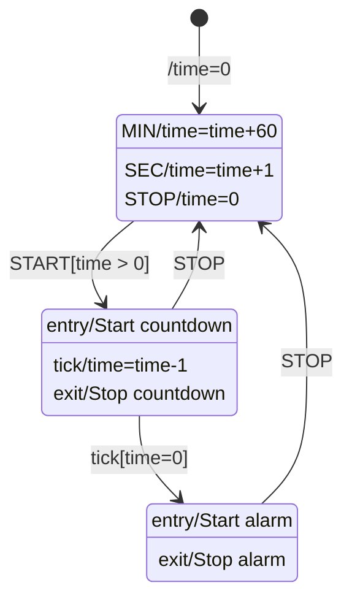
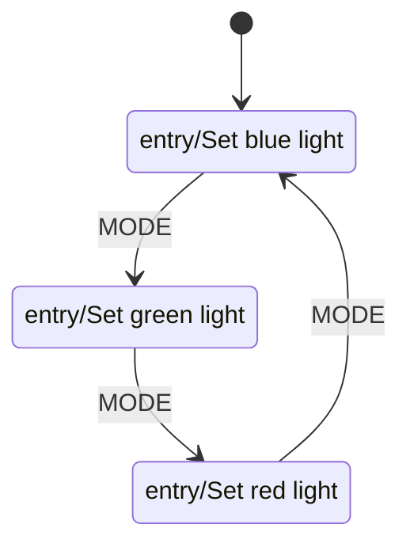
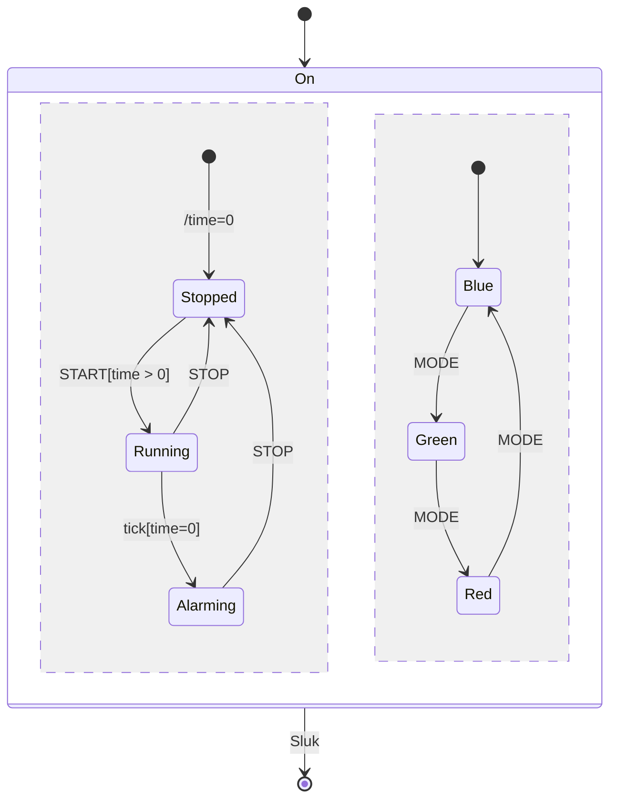

# Øvelse: Egg Timer 2000 og Pimped Egg Timer 3000 — State Machines (med løsningsforslag)

## Metadata

| Felt | Værdi |
|---|---|
| **Lektion** | L10/L11 — SysML Behavioural Diagrams: State Machine Diagrams (øvelser på slide 18 "Egg Timer 2000" og slide 14/"Exercise 2: Pimped Egg Timer 3000") |
| **Kursus** | SWISE-01 Indledende System Engineering |
| **Kilde** | `StateEggTimerSolutionF2019.pdf` (1 side), `StatePimpedEggTimerSolutionF2019.pdf` (1 side), `(L10Ex2)StatePimedEggTimerSolution_MultiRegions_E23.pdf` (1 side); opgavetekst fra `SysML Behavioural Diagrams - State Machine Diagrams.pdf` |
| **Type** | øvelse + løsningsforslag |
| **Emner dækket** | State Machine Diagram (stm), triggers, guards, effects, entry/exit-actions, internal transitions, initial/final state, composite state, orthogonal regions (multi-region) |

---

## Opgavetekst

### Exercise: Egg Timer 2000

- Create a state machine diagram for an egg timer:
  - The egg timer has four buttons: MIN, SEC, START, STOP
    - MIN, SEC: Increase time by 60 seconds and 1 second, respectively
    - START: Start countdown
    - STOP: If running: Stop countdown. If stopped: Clear time. If alarming: Stop alarm
  - Each second, there must be a tick event. If ET2000 is running, the remaining number of seconds shall be counted down by 1. If the timer expires, an alarm shall sound.
  - Ignore display updates etc. and concentrate on the setting, counting down and alarming.

> State Machine Diagrams, slide "Exercise: Egg Timer 2000"

### Exercise 2: Pimped Egg Timer 3000

- PET3000 is like ET2000, but the display can be backlit with either red, green or blue light. This is controlled with the MODE button which toggles the light.
- Draw it's state machine diagram

> State Machine Diagrams, slide "Exercise 2 : Pimped Egg Timer 3000"

---

## Løsningsforslag: `stm Egg Timer` (StateEggTimerSolutionF2019.pdf)

Tre states: **Stopped**, **Running**, **Alarming**. Initial-transition med effect `/time=0` til Stopped.

| State | Internal behaviour |
|---|---|
| **Stopped** | `MIN/time=time+60`, `SEC/time=time+1`, `STOP/time=0` (alle tre er internal transitions — ingen exit/entry udløses) |
| **Running** | `entry/Start countdown`, `tick/time=time-1` (internal), `exit/Stop countdown` |
| **Alarming** | `entry/Start alarm`, `exit/Stop alarm` |

| Fra | Til | Trigger[guard]/effect |
|---|---|---|
| initial | Stopped | `/time=0` |
| Stopped | Running | `START[time > 0]` |
| Running | Stopped | `STOP` |
| Running | Alarming | `tick[time=0]` |
| Alarming | Stopped | `STOP` |

Bemærkninger:
- `tick` i Running er både en internal transition (`tick/time=time-1`) og trigger på transitionen til Alarming med guard `[time=0]`. Ved hvert tick tælles ned; når guarden er sand, tages den eksterne transition (exit/Stop countdown → entry/Start alarm). Rækkefølge/prioritet mellem de to tick-transitioner er ikke angivet i tegningen.
- START uden tid (`time=0`) ignoreres pga. guarden.
- De tre STOP-krav fra opgaven er dækket: Running→Stopped (stop countdown via exit), Stopped internal (`STOP/time=0`), Alarming→Stopped (stop alarm via exit).

---

## Løsningsforslag: `stm Pimped Egg Timer` (StatePimpedEggTimerSolutionF2019.pdf)

Hele Egg Timer-maskinen er lagt ind i en composite state **On** med **to ortogonale regioner** (adskilt af en stiplet lodret linje). Initial-transition på ydre niveau går til On. Fra On's kant går en transition med trigger `Sluk` til en final state (uden for On).

### Region 1 (venstre): timer

Identisk med `stm Egg Timer` ovenfor: egen initial pseudostate med `/time=0` → Stopped; Stopped/Running/Alarming med samme internal behaviour og transitions (`START[time > 0]`, `STOP`, `tick[time=0]`, `STOP`).

### Region 2 (højre): baggrundslys

Egen initial pseudostate → **Blue**.

| State | Internal behaviour |
|---|---|
| **Blue** | `entry/Set blue light` |
| **Green** | `entry/Set green light` |
| **Red** | `entry/Set red light` |

| Fra | Til | Trigger |
|---|---|---|
| initial | Blue | — |
| Blue | Green | `MODE` |
| Green | Red | `MODE` |
| Red | Blue | `MODE` |

### Ydre niveau

(Mermaid viser regionerne med `--`; internal behaviour er udeladt her, se tabellerne.)

Pointer:
- Regionerne er uafhængige: MODE-tryk ændrer lys uanset om timeren er Stopped/Running/Alarming, og timer-events påvirker ikke lyset.
- `Sluk` fra On's kant afslutter begge regioner samtidig (exit-actions i de aktive substates køres).
- Når On enteres, starter begge regioners initial-transitioner: `time=0` og `Set blue light`.

---

## Løsningsforslag E23: Pimped Egg Timer, multi-regions ((L10Ex2)StatePimedEggTimerSolution_MultiRegions_E23.pdf)

Semantisk **samme** maskine som StatePimpedEggTimerSolutionF2019, tegnet i UMLet uden diagramramme (opdateret version brugt fra E23). Forskelle er kun kosmetiske:

- Guard skrevet `START[time>0]` (uden mellemrum).
- Sluk-triggeren skrevet med lille `sluk`; transitionen går fra On's underkant lodret ned til final state.
- Transitions tegnet retlinet i stedet for buet.

Composite state `On`, to regioner adskilt af stiplet linje:

| Region | States | Transitions |
|---|---|---|
| venstre (timer) | Stopped (`MIN/time=time+60`, `SEC/time=time+1`, `STOP/time=0`), Running (`entry/Start countdown`, `tick/time=time-1`, `exit/Stop countdown`), Alarming (`entry/Start alarm`, `exit/Stop alarm`) | initial `/time=0`→Stopped; Stopped→Running `START[time>0]`; Running→Stopped `STOP`; Running→Alarming `tick[time=0]`; Alarming→Stopped `STOP` |
| højre (lys) | Blue (`entry/Set blue light`), Green (`entry/Set green light`), Red (`entry/Set red light`) | initial→Blue; Blue→Green `MODE`; Green→Red `MODE`; Red→Blue `MODE` |

Ydre: initial→On; On→final `sluk`.

Mermaid-diagrammerne ovenfor gælder uændret.
