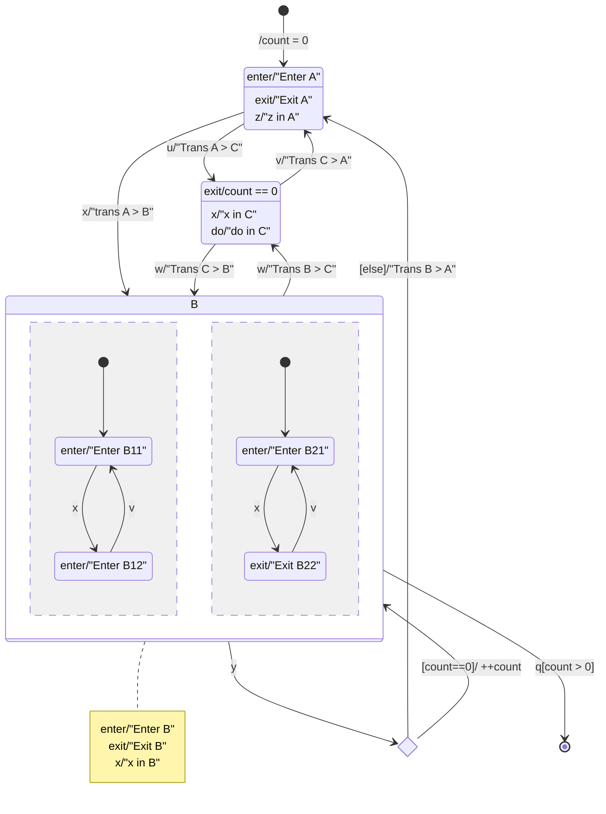

# Øvelse: Konsol-STM (LearnSTMs) — bestem konsollens output (med løsningsforslag)

## Metadata

| Felt | Værdi |
|---|---|
| **Lektion** | L10/L11 — SysML State Machine Diagrams |
| **Kursus** | SWISE-01 Indledende System Engineering (I2SE) |
| **Kilde** | `SysML State Machines (konsol).pdf` (3 sider: note + opgaver + løsninger) + `SysML State Machines (konsol) løsningsforslag.pdf` (2 sider: løsninger + stm-figur) |
| **Type** | øvelse + løsningsforslag |
| **Emner dækket** | entry/exit/do-actions, internal transitions, effects, guards, choice pseudostate ([else]), composite state med to ortogonale regioner, initial pseudostate i regioner, final state, run-to-completion, rækkefølge af exit/effect/entry |

---

## Opgavetekst

**Opgaver og eksempler — SysML State Machine Diagrams**

I denne note præsenteres du for en SysML State Machine Diagram (stm), som bruges til at stille en række opgaver og løsningsforslag. Formålet med noten er at træne dig i at forstå stm'er.

Det giver *ingen* mening blot at læse denne note. Så spilder du tiden. For at få et udbytte af den er du nødt til at lave opgaverne. De er små men gode. Løsningsforslag på opgaverne er givet på de efterfølgende sider. Hvis du er i tvivl om hvorfor resultatet er, som det er, skal du først spørge din gruppe eller andre i klassen til råds, derefter din underviser.

Nedenfor vises et SysML State Machine Diagram (stm), som benyttes i de kommende opgaver/eksempler. Man skal forestille sig at stm'en kører i et konsol-program, hvor effects, f. eks. "Enter B", skrives ud på hver sin linie med et "> " foran, og hvor triggers, f. eks. x, ligeledes gives i konsollen med et "< " foran. Opgaverne illustrerer de fleste af de aspekter der har været behandlet i I2SE omkring stm'er.

> Side 1

### `stm LearnSTMs [Examples]`

Variabel: `count`. Initial-transition: `/count = 0` → A.

| State | Internal behaviour |
|---|---|
| **A** | `enter/"Enter A"`, `exit/"Exit A"`, `z/"z in A"` (internal) |
| **B** (composite, to regioner) | `enter/"Enter B"`, `exit/"Exit B"`, `x/"x in B"` (internal) |
| B region 1: **B11** | `enter/"Enter B11"` |
| B region 1: **B12** | `enter/"Enter B12"` |
| B region 2: **B21** | `enter/"Enter B21"` |
| B region 2: **B22** | `exit/"Exit B22"` |
| **C** | `exit/count == 0` (som skrevet i figuren; effekten sætter count til 0, se opg. 5), `x/"x in C"` (internal), `do/"do in C"` |

Transitions:

| Fra | Til | Trigger[guard]/effect |
|---|---|---|
| initial | A | `/count = 0` |
| A | B | `x/"trans A > B"` |
| A | C | `u/"Trans A > C"` |
| B | choice (◇) | `y` |
| choice | B | `[count==0]/ ++count` |
| choice | A | `[else]/"Trans B > A"` |
| B | C | `w/"Trans B > C"` |
| C | B | `w/"Trans C > B"` |
| C | A | `v/"Trans C > A"` |
| B | final | `q[count > 0]` |
| B11 | B12 | `x` |
| B12 | B11 | `v` |
| B21 | B22 | `x` |
| B22 | B21 | `v` |

Region 1 har initial → B11; region 2 har initial → B21. Begge regioner enteres når B enteres.



> Side 1 (figur)

### Opgaverne

Opgaverne beder dig bestemme konsollens indhold efter kørslen af en given sekvens af triggers. For eksempel:

**Opgave 0:** Bestem konsollens indhold efter følgende sekvens af triggers: (u, v)

Svaret på denne opgave er:

```
> Enter A
< u
> Exit A
> Trans A > C
> do in C
> do in C
> do in C
< v
> Trans C > A
> Enter A
```

**Opgave 1:** Bestem konsollens indhold ved kørslen af følgende sekvens af triggers: (x)

**Opgave 2:** Bestem konsollens indhold ved kørslen af følgende sekvens af triggers: (x, y, y)

**Opgave 3:** Bestem konsollens indhold ved kørslen af følgende sekvens af triggers: (x, w, x, v)

**Opgave 4:** Bestem konsollens indhold ved kørslen af følgende sekvens af triggers: (z, x, x, y, q, x, y, z)

**Opgave 5:** Bestem konsollens indhold ved kørslen af følgende sekvens af triggers: (x, w, x, w, x, x, v, y, q, x, y, z)

> Side 2

---

## Løsningsforslag

(Side 3 i konsol.pdf og side 1 i løsningsforslag.pdf er identiske; side 2 i løsningsforslag.pdf er stm-figuren igen plus Opgave 0.)

Notation: `> tekst` er output, `< t` er indtastet trigger. Antal `do in C`-linjer afhænger af hvor længe maskinen står i C før næste trigger — løsningerne bruger 2–3 linjer.

### Opgave 1: (x)

```
> Enter A
< x
> Exit A
> Trans A > B
> Enter B
> Enter B11
> Enter B21
```

Forklaring: exit-action på A, så transitionens effect, så entry på B, derefter entry på begge regioners initial-states (B11, B21).

### Opgave 2: (x, y, y)

```
> Enter A
< x
> Exit A
> Trans A > B
> Enter B
> Enter B11
> Enter B21
< y
> Exit B
> Enter B
> Enter B11
> Enter B21
< y
> Trans B > A
> Enter A
```

Forklaring: Første `y`: count==0 → choice-grenen `[count==0]/++count` går tilbage til B (ekstern self-transition: B forlades og enteres igen, inkl. regionerne; B11/B21 har ingen exit-actions, så kun "Exit B" ses). count er nu 1. Andet `y`: `[else]/"Trans B > A"` → A. Bemærk at løsningen ikke skriver "Exit B" ved anden `y` (som skrevet i originalen).

### Opgave 3: (x, w, x, v)

```
> Enter A
< x
> Exit A
> Trans A > B
> Enter B
> Enter B11
> Enter B21
< w
> Exit B
> Trans B > C
> do in C
> do in C
< x
> x in C
> do in C
> do in C
< v
> Trans C > A
```

Forklaring: `w` i B → C; `do`-aktiviteten i C kører (gentagne "do in C") indtil en trigger kommer. `x` i C er en internal transition ("x in C") — state forlades ikke, do fortsætter. `v` → A (løsningen viser ikke "Enter A" til sidst — som skrevet i originalen).

### Opgave 4: (z, x, x, y, q, x, y, z)

```
> Enter A
< z
> z in A
< x
> Exit A
> Trans A > B
> Enter B
> Enter B11
> Enter B21
< x
> x in B
> Enter B12
< y
> Exit B22
> Exit B
> Enter B
> Enter B11
> Enter B21
< q
< x
< y
< z
```

Forklaring:
- `z` i A: internal transition, ingen exit/entry.
- Andet `x` (i B): B's internal `x/"x in B"` fyrer, og samtidig B11→B12 (`x`, "Enter B12") og B21→B22 (`x`; B22 har kun exit-action, så intet output ved entry).
- `y` med count==0: self-transition på B → exit-actions af aktive substates først (B22: "Exit B22"; B12 har ingen exit), så "Exit B", `++count`, "Enter B", "Enter B11", "Enter B21".
- `q[count > 0]`: count er 1, så guarden er sand og maskinen går til **final state**. Løsningen viser ingen exit-output her, og de efterfølgende triggers `x`, `y`, `z` giver intet output — maskinen er terminert.

### Opgave 5: (x, w, x, w, x, x, v, y, q, x, y, z)

```
> Enter A
< x
> Exit A
> Trans A > B
> Enter B
> Enter B11
> Enter B21
< w
> Exit B
> Trans B > C
> do in C
> do in C
< x
> x in C
> do in C
> do in C
< w
> Trans C > B
> Enter B
> Enter B11
> Enter B21
< x
> x in B
> Enter B12
< x
> x in B
< v
> Exit B22
> Enter B11
> Enter B21
< y
> Exit B
> Enter B
> Enter B11
> Enter B21
< q
< x
< y
< z
```

Forklaring:
- `w` fra C → B: C's `exit/count == 0` nulstiller count (ingen konsoloutput, da det ikke er en streng).
- Første `x` i B: "x in B" + B11→B12 ("Enter B12") + B21→B22 (intet output).
- Andet `x` i B: kun internal "x in B" — B12 og B22 har ingen `x`-transition.
- `v`: B12→B11 og B22→B21: "Exit B22" (exit-action på B22), "Enter B11", "Enter B21". Rækkefølge i løsningen: Exit B22 først, derefter entries.
- `y` med count==0 (nulstillet ved exit fra C): self-transition på B, ++count → count=1. Her har substaterne B11/B21 ingen exit-actions, så kun "Exit B".
- `q[count > 0]`: sand → final state. `x`, `y`, `z` derefter giver intet output.

> Side 3 / løsningsforslag side 1

---

## Læringspointer (samlet)

1. Rækkefølge ved en transition: exit-actions (inderst ud), transitionens effect, entry-actions (yderst ind), derefter initial-transitions i regioner.
2. Internal transitions (`x/"x in B"`, `z/"z in A"`) udløser hverken exit eller entry.
3. En ekstern self-transition (B → choice → B) forlader og gen-enterer staten inkl. alle regioner.
4. `do`-aktiviteter kører så længe staten er aktiv og afbrydes ikke af internal transitions.
5. En trigger kan fyre transitions i flere ortogonale regioner samtidig plus en internal transition i den omsluttende state (opg. 4/5: `x` i B).
6. Guards evalueres på det aktuelle variabelindhold; `[else]` tages når ingen anden guard er sand.
7. Efter final state ignoreres alle triggers.
