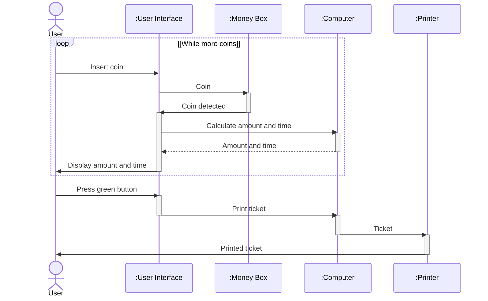

# Øvelse: Parkeringsautomat — BDD, IBD og SD (med løsningsforslag)

## Metadata

| Felt | Værdi |
|---|---|
| **Lektion** | L6 (BDD), L7/L8 (IBD), L9/L10 (SD) — SysML Structural og Behavioural Diagrams |
| **Kursus** | SWISE-01 Indledende System Engineering |
| **Kilde** | `(Exercise) SysML Structural Parkeringsautomat Ovelse.pdf` (2 slides; dublet `SysML Structural Parkeringsautomat Ovelse.pdf` uden L6/L7-markeringer) + `Parkeringsautomat_BDD_Løsning1.pdf`, `Parkeringsautomat_BDD_Løsning2.pdf`, `Pakeringsautomat_IBD_Løsning.pdf`, `(solution)Parkeringsautomat_SD.pdf` (1 side hver, UMLet-tegninger; `.uxf`-kildefiler findes også) |
| **Type** | øvelse + løsningsforslag |
| **Emner dækket** | Block Definition Diagram (bdd), komposition, ports (in/out/inout), konjugerede ports (~), Internal Block Diagram (ibd), parts, connectors, boundary ports, Sequence Diagram (sd), loop-fragment |

---

## Opgavetekst

*Slide 1: titelslide "SysML Structural Diagrams — Parkeringsautomat", Introduction to Systems Engineering, I2ISE.*

*Figur (slide 2): foto af en parkeringsautomat med pile til komponenterne: Card reader, Pay button (green), Print ticket, Undo button, Display, Coin slot, Guide phrase, Return coin slot, Money box.*

**L6 => 1. bdd diagram of components**

- Parkeringsautomat
  - Printer
  - Money Box
  - Computer
  - User Interface
    - Card Reader
    - Controller
    - Display
    - Green Button
    - Red Button

**L7 => 2. ibd diagram of User Interface**

Senere (L9/L10, Brightspace "L9 SysML SD Løsninger", Exercise1) bruges samme system til en SD-øvelse: "SD Parkeringsautomat".

> Slide 1–2

---

## Løsningsforslag 1: `bdd Parkeringsautomat` (Parkeringsautomat_BDD_Løsning1.pdf)

Diagramramme: `bdd Parkeringsautomat`. Alle blokke er stereotypet «block». Der er ingen multipliciteter angivet på nogen komposition.

### Blokke og ports

| Blok | Ports |
|---|---|
| **Parkeringsautomat** | (ingen) |
| **Printer** | (ingen) |
| **User Interface** | `in card: Card`, `in btGreen: Press`, `in btRed: Press`, `in coins: Signal`, `out disp: Text` |
| **Money Box** | (ingen) |
| **Computer** | (ingen) |
| **Card Reader** | `inout cardWires: ~Serial`, `in card: Card` |
| **Controller** | `in bt1Wire: bool`, `in bt2wire: bool`, `in coins: Signal`, `inout cardWires: Serial`, `out dispWires: I2C` |
| **Button** | `in btPress: Press`, `out btWire: bool` |
| **Display** | `in dispWires: I2C`, `out disp: Text` |

### Relationer (komposition, sort diamant ved helheden)

- `Parkeringsautomat` ◆— `Printer`
- `Parkeringsautomat` ◆— `User Interface`
- `Parkeringsautomat` ◆— `Money Box`
- `Parkeringsautomat` ◆— `Computer`
- `User Interface` ◆— `Card Reader`
- `User Interface` ◆— `Controller`
- `User Interface` ◆— `Button` — **to** kompositionslinjer, med rollenavne `btRed` og `btGreen` i del-enden (én Button-blok, to parts)
- `User Interface` ◆— `Display`

I Løsning1 tegnes hver komposition som en separat linje med egen diamant fra helheden (fire diamanter under Parkeringsautomat, fem under User Interface).

### Bemærkninger

- Green Button og Red Button fra opgaven er modelleret som **én** blok `Button` med to parts (`btRed`, `btGreen`) i stedet for to blokke.
- `Card Reader` har `cardWires: ~Serial` (konjugeret port) mens `Controller` har `cardWires: Serial` — de to ender af samme forbindelse.
- Bemærk inkonsistens i case: `bt1Wire` vs. `bt2wire` (gengivet ordret).

---

## Løsningsforslag 2: `bdd Parkeringsautomat` (Parkeringsautomat_BDD_Løsning2.pdf)

Identisk indhold (samme blokke, ports og rollenavne som Løsning1). Eneste forskel er tegnestilen: kompositionerne tegnes med **én** diamant ved helheden og en samlet "træ"-linje der forgrener sig til delene:

- Én diamant under `Parkeringsautomat` → vandret linje → `Printer`, `User Interface`, `Money Box`, `Computer`.
- Én diamant under `User Interface` → vandret linje → `Card Reader`, `Controller`, `Button` (to grene, mærket `btRed` og `btGreen`), `Display`.

Blok- og port-tabellen ovenfor gælder uændret.

---

## Løsningsforslag: `ibd User Interface [Betjening af Parkeringsautomat]` (Pakeringsautomat_IBD_Løsning.pdf)

Diagramramme: `ibd User Interface [Betjening af Parkeringsautomat]`. Rammen repræsenterer blokken `User Interface`; ports på rammen er User Interface's egne ports fra BDD'et.

### Parts

| Part | Type | Ports på part |
|---|---|---|
| `card` | Card Reader | `card: Card` (in), `cardWires: ~Serial` (konjugeret, tegnet som gråt `<>`-symbol) |
| `ctrl` | Controller | `cardWires: Serial` (`<>`), `bt1Wire: bool` (in), `bt2Wire: bool` (in), `coins: Signal` (in), `dispWires: I2C` (out, opad) |
| `btRed` | Button | `btPress: Press` (in), `btWire: bool` (out) |
| `btGreen` | Button | `btPress: Press` (in), `btWire: bool` (out) |
| `disp` | Display | `dispWires: I2C` (in, nedad), `disp: Text` (out) |

### Boundary ports (på rammen)

| Side | Port | Retning |
|---|---|---|
| venstre, øverst | `card: Card` | in |
| venstre, midt | `btGreen: Press` | in |
| venstre, nederst | `btRed: Press` | in |
| højre, øverst | `disp: Text` | out |
| højre, midt | `coins: Signal` | in (pil peger ind i rammen) |

### Connectors

| Fra | Til | Bemærkning |
|---|---|---|
| boundary `card: Card` | `card: Card Reader`.`card: Card` | kortet føres ind til kortlæseren |
| `card: Card Reader`.`cardWires: ~Serial` | `ctrl: Controller`.`cardWires: Serial` | konjugeret/ikke-konjugeret par (skrå linje) |
| boundary `btGreen: Press` (midt) | `btRed: Button`.`btPress: Press` | se bemærkning nedenfor |
| boundary `btRed: Press` (nederst) | `btGreen: Button`.`btPress: Press` | se bemærkning nedenfor |
| `btRed: Button`.`btWire: bool` | `ctrl: Controller`.`bt1Wire: bool` | vandret linje |
| `btGreen: Button`.`btWire: bool` | `ctrl: Controller`.`bt2Wire: bool` | skrå linje |
| boundary `coins: Signal` | `ctrl: Controller`.`coins: Signal` | vandret linje fra højre ramme ind til Controller |
| `ctrl: Controller`.`dispWires: I2C` | `disp: Display`.`dispWires: I2C` | lodret linje opad |
| `disp: Display`.`disp: Text` | boundary `disp: Text` | ud af rammen til højre |

Ingen item flows er tegnet på connectorne; retning fremgår kun af port-pilene.

**Bemærkning (mulig fejl i løsningen):** Etiketterne på de to venstre boundary ports står krydset i forhold til de Button-parts de er forbundet til: boundary `btGreen: Press` er trukket til part `btRed: Button`, og boundary `btRed: Press` til part `btGreen: Button`. Den logisk forventede kobling er btGreen→btGreen og btRed→btRed. Etiketten `btPress: Press` ved hver forbindelse hører til Button-partens egen port.

---

## Løsningsforslag: `sd Parkeringsautomat` ((solution)Parkeringsautomat_SD.pdf)

Lifelines: aktøren `User` (stickman), `:User Interface`, `:Money Box`, `:Computer`, `:Printer`.

Scenarie: brugeren putter mønter i (gentaget), får vist beløb og tid, trykker på den grønne knap og modtager en printet billet.

Detaljer i originalen:

- `loop`-fragmentet har guard `[While more coins]` og omfatter alle fem første beskeder.
- `Calculate amount and time` er tegnet med udfyldt pilespids (synkront kald); `Amount and time` er stiplet returbesked. De øvrige beskeder er tegnet med åben pilespids (asynkrone/signaler).
- `:Money Box`, `:User Interface`, `:Computer` og `:Printer` har activation bars hvor de behandler beskeder.
- `Printed ticket` går direkte fra `:Printer` til `User` (ikke via User Interface).
