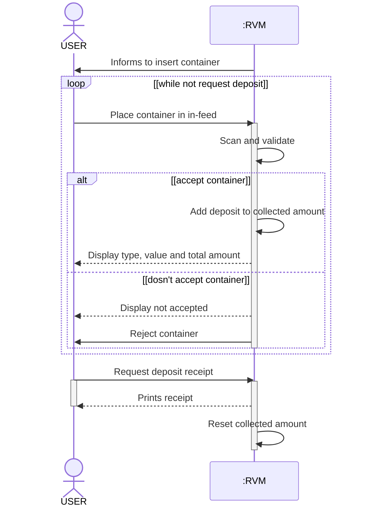
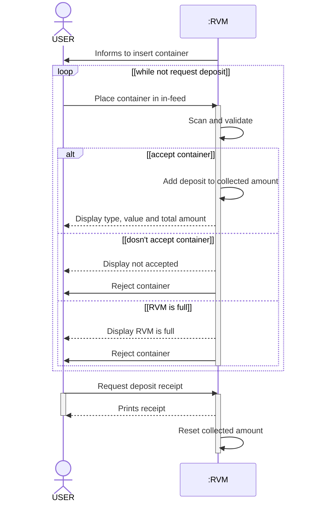

# Øvelse: Reverse Vending Machine (RVM) — Sequence Diagram (med løsningsforslag)

## Metadata

| Felt | Værdi |
|---|---|
| **Lektion** | L9/L10 — SysML Behavioural Diagrams: Sequence Diagrams (øvelse på slide 17, "SD's – your turn!") |
| **Kursus** | SWISE-01 Indledende System Engineering |
| **Kilde** | `(solution)RVM_SD.pdf` (1 side) + `(solution)RVM_SD_withExtraRVMisFull.pdf` (1 side); opgavetekst fra `SysML Behavioural Diagrams - Sequence Diagrams.pdf` slide 17 |
| **Type** | øvelse + løsningsforslag |
| **Emner dækket** | Sequence Diagram (sd), loop- og alt-fragmenter, guards, self-messages, synkrone/asynkrone beskeder, returbeskeder |

---

## Opgavetekst (L10 slide 17: "SD's – your turn!")

- Create a sequence diagram for the RVM scenario *Recycle Containers* below
  - Participants: User and RVM
- Add operations to the RVM on a BDD

**Main Scenario for Use Case Recycle containers**

1. User arrives at RVM and is informed to insert containers.
2. User places container in the in-feed.
3. RVM scans container and either
   a) accepts the container, collects the container from the in-feed, adds the return deposit to the collected amount, and displays the type and value of the accepted container and the total collected amount; or
   b) does not accept the container, rejects the container to User, and displays that the container is not accepted and the total collected amount.

Step 2 through 3 is repeated until User is done feeding containers.

1. User request the return deposit receipt.
2. RVM prints out the return deposit receipt, and resets the collected amount.

> Sequence Diagrams slide 17

---

## Løsningsforslag 1: `sd Recycle Containers` ((solution)RVM_SD.pdf)

Lifelines: aktøren `USER` (stickman) og `:RVM`.

Detaljer i originalen:

- `Informs to insert container` er en åben-pil-besked fra RVM til USER, før loopet.
- `loop`-fragmentet har guard `[while not request deposit]`.
- `Place container in in-feed` og `Request deposit receipt` er tegnet med udfyldt pilespids (synkrone kald) og starter en activation bar på `:RVM`.
- `Scan and validate`, `Add deposit to collected amount` og `Reset collected amount` er self-messages på `:RVM` (udfyldt pilespids).
- `alt`-fragmentet ligger inde i loopet med to operander: `[accept container]` og `[dosn't accept container]` (stavefejl i originalen).
- `Display type, value and total amount`, `Display not accepted` og `Prints receipt` er stiplede (retur-/svar-beskeder). `Reject container` er en fuldt optrukket besked med åben pilespids.
- `USER` har en activation bar fra `Request deposit receipt` til `Prints receipt`.

---

## Løsningsforslag 2: `sd Recycle Containers` med ekstra "RVM is full" ((solution)RVM_SD_withExtraRVMisFull.pdf)

Samme diagram som Løsning 1, men `alt`-fragmentet har en **tredje operand** `[RVM is full]`:

Den nye operand dækker situationen hvor maskinen er fuld: `Display RVM is full` (stiplet svar) efterfulgt af `Reject container` (åben pil). Resten er uændret.

Pointen med de to versioner: `alt` kan have vilkårligt mange operander med gensidigt udelukkende guards, og en undtagelse fra use casen (maskinen fuld) modelleres som en ekstra operand, ikke som et nyt diagram.
