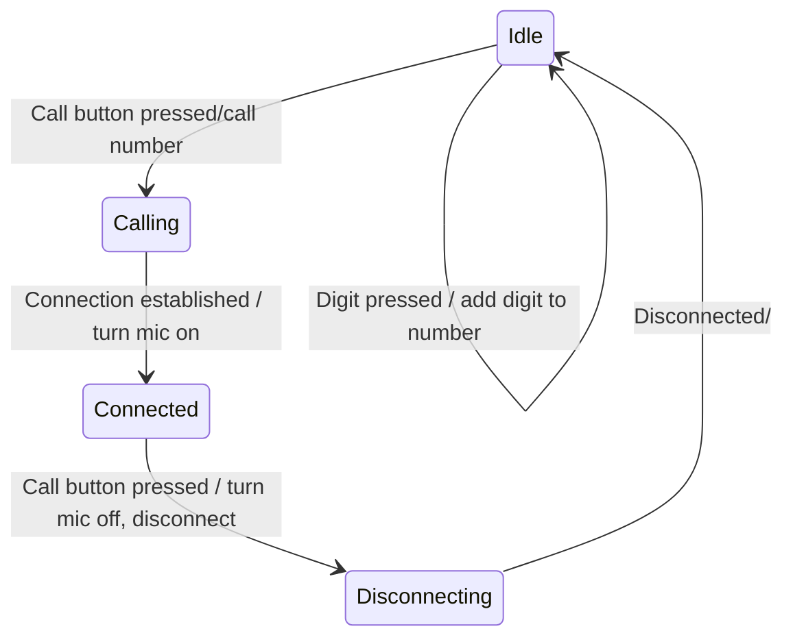
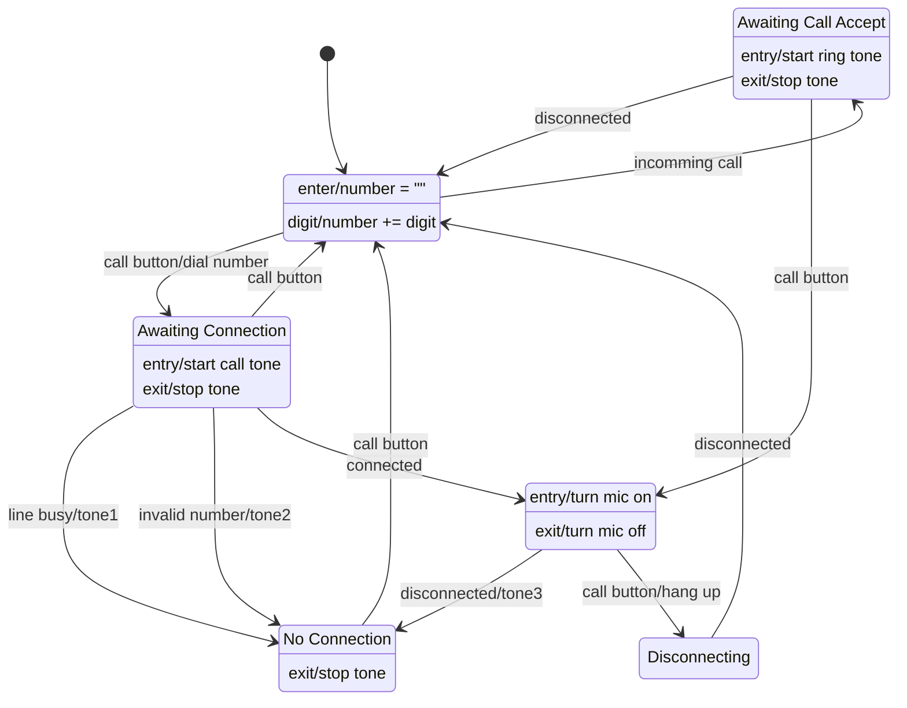
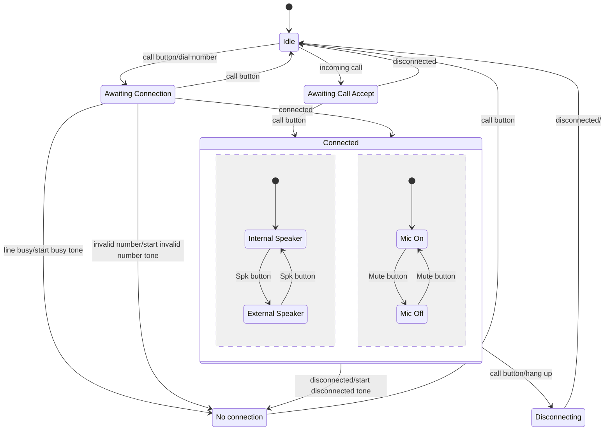

# Øvelse: Telefon — State Machines (med to løsningsforslag)

## Metadata

| Felt | Værdi |
|---|---|
| **Lektion** | L10/L11 — SysML State Machine Diagrams (Home Exercise, TFJ) |
| **Kursus** | SWISE-01 Indledende System Engineering |
| **Kilde** | `SysML State Machines (telefon).pdf` (1 side, opgave) + `SysML SD Løsningsforslag (telefon1).pdf` (1 side, ren figur) + `SysML SD Løsningsforslag (telefon2).pdf` (2 sider: titelslide + figur) |
| **Type** | øvelse + løsningsforslag |
| **Emner dækket** | State Machine Diagram (stm), triggers/effects, entry/exit-actions, fejlhåndtering i stm, composite state med ortogonale regioner (uafhængige substates) |

Bemærk: løsningsfilerne hedder "SD Løsningsforslag" men indeholder state machine diagrams, ikke sequence diagrams.

---

## Opgavetekst

**I2ISE Home Exercise: SysML STMs — TFJ**

**Exercise: State Machines**

In this exercise you will design the business logic of a simple telephone by means of a state machine. Through the exercises you will incrementally add functionality to the system.

The situation: You are to design the state machine for a simple telephone along the lines of the below state chart, supplied by a sales representative from a meeting with a customer:

*Figur: telefon med display og tastatur 7 8 9 / 4 5 6 / 1 2 3 / (grøn opkaldsknap) 0 (tom knap).*

Sælgerens state chart:

**Exercise 1:**

As usual, the sales representative left a number of questions unanswered, such as

- What happens if the line is busy? If the dialed number is invalid?
- How should we handle if the other party disconnects during the call?
- …

Amend the state chart above to answer these questions and any other questions you may have – it's your decision!

**Exercise 2:**

The sales representative has had another meeting with the customer. He has two further requests for the no-longer-so-simple-telephone: When a call is connected, it shall be possible to…

1. Toggle between the use of regular speaker or loudspeaker (speakerphone)
2. Mute the microphone during a call

*Figur: samme telefon med to ekstra knapper over tastaturet: Mute og Spk.*

Amend these changes (hint: think independent sub-states) to your design.

> Page 1 of 1

---

## Løsningsforslag 1 (telefon1.pdf) — Exercise 1

Ren figur uden diagramramme. Seks states.

| State | Internal behaviour |
|---|---|
| **Idle** | `enter/number = ""`, `digit/number += digit` |
| **Awaiting Call Accept** | `entry/start ring tone`, `exit/stop tone` |
| **Awaiting Connection** | `entry/start call tone`, `exit/stop tone` |
| **No Connection** | `exit/stop tone` |
| **Connected** | `entry/turn mic on`, `exit/turn mic off` |
| **Disconnecting** | (ingen) |

| Fra | Til | Trigger/effect |
|---|---|---|
| initial | Idle | — |
| Idle | Awaiting Call Accept | `incomming call` (stavning fra originalen) |
| Awaiting Call Accept | Idle | `disconnected` |
| Awaiting Call Accept | Connected | `call button` |
| Idle | Awaiting Connection | `call button/dial number` |
| Awaiting Connection | Idle | `call button` |
| Awaiting Connection | No Connection | `line busy/tone1` |
| Awaiting Connection | No Connection | `invalid number/tone2` |
| Awaiting Connection | Connected | `connected` |
| No Connection | Idle | `call button` |
| Connected | No Connection | `disconnected/tone3` |
| Connected | Disconnecting | `call button/hang up` |
| Disconnecting | Idle | `disconnected` |

Sådan besvares sælgerens spørgsmål:
- **Optaget / ugyldigt nummer**: to transitions fra Awaiting Connection til No Connection med hver sin tone (tone1/tone2). No Connection's `exit/stop tone` stopper tonen når brugeren trykker call button for at komme tilbage til Idle.
- **Modparten lægger på under samtalen**: Connected → No Connection på `disconnected` med `tone3`; mikrofonen slukkes via Connected's exit-action.
- **Indgående opkald** (ikke spurgt, men tilføjet): Awaiting Call Accept med ringetone; accepteres med call button, eller forsvinder hvis modparten afbryder.
- Nummeret nulstilles ved hver indgang i Idle (`enter/number = ""`).

---

## Løsningsforslag 2 (telefon2.pdf) — `stm Telephone [Exercise 1+2]`

*Side 1: titelslide "Løsningsforslag til telefon-opgave".*

Side 2: diagramramme `stm Telephone [Exercise 1+2]`. Samme struktur som Løsning 1, men effects er skrevet mere beskrivende, og **Connected** er nu en composite state med to ortogonale regioner (Exercise 2).

### Top-niveau

| State | Internal behaviour |
|---|---|
| **Idle** | `enter/number=""`, `digit/number +=digit` |
| **Awaiting Call Accept** | `enter/start ring tone`, `exit/stop ring tone` |
| **Awaiting Connection** | `enter/start call tone`, `exit/stop tone` |
| **No connection** | `exit/stop tone` |
| **Connected** (composite) | `exit/mic off` |
| **Disconnecting** | (ingen) |

| Fra | Til | Trigger/effect |
|---|---|---|
| initial | Idle | — |
| Idle | Awaiting Call Accept | `incoming call` |
| Awaiting Call Accept | Idle | `disconnected` |
| Awaiting Call Accept | Connected | `call button` |
| Idle | Awaiting Connection | `call button/dial number` |
| Awaiting Connection | Idle | `call button` |
| Awaiting Connection | No connection | `line busy/start busy tone` |
| Awaiting Connection | No connection | `invalid number/start invalid number tone` |
| Awaiting Connection | Connected | `connected` |
| No connection | Idle | `call button` |
| Connected | No connection | `disconnected/start disconnected tone` |
| Connected | Disconnecting | `call button/hang up` |
| Disconnecting | Idle | `disconnected/` |

### Connected — region 1 (øverst): højttaler

| State | Internal behaviour |
|---|---|
| **Internal Speaker** | `enter/int. speaker on`, `exit/int. speaker off` |
| **External Speaker** | `enter/ext. speaker on`, `exit/ext. speaker off` |

initial → Internal Speaker; Internal Speaker → External Speaker `Spk button`; External Speaker → Internal Speaker `Spk button`.

### Connected — region 2 (nederst): mikrofon

| State | Internal behaviour |
|---|---|
| **Mic On** | `enter/mic on` |
| **Mic Off** | `enter/mic off` |

initial → Mic On; Mic On → Mic Off `Mute button`; Mic Off → Mic On `Mute button`.

(Entry/exit-actions er udeladt i mermaid; se tabellerne.)

Pointer:
- "Independent sub-states" fra hintet = to ortogonale regioner i Connected: højttalervalg og mute er uafhængige af hinanden.
- Når Connected enteres, går begge regioner til deres initial: Internal Speaker (`int. speaker on`) og Mic On (`mic on`). Løsning 1's `entry/turn mic on` er derfor flyttet ned i Mic On's entry.
- Connected's `exit/mic off` sikrer at mikrofonen slukkes uanset hvilken substate der forlades (både ved `disconnected` og `call button/hang up`).
- Ved at forlade Connected køres først substaternes exit-actions (fx `int. speaker off`), derefter Connected's egen `exit/mic off`.
