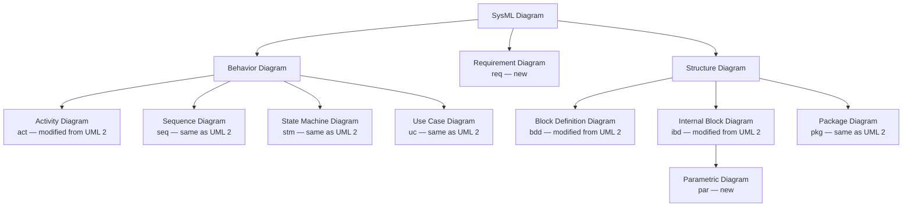

# SysML Introduction

## Metadata

| Felt | Værdi |
|---|---|
| **Lektion** | L6 — SysML introduktion (Structural Diagrams / BDD) |
| **Kursus** | SWISE-01 Indledende System Engineering |
| **Kilde** | `SysML Introduction (F24).pdf` (11 slides) |
| **Type** | slides |
| **Emner dækket** | Hvad SysML er, MBSE, de fire "pillars" (structure, behavior, requirements, parametrics), diagram frame (header + canvas), header-syntaks, SysML-diagramtyper vs. UML, kursets fire fokusdiagrammer (BDD, IBD, SD, STM), UML vs. SysML-overlap |

---

## Introduction to SysML

- SysML = **System Modeling Language**
  - Supports analysis, specification, design, and verification/validation of systems (hardware, software, mechanics, personnel)
- Allows the formation and communication of a system model using diagrams
- Elements in different (types of) diagrams are reused to convey different aspects of the elements' use
- SysML is an enabler of **Model-Based Systems Engineering** (MBSE)
  - The model, not documentation, is in focus

> Slide 2

## SysML "pillars" (diagrams)

De fire søjler i SysML, vist med et ABS-eksempel (Anti-Lock Braking):

| Pillar | Diagrammer | Eksempel på sliden |
|---|---|---|
| **1. Structure** | bdd (definition), ibd (use) | `bdd [package] VehicleStructure [ABS-Block Definition Diagram]` med blokkene «block» Library::Electronic Processor, «block» Anti-Lock Controller, «block» Library::Electro-Hydraulic Valve, «block» Traction Detector (d1) og «block» Brake Modulator (m1). Herunder `ibd [block] Anti-LockController [Internal Block Diagram]` med parts `d1:Traction Detector` og `m1:Brake Modulator` forbundet via `c1:modulator interface` |
| **2. Behavior** | seq (interaction), stm (state machine), act (activity/function) | `sd ABS_ActivationSequence [Sequence Diagram]` med lifelines `d1:Traction Detector` og `m1:Brake Modulator`; `stm TireTraction [State Machine Diagram]` med transition `LossOfTraction`; `act PreventLockup [Activity Diagram]` med aktioner `DetectLossOfTraction` → `TractionLoss` (object node) → `Modulate BrakingForce` |
| **3. Requirements** | req | `req [package] VehicleSpecifications [Requirements Diagram-Braking Requirements]`: «requirement» StoppingDistance (id="102", text="The vehicle shall stop from 60 mph within 150 ft on a clean dry surface") i Vehicle System Specification, og «requirement» Anti-LockPerformance (id="337", text="Braking subsystem shall prevent wheel lockup under all braking conditions") i Braking Subsystem Specification, forbundet med «deriveReqt» |
| **4. Parametrics** | par | `par [constraintBlock] StraightLineVehicleDynamics [Parametric Diagram]` med constraint-blokkene :BrakingForceEquation (f = (tf*bf)*(1-tl)), :AccelerationEquation (F = ma), :VelocityEquation (a = dv/dt), :DistanceEquation (v = dx/dt) forbundet via parametrene tf, bf, tl, f, F, c, a, v, x |

Note på sliden: Package- og Use Case-diagrammer er ikke vist i eksemplet, men hører til henholdsvis structure- og behavior-søjlen.

> Slide 3

## SysML: Diagram frame

- The diagram frame consists of **header** and **canvas**

*Figur: Et rektangel (frame) med en lille "tab" i øverste venstre hjørne. Tab'en indeholder header-teksten `Diagram kind [model element type] model element name [diagram name]`; resten af rektanglet er canvas (content).*

> Slide 4

## SysML: Diagram header

Header-syntaks:

```
Diagram kind [model element type] model element name [diagram name]
```

| Del | Betydning |
|---|---|
| `Diagram kind` | Abbreviation indicating *type* of diagram (**bold** typeface) |
| `[model element type]` | Type of model element the diagram represents |
| `model element name` | Name of the represented model element |
| `[diagram name]` | Description of the diagram's purpose |

Example: `bdd [Block] Camera [Power Subsystem]`

> Slide 5

### Diagram header — example

`**bdd** [block] Camera [Hierarchical system structure]`

- This is a *block definition diagram* (**bdd**),
- for the [*block*]
- *Camera*
- describing its [*Hierarchical system structure*]

Items in brackets are optional:
- *model element type* [block] is frequently omitted,
- *diagram name* [Hierarchical …] frequently included

> Slide 6

## SysML: Diagram canvas

- The diagram canvas holds the modeling elements

*Figur: En diagram-frame med header og to blokke på canvas: `CCD` og `DSP`, hver med en lille kvadratisk port på siden, forbundet med en connector mellem portene.*

> Slide 7

## SysML: Diagram types compared to UML

Taksonomi (træ) af SysML-diagramtyper:



Legende på sliden:

| Kategori | Diagrammer |
|---|---|
| Same as UML 2 | Sequence, State Machine, Use Case, Package |
| Modified from UML 2 | Activity, Block Definition, Internal Block |
| New diagram type | Requirement, Parametric |

Kursets hovedtyper er markeret med rød ramme: **Sequence (seq), State Machine (stm), Block Definition (bdd), Internal Block (ibd)**. Parametric Diagram er specialisering af Internal Block Diagram.

> Slide 8

## Focused SysML Diagrams in the course

- **Block Definition Diagram (BDD)**
  - presents structural elements, called blocks, and their composition and classification (modification of UML class diagram)
- **Internal Block Diagram (IBD)**
  - presents interconnection and interfaces between the parts of a block (modification of UML composite structure diagram)
- **Sequence Diagram (SD)**
  - presents behavior in terms of a sequence of messages exchanged between systems or parts of systems (same as UML sequence diagram)
- **State Machine diagram (STM)**
  - presents the behavior of an entity in terms of its transitions between states triggered by events (same as UML state machine diagram)

> Slide 9

## UML vs. SysML

*Figur: Venn-diagram med to overlappende cirkler, "UML 2" og "SysML". Den del af UML 2 uden for overlappet er "not required by SysML". Overlappet er "UML reused by SysML (UML4SysML)". Den del af SysML uden for UML er "SysML's extensions to UML".*

> Slide 10

## References & Links

- What is SysML: https://www.omgsysml.org/what-is-sysml.htm

> Slide 11
