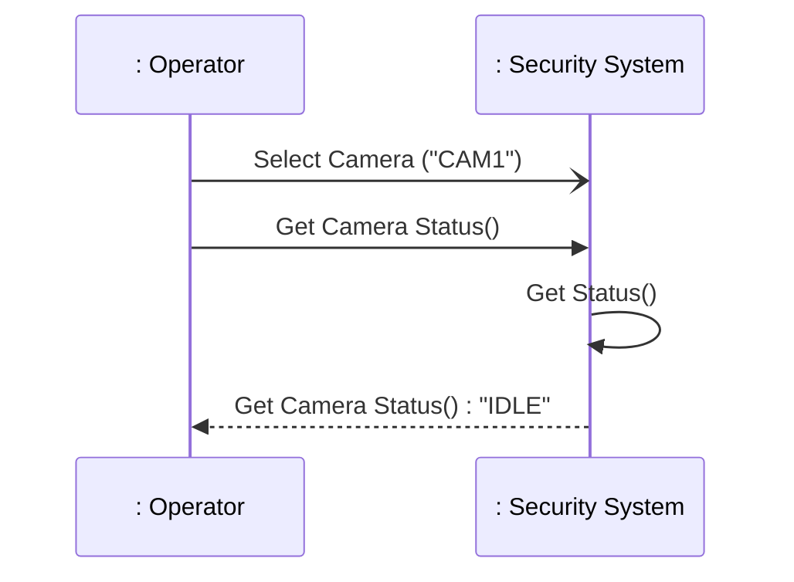
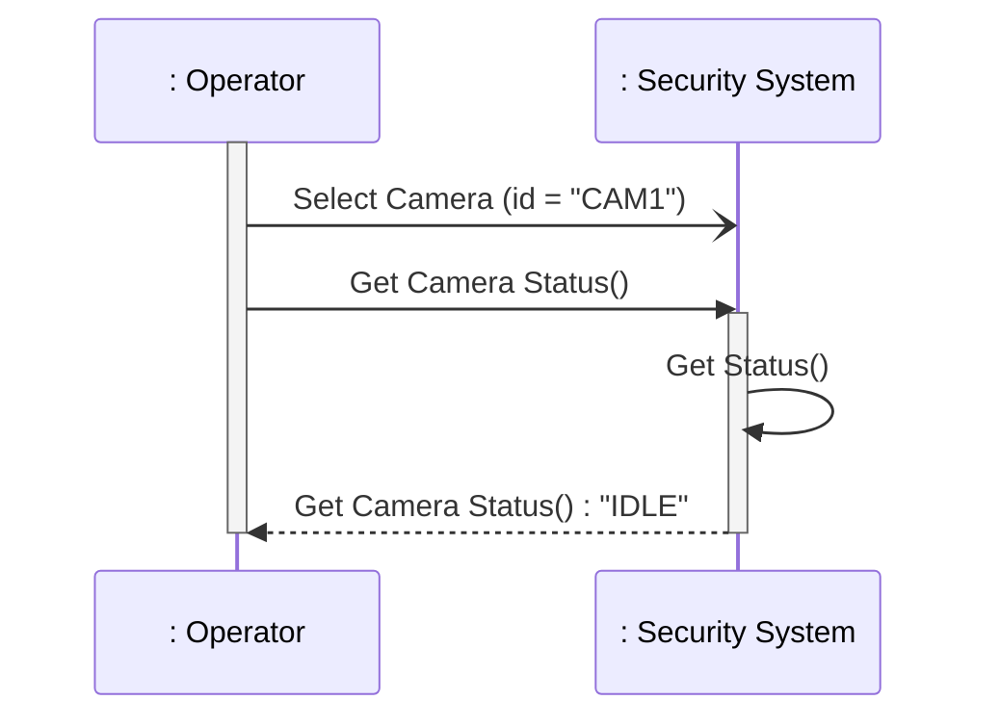
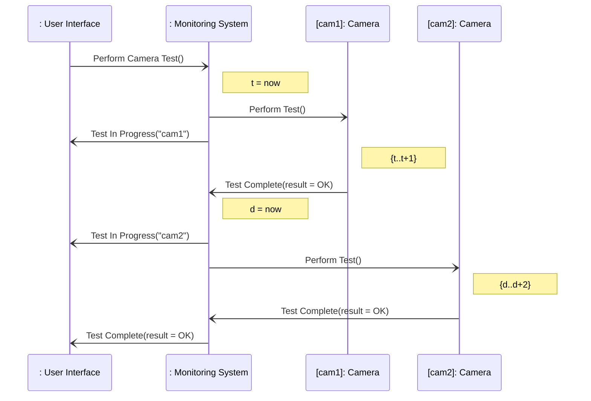
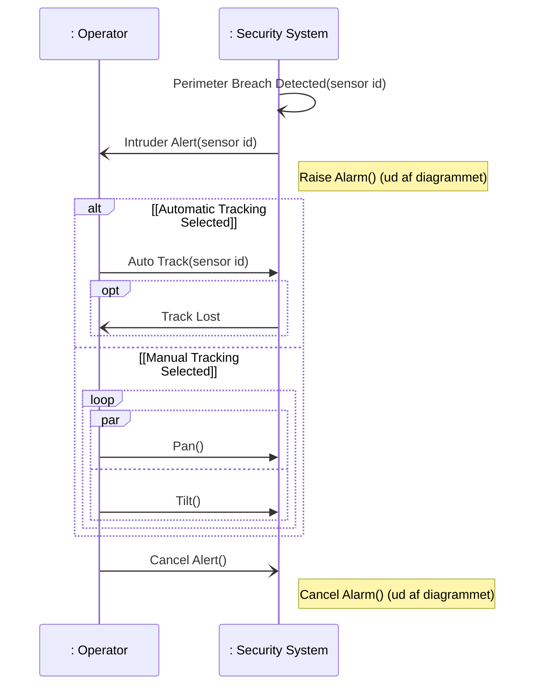

# SysML Behavioural Diagrams — Sequence Diagrams (SD)

## Metadata

| Felt | Værdi |
|---|---|
| **Lektion** | L9 (E25 ToC: L10) — SysML Sequence Diagrams |
| **Kursus** | SWISE-01 Indledende System Engineering (I2ISE) |
| **Kilde** | `SysML Behavioural Diagrams - Sequence Diagrams.pdf` (17 slides) |
| **Type** | slides |
| **Emner dækket** | Struktur vs. adfærd, sd-diagrammet (lifelines, messages), asynkron/synkron/reply-beskeder, activations, eksempelsystem Security System (bdd + ibd), Parkeringsautomat (bdd + ibd User Interface + ibd Parkeringsautomat), øvelse: SD for Buy Ticket, tid i SD (time constraints, duration), fragments (alt, opt, loop, par), reference blocks (ref), øvelse: SD for RVM Recycle Containers |

---

## SysML Structure vs. behaviour

- We have learned a lot about how to model structure in SysML
  - Block Definition Diagrams
  - Internal Block Diagrams
- Now, we will look at how we can model behaviour in SysML
  - Sequence diagrams
  - State Machines

> Slide 2

## Sequence diagrams

- Sequence diagrams (diagram type **sd**) model interactions between parts of a block

> Slide 3

- Sequence diagrams are used to model message-based behaviour
- The interactions take place within a block between its elements of internal structure (parts)
- The basic diagram consists of **lifelines** with **messages** between them

> Slide 4

## SD's – example system (structure)

`bdd Security System Context`:

| Relation | Whole | Part | Multiplicitet |
|---|---|---|---|
| Komposition | Security System Context | Security System | (1) |
| Komposition | Security System Context | Perimeter Sensor | * |
| Komposition | Security System Context | Alarm System | (1) |
| Komposition | Security System Context | Operator (aktør) | (1) |

Security System har parts-compartment: `ui : User Interface`, `st : Monitoring Station`, `cams : Camera[1..n]`.

`ibd Security System Context`:

| Part | Indre parts |
|---|---|
| `Operator` (aktør) | — |
| `: Perimeter Sensor[1..n]` | — |
| `: Alarm System` | — |
| `:Security System` | `ui : User Interface`, `st : Monitoring Station`, `cams : Camera[1..n]` |

Connectors (med pile for retning): Operator ↔ `ui : User Interface` (dobbeltrettet); `: Perimeter Sensor[1..n]` → `st : Monitoring Station`; `st : Monitoring Station` → `: Alarm System`; `ui : User Interface` ↔ `st : Monitoring Station` (dobbeltrettet); `cams : Camera[1..n]` → `st : Monitoring Station`.

> Slide 5

## SD's – lifelines

`sd Camera Control [Lifelines]` med to lifelines: `: Operator` og `: Security System`.

| Element | Beskrivelse |
|---|---|
| Diagram header | type = **sd** |
| Lifeline head | name/type of the part that participates in the interaction (rektangel med `: Operator`) |
| Lifeline tail | stiplet lodret linje ned fra head |

> Slide 6

## SD's – messages

`sd Camera Control [Messages]`:

| Beskedtype | Notation | Eksempel |
|---|---|---|
| *Asynchronous* message | solid line, open arrowhead | `Select Camera ("CAM1")` |
| *Synchronous* message (method call) | solid line, closed arrowhead | `Get Camera Status()` |
| Return message (method call) | dashed line, open arrowhead | `Get Camera Status() : "IDLE"` |
| Message-to-self | pil fra lifeline til sig selv | `Get Status()` |

> Slide 7

## SD's – async/sync/reply

There are two basic types of messages: **asynchronous** and **synchronous**. A sender of an asynchronous message continues to execute immediately after sending the message, whereas a sender of a synchronous message waits until it receives a reply from the receiver.

- An open arrowhead means an **asynchronous message**. Input arguments associated with the message are shown in parentheses as a comma-separated list after the message name.
- A closed arrowhead means a **synchronous message**. The notation is the same as for asynchronous messages.
- An open arrowhead on a dashed line shows a **reply message**. Output arguments associated with the message are shown in parentheses after the message name, and the return value, if any, is shown after the argument list.

> Slide 8

## SD's – activations

`sd Camera Control [Activations]`: Samme sekvens som slide 7 (`Select Camera (id = "CAM1")`, `Get Camera Status()`, `Get Status()` til sig selv, reply `Get Camera Status() : "IDLE"`), men nu med **activations** (execution specifications) tegnet som smalle grå rektangler på lifelines: Operator er aktiv fra Select Camera til reply modtages; Security System er aktiv under Get Camera Status, med en nestet aktivering for Get Status()-selvkaldet.

> Slide 9

## bdd Parkeringsautomat

`bdd Parkeringsautomat`:

| Relation | Whole | Part | Part name |
|---|---|---|---|
| Komposition | «block» Pakeringsautomat *(sic)* | «block» Printer | — |
| Komposition | «block» Pakeringsautomat | «block» User Interface | — |
| Komposition | «block» Pakeringsautomat | «block» Money Box | — |
| Komposition | «block» Pakeringsautomat | «block» Computer | — |
| Komposition | «block» User Interface | «block» Card Reader | — |
| Komposition | «block» User Interface | «block» Controller | — |
| Komposition | «block» User Interface | «block» Button | btRed |
| Komposition | «block» User Interface | «block» Button | btGreen |
| Komposition | «block» User Interface | «block» Display | — |

| Blok | Ports |
|---|---|
| User Interface | `in card: Card`, `in btGreen: Press`, `in btRed: Press`, `in coins: Signal`, `out disp: Text` |
| Card Reader | `inout cardWires: ~Serial`, `in card: Card` |
| Controller | `in bt1Wire: bool`, `in bt2Wire: bool`, `in coins: Signal`, `inout cardWires: Serial`, `out dispWires: I2C` |
| Button | `in btPress: Press`, `out btWire: bool` |
| Display | `in dispWires: I2C`, `out disp: Text` |

> Slide 10

## ibd User Interface

`ibd User Interface` (Parkeringsautomat):

| Part | Ports |
|---|---|
| `card:Card Reader` | `card: Card` (in), `cardWires: ~Serial` (konjugeret) |
| `btRed:Button` | `btPress: Press` (in), `btWire: bool` (out) |
| `btGreen:Button` | `btPress: Press` (in), `btWire: bool` (out) |
| `disp:Display` | `dispWires: I2C` (in), `disp: Text` (out) |
| `ctrl:Controller` | `cardWires: Serial`, `bt1Wire: bool` (in), `bt2Wire: bool` (in), `coins: Signal` (in), `dispWires: I2C` (out) |

Ydre porte på IBD-rammen: `card: Card` (in, venstre), `btGreen: Press` (in, venstre), `btRed: Press` (in, venstre), `disp: Text` (out, højre), `coins: Signal` (in, højre).

Connectors:

| Fra | Til |
|---|---|
| ydre `card: Card` | `card:Card Reader` port `card: Card` |
| ydre `btGreen: Press` | `btRed:Button` port `btPress: Press` *(som tegnet på sliden — btGreen-porten går til btRed-knappen og omvendt)* |
| ydre `btRed: Press` | `btGreen:Button` port `btPress: Press` *(som tegnet)* |
| `card:Card Reader` port `cardWires: ~Serial` | `ctrl:Controller` port `cardWires: Serial` |
| `btRed:Button` port `btWire: bool` | `ctrl:Controller` port `bt1Wire: bool` |
| `btGreen:Button` port `btWire: bool` | `ctrl:Controller` port `bt2Wire: bool` |
| `ctrl:Controller` port `dispWires: I2C` | `disp:Display` port `dispWires: I2C` (item flow `dispWires: I2C` med retningspil op mod Display) |
| `disp:Display` port `disp: Text` | ydre `disp: Text` |
| ydre `coins: Signal` | `ctrl:Controller` port `coins: Signal` |

> Slide 11

## ibd Parkeringsautomat

`ibd Parkeringsautomat`: fire parts `:User Inteface` *(sic)*, `:Money Box`, `: Computer`, `:Printer`. Connectors (simple, uden porte): User Interface — Money Box; User Interface — Computer; Computer — Printer.

> Slide 12

## SD's – your turn – Parking Machine

- Draw a sequence diagram for buy ticket
- Use actor and blocks: **User Interface, Computer, Money Box** and **Printer**

UC: Buy Ticket – Main scenario
1. User inserts coins in the Parking Machine
2. Parking Machine displays total amount and time
3. User press the pay button (green)
4. Parking Machine prints a ticket

> Slide 13

## SD's – representing time

`sd Self Test [Showing time]` med lifelines `: User Interface`, `: Monitoring System`, `[cam1]: Camera`, `[cam2]: Camera`.

Tidsnotation på sliden:

| Notation | Betydning |
|---|---|
| `t = now` (ved Monitoring Systems modtagelse af Perform Camera Test) | Tidspunkt-observation: variablen `t` sættes til nuværende tid |
| `{t..t+1}` (ved cam1's aktivering) | Time constraint: cam1's test skal være færdig inden for 1 tidsenhed efter `t` |
| `d = now` (ved modtagelse af Test Complete fra cam1) | Ny tidsobservation |
| `{d..d+2}` (ved cam2's aktivering) | cam2's test skal være færdig inden for 2 tidsenheder efter `d` |
| `{0..10}` (lodret dobbeltpil langs User Interface fra Perform Camera Test() til sidste Test Complete) | Duration constraint: hele selvtesten skal tage mellem 0 og 10 tidsenheder |

Monitoring System har én lang activation for hele testen; cam1 og cam2 har korte activations under deres Perform Test.

> Slide 14

## SD's – fragments

`sd Handle Alert [Showing fragments]` med lifelines `: Operator` og `: Security System`. Beskeden `Perimeter Breach Detected(sensor id)` kommer ind fra venstre (uden for diagrammet, found message) til Security System; `Raise Alarm()` og `Cancel Alarm()` går ud til højre (lost message / til eksternt system).

*(Bemærk: `Perimeter Breach Detected(sensor id)` er på sliden en pil fra diagrammets venstre kant ind til Security System, ikke en selvbesked — mermaid har ingen "found message".)*

| Fragment | Betydning |
|---|---|
| **alt** | Alternative activities — operander adskilt af stiplet linje med guards `[Automatic Tracking Selected]` / `[Manual Tracking Selected]` |
| **opt** | Optional activity — `Track Lost` sendes kun evt. |
| **loop** | loop activity |
| **par** | parallel activities — `Pan()` og `Tilt()` kan ske samtidig; på sliden er `loop par` kombineret i ét fragment |

> Slide 15

## SD's – reference blocks

`sd End-to-End Scenario` med lifelines `sens1 : Perimeter Sensor`, `: Operator`, `: Security System`, `: Alarm System` (lifeline-head markeret `ref During Alert` — lifelinen refererer selv til et andet sd).

Sekvens:

1. `ref Initialize System` (dækker Operator og Security System)
2. `loop alt` fragment:
   - `[Perimeter secure]`: `ref Standard Surveillance` (Operator, Security System)
   - `[Perimeter breached]`: `sens1 : Perimeter Sensor` sender `Perimeter Breach Detected (sens1)` til Security System; `ref Handle Alert` (Operator, Security System); Security System sender `Raise Alarm()` og senere `Cancel Alarm()` til `: Alarm System`
3. `ref Shutdown System` (Operator, Security System)

**ref** – ref. other sd: en interaction use, der refererer til et andet sekvensdiagram (fx `Handle Alert` fra slide 15), så scenarier kan komponeres.

> Slide 16

## SD's – your turn!

- Create a sequence diagram for the RVM scenario Recycle Containers below
  - Participants: User and RVM
- Add operations to the RVM on a BDD

Main Scenario for Use Case Recycle containers
1. User arrives at RVM and is informed to insert containers.
2. User places container in the in-feed.
3. RVM scans container and either
   - a) accepts the container, collects the container from the in-feed, adds the return deposit to the collected amount, and displays the type and value of the accepted container and the total collected amount; or
   - b) does not accept the container, rejects the container to User, and displays that the container is not accepted and the total collected amount.

Step 2 through 3 is repeated until User is done feeding containers.

4. User request the return deposit receipt.
5. RVM prints out the return deposit receipt, and resets the collected amount.

*(På sliden er de to sidste trin nummereret "1." og "2." igen — det er trin 4 og 5 i scenariet.)*

> Slide 17
