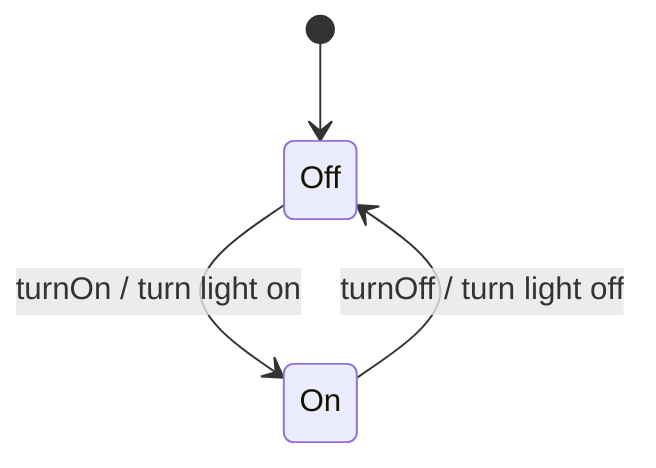
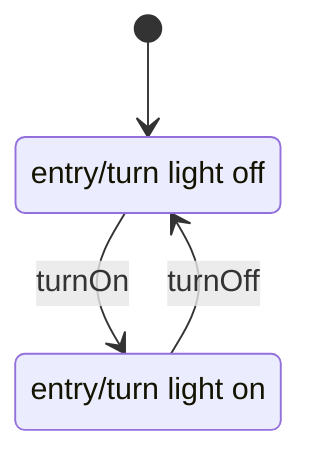
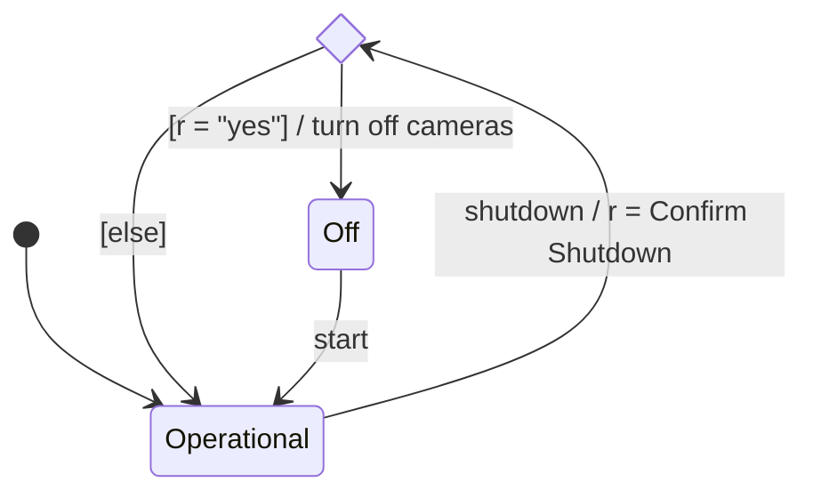
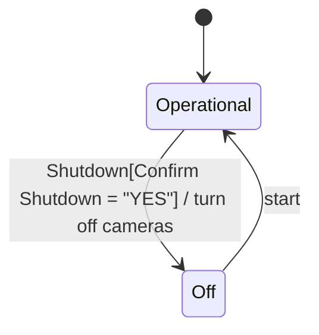
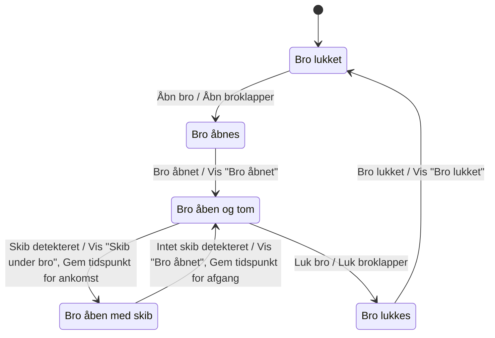
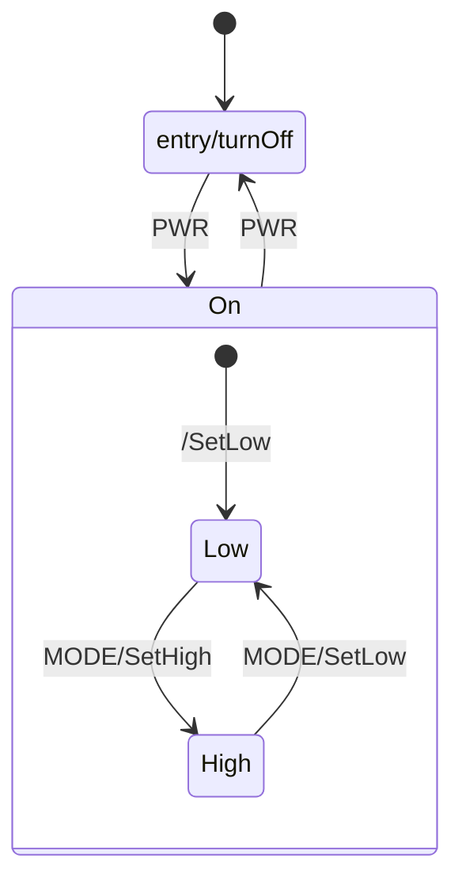
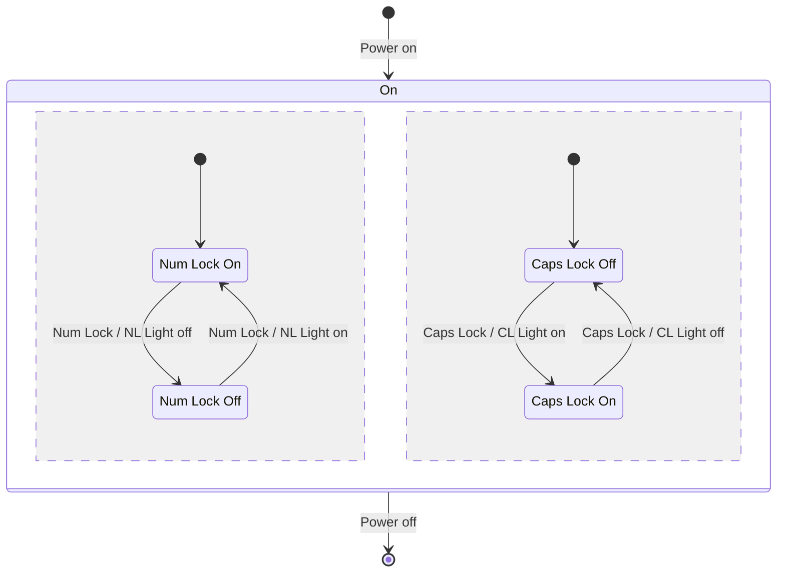

# SysML Behavioural Diagrams — State Machine Diagrams (STM)

## Metadata

| Felt | Værdi |
|---|---|
| **Lektion** | L10 (E25 ToC: L11) — SysML State Machine Diagrams |
| **Kursus** | SWISE-01 Indledende System Engineering (I2ISE) |
| **Kilde** | `SysML Behavioural Diagrams - State Machine Diagrams.pdf` (19 slides) |
| **Type** | slides |
| **Emner dækket** | State machines / state charts, states og transitions, entry/do/exit-adfærd, interne transitions vs. selv-transitions, trigger[guard]/effect, choice pseudostate, Bridge Control System-eksempel, nested states (substates), states med multiple regions (orthogonal), øvelser: Compression stocking, Egg Timer 2000, Pimped Egg Timer 3000, konsol- og telefon-øvelser |

---

## State Machines

- State Machines Diagrams (**stm**), aka *state charts*, are used to model state-dependent behaviour of a block throughout its lifecycle
- A *state* is some significant condition in the life of a block
  - Typically, different states respond differently to same events
- A state machine is always in a certain state and will remain there until some *event* causes it to *transition* to another state
- Any examples?

> Slide 2–3

## States and transitions – basics

`stm Light Switch`:



| Element | På diagrammet |
|---|---|
| State Machine Diagram frame | header med type = **stm** (`stm Light Switch`) |
| State | afrundet rektangel (`Off`, `On`) |
| Initial pseudostate | udfyldt sort cirkel med pil til `Off` |
| Transition | pil fra en state til en anden |
| Event (trigger) | `turnOn`, `turnOff` — teksten før `/` |
| Action (effect) | `turn light on`, `turn light off` — teksten efter `/` |

> Slide 4

## States in detail

`stm Security System`: initial → `Operational`; transition `shutdown / turn off cameras` fra Operational til final state (cirkel med prik).

State `Operational` med fire linjer i body:

```
entry/Display "Operational"
do/Monitor site
exit/Display "Not Operational"
buttonPushed/Handle button
```

| Adfærd | Semantik |
|---|---|
| *entry* behaviour | is executed on entry into the state |
| *do* behaviour | is continuously executed after entry until exit |
| *exit* behaviour | is executed just prior to exit of the state |
| intern transition (`buttonPushed/Handle button`) | When event (*buttonPushed*) occurs, do behaviour is interrupted and action (Handle button) is executed. Then, do is resumed |

Eksempel på kørsel (Events → Actions):

| # | Event | Action |
|---|---|---|
| 1 | Start → | Display "Operational" |
| 2 | .. | Monitor site |
| 3 | | Monitor site |
| 4 | buttonPushed → | Handle button |
| 5 | .. | Monitor site |
| 6 | | Monitor site |
| 7 | Shutdown → | Display "Not Operational" |
| 8 | .. | turn off cameras |

> Slide 5

## Example: Light switch

To varianter af `stm Light Switch`, begge med `[*] → Off`, `Off → On : turnOn`, `On → Off : turnOff`:

**Variant 1 (markeret "Best", grønt flueben):** actions som *entry*-adfærd i states:



**Variant 2:** actions som *exit*-adfærd — `Off: exit/turn light on`, `On: exit/turn light off`. Fungerer, men er mindre læsbar: handlingen "turn light on" står i state Off.

> Slide 6

## States in detail – what's the difference?

To varianter af `stm Security System` (`init → Operational`, `Operational → final : shutdown[all users logged off]/turn off cameras`):

**Variant A — intern transition:** `buttonPushed/Handle button` står *inde i* Operational-statens body sammen med entry/do/exit. Resultat ved buttonPushed:
1. Handle button

**Variant B — selv-transition:** `buttonPushed/Handle button` er tegnet som en pil fra Operational tilbage til Operational (ydre transition). Resultat ved buttonPushed:
1. Display "Not operational" (exit)
2. Handle button (effect)
3. Display "Operational" (entry)

Pointe: en selv-transition forlader og genindtræder i staten, så exit- og entry-adfærd udføres. En intern transition gør ikke.

> Slide 7

## Transitions in detail

- Transitions consist of *trigger* (**event**), *guard* and *effect* (**action**): `trigger[guard]/effect`
- When `trigger` occurs, `guard` is evaluated.
  - If `guard` is true, `effect` occurs.
  - If not, `trigger` is consumed without effect

Eksempel `stm Security System`: `Operational → final : shutdown[all users logged off]/turn off cameras`

| Del | Værdi |
|---|---|
| Trigger | shutdown |
| Guard | all users logged off |
| Effect | turn off cameras |

*What happens if some user is still logged on?* — shutdown-eventet forbruges uden effekt; systemet bliver i Operational.

> Slide 8

## Choice pseudostate

To måder at modellere bekræftet shutdown i `stm Security System`:

**Med choice pseudostate (venstre):**



Choice pseudostate tegnes som en rombe. Transitionen ind i romben har trigger og effect (`shutdown/r = Confirm Shutdown`); transitionerne ud har kun guards (`[r = "yes"]/turn off cameras`, `[else]`). Guarden evalueres *efter* effekten på den indgående transition er udført.

**Med guard direkte (højre):**



> Slide 9

## Bridge Control System (BCS)

*Figur: Skitse af en bro med "Bridge Control System". Med rødt: Brovagtens hus (indeholder BCS brugerinterface), Vision System (detekterer skibe; detekterer om broen er åben/lukket) og Broklap-motorer (venstre og højre; åbner/lukker en broklap). Broklapperne er de to hævede halvdele; et skib er på vej under.*

> Slide 10

### Bridge Control System (STM)

`stm Tilstandsmaskine for "SikkerPassage"`:



| Fra | Trigger | Effect | Til |
|---|---|---|---|
| Bro lukket | Åbn bro | Åbn broklapper | Bro åbnes |
| Bro åbnes | Bro åbnet | Vis "Bro åbnet" | Bro åben og tom |
| Bro åben og tom | Skib detekteret | Vis "Skib under bro", Gem tidspunkt for ankomst | Bro åben med skib |
| Bro åben med skib | Intet skib detekteret | Vis "Bro åbnet", Gem tidspunkt for afgang | Bro åben og tom |
| Bro åben og tom | Luk bro | Luk broklapper | Bro lukkes |
| Bro lukkes | Bro lukket | Vis "Bro lukket" | Bro lukket |

Bemærk: broen kan kun lukkes fra "Bro åben og tom" — aldrig mens et skib er under broen (sikker passage).

> Slide 11

## Exercise: Compression stocking

*Figur: Foto af et bensår ved en ankel (med målelineal) og en illustration af en blå kompressionsstrømpe med pile, der viser tryk ind mod benet.*

- Create a state machine diagram for a compression stocking
  - When the RED button is pushed, the stocking compresses.
  - When the GREEN button is pushed, the stocking decompresses.
  - Each second the battery level is checked. If it falls below 2.8V, the stocking decompresses and enters a FAIL SAFE state

> Slide 12–13

## Exercise: Egg Timer 2000

- Create a state machine diagram for an egg timer:
  - The egg timer has four buttons: **MIN**, **SEC**, **START**, **STOP**
    - **MIN**, **SEC**: Increase time by 60 seconds and 1 second, respectively
    - **START**: Start countdown
    - **STOP**: If running: Stop countdown. If stopped: Clear time. If alarming: Stop alarm
  - Each second, there must be a *tick* event. If ET2000 is running, the remaining number of seconds shall be counted down by 1. If the timer expires, an alarm shall sound.
  - Ignore display updates etc. and concentrate on the setting, counting down and alarming.

*Figur: Egg Timer 2000 — display der viser `00:00` og fire knapper MIN, SEC, START, STOP.*

> Slide 14

## States and substates (nested states)

- A state may have substates.
- Example: Flashlight with **PWR** and **MODE** buttons

`stm Flashlight [Power modes]`:



`On` har `entry/turnOn` og indeholder substates `Low` og `High` med egen initial pseudostate (`/SetLow` som effect på initial-transitionen). `PWR` fra Off går ind i On (og dermed via initial til Low); `PWR` fra On (kanten af composite state) går til Off, uanset om Low eller High er aktiv.

> Slide 15

## States with multiple regions

- A state may have multiple regions (aka. *orthogonal* or *independent substates*)
- If the enclosing state is active, each region will have exactly 1 active state
- State transitions in one region does not affect states in another region.
- State transitions can never transition the boundary between regions

> Slide 16

### States with multiple regions: Example

`stm Keyboard [Num Lock and Caps Lock]`:

- `Power on`: initial → `On`
- `Power off`: `On` → final
- `On` har `entry/NL Light on, CL light off` og `exit/NL Light off, CL light off`
- `On` er delt i to regioner af en stiplet lodret linje, hver med egen initial pseudostate:

**Region 1 (Num Lock):**

| State | Interne transitions | Ud-transitions |
|---|---|---|
| Num Lock On (initial) | `Key_1/'1'`, `Key_2/'2'`, … | `Num Lock/NL Light off` → Num Lock Off |
| Num Lock Off | `Key_1/'End'`, `Key_2/'Arrow Down'`, `Key_3/'Page Dn'`, … | `Num Lock/NL Light on` → Num Lock On |

**Region 2 (Caps Lock):**

| State | Interne transitions | Ud-transitions |
|---|---|---|
| Caps Lock Off (initial) | `Key_Q/'q'`, `Key_W/'q'` *(sic — sliden skriver 'q' for begge)*, … | `Caps Lock/CL Light on` → Caps Lock On |
| Caps Lock On | `Key_Q/'Q'`, `Key_W/'W'`, … | `Caps Lock/CL Light off` → Caps Lock Off |



(De interne `Key_x/…`-transitions i hver substate er udeladt i mermaid; se tabellerne.)

> Slide 17

## Exercise 2: Pimped Egg Timer 3000

- PET3000 is like ET2000, but the display can be backlit with either red, green or blue light. This is controlled with the **MODE** button which toggles the light.
- Draw it's state machine diagram

(Oplagt kandidat til multiple regions: én region for timer-logikken, én for baggrundslyset.)

> Slide 18

## Exercises

- SysML State Machines (konsol).pdf
- SysML State Machines (telefon).pdf

> Slide 19
