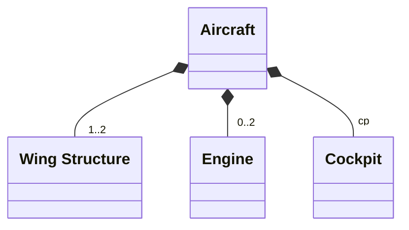
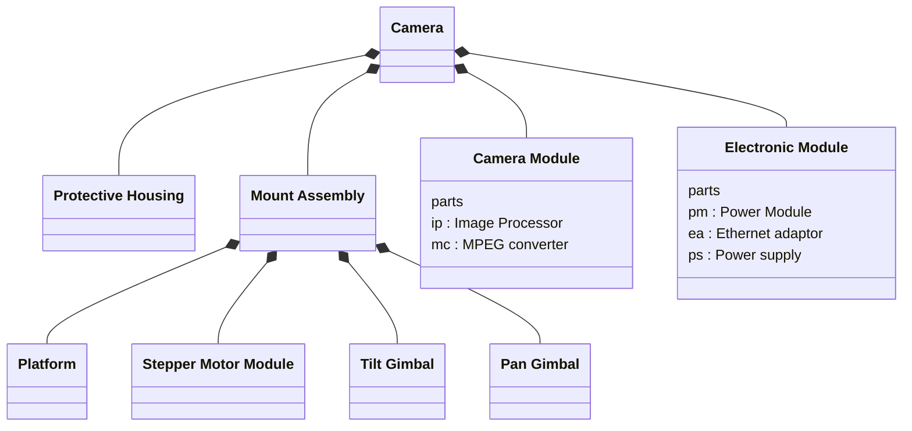

# SysML Structural Diagrams 1 — Block Definition Diagram (BDD)

## Metadata

| Felt | Værdi |
|---|---|
| **Lektion** | L6 — SysML Structural Diagrams: BDD |
| **Kursus** | SWISE-01 Indledende System Engineering (I2ISE) |
| **Kilde** | `SysML Structural Diagrams 1.pdf` (16 slides) |
| **Type** | slides |
| **Emner dækket** | De fire strukturdiagrammer (bdd, ibd, par, pkg), blokke og compartments (parts, ports, values), BDD-formål, komposition (whole-part) med multiplicitet og part names, BDD-varianter (parts compartment vs. association path), dybere hierarki (Surveillance Camera), allokering af logiske blokke til fysiske (Camera Electronics), system context (Access Control System), øvelser: BDD for Access Control System og BeoSoundF |

---

## SysML: Diagram types

*Figur: Samme taksonomi som i introduktionen — SysML Diagram generaliserer Behavior Diagram (Activity, Sequence, State Machine, Use Case), Requirement Diagram og Structure Diagram (Block Definition, Internal Block, Parametric, Package). Structure-grenen er fremhævet med blå baggrund — det er emnet for denne slideserie.*

> Slide 2

## Introduction

There are 4 different types of structural diagrams:

| Diagram | Forkortelse | Indhold |
|---|---|---|
| Block Definition Diagram | bdd | Structural system elements called *blocks* and their composition |
| Internal Block Diagram | ibd | Interconnection and interfaces between the parts of a block |
| Parametric diagram | par | Constraints on property values |
| Package diagram | pkg | The organization of a model into packages that contain model elements |

> Slide 3

## Blocks

### SysML structural diagrams – the blocks

- The *block* is the fundamental model element for describing system structure
  - Hardware, software, person, facility, water, atmosphere, files, …
- The block is a *type*
  - A common description of similar *instances*, just like a C++ class

> Slide 5

### Blocks

- The block is drawn as a *rectangle* on a diagram canvas
- The block may be divided into *compartments*
- The top compartment always contains the block's *name*
  - *Name* is mandatory
  - `<<block>>` is optional
- Other compartments may be used to represent other block features
  - Parts, operations, ports, …
- Each compartment contains *properties*

Eksempel på sliden:

```
<<block>>
Camera
-----------------
parts
Housing: Housing
Mb : MotherBoard
Ccd: CCD
…
-----------------
ports
rel : RemoteShutter
…
```

> Slide 6

### Blocks – the works

Eksempelblok «block» Aircraft med tre compartments:

| Compartment | Betydning | Syntaks | Indhold i eksemplet |
|---|---|---|---|
| Name compartment | `<<block>>` is optional | — | «block» **Aircraft** |
| *parts* compartment | composition | `part name : block name[mul]` | `wings: Wing[2]`, `cockpit: Cockpit` |
| *ports* compartment | interaction points | `port name : block name[mul]` | `fuelReceptible: Fuel`, `weaponsInterface: MIL-STD-1760 Bus` |
| *values* compartment | quantitative characteristics of a block | `value name : value type` | `weight : kg`, `bureauNumber:: String = "UNKNOWN"` |

Indholdet i compartments kaldes samlet *properties*.

You can also specify…
- *references* (weaker connections)
- *value types* and their *units* and *dimensions*
- *read-only properties*
- *initial* property values, their *distribution*
- …

Reference vist på sliden: bogen *A Practical Guide to SysML — The Systems Modeling Language* (Sanford Friedenthal, Alan Moore, Rick Steiner).

> Slide 7

## SysML: Block definition diagram

- A *Block Definition Diagram (BDD)* is used to define *blocks* and their relationship other blocks (their *composition*)
- A BDD may be used to define any kind of structure
  - Logical, physical, electrical, software, etc.
- BDDs are also used to define other relationships between blocks, e.g. allocation of functions to physical entities

> Slide 9

## bdd: Composition relationships

The most common kind of relationship is *composition*:
- "*Consists-of*" or "*whole-part*" relationship, e.g. "an `Aircraft` consists-of 1-2 `wings`, 0-2 `engines` and 1 `cockpit`"

Diagram `bdd Aircraft [Structural hierarchy]`:

| Relation | Whole (helhed) | Part (del) | Multiplicitet på part-enden | Part name |
|---|---|---|---|---|
| Komposition (udfyldt rombe ved Aircraft) | «block» Aircraft | «block» Wing Structure | 1..2 | — |
| Komposition | «block» Aircraft | «block» Engine | 0..2 | — |
| Komposition | «block» Aircraft | «block» Cockpit | (1, ikke angivet) | cp |

Notationselementer markeret på sliden: *Composite association path* (linjen med udfyldt rombe), *Whole* (Aircraft), *Parts* (de tre nederste blokke), *Part multiplicity* (1..2, 0..2), *Part name* (cp).



> Slide 10

## bdd: Variants

Tre ækvivalente måder at tegne samme Aircraft-hierarki (alle tre er markeret gyldige med grønt flueben på de to varianter):

1. **Udgangspunkt:** «block» Aircraft med komposition til «block» Wing Structure (1..2), «block» Engine (0..2), «block» Cockpit (cp) — som slide 10.
2. **Variant med parts compartment:** Aircraft-blokken har et *parts*-compartment med `eng1: Engine`, `eng2: Engine`, `cp: Cockpit`. Kun Wing Structure tegnes som separat blok, forbundet med to kompositions-linjer fra Aircraft med part names `leftWing` og `rightWing`. (Engine og Cockpit vises altså kun som parts-tekst, ikke som blokke.)
3. **Variant med navngivne wing-parts:** Som udgangspunktet, men Wing Structure har to kompositions-linjer fra Aircraft med part names `leftWing` og `rightWing` (i stedet for multiplicitet 1..2). Engine (0..2) og Cockpit (cp) som før.

Pointe: en multiplicitet `1..2` kan erstattes af to navngivne parts, og parts kan vises enten som association paths eller som tekst i parts-compartment.

> Slide 11

## bdd: Deeper hierarchy

How would you read this diagram? *"A camera consists of…"*

Diagram `bdd [Package] Surveillance Camera [Structural Breakdown]`:

| Whole | Parts (komposition) | Parts i compartment |
|---|---|---|
| Camera | Protective Housing, Mount Assembly, Camera Module, Electronic Module | — |
| Camera Module | — | `ip : Image Processor`, `mc : MPEG converter` |
| Electronic Module | — | `pm : Power Module`, `ea : Ethernet adaptor`, `ps : Power supply` |
| Mount Assembly | Platform, Stepper Motor Module, Tilt Gimbal, Pan Gimbal | — |

Læsning: A Camera consists of a Protective Housing, a Mount Assembly, a Camera Module (with an Image Processor and an MPEG converter) and an Electronic Module (with a Power Module, an Ethernet adaptor and a Power supply). The Mount Assembly consists of a Platform, a Stepper Motor Module, a Tilt Gimbal and a Pan Gimbal.



> Slide 12

## bdd: Another use

**Logical functions *allocate* physical components.**

Diagram `bdd [Package] Camera Electronics [Structural allocation from logical blocks to HW units]`:

Logisk side (alle «block» «logical»): Camera Electronics er komponeret (udfyldt rombe ved Camera Electronics) af Image Detector, MPEG Converter, Image Processor og Focus Controller.

Fysisk side (alle «block» «physical»): Camera PCB er komponeret af CCD Imaging Chipset og MPEG Chipset. Camera Mother Board er komponeret af Control Processor og Vector Processor.

Allokeringer (stiplet pil med «allocate», fra logisk til fysisk):

| Logisk blok | «allocate» → | Fysisk blok |
|---|---|---|
| Image Detector | → | CCD Imaging Chipset |
| MPEG Converter | → | MPEG Chipset |
| Image Processor | → | Vector Processor |
| Focus Controller | → | Vector Processor |

(Control Processor får ingen allokering på diagrammet.)

> Slide 13

## bdd: Defining the system's context

Diagram `bdd Access Control System Context`:

Blokken **System Context** er komponeret (udfyldt rombe ved System Context) af fire elementer: «system of interest» **Access Control System**, **Access Card**, **Door** og aktøren **User** (tegnet som stregfigur).

| Blok | Stereotype | Ports |
|---|---|---|
| Access Control System | «system of interest» | `in card: Card`, `in keyPressed[12]: Force`, `inout doorCtrl: ~DoorCtrl` |
| Access Card | — | `out cardVal: Card` |
| Door | — | `in ctrl: DoorCtrl` |
| User | (actor) | — |

Flow specification (separat blok på diagrammet):

| «flowSpecification» DoorCtrl — values |
|---|
| `in unlock: bool` |
| `in openDoor: bool` |
| `out status: string` |

Bemærk `~DoorCtrl` på Access Control System: tilde angiver *conjugated* port — retningerne i flow-specifikationen vendes, så systemet sender `unlock`/`openDoor` ud og modtager `status` ind, mens Door (`in ctrl: DoorCtrl`) har den ukonjugerede.

> Slide 14

## Your turn!

- Create a bdd for an access control system

*Figur: Foto/tegning af et adgangskontrolpanel med markeringer: **Card reader** (slids i venstre side), **Keypad** (taster 1–9, *, 0, #), **LEDs** (en grøn og en rød), **Buzzer** (højttalergitter).*

> Slide 15

## BDD for BeoSoundF

Create a bdd for BeosoundF

**Blocks:**
- Speaker — 3 speakers with names: T1, T2, W
- Amplifier
- CPU Board
- Bluetooth
- Power Supply
- Motor
- Inductive Mat
- User IF

> Slide 16
