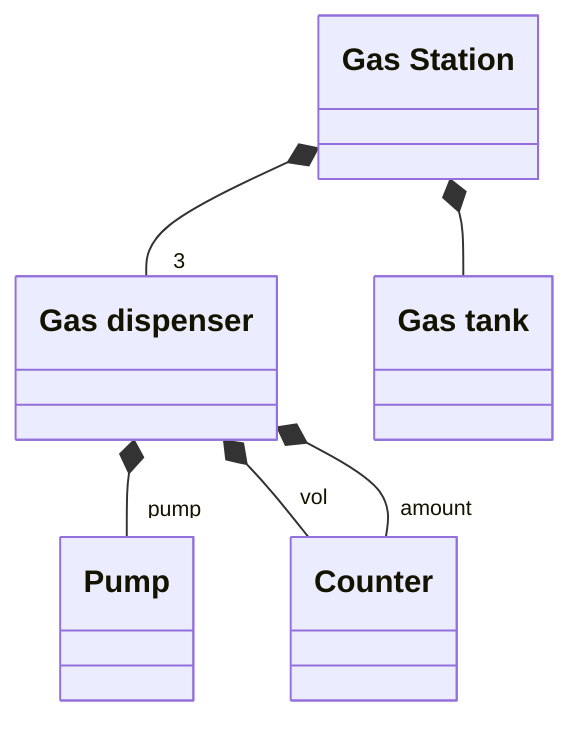
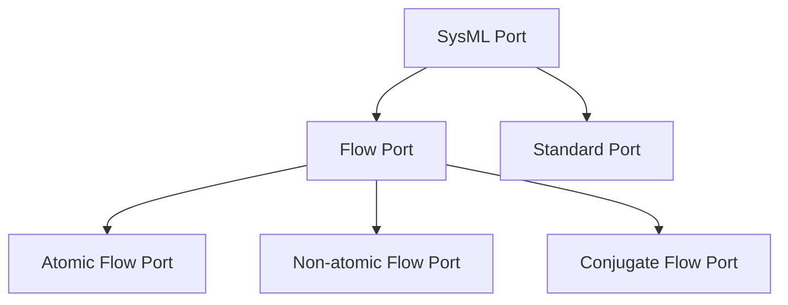

# SysML Structural Diagrams 2 — Internal Block Diagram (IBD), ports og item flows

## Metadata

| Felt | Værdi |
|---|---|
| **Lektion** | L7 (E25 ToC: L8) — SysML Structural Diagrams: BDD + IBD |
| **Kursus** | SWISE-01 Indledende System Engineering (I2ISE) |
| **Kilde** | `SysML Structural Diagrams 2.pdf` (25 slides) |
| **Type** | slides |
| **Emner dækket** | IBD-definition og relation til BDD, block = type vs. part = instance, deep structure i IBD (Aircraft), IBD-eksempler (Bicycle Front Brake Mounting, Gas Station), items og item flows, ports (flow ports: atomic, nonatomic, conjugate), kompatibilitetsregler, flow specification, konjugerede porte (~), notation på BDD vs. IBD, flow port rules (ASE-konvention), øvelse: 2 IBD'er for Access Control System |

---

## SysML: Internal Block Diagram

- An *Internal Block Diagram* (*ibd*) is used to define
  - the *interconnection* and *interfaces* of the parts of a block, and
  - the *information flow* between parts
- An ibd **always** relates to a block on a bdd. It shows the internal connections of the block's constituents

Eksempel: `bdd Aircraft [Structural hierarchy]` og det tilhørende `ibd Aircraft`.

**BDD:** Aircraft er komponeret af Wing Structure (part name `wings`, multiplicitet 2), Engine (part name `eng`) og Cockpit (uden part name).

**IBD Aircraft** (parts inde i Aircraft-rammen):

| Part på IBD | Type | Svarer til på BDD |
|---|---|---|
| `eng : Engine` | Engine | part `eng` |
| `: Cockpit` | Cockpit | unavngiven part |
| `wings[0]: Wing Structure` | Wing Structure | `wings` med multiplicitet 2 (element 0) |
| `wings[1]: Wing Structure` | Wing Structure | `wings` med multiplicitet 2 (element 1) |

Connectors: `: Cockpit` er forbundet til `eng : Engine`, `wings[0]` og `wings[1]` (simple linjer, ingen ports). Farvede cirkler på sliden matcher blok på BDD med tilsvarende part på IBD (Aircraft ↔ ibd-rammen, Engine ↔ eng, Cockpit ↔ : Cockpit, Wing Structure ↔ wings[0]/wings[1]).

> Slide 3

## SysML: Blocks and parts

- A block is a *type definition* – there can be only one block with a given name
- A part is an *instance* of a block – there can be many instances of the same block

Annotationer på samme Aircraft-eksempel:
- "This part is unnamed and is of type `Cockpit`" → `: Cockpit`
- "This part is called `eng` and is of type `Engine`" → `eng : Engine`
- **Block = type** (blokkene Engine, Cockpit på BDD)
- **Part = instance** (`: Cockpit`, `wings[1]: Wing Structure` på IBD)

> Slide 4

## ibd: Aircraft – deep structure

- Deep structure on a bdd can be shown in an ibd:

`bdd Aircraft [Structural hierarchy]` i tre niveauer:

| Whole | Parts (komposition) |
|---|---|
| «block» Aircraft | «block» Wing Structure (part name `wing`), «block» Engine (`eng`), «block» Cockpit (`cp`) |
| «block» Wing Structure | «block» Control Surface, «block» Fuel Tank, «block» Main Wing Spar |
| «block» Engine | «block» Compressor, «block» Combustion Chamber, «block» Engine Control, «block» Fuel Pump |
| «block» Cockpit | «block» Throttle, «block» Stick |

> Slide 5

Samme BDD omsat til `ibd Aircraft [Cockpit controls]` — parts nestet i parts:

| Ydre part | Indre parts |
|---|---|
| `: Cockpit` | `: Throttle`, `: Stick` |
| `: Wing` | `: Fuel Tank`, `: Control Surface` |
| `: Engine` | `: Engine Control`, `: Compressor`, `: Fuel Pump`, `: Combustion Chamber` |

Connectors på IBD'et:

| Fra | Til |
|---|---|
| `: Throttle` (i Cockpit) | `: Engine Control` (i Engine) |
| `: Stick` (i Cockpit) | `: Control Surface` (i Wing) |
| `: Fuel Tank` (i Wing) | `: Fuel Pump` (i Engine) |
| `: Engine Control` | `: Compressor` |
| `: Engine Control` | `: Fuel Pump` |
| `: Fuel Pump` | `: Combustion Chamber` |

> Slide 6

## ibd: Aircraft – better deep structure

Bedre: split det store IBD i to fokuserede IBD'er (vist med et grønt plus-tegn):

**`ibd Aircraft [Cockpit stick controls]`**: `: Cockpit` med `: Stick`; `: Wing` med `: Control Surface`; én connector `: Stick` — `: Control Surface`.

**`ibd Aircraft [Cockpit throttle controls]`**: `: Cockpit` med `: Throttle`; `: Wing` med `: Fuel Tank`; `: Engine` med `: Engine Control`, `: Compressor`, `: Fuel Pump`, `: Combustion Chamber`. Connectors: Throttle — Engine Control; Engine Control — Compressor; Engine Control — Fuel Pump; Fuel Tank — Fuel Pump; Fuel Pump — Combustion Chamber.

Pointe: ét IBD per aspekt/formål (diagram name i header fortæller hvilket), fremfor ét stort.

> Slide 7

## ibd : Bicycle – Front Brake Mounting

`ibd Bicycle [Front Brake Mounting]`:

| Ydre part | Indre parts |
|---|---|
| `Front Brake : Brake` | `:Brake Lever`, `:Brake Cable`, `:Brake Assembly`, `: Brake Disc` |
| `:Steering` | `: Handlebar`, `: Fork` |
| `Front Wheel : Wheel` | `: Hub` |

Connectors:

| Fra | Til |
|---|---|
| `:Brake Lever` | `:Brake Cable` |
| `:Brake Cable` | `:Brake Assembly` |
| `:Brake Assembly` | `: Brake Disc` |
| `:Brake Lever` | `: Handlebar` (i Steering) |
| `:Brake Assembly` | `: Fork` (i Steering) |
| `: Brake Disc` | `: Hub` (i Front Wheel) |

Bemærk navngivne parts med type: `Front Brake : Brake` og `Front Wheel : Wheel` (part name : block name).

> Slide 8

## Gas station example – BDD

`bdd Gas Station`:

| Relation | Whole | Part | Multiplicitet | Part name |
|---|---|---|---|---|
| Komposition | Gas Station | Gas dispenser | 3 | — |
| Komposition | Gas Station | Gas tank | (1) | — |
| Komposition | Gas dispenser | Pump | (1) | pump |
| Komposition | Gas dispenser | Counter | (1) | vol |
| Komposition | Gas dispenser | Counter | (1) | amount |

Gas dispenser har altså *to* Counter-parts med forskellige part names (`vol` og `amount`) og én Pump-part (`pump`).

> Slide 9

## ibd: Gas station example

`ibd Gas Station` (første, "dårlige" udgave): Én part `: Gas tank` øverst og tre parts `: Gas Dispenser` nedenunder. Hver `: Gas Dispenser` indeholder de nestede parts `pump`, `amount` og `vol`, hvor `pump` er forbundet til både `amount` og `vol`. `: Gas tank` har en connector til `pump` i hver af de tre dispensere. Den indre struktur gentages tre gange — redundant.

> Slide 10

## ibd: Better Gas station example

Split i to (grønt plus):

**`ibd Gas Station`**: `: Gas tank` forbundet til tre parts `: Gas Dispenser` (ingen indre detaljer).

**`ibd Gas Dispenser`**: `pump` forbundet til `amount` og `vol`.

Pointe: den indre struktur af Gas Dispenser tegnes én gang i sit eget IBD, ikke tre gange.

> Slide 11

## So far, so good…

- We can say a lot about the structure of a system in terms of blocks and parts… but what about their interfaces?

> Slide 12

## Modeling interfaces using items, item flows and ports

- We would like to express more about the connection between parts on the ibd
  - This would help us to define the interface of the parts
- To do this, we must define **items**, **item flows** and **ports**!

> Slide 13–14

### Items and item flows

- An *item* describes an entity that flows through a system (blocks, value types or signals)
  - Physical flow, information flow, energy, …
  - Simple or complex
- An *item flow* is used to describe a flow of items (!) on a connector between two blocks on an ibd
  - Item flow = item type + flow direction

> Slide 15

### Ports

- A *port* is an interaction point on the boundary of a block
  - Ports are where the items flow into / out of
  - One block can have many ports
- Ports are *defined* on the blocks on a bdd and used to connect *parts* on ibds

Eksempel (bdd → ibd):

**bdd:** «block» Valve med compartment *flow ports*: `in inFlow : Water` (rød prik), `out outFlow : Water` (grøn prik).

**ibd:** part `: Valve` med to porte tegnet som små kvadrater på rammen: `inFlow : Water` til venstre (rød) og `outFlow : Water` til højre (grøn). Item flow `in : Water` ind med pil mod venstre port; item flow `out : Water` ud med pil fra højre port.

> Slide 16

### Ports – flavours

- Ports come in different flavours, each with different meaning and use
- We will concentrate on *flow* ports

Taksonomi på sliden:

Flow Port og de tre specialiseringer er markeret med rød ramme (kursets fokus).

> Slide 17

### Atomic flow ports

- *Atomic flow ports* are used to describe flows of a single, simple type of item flow to/from a block
  - Directions: In, out or inout
- "Atomic" means "simple"

Eksempel: part `:Water purifier` med porte (syntaks **Port name : item name**):

| Port | Retning | Symbol |
|---|---|---|
| `dirty water : Water` | in (Input Atomic port) | kvadrat med pil ind (venstre side, øverst) |
| `agent : Purifying agent` | in (Input Atomic port) | kvadrat med pil ind (venstre side, nederst) |
| `clean water : Water` | out (Output Atomic port) | kvadrat med pil ud (højre side, øverst) |
| `waste : Sludge` | out (Output Atomic port) | kvadrat med pil ud (højre side, nederst) |
| (unavngiven) | inout (Inout atomic port) | kvadrat med dobbeltpil (bunden) |

> Slide 18

Atomic flow ports can be connected only if directions and item flow are compatible:

**Korrekt (grønt flueben)** — `ibd Camera`: `:Optical Assembly` med in-port `external light : Light` og out-port `optical image : Light`; connector med item flow `image light : Light` (pil mod højre) til `:Imaging Assembly` med in-port `optical image: Light` og out-port `image: Image`. Light → Light: typerne matcher, out → in.

**Forkert (rødt kryds)** — `ibd Camera`: `:Optical Assembly` (out-port `optical image : Light`, item flow `image light : Light`) forbundet til `:Storage` med in-port `file: MPEG4`. Light ≠ MPEG4: item-typerne matcher ikke.

> Slide 19

### Nonatomic flow ports

- Nonatomic flow ports are used for composite interfaces
  - "Nonatomic" means "composed of several things"
- A nonatomic flow port must be matched by a *flow specification* on a bdd
  - Each component given as a flow property (type and direction)
- You may also use a *conjugate flow port* (see next slide)

> Slide 20

### Nonatomic flows on BDDs

- Nonatomic flows are always *inout*
- A conjugated nonatomic flow port is indicated with ~ (tilde)
- For a conjugated flow – in and out are exchanged!

`bdd Name`:

| Blok | Ports |
|---|---|
| «block» Acesss Control System *(sic)* | `inout doorCtrl : ~DoorControl` |
| «block» Door | `Inout control : DoorControl` |

| <<flowSpecification>> DoorControl — flowProperties |
|---|
| `in unlock : bool` |
| `in open : bool` |
| `out status : string` |

Set fra Door: unlock og open kommer ind, status går ud. Set fra Access Control System (konjugeret, `~`): unlock og open går ud, status kommer ind.

> Slide 21

### Nonatomic flows on IBDs

- Nonatomic flows are always *inout*, indicated by the double arrow
- A conjugated nonatomic flow port is indicated with the negative double arrow
- The ~ (tilde) is not used, if you use the negative symbol!
- *inout* is never written when using the arrow symbols!

`ibd Name`: part `: Access Control System` med port `doorCtrl : DoorControl` (negativ dobbeltpil = konjugeret) forbundet med connector til part `: Door` med port `Control : DoorControl` (dobbeltpil). Ingen `~`, ingen `inout` i teksten — symbolet bærer betydningen.

> Slide 22

### Flow port rules

- **in, out, inout is NEVER used, when you are using the arrow port symbols!**
- Flow items and flow ports can be used on the same connection, but both are not necessary! The directions must match!
- Be consistent, if you use flow ports: there must be a flow port in each end, and the directions must make sense!
- Flow ports (but not flows) can be used on BDDs according to the SysML standard, but we never do it here at ASE!

> Slide 23

## Your turn!

- Given a bdd for an access control system, create 2 ibds incl. ports and item flows
  - At system context level
  - At system of interest level

*Figur: Adgangskontrolpanelet igen — Card reader, Keypad (1–9, *, 0, #), LEDs (grøn, rød), Buzzer.*

> Slide 24

### Your turn! — udleveret BDD

`bdd Access Control System Context`:

**System Context** er komponeret af «system of interest» Access Control System, Access Card, Door og aktøren User.

**Access Control System** er komponeret af Card Reader, Keypad, Control, LED (to kompositions-linjer med part names `red` og `green`) og Buzzer.

| Blok | Stereotype | Ports |
|---|---|---|
| Access Control System | «system of interest» | `in card: Card`, `in keyPressed[12]: Force`, `inout doorCtrl: ~DoorCtrl` |
| Access Card | — | `out cardVal: Card` |
| Door | — | `inout ctrl: DoorCtrl` |
| User | (actor) | — |
| Card Reader | — | `in card: Card`, `out id: string` |
| Keypad | — | `in keyPressed[12]: Force`, `out key: string` |
| Control | — | `in id: string`, `in keyVal: string`, `out red: GPIO`, `out green: GPIO`, `out buzzer: GPIO`, `inout doorCtrl: ~DoorCtrl` |
| LED | — | `in on: GPIO` |
| Buzzer | — | `in ctrl: GPIO` |

| «flowSpecification» DoorCtrl — values |
|---|
| `in unlock: bool` |
| `in openDoor: bool` |
| `out status: string` |

Note på sliden: *"Observe the new element: a Control block"* — Control-blokken er den logiske styring, der samler input fra Card Reader og Keypad og driver LED'er, Buzzer og døren. Bemærk også at Access Control Systems ydre porte (`card`, `keyPressed[12]`, `doorCtrl`) gentages på de indre parts (Card Reader, Keypad, Control), som implementerer dem.

> Slide 25
