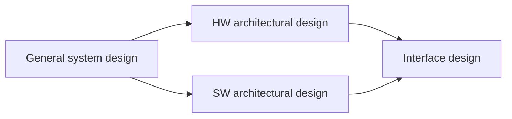
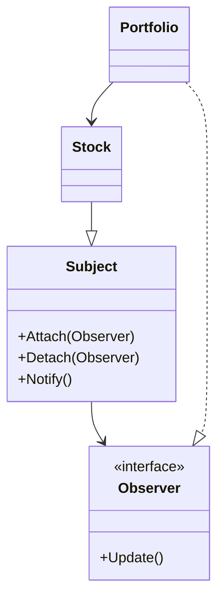

# System Architecture and Design

## Metadata

| Felt | Værdi |
|---|---|
| **Lektion** | L12 — Fra arkitektur til systemdesign |
| **Kursus** | SWISE-01 Indledende System Engineering |
| **Kilde** | `System Architecture and Design.pdf` (36 slides) |
| **Type** | slides |
| **Emner dækket** | Arkitekturdesign-aktiviteter (general/HW/SW/interface), designprincipper (decomposition, low coupling, high cohesion, abstraktion, re-use, testability), cohesion-typer, RVM-arkitektureksempler, designkriterier og prioritering, arkitekturstrategi (layering, half-sync/half-async, frameworks), initiation/termination, error handling (watchdog, POST, CBIT, limp mode, redundans) |

---

## System Architectural Design

- Med specifikationen og System Design (BDD, IBD) som udgangspunkt uddybes nu systemets arkitekturdesign.
- Arkitekturdesignet dækker design decisions, prioriteter, HW- og SW-dekomponering osv.
- Det kræver en række forskellige overvejelser, som gennemgås.

> Slide 1–2

## Architectural design activities — overview

Fire relaterede arkitekturdesign-aktiviteter:



| Aktivitet | Indhold |
|---|---|
| General system design | General considerations, prioritizing, and system-wide design decisions |
| HW architectural design | HW compositional break-down |
| SW architectural design | SW compositional break-down |
| Interface design | Design of HW/SW interfaces |

Denne lektion dækker *General system design*. (HW architectural design og interfaces dækkes i L13, se `system-design-and-interfaces.md`.)

> Slide 3–4

## General system design

- I general system design laves designovervejelser.
- Der er vigtige og svære valg at træffe.

*Figur: trekant med siderne FAST, CHEAP, GOOD — "Fast, cheap, good – chose any two!"*

- Før de svære valg: et par designprincipper der hjælper uanset valg.

> Slide 5

## System design principles

- Designprincipperne er "your new best friends".
- De hjælper med at konstruere et system der er maintainable, scalable og easy-to-understand.
- De bliver second nature senere i studiet; lige nu er de nye og svære at forstå og bruge.

Principperne:

- **Decomposition**
- Low **coupling** (kobling/binding)
- High **cohesion** (samhørighed)
- Use **abstractions**
- **Re-use** existing design solutions
- Ensure **testability**

> Slide 6–7

### Decomposition

*Figur: Til venstre "A nightmare system": én stor rød boks med `main()`. Til højre "Your choice": hierarkisk træ System → Subsystem 1, Subsystem 2, Subsystem 3; Subsystem 2 → Module 1, Module 2; Module 1 → Class 1, Class 2, Class 3, Class 4. Imellem: "WHY?"*

Dekomponeringshierarki: System → Subsystem → Module → Class.

> Slide 8

### Low coupling

- **Coupling** er et mål for hvor afhængigt et {SW|HW}-modul er af andre moduler.

*Figur: To grafer med noderne A–F. "High coupling": mange pile på kryds og tværs (A→E, A→B, A→C, B→C, D→C, D→E, D→F, B→E, B→F, F→A …). "Low coupling": få pile (A→E, A→B, D→C, C→F, B→F).*

- At sænke coupling giver en række fordele — hvilke?

**High Coupling — konsekvenser:**

- Difficult to debug during development
- Difficult to trace errors in running system
- Difficult to maintain
- Difficult to modify with new functionality
- …

**Advice:**

- Remove and reduce dependencies
- Minimize amount of information exchange between components
- Do not use global variables
- Keep design simple

*Figur (slide 10): "Tight Coupling" vs. "Loose Coupling" — tæt sammenvævede bokse vs. bokse med få forbindelser. Undertekst: "Objects of low cohesion are not sure what they do…" / "Cohesive objects do one thing, and only one thing, well!"*

> Slide 9–10

### High cohesion

- **Cohesion** er et mål for hvor godt et givet ansvar (responsibility) er indkapslet i et modul eller en komponent.

*Figur: Tre ansvar Rsp. A, Rsp. B, Rsp. C. "Low cohesion": hvert ansvar er spredt over flere moduler (Module 1–3 er hver især flerfarvede). "High cohesion": Rsp. A → Module 1, Rsp. B → Module 2, Rsp. C → Module 3 — ét ansvar pr. modul.*

> Slide 11

### Application Model (ATM) som eksempel

- Funktionalitet specificeret af use cases, realiseret af controller-klasser, er et eksempel på at opnå high cohesion.

*Figur: Use cases "Width Draw Cash", "Check Account", "Transfer Amount". Low cohesion: hver use case er spredt over Class 1, 2 og 3. High cohesion: én use case → én klasse (Width Draw Cash → Class 1, Check Account → Class 2, Transfer Amount → Class 3).*

> Slide 12

### Types of Cohesion

- **Functional** — alle elementer bidrager til udførelsen af én specifik opgave
- **Sequential** — output fra én procedure bliver input til den næste
- **Communication** — procedurer der opererer på samme sæt inputdata

> Slide 13

## RVM Architecture 1–3 (Reverse Vending Machine)

Tre alternative BDD'er for en RVM, til diskussion af cohesion/coupling.

**RVM Architecture 1** — Cohesion / Coupling?

| Blok | Forbundet til |
|---|---|
| «block» Computer | Display, Buttons, Printer, In-feed, MotorCtrl, Scanner, Central Database |
| «block» Display | Computer |
| «block» Buttons | Computer |
| «block» Printer | Computer |
| «block» In-feed | Computer |
| «block» MotorCtrl | Computer |
| «block» Scanner | Computer |
| «block» Central Database | Computer |

Stjernetopologi: alle blokke er kun forbundet til Computer.

**RVM Architecture 2** — Cohesion / Coupling? Er samme funktionalitet mulig at realisere som i Architecture 1?

| Blok | Forbundet til |
|---|---|
| «block» In-feed | Scanner, (bus) |
| «block» Scanner | In-feed, Central Database |
| «block» Touch-Display | (bus) |
| «block» Printer | Central Database (nederste linje) |
| «block» MotorCtrl | (bus) |
| «block» Central Database | Scanner, Printer, (bus) |

Display og Buttons er slået sammen til Touch-Display (cirklet på sliden); Computer-blokken er væk og erstattet af en fælles forbindelse/bus (også cirklet). Ingen central controller.

**RVM Architecture 3** — Cohesion / Coupling? Hvad med fejl og udskiftning af komponenter?

| Blok | Forbundet til |
|---|---|
| «block» In-feed+Scanner+MotorCtrl | Display+Buttons+Computer |
| «block» Display+Buttons+Computer | In-feed+Scanner+MotorCtrl, Central Database, Printer |
| «block» Central Database | Display+Buttons+Computer |
| «block» Printer | Display+Buttons+Computer |

Blokke er lagt sammen til få store enheder — lav kobling mellem blokke, men lav cohesion inde i blokkene, og en fejl i én sammenlagt enhed kræver udskiftning af hele enheden.

> Slide 14–16

## Eksamensspørgsmål: coupling og cohesion

*Forklar kort hvilken betydning begreberne "coupling" og "cohesion" har i forhold til et godt arkitekturdesign.*

> Design principperne "coupling" (kobling) og "cohesion" (samhørighed) er vigtige for et godt design. Der skal være lav kobling mellem klasser/komponenter i designet og stor samhørighed i de enkelte klasser/komponenter. Den lave kobling gør at de enkelte komponenter er lettet at vedligeholde, udskifte, modificere og teste. Samhørigheden internet i klassen/komponenten kan omhandle emner som: funktionsmæssig sammenhæng, sammenhæng mellem sekvens af operationer, kommunikation og logisk sammenhæng.

(Ordret fra sliden, inkl. stavefejl "lettet" og "internet".)

> Slide 17

## Abstractions

- Abstraktioner hjælper med at opnå low coupling og high cohesion
  - Se bort fra *irrelevant details*, fokusér på nogle få aspekter
  - Data- eller kontrolabstraktion
- Korrekt brug af abstraktioner øger også cohesion
- Eksempel: underviserens abstraktion af det værksted der reparerede bilens parkeringssensor

> Slide 18

### Abstractions — parking sensor

Uden abstraktion ("Far too many details that I (as car owner) do not care about. I just want my car fixed."):

```cpp
Car fixMyCar(Garage garage, Car car)
{
    Mechanic kian = garage.findMechanic();
    Lift lift = garage.getAvailableLift();
    kian.moveCarToLift(car, lift);
    lift.liftCar();
    kian.removeRearBumper(car);
    if(kian.inspectElectronicsUnderRearBumper(car) == BROKEN)
    {
        ParkingSensor ps =
                     kian.getNewParkingSensor(garage.getStock());
        kian.install(ps, car);
    }
    else
        kian.cleanParkingSensorHeads(car);
    kian.attachRearBumper(car);
    lift.lowerCar();
    kian.moveCarToParkingLot(garage.getParkingLot());

    return car;
}
```

Med abstraktion ("Much better! Let the garage worry about *how* to fix my car - they can use Kian, Mary, a robot or ninja smoke for all I care. I just want my car fixed."):

```cpp
Car fixMyCar(Garage garage, Car car)
{
    garage.repair(car, "PARKING SENSOR BROKEN");
    return car;
}
```

> Slide 19

### Eksempler på abstraktionsniveau

*Figur (slide 20): "Automation – Production" — foto af et industrielt styreskab med et lille operatørpanel/display, en rød nødstop-knap og fire farvede trykknapper (blå, grøn, rød, sort). Høj abstraktion mod operatøren.*

*Figur (slide 21): "Airbus A380 – Flight deck" — foto af cockpittet med mange skærme, knapper og kontroller. Lav abstraktion / mange detaljer eksponeret for brugeren.*

> Slide 20–21

## Design for test — Ensure testability

- Planlæg hvordan hardwarekomponenter og softwareklasser skal testes samtidig med at systemet designes
  - V-model
- Unit and component test
  - Interfaces
  - Functionality
  - Test cases: stimuli and expected response
- Integration test
  - Top-down or Bottom-up
  - Stubs and drivers

> Slide 22

## Diskuter (Menti)

- Hvad betyder det at et design har høj kobling?
- Hvordan kan høj samhørighed i komponenter være med til at give lav kobling for systemet?
- Hvordan kan SysML diagrammerne bruges til at opfylde de gode design principper?
- Find et eksempel på et system med høj og/eller lav abstraktion?
- Hvordan kan man designe HW/SW med "re-use"?
- Hvilke principper vil I bruge for at et system er nemt at teste?

> Slide 23 (slide 24: "Meanwhile, in the system design cave…" — overgangsbillede)

## System design — activities

Svære beslutninger der skal træffes:

**List of decisions:**

1. Prioritize design criteria
2. Architectural design strategy / strategies
3. Data storage strategies
4. Software control strategies
5. Initiation/termination strategies
6. Error handling
7. Self-test and backup functions
8. …

- Valgene påvirker systemarkitekturen som helhed.
- Nogle af dem gennemgås i det følgende.

> Slide 25

## 1. Prioritizing design criteria

- Et systems valgte designkriterier er fundamentet som senere designbeslutninger træffes på.
- Velkommen til den virkelige (uperfekte) verden: designkriterier er forskelligartede og modstridende — "Fast, cheap, good…"
- De valgte kriterier drives af det *tilsigtede marked* og den *eksisterende teknologi*.

Eksempler på designkriterier:

| | | |
|---|---|---|
| Cost | Extensibility | Usability |
| Performance | Functionality | Testability |
| Time-to-market | Reliability | Scalability |
| Safety | Security | … |

*Figur: Kriterierne → "Prioritization" → "Decisions". Nedefra peger "Exploitation" fra "Available technology (hardware, frameworks, operating systems, …)" op mod Decisions. Cost, Performance og Time-to-market er markeret med mørkere farve.*

**Your turn!** 10 minutter: vælg top-4 designkriterier hvis I laver…

- An iPhone accessory
- A nuclear power plant
- A Reverse Vending Machine
- "Slusesystem"

> Slide 26–28

## 2. Architectural design strategy

En arkitekturstrategi er en strategi for designet af systemet. Den omfatter…

- Selection of layering
- Deciding the use of framework(s)
- Network technologies
- Database management
- …

> Slide 29

### Layering

- Lagdeling af systemet er en af de mest effektive måder at opnå low coupling på system-niveau.

To eksempler på lagdeling (pile op og ned mellem nabolag):

| Software-applikation | Embedded system |
|---|---|
| Presentation layer | Program |
| Business logic layer | Operating System |
| Data access layer | Drivers |
| Network layer | Hardware |

> Slide 30

### Half-sync, half-async

- For kontinuerte systemer (fx regulering/control) kan *half-sync, half-async* være en fin tilgang.

*Figur: To områder. Øverst "Event-controlled (synchronous)": aktør ↔ UI; UI → Control; UI → Configuration. Nederst "Continuous processing (asynchronous)": Sensor processing → Regulation → Driver. Control (øverst) → Regulation (nederst); Configuration (øverst) → Driver (nederst). Driver → motor (fysisk aktuator) og motor → Sensor processing (feedback-loop).*

| Del | Komponenter | Karakter |
|---|---|---|
| Event-controlled (synchronous) | UI, Control, Configuration | Reagerer på brugerhændelser |
| Continuous processing (asynchronous) | Sensor processing, Regulation, Driver | Kører kontinuert i loop mod motoren |

> Slide 31

### Frameworks

- Frameworks er færdiglavede softwaresystemer som man instantierer, typisk ved extension:
  - Erklær nedarvning fra en framework-klasse
  - Implementér frameworkets (abstrakte) metoder
- Frameworks giver meget funktionalitet og decoupling og skjuler typisk irrelevante detaljer.

> Slide 32

### Frameworks — example: A stock market

Observer-mønsteret som framework:



Framework-laget: `Subject` (abstrakt) og `«interface» Observer`. Application-laget: `Stock` arver fra `Subject`; `Portfolio` implementerer `Observer` og holder reference til `Stock`.

```cpp
Stock::setValue(double v)
{
  value = v;
  Notify();
}
```

```cpp
Portfolio::addStock(Stock s)
{
  s.Attach(this);
}

Portfolio::Update()
{
  // Do something with the stock
}
```

`Notify()` og `Update()` er fremhævet med rødt på sliden — det er framework-kaldene der binder applikationen sammen.

> Slide 33

## 5. Initiation/termination strategies

- Overvej også hvordan systemet startes og stoppes.
- **Initiation:**
  - Start order?
  - Access to configuration data?
  - Power-On Self-Test?
- **Termination:**
  - Termination order?
  - Configuration storage?

> Slide 34

## 6. Error handling

- Hardware i systemet → systemet vil på et tidspunkt fejle.
- Error handling er kritisk at få ind i systemet fra dag 1.
- Der skal være en *strategi*:
  - Hvordan *detekteres* fejl?
  - Hvordan *håndteres* detekterede fejl?

### Some strategies for error detection and handling

- **Detection:**
  - Watchdogs — detect software deadlocks
  - Voting systems
  - Self tests / self-diagnostics
    - Power-On Self-Test (POST)
    - Continuous Built-In Test (CBIT)
- **Handling:**
  - User intervention
  - Limp mode
  - Redundant systems

> Slide 35–36
