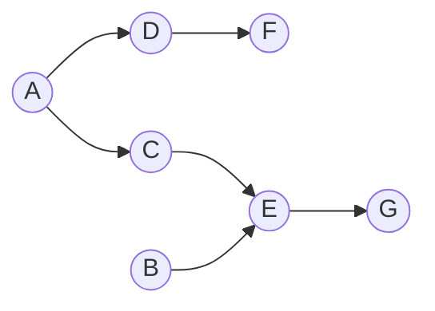

# Project Management

## Metadata

| Felt | Værdi |
|---|---|
| **Lektion** | L14/L15 — Projektledelse + Risk Analysis |
| **Kursus** | SWISE-01 Indledende System Engineering |
| **Kilde** | `Project Management_E22.pdf` (33 slides) |
| **Type** | slides |
| **Emner dækket** | Grupper vs. teams; Belbin teamroller og Belbin chart; traditionelle roller (projektleder, teammedlemmer, sekretær); teamfaser (forming/storming/norming/performing); projektplanlægning; Work Breakdown Structure (WBS); Estimated Time to Complete (PERT-formel); afhængigheder og kritisk vej; Gantt- og netværksdiagram (MS Project); risikostyring: identifikation, probability × consequence, risk mitigation plan, risk matrix; øvelse til semesterprojekt |

---

## Introduction

- Why do we need project management?
- Groups vs. teams
- Team roles and activities
- Maintaining a team – group AC
- Project planning and estimation
- Risk management

> Slide 2

## Project teams, roles and activities

*Figur (slide 4): Foto af seks personer i en raftingbåd i strømfyldt vand — alle padler synkront med én styrmand bagest. Illustration af team.*

> Slide 3–4

### Groups vs teams

- What is the difference between a *group* and a *team*?

| GROUP | TEAM |
|---|---|
| *Individual* accountability | *Individual* and *mutual* accountability |
| Meet to share information | Meet to discuss, make decisions, solve problems, planning |
| Focus on *individual* goals | Focus on *team* goals |
| Produce *individual* work products | Produce *collective* work products |
| Define *individual* roles, responsibilities, and tasks | Define individual roles, responsibilities, and tasks *to help team do its work* |
| Concerned with *individual's* outcome and challenges | Concerned with *team* outcome and challenges |
| Purpose, goals, approach to work shaped by *manager* | Purpose, goals, approach to work shaped by team leader *with team members* |

> Slide 5

### Nobody is perfect – but a team can be

> "A group is a matter of balance. Good team-members has strengths and competencies which cover the needs of the group – without doubling strengths and competencies already present. Strengths possessed by some team-members can compensated weaknesses in others. **Nobody is perfect – but a team can be.**"
> — Dr. Meredith Belbin, http://www.belbin.com/

> Slide 6

### Belbin team roles

| Type | Positive qualities | Allowable weaknesses |
|---|---|---|
| Organiser | Organizing, disciplined, turns ideas into practical actions. Hard working. | Less flexible. Skeptical to unproven ideas |
| Analyst | Sober, strategic. Sees all options. Judges accurately. High intellect. | Lacks drive and ability to inspire others. |
| Idea generator | Dominating, high intellect. Creative, imaginative, unorthodox. | Ignores routine questions. Too focused on the special problems. |
| Finisher | Mindful, anxious. Finds errors and omissions. Delivers on time. | Inclined to worry unduly. Reluctant to delegate. |
| Coordinator | Stable, dominant. Good chairperson, clarifies goals, promotes decision-making, delegates well. | Can be seen as manipulative. Off loads personal work. |
| Communicator | Stable. Low dominance. Co-operative, mild, perceptive and diplomatic. Listens, averts friction. | Indecisive in crunch situations. |
| Contact creator | Stable, dominant, enthusiastic, communicative, develop contacts. | Over-optimistic. Looses interest once initial enthusiasm has passed. |
| Initiator | Impatient, dominant, challenging, dynamic, thrive on pressure. | Prone to provocation. Offends peoples feelings. |

> Slide 7

### Belbin team roles – Belbin chart

*Figur: Radardiagram ("spider chart") med otte akser, én pr. rolle, i rækkefølge rundt om cirklen: Organizer (top), Initiator, Coordinator, Communicator, Contact Creator (bund), Idea Generator, Analyst, Finisher. Fire koncentriske "score rings" mærket Low, Average, High, Very High. En rød polygon viser en persons profil — i eksemplet høj på Analyst og Coordinator, gennemsnitlig på Organizer, lavere på de øvrige. Tekst: "Nobody is perfect – but a team can be".*

> Slide 8

### Traditional team roles

- Traditionally, in a team there are some well-known roles:
  - Project manager
  - Team members
  - Secretary
- All members assume (at least) one role
- With a role comes tasks and responsibilities

> Slide 9

### Team roles – project manager

- What is the project manager's tasks?
  - Manage expectations - internally (team) and externally (stakeholders)
  - Seek information – from team and stakeholders
  - Conduct planning - tasks, plans, manning, preferably with the team
  - Keep information level up - internally and externally
  - Display team culture and behaviour
  - Be the team lightning rod / shield
  - Report to steering comittee
  - …

> Slide 10

### Team roles – the team members

- What requirements are fair to have to team members?
  - There's no "I" in "team"
  - Responsible
  - Tolerant
  - Loyal to decisions
  - Self-reliant and self-driving
  - Honest
  - Display "due dilligence"

> Slide 11

### Teams go through phases

| Fase | Beskrivelse |
|---|---|
| **Forming** | team begins to discuss the task(s) and orientate towards a work plan |
| **Storming** | conflicts and tensions emerge - different work styles, expectations, ethics, … |
| **Norming** | mutual trust and effective ways of working emerge |
| **Performing** | effective work patterns are producing the required results |

> Slide 12

### Grupper og Teams (diskussion)

- Diskuter nedenstående spørgsmål:
- Del erfaringer omkring projekt/gruppe arbejde
  - Hvad skal der til før det bliver godt?
  - Hvad kan være en forhindring?
- Kan I genkende teorien omkring teams og udviklingsfaserne?
- Er det nødvendig med en projektleder?
- Hvornår fungere en gruppe/team bedst?
- Diskuter forskellen på gruppe og teams samarbejde og giv eksempler?

Menti: https://www.menti.com/alhjki2fnmi3

> Slide 13

### Leadership & Teamwork

*Figur: Overstreget meme (Michael Scott, The Office): "I want all the credit but none of the blame". To ordskyer: "Leadership" (Appreciation, Strategy, Humility, Commitment, Responsibility, Integrity, Listening, Honest, Communication, Values, Purpose, Determination, Passion, Principles) og "Teamwork" (Together, Unity, Work, Success, Cooperation, Leadership, Partnership, Support, Goal, Collaboration, Productivity, Skills, Vision, Community, Office, Communication, …).*

Videoer:

- https://www.youtube.com/watch?v=3Y6nYfxWuB8
- https://www.youtube.com/watch?v=vlpKyLklDDY

> Slide 14

## Project planning

- To have a succesful project, you will need a *plan*

*Figur: Under punktet en lille graf: en rød ellipse "Task understanding" med to stiplede pile ind mærket "requires" — planen og projektledelsen kræver forståelse af opgaven. (Sliden har et indlejret miniaturebillede af titelsliden "Project Management — Introduction to Systems Engineering I2ISE".)*

- Thus, to *plan*, we first need to *understand what to plan*!

> Slide 15–16

### Planning activities

Project planning is a **continuous** activity

- **Initially**
  - Break project down into manageable *work packages*
  - Identify *activities* and *milestones*
  - Make *estimates* (*Estimated Time to Complete* (ETC))
  - Allocate *resources*
  - Create the plan itself
- **Continuously**
  - Monitor project status and progress
  - Monitor time spent/remaining, compare with milestones
  - Adjust plan/scope of milestones, etc.

> Slide 17

### Project Work Breakdown Structure (WBS)

*Figur: Eksempel på WBS-træ. Level 1: "Project A". Level 2 (1.1–1.8): Project Management, Systems Engineering, Software, Hardware, Deliverables Management, System Test, Support Services, Installation. Under Software (1.3) tre delgrene: Software Design, Software Build, Unit Testing. Hvert level 2-element har en liste af arbejdspakker nedenunder, fx Project Management: Planning; Cost & schedule management; Scope management; Task management; Project office administration; Project communications; Human resources management; Space and facilities planning; Risk management; Procurement management; Quality management. Systems Engineering: Technical planning; Technical supervision; Business requirements definition; System requirements definition; System architecture & top level design. Software Design: Software requirement specification; Software work package definition; Software prototyping; Software unit detailed design. Software Build: Software unit coding; Software unit debugging. Unit Testing: Unit test planning; Unit test case preparation; Unit test conduct; Unit test records. Hardware: Hardware requirements planning; Hardware requirement definition; Hardware component selection; Hardware unit/component testing. Deliverables Management: Deliverables tracking; Deliverables production and packaging. System Test: Module & subsystem testing; System integration testing; Acceptance testing; Defect classification, tracking & metrics. Support Services: Configuration management; Quality assurance; Development tools and utilities; Development environment upkeep; Internal product liaison; Team technical training. Installation: Installation planning; User support documentation; User communications & training; Installation management & coordination; Installation testing and verification; Installation performance monitoring.*

Source: http://itsadeliverything.com/got-a-wbs-for-your-agile-project-sure-of-course

> Slide 18

### Planning – WBS

- The work in a project can be broken down in a *Work Breakdown Structure* (WBS)
  - A tree structure containing ever-finer divisions of work
- The WBS leaves should be managable, well-defined, "estimatable" pieces of work
  - *Terminal elements* or *work packages (WPs)*
- The WBS is the basis of further planning, e.g. time, cost, manpower, dependencies, …

> Slide 19

*Figur (slide 20): WBS for en cykel i tre niveauer, med procentvis fordeling af arbejdet (summer til 100 på hvert niveau):*

| WBS Level 1 | WBS Level 2 | WBS Level 3 |
|---|---|---|
| 1. Bicycle — 100 | 1.1 Frame Set — 15 | 1.1.1 Frame — 7; 1.1.2 Handlebar — 2; 1.1.3 Fork — 3; 1.1.4 Seat — 3 |
| | 1.2 Crank Set — 5 | (5) |
| | 1.3 Wheels — 30 | 1.3.1 Front Wheel — 13; 1.3.2 Rear Wheel — 17 |
| | 1.4 Braking System — 5 | (5) |
| | 1.5 Shifting System — 5 | (5) |
| | 1.6 Integration — 35 | 1.6.1 Concept — 3; 1.6.2 Design — 5; 1.6.3 Assembly — 10; 1.6.4 Testing — 17 |
| | 1.7 Project Mgt — 5 | (5) |
| | **Sum 100** | **Sum 100** |

> Slide 20

### Planning – estimering (PERT / ETC)

- Once the project is broken down, you can start to *estimate* and *schedule* your work
- One way to do this:
  - List your WBSs
  - Estimate time to complete, e.g.

$$\text{ETC} = \frac{P + 4 \cdot N + O}{6}$$

  hvor *O* = optimistisk estimat, *N* = normalt (mest sandsynligt) estimat, *P* = pessimistisk estimat. (Sliden skriver formlen `ETC = (P+4*N+O)/6`.)

  - Determine dependencies
    - "C cannot start before A and B is complete…"
  - Determine "critical path"
    - The path which, if delayed, delays the project as a whole

> Slide 21

### WBS, duration and predecessors

| Activity | Predecessor | Opt. (O) | Normal (N) | Pess. (P) | Expected time |
|---|---|---|---|---|---|
| A | — | 2 | 4 | 6 | 4.00 |
| B | — | 3 | 5 | 9 | 5.33 |
| C | A | 4 | 5 | 7 | 5.17 |
| D | A | 4 | 6 | 10 | 6.33 |
| E | B, C | 4 | 5 | 7 | 5.17 |
| F | D | 3 | 4 | 8 | 4.50 |
| G | E | 3 | 5 | 8 | 5.17 |

Kontrol af formlen på række A: (6 + 4·4 + 2)/6 = 24/6 = 4.00. Række B: (9 + 20 + 3)/6 = 32/6 = 5.33.

*Figur: Netværksdiagram (aktivitet-på-node) af tabellen:*

Beregnet (står ikke på sliden): de tre veje er A→D→F = 14.83, A→C→E→G = 19.51 og B→E→G = 15.67, så den kritiske vej er A→C→E→G.

> Slide 22

### Planning – Gantt chart

- With estimates in hand, you can do a *Gantt chart* to show dependencies, duration etc. of tasks
  - Graphical overview
  - Critical paths, milestones, etc.

*Figur: Gantt-diagram (MS Project) af eksemplet ovenfor, uge 23. jul – 13. aug '06:*

| ID | Task Name | Predecessors | Duration |
|---|---|---|---|
| 1 | Start | | 0 days |
| 2 | a | 1 | 4 days |
| 3 | b | 1 | 5.33 days |
| 4 | c | 2 | 5.17 days |
| 5 | d | 2 | 6.33 days |
| 6 | e | 3,4 | 5.17 days |
| 7 | f | 5 | 4.5 days |
| 8 | g | 6 | 5.17 days |
| 9 | Finish | 7,8 | 0 days |

*Start og Finish er milepæle (sorte diamanter). Røde bjælker markerer opgaverne på den kritiske vej (a, c, e, g), blå bjælker de øvrige (b, d, f).*

> Slide 23

### Gantt (1) og (2) – MS Project

*Figur (slide 24–25): Skærmbilleder fra Microsoft Project ("Cartoon Hero plan", Tracking Gantt) med en WBS for en rapport om tegneseriehelte. Opgavehierarki med varigheder og predecessors:*

| WP | Task Name | Duration | Predecessors |
|---|---|---|---|
| 1 | Plan detailed contents | 10 days | |
| 1.1 | Introduction | 1 day | |
| 1.2 | Presentation of characters | 10 days | |
| 1.2.1 | Spiderman section | 1 day | |
| 1.2.2 | Superman section | 10 days | |
| 1.2.3 | Batman section | 1 day | |
| 1.3 | Comparison | 2 days | |
| 1.4 | Conclusion | 2 days | |
| 2 | Create document template | 1 day | |
| 3 | Write contents | 13 days | 1;9 |
| 3.1 | Introduction | 2 days | 2;9 |
| 3.2 | Presentation of characters | 2 days | |
| 3.2.1 | Spiderman section | 4 days | 4;9 |
| 3.2.2 | Superman section | 4 days | 5;9 |
| 3.2.3 | Batman section | 5 days | 6;9 |
| 3.3 | Comparison | 4 days | 7;9 |
| 3.4 | Conclusion | 4 days | 8;9 |
| 4 | Create artwork | 2 days | 9 |
| 4.1 | Front page | 2 days | 9 |
| 4.2 | Spiderman | 2 days | 9 |
| 4.3 | Superman | 2 days | 9 |
| 4.4 | Batman | 2 days | 9 |
| 5 | Review and corret report | 5 days | 10;18 |
| 5.1 | Review | 1 day | 11;13;14;15;16;1… |
| 5.2 | Corrections | 4 days | 24 |
| 6 | Finish report | 2,5 days | 23 |
| 6.1 | Print contents | 0,5 days | 25 |
| 6.2 | Print front page | 0,5 days | 25 |
| 6.3 | Collect front page and contents | 1 day | 27;28 |
| 6.4 | Bind report | 1 day | 29 |
| 7 | Hand in report | 0 days | 26 |
| 8 | Project Management | 5 days | |

*Gantt-visningen til højre viser bjælkerne med afhængighedspile; kritiske opgaver i rødt, milepælen "Hand in report" som diamant (05-03). Skærmbilledet er småt; enkelte predecessor-værdier er afskåret i originalen.*

> Slide 24–25

### Network (1) og (2) – MS Project

*Figur (slide 26–27): Netværksdiagram-visningen af samme plan i MS Project. Slide 26 viser hele netværket zoomet ud (bokse forbundet med røde linjer = kritisk vej, blå = ikke-kritisk). Slide 27 er zoomet ind: "Write contents" (Start Mon 06-02, ID 10, Finish Wed 22-02, Dur 13 days, Comp 0%) → "Introduction" (Start Fri 17-02, ID 11, Finish Mon 20-02, Dur 2 days), "Presentation of characters" (Start Tue 07-02, ID 12, Finish Wed 08-02, Dur 2 days) → "Spiderman section" (Mon 06-02, ID 13, Thu 09-02, 4 days), "Superman section" (Fri 17-02, ID 14, Wed 22-02, 4 days, fremhævet), "Batman section" (Mon 06-02, ID 15, Fri 10-02, 5 days). Summary tasks tegnes som parallelogrammer, almindelige opgaver som rektangler.*

> Slide 26–27

## Risk Management

- The project plan is objective, but idealized.

> "No campaign plan survives first contact with the enemy!"
> — Helmuth Karl Bernhard von Moltke, German Field Marshall (1800-1891)

*Figur: Portrætfoto af von Moltke med citatet i taleboble.*

> Slide 28

- What can we do to handle risk in the project?
- Risks cannot be avoided, but some can be foreseen and planned for.
- Simple, effective risk mitigation tool:
  1. *Envision* the risk items
  2. *Evaluate* the risk items (probability × consequence)
  3. Make *risk mitigation* / *contingency plan* for each risk item

> Slide 29

### Identification of risks

- Project impact
  - Schedule, resources, people skills, estimates, tools
    - E.g. Loss of team member, problem with tool, missing important competences
- Product impact
  - Requirements, quality, performance, purchased components, technology
    - E.g. Poor requirements, low performance, mature technology
- Business impact
  - Organization, competitor, cost, world economic
    - E.g. New competing product, too expensive, change of organization

> Slide 30

### Risk Management – risikotabel

| Description | Prob. 1-5 | Conseq. 1-5 | Impact 1-25 | Risk Mitigation Plan |
|---|---|---|---|---|
| Members leave team | 2 | 3 | 6 | Mandatory monthly knowledge sharing via team meetings |
| Subsuppliers delayed | 2 | 5 | 10 | Formal agreement with reimpursement plan |
| Requirement changes | 5 | 3 | 15 | Frequent demonstrations of product to customer |
| … | … | … | … | … |

- Risk Impact = Probability x Consequence (Highest)
- Extensions:
  - Identify cause
  - Separate *risk mitigation* from *contingency planning*

> Slide 31

### Risk Matrix

| Consequence of risk item \ Probability of risk item | High | Medium | Low |
|---|---|---|---|
| **High** | A | A | B |
| **Medium** | A | B | C |
| **Low** | B | C | C |

*A (rød) = højeste prioritet, B (orange) = mellem, C (grøn) = lav.*

> Slide 32

### Semester project: Risk Matrix

**Exercise:** Create a risk matrix for your project (Identify and evaluate risk items, like exceeding budget or plan)

*Samme 3×3 risk matrix som ovenfor (A/A/B, A/B/C, B/C/C) som skabelon.*

> Slide 33
