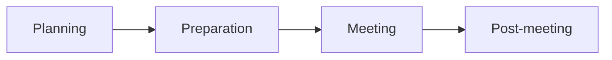
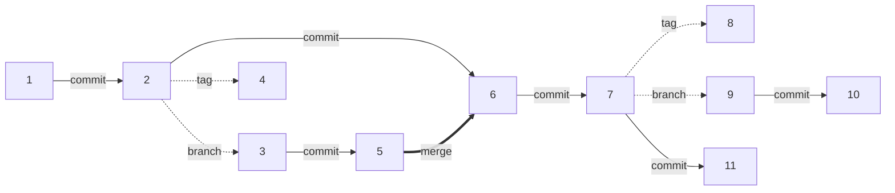

# Quality Management

## Metadata

| Felt | Værdi |
|---|---|
| **Lektion** | L13/L24 — Kvalitetssikring |
| **Kursus** | SWISE-01 Indledende System Engineering |
| **Kilde** | `Quality Management.pdf` (27 slides) |
| **Type** | slides |
| **Emner dækket** | Quality Management (planned/controlled/assured/improved), test vs. review/CM, reviews (mål, faser: planning/preparation/meeting/post-meeting, roller, ground rules, agenda, MoM), Configuration Management, configuration items (CIs), versioner vs. baselines, revisionsnummerering, version control systems, Subversion (checkout/update/commit/add/revert, branch/tag/merge), Git-kommandoer, GitHub |

---

## Introduction

- What is Quality Management?
- Reviews
- Configuration control
- Subversion/Github

> Slide 2

## What is Quality Management?

- Quality Management (QM) is a set of activities performed to ensure that quality is
  - Planned
  - Controlled
  - Assured
  - Improved
- A couple of activities/tools: Reviews, version control and Subversion/Github

> Slide 3

## Errors

- **Test** is good in **finding** errors implemented by mistake
- **Review** and **configuration management** is to **prevent** errors being implemented at all!

> Slide 4

## QM — reviews

- A review is the activity of looking through proposed work prior to its commitment.
- You can (practically) review anything
  - Code, diagrams
  - Documents
  - Processes (e.g. Scrum retrospective)
  - …
- For reviews to be effective, they must be structured

> Slide 5

### Reviews — goal

- The goal of a review: **Release of the item under review**
- How is the goal supported by the review?
  - By constructive criticism on the review item
  - By finding potential quality problems
  - By ensuring corrective action is taken
- How is the goal obstructed by the review?
  - By using it to prove you're smarter than everybody else
  - By establishing yourself as a leader
  - By pressing your preferred solution

> Slide 6

### Reviews — phases

(De fire faser gentages som fodnote-figur på slide 8–13 med den aktuelle fase fremhævet.)

> Slide 7

### Reviews — planning

What should be planned?
- What are we going to review?
- Who are the reviewers?
- When, where and how will the review take place?
- How is the document and supplementary material distributed?
- Who will chair the review meeting?

> Slide 8

### Reviews — preparation

**How should the document owners prepare?**
- Make sure the review item is frozen for review
- Practicals: Book meeting room, ensure AV equipment is present, …
- Distribute review item etc. to review opponents along with agenda and venue
- Define the desired roles (review leader, secretary)
- …

**How should the reviewer prepare?**
- Read the review item thoroughly — distribute roles (spelling, diagrams, …)
- Prepare overall and detailed critique
- Find relevant sources etc.

> Slide 9

### The document owners' roles

**Review leader (chair) ensures…**
- agenda for review is issued and kept
- everyone is heard during review
- focus during the meeting
- delegation of action items

**Review secretary ensures**
- distribution of review item, agenda, …
- creation and distribution of Minutes of Meeting (MoM)
- changes are captured
- review item is updated iaw. review (assigns action items)
- sufficient coffee!

> Slide 10

### The reviewers' roles

Some ground rules for the reviewers:
1. Be prepared
2. Be friendly and empathic
3. Behave
4. Point to issues, not solutions
5. Avoid discussions on style (taste)
6. Stick to the subject matter

> Slide 11

### Review: The agenda

The review meeting is best conducted along an agenda, e.g.
1. Welcome, opening remarks (chair)
2. General remarks (opponents)
3. Detailed run-through of review item (opponents)
4. Conclusion (chair, secretary)
5. Actions to be taken — rework, corrections (all)
6. Closing remarks (all)

> Slide 12

### Reviews — post-meeting

- Make sure Minutes of Meetings are distributed ASAP
- Make necessary corrections to the review item
- Decide on the action to take now: Call new review or release the review item

> Slide 13

## Configuration Management

- Another important activity is Configuration Management
- The purpose of configuration management is to
  - Capture the baseline of a given (version) of a product
  - Ensure that a given product can be re-created from scratch

> Slide 14

### Baseline!

- Agreed-to information that defines and **establishes the attributes of a product at a point in time and serves as the basis for defining change**
- Goals
  - to handle changes related to baseline
  - to ensure documentation and product artifacts fits together
    - Where do I find documentation that fits with product release x.y.z?

> Slide 15

### Configuration Management — problemet

*Figur: Grønt "revisionstræ" med en hovedlinje og flere afgreninger (branches), hvor sorte prikker markerer punkter på linjerne. Én prik på hovedlinjen har en gul note: "SW, HW, Req.spec., Design spec., Test spec., …" — dvs. de artefakter, der hører sammen på det punkt. Til højre et foto af en frustreret udvikler med hænderne i håret: uden CM ved man ikke hvilke artefakter der hører sammen.*

> Slide 16

### Configuration Management — CIs og baseline

- What you need is *configuration management*
  - A way to control what *configuration items (CIs)* (documents, HW, SW, tools, …) in what *revision* that apply to a given *version* of the product
- Collectively, this is known as a *baseline*
  - Typically defined by a top-level document that calls out the different versions of CIs
- The baseline must contain everything necessary to rebuild the version from scratch

*Figur: En grøn linje med en sort prik mærket "Version". Fra prikken går en linje til en rød ramme mærket "Baseline", som indeholder en gul note mærket "CIs":*

| CI | Revision |
|---|---|
| SW | rev. 1.2 |
| HW | rev. A09 |
| Req.spec. | rev. 1.2 |
| Design spec. | rev. 1.2 |
| Test spec. | rev. 1.2 |
| … | |

> Slide 17

### Configuration Management — versioner og baselines

- Versions are defined
- Each *version* defines its own *baseline*

*Figur: Samme revisionstræ som slide 16, nu med versionsetiketter på prikkerne. Hovedlinje: Version 1.0 → 1.1 → 1.2 → 1.3. Fra 1.0 udgår en gren opad: Version 2.0 → (deler sig) Version 2.1 og Version 2.2, som mødes i Version 2.3. Fra 1.1 udgår en gren nedad: Version 3.0 → Version 3.1, og fra 3.0 videre til Version 3.2. To baseline-bokse er vist:*

| Ver. 1.0 Baseline | Ver. 2.0 Baseline |
|---|---|
| SW rev. 1523 | SW rev. 2301 |
| PC HW rev. 001 | PC HW rev. 001 |
| uC HW rev. A08 | uC HW rev. A08 |
| RS rev. 1.2 | RS rev. 2.2 |
| AT rev. 1.2 | AT rev. 2.1 |
| SDD rev. 1.5 | SDD rev. 2.3 |
| … | … |

(RS = requirements specification, AT = accepttest, SDD = software design document — forkortelserne er ikke udfoldet på sliden.)

> Slide 18

### Configuration Management — Note that…

- *Versions* are defined at planning-time
- *Baselines* are defined when a version is completed (released)

*Figur: Udsnit af træet: Version 1.0 → Version 1.1 på hovedlinjen, Version 2.0 på gren fra 1.0. Tre baseline-bokse:*

| Ver. 1.0 Baseline | Ver. 1.1 Baseline | Ver. 2.0 Baseline |
|---|---|---|
| SW rev. 1523 | SW rev. 1999 | SW rev. 2301 |
| PC HW rev. 001 | PC HW rev. 002 | PC HW rev. 001 |
| uC HW rev. A08 | uC HW rev. A09 | uC HW rev. A08 |
| RS rev. 1.2 | RS rev. 1.3 | RS rev. 2.2 |
| AT rev. 1.2 | AT rev. 1.3.1 | AT rev. 2.1 |
| SDD rev. 1.5 | SDD rev. 1.8 | SDD rev. 2.3 |
| … | … | … |

Bemærk revisionsnummereringen: hver CI har sit eget revisionsnummer uafhængigt af produktets versionsnummer (SW som ét løbenummer, HW som bogstav+tal, dokumenter som major.minor[.patch]). Baselinen er den tabel der binder dem sammen.

> Slide 19

## CM — version control systems

- There exists a variety of version control systems
  - Systems that allow you to get, update, submit, track and revert revisions of a document/source file
  - Examples: Git, Subversion, PVCS, Dropbox, …
- Indispensable for a number of reasons:
  - Concurrent work
  - Versioning and revision control
- Example: Subversion (http://subversion.tigris.org/)

> Slide 20

### CM — Subversion

| Egenskab | Beskrivelse |
|---|---|
| History | All earlier revisions of a document are maintained |
| Availability | Documents are securely accessible in a single place |
| Sharing | Several people can contribute to a document |

> Slide 21

### CM — Subversion basics

- Somewhere, someone (maybe you?) have created a *repository*
  - Ask Google how if you're interested
- First (and only once), you **check out** the repository
  1. Perform an `SVN checkout` operation — this will give you a *working copy* of the repository
- Before you start work, you **update** your working copy
  1. Perform an `svn update` operation
- You work on your working copy. When happy, you **commit** your changes
  1. Perform an `svn commit` operation on a file or folder

> Slide 22

- If you make any new files, you can **add** them to the repository
  - Perform an `SVN add` operation
  - Note: Nothing changes until you *commit* your working copy
- If you regret your current changes you can **revert** them
  - Perform an `SVN revert` operation
- Other stuff:
  - Version history
  - Diff
  - Branching
  - Tagging
  - Merging

> Slide 23

### CM — Subversion: revisionsgraf

*Figur: Revisionsgraf med nummererede noder 1–11. Piletyper: sort = Commit, rød = Tag, blå = Branch, grøn = Merge.*

Trunk (grønne noder): 1 → 2 → 6 → 7 → 11. Branch (blå): 2 → 3 → 5, merget ind i 6. Branch (blå): 7 → 9 → 10 (ikke merget). Tags (orange): 4 (fra 2) og 8 (fra 7).

> Slide 24

### CM — Subversion: Multiple users

- Multiple users checkout/update → no problem!
- Multiple users commit → *usually* no problem!

*Figur: Øverst en "Repo"-cylinder med pile "update" ud til to brugeres dokumentstakke. Nederst en "Repo"-cylinder med pile "commit" ind fra to brugeres dokumentstakke.*

> Slide 25

## Git — source code management system

| Kommando | Betydning |
|---|---|
| `git clone` | checkout a repository |
| `git add` | add new file to repository |
| `git commit` | commit changes to repository |
| `git push` | send changes to remote repository |
| `git pull` | update local repository to newest commit |

> Slide 26

## Github

- Web-based Git repository hosting
- Web-based graphical interface (PC and mobile)
- Incorporates bug tracking, feature request and task management — https://en.wikipedia.org/wiki/GitHub
- Server: https://github.com
- Desktop Client: https://desktop.github.com/
- Repository: https://github.com/kimbjerge/education-ise

> Slide 27
