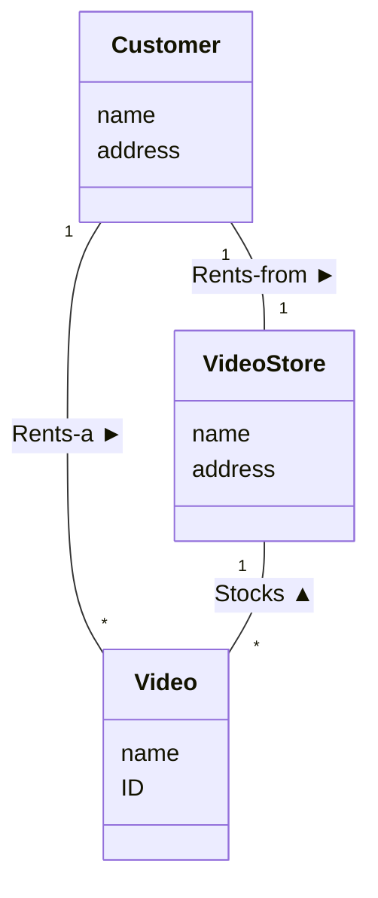

# Systemdomæneanalyse og Domænemodeller (artikel, "kogebog")

## Metadata

| Felt | Værdi |
|---|---|
| **Lektion** | L15–L17 — Domæneanalyse / domænemodeller (forberedende læsestof) |
| **Kursus** | SWISE-01 Indledende System Engineering |
| **Kilde** | `DomæneModeller.pdf` (11 sider, Version 1.0, Frank Bodholdt Jakobsen, Ingeniørhøjskolen Aarhus Universitet) |
| **Type** | artikel |
| **Emner dækket** | Domænemodellens plads i udviklingsforløbet, hvorfor, hvad er domæne/domænemodel, kommunikationsmiddel udad/indad, begreber (conceptual classes), metode i 4 skridt (navneordsanalyse, kategoriliste, udsagnsordsanalyse, relationsliste, multiplicitet, finpudsning), aggregering/komposition/arv, hvad en domænemodel IKKE er |

---

## Indholdsfortegnelse

1. Domænemodeller
   - 1.1 Domænemodellens plads i udviklingsforløbet
   - 1.2 Hvorfor skal man lave en Domænemodel?
   - 1.3 Hvad er Systemdomæneanalyse og Domænemodellen?
   - 1.4 Domænemodellens rolle som kommunikationsmiddel
     - 1.4.1 Domænemodellen udad til
     - 1.4.2 Domænemodellen indad til
   - 1.5 Hvad er begreber (concepts, conceptual classes)
   - 1.6 Metode
     - 1.6.1 Skridt 1. Find begreberne
     - 1.6.2 Skridt 2. Find relationerne
     - 1.6.3 Skridt 3. Find multipliciteterne
     - 1.6.4 Skridt 4. Finpudsning
   - 1.7 Hvad er en Domænemodel IKKE!

> Side 1

## 1. Domænemodeller

### 1.1 Domænemodellens plads i udviklingsforløbet

**Forudgående aktiviteter:** Kravspecifikation, hvor der er arbejdet meget med, HVAD systemet skal gøre.

**Input:** Fra arbejdet med Kravspecifikationen vil man have dokumenter, der specificerer funktionelle krav, fx Fully Dressed Use Cases (UC). Under Systemdomæneanalyse kan det være relevant med input fra dialog med: Kunden, Slutbrugere, Udviklere, Stakeholders, Product Owner.

**Output:** Domænemodellen – nemlig et eller flere klassediagrammer i den specielle Domænemodelnotation.

**Efterfølgende aktiviteter:** Detaljeret SW systemdesign – Applikationsmodellen.

I ASE-modellen: En tidlig del af arkitekturaktiviteterne.

I V-modellen: En tidlig del af Systemdesign.

Systemdomæneanalysen er en del af analysen og designet for Systemarkitekturen, hvor de første skridt tages fra HVAD systemet skal gøre frem mod HVORDAN det skal gøre det.

### 1.2 Hvorfor skal man lave en Domænemodel?

Med opståelsen af begrebet objektorienteret analyse, design og programmering i begyndelsen af 1990'erne, opstod et alternativ til den på den tid fremherskende indstilling: programmer består af aktiviteter, der skal behandle nogen data. Altså: aktiviteter først – og så data.

Filosofien er, at IT-systemer, der skal interagere med objekter og begreber, der findes i den virkelighed – udenfor systemet – der skal have nytte af systemet, konstrueres bedst, hvis de afspejler objekter og begreber i den måde softwaren er struktureret på. Altså: Data og begreber først – og så aktiviteter.

Der er derfor brug for en metode hvormed man kan gå på jagt efter de objekter og begreber, der skal tages i betragtning – det er hvad denne artikel handler om.

### 1.3 Hvad er Systemdomæneanalyse og Domænemodellen?

Der er først og fremmest brug for en opdeling af begreberne i virkeligheden omkring systemet i dem, der skal tages hensyn til af systemet – og dem der IKKE skal! Den del af begreberne, der SKAL med, kaldes for Domænet, se Figur 1.

Det er først og fremmest den information som systemet skal huske og have styr på, der er de mest interessante og relevante objekter og begreber og relationer, at finde frem i Domænet.

> Side 2

*Figur 1: Virkeligheden, Systemet og dets Domæne. En sky "Virkeligheden!" indeholder en firkant "Domænet!". I firkanten: "En bruger" (smiley) ↔ "Et nyt system" (cirkel delt i HW, MEK og SW; i SW-delen gule kasser "Klasser"). Systemet ↔ "Et andet system" (lille cirkel) og ↔ to bjælker "Vigtige domænebegreber".*

Aktiviteten at afgrænse og beskrive Domænet kaldes **Systemdomæneanalyse** (*Systems Domain Analysis*).

Når vi skal designe og kode systemet, har vi også brug for at vide hvordan disse begreber forholder sig til hinanden. Hvad har de med hinanden at gøre, hvor mange er der af dem og hvad er der af karakteristika, der kendetegner dem, og som er vigtige at kende, når vi skal behandle dem i systemet?

Disse forhold skal vi også gå på jagt efter i Systemdomæneanalysen. Systemets og Domænets plads i Virkeligheden kan ses på Figur 1.

Når vi er færdige med analysen, skal vi gerne have et resultat, der er fastholdt som et dokument, vi kan bruge, når vi går videre i softwareudviklingen. Dette dokument kaldes for **Domænemodellen** (*Domain Model*).

Det vil være godt, at alle er enige om Domænemodellen, at den er let at forstå af dem, som skal bruge den i det videre arbejde, og at den er rimelig komplet og relevant. Den skal kommunikere resultatet af Systemdomæneanalysen, så den kan diskuteres, reviewes, godkendes og bruges i det videre udviklingsforløb.

Hvordan kan man gøre det?

Ligesom man kan vælge at fastholde kravene til systemet i ren tekst – side op og side ned – viser erfaringen, at en tegning siger mere end tusind ord – en grafisk præsentation har mange fordele som kommunikationsværktøj.

Med SysML – og som en del af dette UML – som værktøj, har vi mulighed for at lave et diagram (eller flere), der kan opfylde disse ønsker.

Domænemodellen laves som et klassediagram (eller flere), hvor hvert begreb får et klassesymbol.

Her er et eksempel (Figur 2):

> Side 3

*Figur 2: (Del af) et eksempel på en Domænemodel. Klassediagram med Customer (name, address), Video (name, ID), VideoStore (name, address). Annoteringer: "Association" (linjen Customer–Video), "Multiplicity" (`*`), "UML Class or SysML Block" (Video), "Conceptual classes" (Customer, VideoStore), "Attributes" (name, address).*

Relationerne mellem begreberne tegnes som klasserelationer – typisk som en association med en forklarende tekst og evt. multipliciteter, som illustrerer, at der i virkelighedens verden er en relation mellem begreberne i hver ende af associationen, som kan være vigtig for det system, vi skal designe og implementere.

Klasserne kan være forsynet med attributter, som vi ved Systemdomæneanalysen er kommet frem til, er vigtige for det endelige system at kende og huske.

Derimod har klasserne ikke metoder. Begreber i virkeligheden kan ikke "kalde metoder" på andre begreber – de er jo ikke software. Klasserne på Domænemodellen er heller ikke klasser i vores kode – endnu. Måske bliver de til klasser i det endelige system – det afgør vi først i de senere faser af softwareudviklingen, nemlig når vi skal lave Applikationsmodellen. Skulle det være tilfældet, har vi allerede nu et godt navn for en sådan klasse.

Når man ser på eksemplet, vil man lægge mærke til, at associationerne ikke har pile for enderne, men derimod er der pile på de forklarende tekster – så man kan se, hvilken vej den skal læses/forstås.

Man vil også lægge mærke til en anden ting: attributterne har ikke typer tilknyttet.

Begge disse forhold er en afspejling af, at vi ikke ønsker at fastlægge implementationsdetaljer på dette tidspunkt af udviklingsprocessen. Det kan kræve en nærmere analyse at afgøre om et tal skal gemmes som heltal eller kommatal. Eller om de endelige klasser rent faktisk har brug for at implementere en association, den ene vej eller den anden vej, begge veje, eller måske slet ikke. Men vi ved, at de har en relation i virkelighedens verden.

### 1.4 Domænemodellens rolle som kommunikationsmiddel

Domænemodellen er først og fremmest et kommunikationsmiddel, der skal bruges af forskellige deltagere i og omkring et projekt. Det kan have mindst to kommunikationsretninger:

1. Udad fra projektet, til kunder, product owner og brugere.
2. Indad til projektet, til udviklere, designere, projektleder, SCRUM master og testere.

> Side 4

#### 1.4.1 Domænemodellen udad til

Domænemodellen som vi beskriver den i denne artikel, vil være i form af klassediagrammer med visse specielle notationer og begrænsninger i forhold til et fuldt UML klassediagram.

Denne type diagram bør sagtens kunne læses og forstås af eksterne interessenter uden speciel teknisk indsigt, således at man kan tale med dem om Domænemodellen.

Den kan bruges til at afklare, om man nu har forstået specifikationerne korrekt, fordi at de er et tegnet resume af specifikationer og Use Cases.

Den kan derfor betragtes som et "rigt billede" i en stringent notation, som kan bruges i en dialog med de eksterne stakeholders til projektet.

Det er imidlertid ikke disse egenskaber for Domænemodellen vi lægger mest vægt på i dette kursus og i denne artikel.

#### 1.4.2 Domænemodellen indad til

Domænemodellen er lavet i et sprog, UML, som alle, der deltager i implementationen, skal kunne forstå.

For dem vil Domænemodellen være som en visuel ordbog, der giver navn til de vigtige begreber, der skal arbejdes med, så alle bruger samme navne. Og de vigtige relationer mellem begreberne er identificeret.

Disse navne kan også bruges til de klasser og objekter, som senere vil blive designet og anvendt i implementationen. Ligesom relationerne vil indgå i overvejelserne, om de skal designes og implementeres med.

Dermed er Domænemodellen med til at danne bro mellem virkeligheden og den implementerede kode, man kan sige at Domænemodellen formindsker det gab, der er mellem virkeligheden – systemets domæne – og de elementer, der skal repræsentere virkeligheden i systemet.

Den beskriver en afgrænsning af systemet og dets domæne, så man ved, hvad vi skal have med, og hvad vi ikke skal have med.

Det er disse egenskaber, vi lægger mest vægt på i dette kursus og i denne artikel: Domænemodellen som det første skridt til at hjælpe os i gang med at designe softwaren – det første skridt fra HVAD til HVORDAN.

En Domænemodel bliver nok aldrig færdig. Hvis vi arbejder med den systematisk i projektet, og gerne med projektets stakeholdere, kan den nå et fornuftigt niveau, specielt med lidt øvelse.

### 1.5 Hvad er begreber (concepts, conceptual classes, begrebsklasser)

Et begreb, som vi er ude efter i Systemdomæneanalysen er en ide, en abstrakt ting eller et fysisk objekt.

Man må nogle gange strække sin tankegang lidt, for at få "øje" på tingene, og hæve sig op på et lidt højere abstraktionsniveau, end hvis vi begrænsede "Virkeligheden" til kun at være den fysiske verden, vi kan røre ved.

Er et "Salg" en ting? Nej, det er en abstrakt ide, men det er sådanne ting som vores software nogen gange skal beskæftige sig med.

> Side 5

En SMS eller en e-mail – er det en ting? Vi kan ikke røre ved dem, men vi kan tale om dem. Så det må være en ting, bare abstrakt.

For at undgå det lidt tunge ord begrebsklasser – direkte oversat fra engelsk – bruger jeg i denne artikel ordet begreb.

### 1.6 Metode

Der er ikke nogen Domænemodel-compiler – både desværre og heldigvis! Som ovenfor nævnt, er Domænemodellen et arbejdsredskab og et kommunikationsværktøj, ikke et design- og implementeringsværktøj. Det er derfor de mennesker, der skal læse, forstå og bruge Domænemodellen der er "compileren".

At opstille en Domænemodel med et godt valg af begreber fra domænet og deres relationer, er en aktivitet der kræver øvelse og erfaring.

I det følgende vil jeg beskrive en metode, der kan bruges til at arbejde sig frem imod en god Domænemodel.

#### 1.6.1 Skridt 1. Find begreberne

Første skridt er, tro mod den beskrevne objektorienterede filosofi, at finde begreberne. De følgende afsnit giver en praktisk metode til at komme i gang.

**Skridt 1.1: Navneordsanalyse i specifikationer og Use Cases.**

I de forrige faser af systemudviklingen, er der brugt meget tid på at specificere, hvad Systemet skal gøre. Ved arbejdet med krav og specifikationer er der kommet en masse tekstbeskrivelser og – ikke mindst – nogle detaljerede Fully Dressed Use Cases.

Første skridt er simpelthen at tage disse frem, og gennemgå dem for navneord. Begreber er ting, koncepter og ideer, der har et navn, ellers kunne vi ikke skrive om dem i specifikationer.

Tag fat med en markeringspen eller en blyant og marker alle navneord i teksterne. Det vil gøre arbejdet overskueligt, hvis man tro mod de iterative principper, tager en eller et par Use Case af gangen, nemlig dem som vi gerne vil starte med i de første iterationer/sprints af systemudviklingen.

Skriv dem så ned på en liste – eller måske endnu bedre – giv straks hvert navneord en gul seddel på en tavle, eller et klassesymbol på et klassediagram.

Der skal ikke bare kigges i aktivitetsdelen (hovedscenariet med extensions) i FDUC. Aktørerne skal også med, de er jo også begreber, der indgår i domænet (se Figur 1).

Det er ikke sikkert at alle navneord er nyttige for at lave en tilstrækkelig men overskuelig Domænemodel. Første filtrering vil være at sortere ting fra, der er for tekniske eller for meget rettet mod implementeringsdetaljer. Og andre ting skal man måske erstatte med et begreb, der er mere abstrakt, end et håndfast ord, der står i specifikationerne.

Et eksempel kunne være "magnetstriben" på et betalingskort. Denne stribe indeholder data, fx kortets nummer eller identitet (id), og det er dem, der er mere interessante, når vi skal finde frem til de væsentlige begreber i domænet. Som et andet eksempel, vil vi ofte være ligeglade med, om stregkoden på en vare står på en etiket eller er i det ene eller det andet stregkodeformat, det er ting, der bør stå i de ikke-funktionelle krav til systemet.

> Side 6

Nogle af navneordene vil måske dække over begreber af simpel karakter. Så er de måske kandidater til at være en attribut på en af de andre begreber. Gør det med det samme på den gule seddel eller klassesymbolet for det andet begreb.

Det kræver øvelse at finde det rigtige niveau, og måske også et par gennemløb af alle skridtene i dette afsnit. Når det er sagt, så hellere lidt for mange begreber og detaljer i første skud, de kan altid fjernes senere.

**Skridt 1.2: ofte sete IT-begreber (kategorier)**

Erfaringen med at udvikle systemer viser, at der er begreber der er nyttige i sammenhænge, man genkender mellem mange forskellige systemer.

Måske gemmer der sig bag beskrivelserne i specifikationer og Use Cases begreber på højere abstraktionsniveau, som det vil være relevant at fremdrage.

Eller der kan være nogen begreber, man ikke har fået med. Eller måske er der slet ikke nogen Use Cases eller særlig gode Specifikationer!

Her er en liste af kategorier med eksempler på sådanne "ofte sete IT-begreber".

| Generelt Begreb | Eksempler |
|---|---|
| **Transaktion** – en afsluttet forretningshændelse, som naturligt afgrænser en aktivitet, der skal kunne skelnes fra andre slags og andre af samme slags | Et Salg; En Betaling; En Tankning; En Udcheckning på biblioteket/supermarkedet; En Flyreservation |
| **Transaktionslinje** – en af flere linjer, der repræsenterer et begreb, der indgår i eller dækkes af transaktionen | En Varelinje på en bon ved et salg; En Boglinje i en udcheckning på biblioteket |
| **Fysisk genstand** – et fysisk objekt, der fx matcher en transaktionslinje | Selve Varen; Selve Bogen; Et Lånerkort |
| **Service** – en service eller aktivitet, som er en "vare" i forbindelse med fx en transaktion | Selve Flyveturen (Flight, med rute og tidspunkt); Selve retten til et Sæde |
| **Register** – hvor registreres Transaktionen | Hovedbog; Kasseapparat; Systemet; Dagsjournal |
| **Fysisk sted** for Transaktion eller Service | Bibliotek; Lufthavn; Sæde |
| **Hændelse** som vi ønsker at registrere (behøver ikke at være en Transaktion) | Et Salg; En Betaling; En Flyvetur (Flight, med rute og tidspunkt) |
| **Katalog** | Bibliotekets Kartotek; Supermarkedets Ugeavis; Flyveplanen; Køreplanen |
| **Fysisk container** – som kan have flere fysiske ting i sig | Lagerrum; Container; Restaurationsbord |
| **Eksternt System** | Flykontrollen; Betalingscentralen |
| **Aktør** | Kunde; Kasseassistent; Mekaniker; Stewardesse |
| **Beskrivelse** – generisk information, som er vigtig at bevare når alle objekter er væk | Videobeskrivelse; Bogbeskrivelse; Varebeskrivelse |
| **Transaktionsbevis** | Bon; Kvittering; Udlånsseddel; Reservationsbekræftelse |
| **Betalingsmiddel** | Kontanter; Kort; Kredit; Point; Mærker |

> Side 7–8

Brug denne liste af kategorier til at overveje, om der kan findes nogle flere begreber, som måske ikke direkte fremgår af specifikationerne, måske fordi de er underforståede, og dermed ikke står der eksplicit.

Dette skridt kræver selvfølgelig også erfaring med udvikling af systemer for at gøre det godt, men det er med til at gøre vores Domænemodel mere komplet.

#### 1.6.2 Skridt 2. Find relationerne

Nu har vi fundet et sæt af begreber, som vi mener er relevante for at kunne beskrive vores system. De ligger nu spredt ud foran os på tavlen eller på et klassediagram.

For at gøre disse klasser til en Domænemodel skal vi nu i gang med at beskrive, hvilke relationer de har til hinanden.

Lad os igen gå praktisk frem.

**Skridt 2.1: udsagnsordsanalyse i specifikationer og Use Cases**

I specifikationerne vil der stå en masse udsagnsord (verber), der beskriver hvordan begreberne agerer eller forholder sig til og med hinanden.

Dem kan man nu markere eller fremhæve i teksterne, gerne på en sådan måde at de kan skelnes fra navneordene. Man kan også bruge teksten som en checkliste, og for hvert udsagnsord, man finder, tegne en relation i form af en association imellem de begreber, der indgår, og skrive udsagnsordet på associationen. Bagefter kan man så markere udsagnsordet, når det er behandlet.

For overskuelighedens skyld beskriver man nogle gange flere relationer på den samme associationsforbindelse, ved at tilføje flere tekster. Men der skal kun stå ét udsagnsord i hver tekst. Måske skal der vælges mellem aktiv eller passiv, og måske er man nødt til at tilføje et 3. begreb og/eller et forholdsord. Grundled og genstandsled (eller hensynsled) vil fremgå automatisk af, at disse står i hver deres ende af associationen, derfor skal de IKKE stå i teksten på associationen.

> Side 8

For at gøre Domænemodellen nemmere at læse, tilføjer man næsten altid en læsepil, der gør det sikrere at forstå relationen. Denne kan indsættes som et pilehoved parallelt med teksten, brug fx flowpilene kendt fra IBD-diagrammerne, eller man kan indlejre det i teksten, evt. ved at bruge tegnene `<`, `>`, `^` og `v`. Hvis relationens læseretning falder sammen med den almindelige læseretning fra venstre til højre, kan læsepilen udelades.

Men der er IKKE pile i enden af associationerne! Retningspile på associationer er implementationsdetaljer for rigtige klasser i det endelige program, der fortæller noget om at den ene klasse skal kende den anden for at kunne kalde dens metoder, el. lign. Så langt er vi slet ikke endnu.

**Skridt 2.2: ofte sete IT-strukturer**

Ligesom for begreber, kan man også lave en checkliste over relationer, man kender fra mange forskellige systemer.

Her er en liste med nogle kategorier af "ofte sete IT-strukturer" med eksempler.

| Generel Relation | Eksempler |
|---|---|
| A er en transaktion som hænger sammen med en anden transaktion B | Salg – Betaling; Reservation – Afbestilling |
| A er en transaktionslinje i transaktionen B | Faktura – Varelinje |
| A er et produkt eller en service for en transaktion eller transaktionslinje B | Varelinje – Vare; Reservation – Selve flyveturen |
| A er en fysisk eller logisk del af B | Kasseapparat – Pengeskuffe; Fly – Sæde |
| A er fysisk eller logisk indeholdt i B | Container – Vare |
| A er en beskrivelse for B | Flyrute – Selve flyveturen; Bogbeskrivelse – Bogeksemplar |
| A er en rolle/aktør relateret til aktionen B | Salg – Kunde |
| A huskes/registreres/rapporteres i B | Kasseapparat – Salg; Journal – Konsultation |
| A er medlem af B | Firma – Ansat; Supermarked – Kasseassistent |
| A er en underorganisation af B | Firma – Afdeling |
| A bruger eller ejer B | Kasseapparat – Kasseassistent; Kaffeautomat – Firma |

Brug dem til at tænke over, om der er nogle relationer, man ikke lige har fået med, måske fordi de er underforståede i specifikationerne. Tag dem med på tegningen, for at gøre Domænemodellen mere komplet.

#### 1.6.3 Skridt 3. Find multipliciteterne

En vigtig detalje i mange relationer er hvor mange instanser af begreberne, der indgår.

> Side 9

Her bruges multiplicitetsnotationer på associationerne, så man kan se, når man læser relationen, om hvor mange, der er i hver ende af relationen.

I de fleste tilfælde vil det være nok med at angive at der er én instans i en ende, skrevet som et ettal "1", eller at der er "nul, en eller mange", skrevet som en stjerne "*". Det kan være nødvendigt at angive muligheden for at der ikke er nogen instans i den ene ende af relationen, så bruger man "0..1", eller at der er "mindst en", så bruger man "1..*".

Er det vigtigt, ud fra specifikationen, at angive et nøjagtigt antal eller maksimum antal, gør man bare det.

Er det en 1-til-1 relation, behøver man ikke at skrive multipliciteter på associationen.

Alle relationerne gennemgås og opdateres med multiplicitet ud fra ovenstående retningslinjer.

#### 1.6.4 Skridt 4. Finpudsning

**Attribut eller selvstændigt begreb?**

Domænemodellen kan blive mindre kompleks, men måske også mindre dækkende, ved at vælge at lade begreber fra Domænet blot være attributter til et andet begreb.

Følgende retningslinjer kan man bruge til at tage sin beslutning om et begreb er en attribut, eller skal vises som sit eget begreb:

- Hvis det fylder noget fysisk, er det et begreb
- Hvis det har en kompleks struktur med underattributter (som er vigtige for dette system), er det et begreb
- Hvis det har aktiviteter, er det et begreb
- Hvis det er simpelt, med en veldefineret værdimængde, er det en attribut

Man kan fx spørge sig selv, om man kan tænke på begrebet X som et tal eller en simpel tekst i den virkelige verden. Hvis ikke, er det et begreb i sig selv, ikke en attribut.

Domænemodellen gennemgås, også for de attributter, man allerede har oprettet i skridt 1.1 og 1.2.

**Systembegreb**

Ud fra inputtet til Systemdomæneanalysen kan man til tider stå med en aktivitet – et udsagnsord, der ikke har noget naturligt tilhørsforhold til en relation mellem de fundne begreber. Her kan det være nyttigt at bruge et Systembegreb, og indføre det på Domænemodellen. Specielt hvis det står direkte nævnt i specifikationerne. Se også nedenfor.

**Aktør – tændstiksmand eller klasse?**

Hvis systemet skal huske noget om en bestemt Aktør, fx navn eller CPR-nr, kan man tegne aktørerne som en klasse, med de attributter, der er nødvendige for systemets funktion. Evt. kan man markere klassen med stereotypen <<aktør>>. Ellers er det fint, at tegne Aktørerne som en tændstiksmand.

**Komposition, aggregering og arv i Domænemodellen**

Der er sjældent brug for andre klasserelationer end association i det klassediagram, som Domænemodellen er. Her er et par kommentarer om de andre. Ofte er disse mere udspecificerede relationer implementeringsdetaljer, der ikke skal/bør vises på Domænemodellen.

> Side 10

*Aggregering* er en "har en" relation, uden ejerskab. Den er en svag relation, og kan ligeså godt tegnes som en association, uden at dybere viden går tabt. Hvis man kun kan finde på at kalde relationen "har en", som er en ret intetsigende betegnelse på Domænemodellen, kan man prøve at vende retningen, og se, om der ikke er en bedre beskrivelse af relationen.

*Komposition* er en "har en" relation, hvor levetiden for det underordnede begreb er stærkt sammenkoblet med ejeren, ligeså stærkt som en attribut. Kun hvis det underordnede begreb ikke kan bruges/ses alene eller har en relation til andre begreber på Domænemodellen, og levetiden er stærkt forbundet, er der grund til at bruge komposition. Som med Aggregering kan man prøve at beskrive relationen "set fra den anden ende".

*Arv* er en "er en" relation, en generalisering, hvor en eller flere attributter og relationer er fælles for en række begreber, og basisklassen vil derfor være et mere abstrakt begreb. Arv kan bruges til at forenkle Domænemodellen, men brug den kun, hvis de afledte klasser adskiller sig fra hinanden ved forskellige relationer, som man gerne vil have med i Domænemodellen. Er det blot simple attributter el. lign. der adskiller dem, bør man identificere og bruge den abstrakte basisklasse med passende attributter, evt. en "type"-attribut. Så har man lavet en forenkling, uden at tilføje yderligere begreber og relationer.

**Oprydning**

På dette tidspunkt kan man også overveje, om der er kommet for mange begreber med, fx fra skridt 1.2, som man ved nærmere overvejelse indser, ikke har betydning for dette system. Så kan man jo slette dem igen, samt deres relationer, eller finde ud af om andre begreber skal overtage relationerne, fordi det slettede begreb er en del af det andet begreb.

### 1.7 Hvad er en Domænemodel IKKE!

En Domænemodel er IKKE et hardwaresystemdesign eller en softwaresystemarkitektur. Disse ting beskrives bedre med andre diagrammer, fx BDD og IBD for hardware og Applikationsmodellen for software.

Den beskriver først og fremmest de dele af virkeligheden, der er interessante i forhold til vores system, og hvordan de interagerer med hinanden og med systemet.

Er der underdele af systemet med i Domænemodellen, skal det være fordi de fx er synlige udefra, og en aktør interagerer med den specifikke del af systemet.

Den indbyggede CPU, eller netværkskortet, eller andre (hardware) implementationsdetaljer optræder IKKE i Domænemodellen. Man kan fx skjule dem i en System-klasse, specielt hvis der i specifikationerne står noget om hvad systemet gør, uden at det er vigtigt hvilke dele af systemet, der gør det.

Domænemodellen er heller ikke en dynamisk flowmodel, der angiver hvordan information eller materiale flyder mellem forskellige dele af systemet. Den slags information skal beskrives på IBD'erne og Applikationsmodellerne.

Med andre ord, pas på med at Domænemodellen ikke kun indeholder hardwarekomponenter, for så bliver modellen let bare det samme som et IBD-diagram. Kontroller at der er objekter med, der beskriver information som systemet skal huske på, det er de objekter, som er mest interessante for softwaren.

> Side 11
