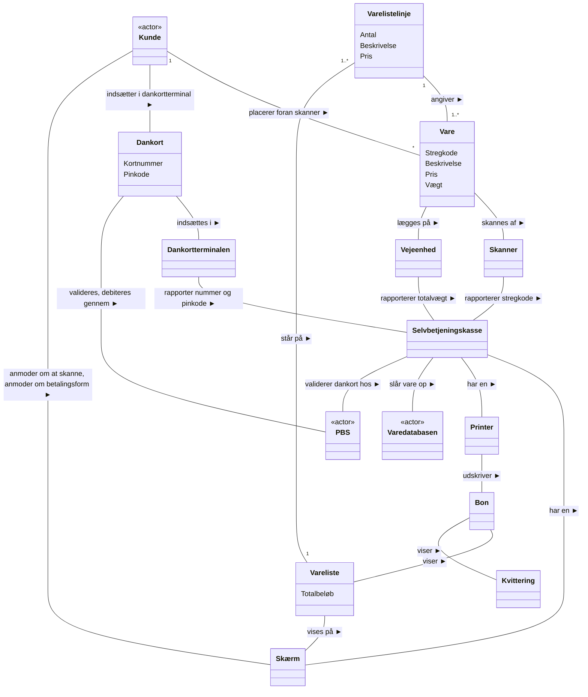

# Eksempel til illustration af Systemdomæneanalyse og Domænemodeller (Selvbetjeningskasse)

## Metadata

| Felt | Værdi |
|---|---|
| **Lektion** | L15–L17 — Domæneanalyse / domænemodeller (forberedende læsestof) |
| **Kursus** | SWISE-01 Indledende System Engineering |
| **Kilde** | `DomænemodellerEksempel.pdf` (11 sider, Version 1.1, Frank Bodholdt Jakobsen, Ingeniørhøjskolen Aarhus Universitet) |
| **Type** | eksempel |
| **Emner dækket** | Gennemarbejdet domænemodel for Føtex' selvbetjeningskasse efter kogebogen i `artikel-domaenemodeller.md`: Use Cases som input, Skridt 1.1 navneord, finpudsning, Skridt 1.2 kategoriliste, Skridt 2.1 udsagnsord, systembegreb, Skridt 2.2 relationsliste, Skridt 3 multiplicitet, Skridt 4 finpudsning/oprydning |

---

## Indledning

Som et gennemarbejdet eksempel på arbejdsprocessen med at udføre Systemdomæneanalysen og komme frem til Domænemodellen, har forfatteren valgt den forhadte Selvbetjeningskasse hos Føtex.

*Figur: Foto af en kunde ved en Føtex-selvbetjeningskasse med skærm, håndskanner, betalingsterminal og poseholder.*

> Side 1

## Input: Use Cases

Et Use Case for dette system er udarbejdet, og heraf ses et uddrag:

*Figur: Use case-diagram `uc [Package] Use Cases [Use Cases]`. Systemgrænse "Selvbetjeningskasse" med to use cases: "Skanning af varer" og "Betaling af varer". Aktør Kunde (venstre) er forbundet til begge. Aktør Varedatabase (højre) er forbundet til "Skanning af varer". Aktør PBS (højre) er forbundet til "Betaling af varer".*

Man har valgt at betragte disse to dele af et naturligt indkøbsforløb som to separate UC, man kunne enten samle dem i en, eller forbinde dem med en <<extends>> eller <<includes>> afhængighed.

> Side 2

Der er også lavet Fully Dressed Use Cases. For overskuelighedens skyld vises her blot hovedscenarierne, uden extensions. Dem kunne der jo sagtens tænkes nogle stykker af.

**Use Case Skanning af Varer — hovedscenarie:**

1. Selvbetjeningskassen anmoder kunden om at skanne vare
2. Kunden placerer vare foran skanner
3. Systemet skanner varens stregkode
4. Systemet finder varens pris i varedatabasen
5. Vare med pris tilføjes til en vareliste som vises på skærmen
6. Kunden lægger vare i pose på vægten ved siden af skanner
7. Punkterne 1–6 gentages indtil alle varer er skannet
8. Kunden vælger afslut på skærmen

**Use Case Betaling af varer — hovedscenarie:**

1. Kunden vælger betal med dankort på beløbet
2. Kunden indsætter kort i dankortterminalen
3. System viser det totale beløb og anmoder om pinkode
4. Kunden indtaster pinkode
5. Kort og pinkode valideres mod PBS
6. Printer udskriver bon med vareliste og kvittering

> Side 3

## Skridt 1.1 — Navneord

I dette skridt tager vi fat på jagten på navneord i de UC vi skal til at behandle på dette tidspunkt af projektet.

*Figur: Klassediagram uden relationer. Aktører som tændstiksmænd: Kunde, Varedatabasen, PBS. Klasser (tomme kasser): Selvbetjeningskasse, System, Skærm, Dankortterminalen, Skanner, Printer, Vareliste, Totalbeløb, Vare, Pose, Stregkode, Pris, Vægt, Bon, Dankort, Kvittering, Pinkode.*

| Aktører (tændstiksmænd) | Klasser |
|---|---|
| Kunde, Varedatabasen, PBS | Selvbetjeningskasse, System, Skærm, Dankortterminalen, Skanner, Printer, Vareliste, Totalbeløb, Vare, Pose, Stregkode, Pris, Vægt, Bon, Dankort, Kvittering, Pinkode |

Her er valgt næsten bevidstløst at give alle fundne navneord en klasse, og aktørerne er blot angivet som aktører.

> Side 4

## Finpudsning af Skridt 1.1

Vi kan lige så godt tage fat på forenklinger med det samme, for at få gjort det store klassediagram lidt mere overskueligt.

*Figur: Klassediagram uden relationer. Aktører: Kunde, Varedatabasen, PBS. Klasser med attributter:*

| Klasse | Attributter |
|---|---|
| Selvbetjeningskasse | – |
| Vare | Stregkode, Beskrivelse, Pris, Vægt |
| Vareliste | Totalbeløb |
| Dankort | Kortnummer, Pinkode |
| Skærm | – |
| Skanner | – |
| Dankortterminal | – |
| Printer | – |
| Vejeenhed | – |
| Bon | – |
| Kvittering | – |

Her har forfatteren indset, at Selvbetjeningskasse og System må være det samme, så System er fjernet. Nogle af begreberne kan ret nemt indses, at de er simple data, der kunne være attributter for Vare, Vareliste og Dankort.

Pose kan han ikke indse har nogen særlig betydning i alt dette – det kan være han tager fejl, men der står ikke noget i UC om, at der er en extension om man starter med eller uden pose. Så den er fjernet.

Han har også tænkt lidt over hvilke attributter der ellers kunne være relevante, så han har tilføjet Vægt (per enhed) og Beskrivelse til Vare.

Til Dankort ville det også være naturligt at holde styr på Kortnummeret.

Da han nu har opfundet attributten Vægt for Vare, har han omdøbt "Vægt" til Vejeenhed, for at undgå misforståelser. Dette skal man selvfølgelig være enige med projektets kunde om.

> Side 5

## Skridt 1.2 — Kategoriliste

For at sikre sig, at det hele nu er med, lader han sig inspirere af listen over kategorier af generelle begreber som ofte ses i IT-systemer, og tænker efter, om der skulle være nogen af dem at finde i systemet.

*Figur: Samme diagram som ovenfor plus tre nye klasser i midten: Varelistelinje, Køb, Betaling (alle uden attributter).*

Her bliver han inspireret til at indføre transaktionerne **Køb** og **Betaling**, samt transaktionslinjen **Varelistelinje**. En Varelistelinje er ikke det samme som en Vare, for der kan være forskellige attributter, og han har set, at Føtex' kasseboner samler flere varer af samme slags til én linje, så det vil han gerne give mulighed for.

> Side 6

## Skridt 2.1 — Udsagnsord

Nu skal vi i gang med at finde relationerne. Som første skridt kigger han efter udsagnsord i UC, og ser om han kan bruge dem som relationer.

**Første udkast** — associationer (læseretning angivet som A → B = "A <tekst> B"):

| Fra | Relationstekst | Til |
|---|---|---|
| Skærm | Anmoder om at skanne, anmoder om betalingsform ◄ | Kunde |
| Kunde | placerer foran skanner | Vare |
| Vare | skannes af | Skanner |
| Vare | lægges på | Vejeenhed |
| Vareliste | vises på ▲ | Skærm |
| Varelistelinje | står på ▼ | Vareliste |
| Dankort | indsættes i ▲ | Dankortterminalen |
| Kunde | indsætter i dankortterminal | Dankort |
| Printer | udskriver ▼ | Bon |
| Bon | < viser | Vareliste |
| Bon | viser ▼ | Kvittering |
| Dankort | valideres | PBS |
| Selvbetjeningskasse | slår vare op ► | Varedatabasen |

Køb og Betaling hænger endnu uden relationer. Kunde, Varedatabasen og PBS er stadig tændstiksmænd.

Han har her kun taget de udsagnsord, han kunne finde og bruge i UC, evt. med lidt omformulering.

> Side 7

Men der er jo stadig mange løsthængende begreber, så han prøver at se, om han kan finde nogle flere.

**Tilføjede relationer** (systembegrebet Selvbetjeningskasse bruges som ophæng):

| Fra | Relationstekst | Til |
|---|---|---|
| Selvbetjeningskasse | har en ▼ | Skærm |
| Skanner | rapporterer stregkode | Selvbetjeningskasse |
| Vejeenhed | rapporterer totalvægt | Selvbetjeningskasse |
| Dankortterminalen | rapporter nummer og pinkode | Selvbetjeningskasse |
| Selvbetjeningskasse | har en ◄ | Printer |
| Selvbetjeningskasse | validerer dankort hos ▼ | PBS |

Her er det specielt "systembegrebet" Selvbetjeningskasse der kan bruges til at hænge nogle af de andre begreber op på. Der hvor det giver mening, har han ændret "har en"-relationen til at have et lidt mere sigende navn, der kan fortælle lidt om relationens rolle (fx "rapporterer stregkode" i stedet for "har en Skanner").

> Side 8

## Skridt 2.2 — Relationsliste

Men der er stadig nogen begreber, der hænger og flagrer. Nu lader han sig inspirere af listen over generelle relationskategorier.

**Tilføjede/ændrede relationer:**

| Fra | Relationstekst | Til | Kategori |
|---|---|---|---|
| Varelistelinje | angiver > | Vare | produkt for transaktionslinje |
| Varelistelinje | står på ▼ | Vareliste | transaktionslinje i transaktion (flyttet, så den nu går fra Varelistelinje til Vareliste) |
| Vareliste | beskriver ▼ | Køb | beskrivelse |
| Køb | betales af | Betaling | transaktion hænger sammen med transaktion |
| Dankort | trækkes for | Betaling | betalingsmiddel |
| Kvittering | dokumenterer ▼ | Betaling | transaktionsbevis |
| Dankort | valideres, debiteres gennem | PBS | (omdøbt fra "valideres") |

En Varelistelinje står selvfølgelig på Varelisten, og en Vare er et produkt der hænger sammen med sådan Varelistelinje.

Betaling dækker Køb. Køb er beskrevet af Vareliste. Kvitteringsdelen af Bon er et transaktionsbevis for Betaling. Varelistedelen af Bon er et transaktionsbevis for Køb.

> Side 9

## Skridt 3 — Multipliciteter

Nu skal der multiplicitetsannotationer på.

| Association | Multiplicitet |
|---|---|
| Kunde — placerer foran skanner — Vare | Kunde `1`, Vare `*` |
| Varelistelinje — angiver > — Vare | Varelistelinje `1`, Vare `1..*` |
| Varelistelinje — står på ▼ — Vareliste | Varelistelinje `1..*`, Vareliste `1` |
| Alle øvrige | 1-til-1 (udeladt) |

Der er ikke ret mange af relationerne, der ikke er 1-til-1. Tænk på, at vi jo kun ser på selve Selvbetjeningskassen, og ikke hele Føtex, hvor der kan være mange af dem. Vi interesserer os fx derfor ikke for at der er mange Selvbetjeningskasser der anvender Varedatabasen – det kunne man have brug for, når man skal lave Domænemodellen for Varedatabasen.

Der er 1 eller flere Varelistelinjer på en Vareliste, og hver Varelistelinje kan dække over 1 eller flere fysiske Varer (jf. observationen over Føtex-boner).

Kunden skanner ifølge UC flere varer, derfor er der "*" på "placerer foran skanner".

> Side 10

## Skridt 4 — Finpudsning

Nu er det tid til lidt finpudsning. Endelig Domænemodel:

(► angiver læseretningen fra venstre klasse til højre klasse i hver linje; i originalen er læsepilene tegnet som trekanter ved teksten. Ingen pile i associationsenderne. Attributter uden typer.)

Ændringer i forhold til Skridt 3:

- **Køb og Betaling er fjernet** igen fra Domænemodellen. Der er ingen steder i specifikationerne for dette system – Selvbetjeningskassen – der står noget om, at de skal gemmes et eller andet sted, og *huskes*, når Kunden er gået sin vej. Så er der ingen grund til at bekymre sig om dem nu. De kan altid komme på i en de næste iterationer, hvis der kommer krav om det. (Dermed forsvinder også relationerne "beskriver", "betales af", "trækkes for", "dokumenterer".)
- En anden kandidat til at blive fjernet eller ændret, ud fra samme argumentation, er **Vejeenheden**. Der står ikke noget om, at den målte totale vægt bliver sammenlignet med den teoretiske ud fra Varernes samlede Vægt og at en uoverensstemmelse giver alarm. Så den kunne fjernes eller omdøbes. Men forfatteren tror mest på, at den står i en extension i UC. Hvordan sikrer Føtex sig ellers, at man ikke snyder? (Den er beholdt.)
- Til gengæld ville han gerne uddybe, hvorfor **Vare og Varelistelinje er forskellige** – og har derfor indført de attributter på Varelistelinje (Antal, Beskrivelse, Pris), som han forestiller sig, der er brug for, når den skal skrives på Bonen.
- Vedr. **andre klasserelationer end association**, kunne man måske forestille sig at tegne Bonens relation til Vareliste og Kvittering som komposition. Men dels indgår Varelisten også i andre relationer, og dels er Bon nok nærmere en fysisk ting, end et objekt.
- Der er lidt tendenser til, at der er **gået lidt BDD i dette**, fordi det er angivet at Selvbetjeningskasse har en Skærm, en Skanner, en Dankortterminal, en Vejeenhed og en Printer. Men dels er disse begreber nævnt i specifikationen, og dels er der mange andre detaljer i Domænemodellen, der gør at der er masser af input til det efterfølgende softwaredesign, i form af information om systemet.

> Side 11
