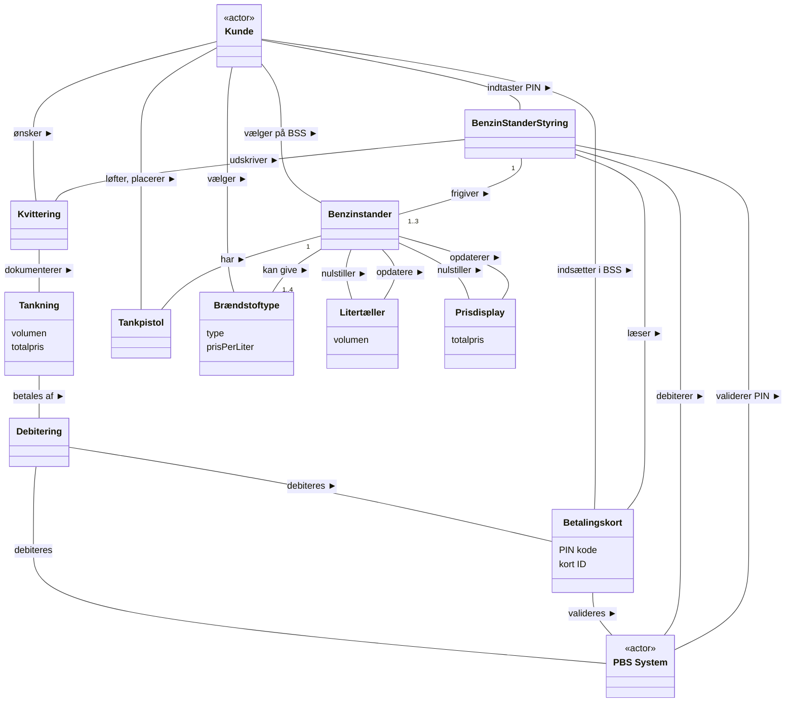

# Øvelse: Benzinstander med automatbetaling — opgave i domænemodel (med løsningsforslag)

## Metadata

| Felt | Værdi |
|---|---|
| **Lektion** | L15–L17 — Domæneanalyse / domænemodeller (øvelse i L16, løsningsforslag gennemgås i L17) |
| **Kursus** | SWISE-01 Indledende System Engineering |
| **Kilde** | `SDA_Benzinstander_Opgave1.pdf` (3 sider) + `SDA Benzinstation Løsning E2018.pdf` (6 sider) |
| **Type** | øvelse + løsningsforslag |
| **Emner dækket** | Domænemodel for tankstation ud fra UC1 Optank Bil: navneordsanalyse, kategoriliste (Debitering som transaktion), attribut vs. klasse, udsagnsord som associationer, læsepile, multiplicitet (1..3, 1..4), systembegreb der forsvinder i endelig version |

---

# Del 1: Opgaven

## Benzinstander med automatbetaling — opgave i domænemodel

Opgaven tager udgangspunkt i en *tankstation* med flere *benzinstandere* og *automatbetaling*. Et SysML Block Definition Diagram (bdd) af systemet er vist på Figur 1.

**Figur 1: SysML Block Definition Diagram (BDD) for arkitekturen af tankstation med benzinstanderstyring** — `bdd [Package] Arkitektur [Tankstation]`:

| Blok | Består af (komposition, sort ruder) | Multiplicitet | Reference-associationer (hvide ruder) |
|---|---|---|---|
| «block» Tankstation | Benzinstander | 1..* | – |
| | Benzinstanderstyring | 1..* | – |
| | Central computer | 1 | – |
| «block» Benzinstander | Benzinpumpe, Elektroniskstyring | – | Benzinstander `1..3` — `1` Benzinstanderstyring |
| «block» Benzinstanderstyring | Computer, Kontrolpanel, Automatbetalingsenhed | – | Benzinstanderstyring `1..*` — `1` Central computer |
| «block» Central computer | – | – | – |

Dvs. én Benzinstanderstyring betjener 1..3 Benzinstandere, og én Central computer har 1..* Benzinstanderstyringer.

På **automatbetalingsenheden** indsætter kunden betalingskort og indtaster PIN-kode. Automatbetalingsenheden indeholder kortlæser, printer, display og tastatur. På **kontrolpanelet** vælger kunden benzinstander og udskrivning af kvittering. På **benzinstanderen** vælger kunden brændstoftype. Tankning påbegyndes når kunden løfter tankpistolen på **benzinstanderen**. Løft af tankpistolen detekteres af den elektroniske styring, som er en del af benzinstanderen.

**Figur 2: Use Case diagram for tankstation** — systemgrænse med to use cases: *UC1: Optank bil* (aktører: Kunde til venstre, PBS System til højre) og *UC2: Overvåg Benzinstander* (aktør: Tankadministrator til højre).

> Side 1

### UC1: Optank Bil

| Felt | Indhold |
|---|---|
| **Navn** | UC1: Optank Bil |
| **Mål** | Kunde kan tanke en bestemt brændstoftype fra en bestemt benzinstander. Kundes betalingskort er debiteret prisen for tankningen. Kunde kan valgfrit få en kvittering for sin tankning. |
| **Initiering** | Kunde |
| **Aktører og interessenter** | Kunde (primær aktør): Ønsker at gennemføre en tankning, at betale med sit kreditkort og eventuelt at modtage en kvittering for tankningen. PBS System (Sekundær): Validerer anvendelsen af kundens betalingskort ved den angivne PIN-kode |
| **Prækonditioner** | Ingen tankning er pt. aktiv på den valgte benzinstander. |
| **Postkonditioner** | Kunde har gennemført tankning ved betaling med kreditkort. Kunde har modtaget en kvittering hvis ønsket. Kundes betalingskort er debiteret prisen for tankningen. |

**Hovedscenarie:**

1. Kunde indsætter betalingskort i Benzinstanderstyring delsystemet.
2. Kunde indtaster PIN-kode
3. System validerer PIN-kode ved PBS System [Undtagelse 1: Kreditkort kan ikke valideres]
4. Kunde vælger benzinstander mellem 1 og max. antal benzinstandere
5. Kunde løfter tankpistol
6. Kunde vælger brændstoftype
7. System nulstiller litertæller og pris på den valgte benzinstander
8. Kunde påbegynder tankningen
9. System viser løbende pris og tanket volumen i antal liter på benzinstander [Undtagelse 2: Benzinstander fejler]
10. Kunde placerer tankpistol i holder på benzinstander
11. System beordrer PBS-System at debitere kundens betalingskort for prisen for tankningen
12. Kvittering håndteres
    - a. Kunde ønsker kvittering
      - i. Kvittering udskrives
    - b. Kunde ønsker ikke kvittering
      - i. Ingen aktion

**Undtagelser:**

- [Undtagelse 1: Kreditkort kan ikke valideres] 1. System udskriver en passende fejlmeddelelse. Use casen afsluttes
- [Undtagelse 2: Benzinstander fejler] 1. System udskriver en passende fejlmeddelelse. Use casen afsluttes.

**Datavariationer:** max. antal benzinstandere: Maksimalt antal benzinstandere tilknyttet systemet. Min. 1 Max. 3.

> Side 2

### Opgave 1

Udarbejd en domænemodel for tankstationen med udgangspunkt i UC1: Optank bil som givet ovenfor. Der skal ikke medtages de beskrevne undtagelser i Use Casen.

- Find konceptuelle klasser
- Tegn et klassediagram med associationer
- Angiv associationernes navne og multipliciteter
- Find væsentlige attributter og angiv dem på klassediagrammet

Resultatet er domænemodellen (et klassediagram).

> Side 3

---

# Del 2: Løsningsforslag (E2018)

## Løsningsforslag til Domænemodel for Tankstation – UC Optank Bil

Conceptual classes findes fra UC Optank Bil (UC-teksten gentages i løsningen — identisk med ovenstående).

> Løsning side 1

### Konceptuelle klasser som liste fra UC og anden information

**Navneord:**

- Bil
- Kunde
- Brændstoftype
- Benzinstander
- Betalingskort
- Pris
- Tankning
- Kvittering
- PBS System
- PIN Kode
- Benzinstanderstyring
- System
- Tankpistol
- Litertæller
- Volumen
- Holder til tankpistol

**Andre begreber, fx fra kategorilisten:**

- Debitering (transaktion)

> Løsning side 2

### Første version af Domain Model – concepts som klasser

*Figur: Klassediagram uden relationer. Aktører (tændstiksmænd): Kunde, PBS System. Klasser: Tankning, Debitering, Kvittering, Betalingskort, PIN Kode, Bil, BenzinStanderStyring, System, Tankpistol, Volumen, Benzinstander, Holder til Tankpistol, Litertæller, Brændstoftype, Totalpris.*

> Løsning side 3

### Tilpasning af klasser og attributter

Hvilke klasser er vigtige for dette system? Hvilke koncepter er bare attributter?

Fx: Systemet er fuldstændig ligeglad med bilen. Holderen til tankpistolen er overdetaljering.

*Figur: Samme diagram; Bil og Holder til Tankpistol er streget over med rødt kryds. Volumen, Totalpris og PIN Kode er blevet attributter. Nye klasser Litertæller og Prisdisplay.*

| Klasse | Attributter |
|---|---|
| Tankning | volumen, totalpris |
| Betalingskort | PIN kode, kort ID |
| Brændstoftype | type, prisPerLiter |
| Litertæller | volumen |
| Prisdisplay | totalpris |
| Debitering, Kvittering, BenzinStanderStyring, System, Tankpistol, Benzinstander | – |
| ~~Bil~~, ~~Holder til Tankpistol~~ | fjernet |

Aktører: Kunde, PBS System (tændstiksmænd).

> Løsning side 4

### Verber og logiske sammenhænge med multipliciteter

Nu findes verber og andre logiske sammenhænge, og multipliciteter føres på. I første omgang bruges System til at hænge nogen associationer på.

*Figur: Klassediagram med følgende associationer (læsepil angivet med `>`, `<`, `^`, `v` som i originalen):*

| Fra | Relationstekst | Til | Multiplicitet |
|---|---|---|---|
| Kvittering | dokumenterer > | Tankning | |
| Tankning | betales af > | Debitering | |
| Debitering | debiteres | PBS System | |
| Betalingskort | < debiteres | Debitering | |
| Betalingskort | valideres > | PBS System | |
| Kunde | ønsker ^ | Kvittering | |
| Kunde | påbegynder > | Tankning | |
| Kunde | indsætter > | Betalingskort | |
| Kunde | indtaster PIN | BenzinStanderStyring | |
| BenzinStanderStyring | < udskriver | Kvittering | |
| BenzinStanderStyring | læser ^ | Betalingskort | |
| BenzinStanderStyring | styrer v | Benzinstander | Benzinstander `1..3` |
| Kunde | vælger > | Benzinstander | |
| Kunde | løfter, placerer > | Tankpistol | |
| Kunde | vælger v | Brændstoftype | |
| Benzinstander | < har | Tankpistol | |
| Benzinstander | kan give v | Brændstoftype | Brændstoftype `1..4` |
| Benzinstander | har > | Litertæller | |
| Benzinstander | har > | Prisdisplay | |
| System | debiterer ^ | PBS System | |
| System | validerer PIN ^ | PBS System | |
| System | opdaterer v | Litertæller | |
| System | nulstiller v | Litertæller | |
| System | nulstiller | Prisdisplay | |
| System | opdaterer v | Prisdisplay | |

> Løsning side 5

### Endelig version

System er forsvundet, fordi andre elementer naturligt kunne tage sig af disse ting. Andre gange kan det være godt med et System-objekt til at holde styr på ting, der ikke er klart, hvor de hører til.

(► = læseretning fra venstre klasse til højre klasse i linjen; "BSS" = BenzinStanderStyring. I originalen: "< debiteres" ved Betalingskort, dvs. Debitering debiteres Betalingskort; "debiteres" mellem Debitering og PBS System uden pil. Multiplicitet `1..3` står ved Benzinstander-enden af "frigiver v", `1..4` ved Brændstoftype-enden af "kan give v". "opdatere" er stavet sådan i originalen.)

Ændringer fra forrige version: System er fjernet — "debiterer" og "validerer PIN" er flyttet til BenzinStanderStyring; "nulstiller"/"opdaterer" af Litertæller og Prisdisplay er flyttet til Benzinstander; "styrer" er omdøbt til "frigiver"; "indsætter" er præciseret til "indsætter i BSS"; "vælger" til "vælger på BSS"; "påbegynder >" (Kunde–Tankning) er udgået.

Domænemodellen viser ikke det komplette data flow, og den viser ikke tidsmæssige sammenhænge. Hvad angår Systemarkitekturen, viser den kun det, som allerede er beskrevet i BDD og IBD.

Måske kunne Litertæller og Prisdisplay blot være attributter på Benzinstanderen.

> Løsning side 6
